# 从 0.1917× 到 1.0×：在 MI300X 上从零优化一个 C++/HIP LLM 引擎

> 这是一篇会随着实验继续生长的博客。绿色不是“计划成功”，只有实际测量并通过
> 正确性门的改动才会出现在绿色 running-best 上。


## 0. 我们到底在优化什么

microLLM-rocm 已经可以：

- 用纯 C++/HIP 构造 Tensor、算子和自动求导图；
- 在 MI300X 上加载官方 Qwen2.5-0.5B；
- 运行 DeepSeek-R1-Distill-Qwen-1.5B；
- 让 logits、生成 token、loss 和参数更新与 PyTorch 对齐；
- 使用两张 GPU 做 RCCL 数据并行正确性实验。

但“输出正确”与“像成熟框架一样快”是两个完全不同的终点。

在固定 FP32、多步、排除热身的 MI300X 对比中：

| Workload | microLLM | Python/PyTorch | microLLM/PyTorch |
|---|---:|---:|---:|
| Qwen train | 7.30 token/s | 51.32 token/s | 0.1422 |
| Qwen generate | 18.77 token/s | 70.18 token/s | 0.2675 |
| DeepSeek Distill train | 5.79 token/s | 26.23 token/s | 0.2209 |
| DeepSeek Distill generate | 10.02 token/s | 62.40 token/s | 0.1606 |

四项几何平均只有：

```text
0.191660× PyTorch
```

经过十四个保留实验，当前重复进程 score 已到 `2.478439×`。这不是估计值：它来自同一张
MI300X、同一组模型权重、同样的 2 次热身和 5 次正式测量。

因此，本专项的故事不是“我们已经超过 PyTorch”，而是：

> 一个正确但很慢的教学引擎，怎样经过可反驳的系统实验，一步步长成一个在固定
> AMD GPU 矩阵上接近成熟框架的引擎？

这里的最终 `1.0×` 只表示固定 GPU、模型、dtype、batch、context 和 token 的 selected
matrix parity。它不代表所有模型、所有 shape 或所有 AMD GPU。

## 1. 从 autoresearch 学到的不是“让 Agent 随便改代码”

[karpathy/autoresearch](https://github.com/karpathy/autoresearch) 的核心不是一句
“AI 自动研究”，而是一个非常克制的实验系统：

```text
固定时间预算
固定评价指标
一次做一个实验
成功保留
失败回退
结果持续写入表格
用图展示 running best
```

它的 `progress.png` 里，灰点是被丢弃的实验，绿点是保留的实验，绿色阶梯线是
running best。真正有价值的不是曲线看起来不断改善，而是失败点没有被删除。

microLLM 的问题更复杂。模型质量实验可以使用一个 `val_bpb`，系统实验至少需要：

- 四项吞吐；
- 四项峰值显存；
- logits、loss、gradient 和 generated token；
- Kernel、copy、allocation 和 launch 时间线；
- reference、readable 和 optimized 三条路径。

所以我们借用实验循环，不照搬指标。

## 2. 为什么要先固定测量，而不是马上写 Kernel

最早的一次官方模型对比只测了第一个训练 step，结果看起来 microLLM 比 PyTorch
快约 3 倍。如果停在这里，我们可能会写出一篇错误的“自研框架击败 PyTorch”。

加入两次 warm-up、再测五步后，结果变成：

```text
Qwen train       microLLM 7.30   PyTorch 51.32
DeepSeek train   microLLM 5.79   PyTorch 26.23
```

原来的“领先”只是 PyTorch 首次 Kernel 初始化成本。

因此本项目固定：

```text
load
→ 2 complete warm-up iterations
→ reset peak allocator counter
→ 5 measured iterations
→ only measured interval enters throughput
```

setup、warm-up 和 measured 必须分别报告。不能把不喜欢的时间藏起来，也不能把
一次首次启动写成 steady-state。

## 3. 先画出当前系统，而不是凭感觉优化


优化起点的训练路径：

```text
token
→ Embedding
→ [RMSNorm → QKV → RoPE → QK → Softmax → PV → O]
→ [RMSNorm → gate/up → SwiGLU → down]
→ output head
→ CrossEntropy
→ backward
→ AdamW
```

优化起点的生成路径：

```text
token
→ 每层计算 Q/K/V
→ K/V 搬回 CPU
→ CPU 拼接旧 cache
→ 搬回 GPU
→ GQA 再搬回 CPU 展开
→ 再搬回 GPU
→ Attention
→ tied output weight 整体转置复制
→ 完整 logits 搬回 CPU 做 argmax
```

程序能输出正确 token，但这条数据路线显然不适合高性能 GPU。

## 4. Baseline profiler 告诉了我们什么

### 4.1 Qwen 推理

代表性 rocprof：一次完整 forward、一次 warm-up generate、一次 measured generate。

| Kernel | Calls | Total | Share |
|---|---:|---:|---:|
| strided transpose copy | 323 | 119.25 ms | 43.43% |
| RMSNorm | 539 | 103.45 ms | 37.67% |
| largest hipBLASLt shape | 792 | 17.89 ms | 6.52% |
| readable batched matmul | 538 | 6.58 ms | 2.40% |

另外还有：

```text
hipMalloc 7404
hipFree   7403
hipMemcpy 2712
ordinary Kernel launch 4099
```

结论非常反直觉：GEMM 不是第一热点。继续只调 GEMM，端到端不会发生根本变化。

### 4.2 Qwen 训练

| Kernel | Share |
|---|---:|
| CrossEntropy backward | 49.52% |
| CrossEntropy forward | 26.21% |
| strided transpose copy | 8.43% |
| RMSNorm backward | 7.48% |
| RMSNorm forward | 2.76% |
| AdamW | 1.49% |

这说明训练第一刀应该砍 CrossEntropy，而不是 AdamW。

## 5. 第一个结构性错误：GPU 上的串行 reduction

当前 CrossEntropy forward/backward 由一个 GPU 线程循环完整词表。Qwen 词表是
151,936，三个 token 就需要一个线程反复执行几十万次 max、exp 和 sum。

RMSNorm 也类似：一个线程处理整行 hidden。Qwen width 896，DeepSeek width 1536。

正确的 GPU 思路应是：

```text
一行交给一个 block
→ 每个线程处理多个元素
→ wave reduction
→ block reduction
→ 必要时第二阶段 reduction
```

Step 01 和 Step 03 分别处理这两个问题。它们必须先保留简单 CPU 参考，再新增
readable parallel HIP 和 optimized candidate。

## 6. 第二个结构性错误：把 view 变成 544 MB 的复制

Qwen 使用 tied embedding。输出 logits 时，Embedding weight 既当输入表，又当输出
投影矩阵。

优化前的实现：

```text
[151936, 896]
→ transpose view [896, 151936]
→ contiguous copy
→ GEMM
```

每个 token 产生约 544 MB 转置副本。训练 backward 中每个 Linear 权重也会执行
类似转置复制。

真正的解决办法不是缓存一个永久副本——那会让 tied weight 更新一致性变复杂——
而是让 GEMM 接受 transpose/stride 描述。hipBLASLt 可以把 transpose 当作 layout，
不移动数据。

Step 02 的验收不是“Kernel 变快”，而是 profiler 中整个权重 strided copy 消失，
同时 logits 和梯度保持一致。

这个问题可以把 GEMM 想成读一张表。过去为了“横着读”，程序先把整张大表抄成
另一张表；现在我们只告诉 GEMM：“请交换行号和列号来读原表”。数字没有搬家，
只是读取公式变了。

## 7. 第三个结构性错误：KV Cache 不是 Cache

真正的 Cache 应当：

```text
初始化时分配一次
每步原地写一个 position
过去的数据地址不变
```

当前 Cache 每步重新创建更大的 Tensor，并通过 CPU 拼接。GQA 又把少量 KV head
复制成所有 query head。

目标结构：

```text
K/V [B, KVH, max_T, head_dim]
length
current K/V → device slice write
query_head → 直接映射 kv_head
```

完成后，生成循环里不应有 Tensor payload H2D/D2H。只有最终需要显示文字时，才
把 token IDs 取回 CPU。

## 8. 为什么 allocator 本身也会拖慢模型

当前每个临时 Tensor 都直接 hipMalloc/hipFree。短 Qwen 推理就出现七千多次申请和
释放。

`hipFree` 还可能等待尚未完成的 GPU 工作。于是一个普通 C++ 析构函数可能变成
隐藏同步点。

Step 06 将按顺序引入：

```text
size-class cache
→ per-device pool
→ stream-aware retirement
→ workspace arena
→ stable-address graph memory plan
```

allocator 改动风险很高：复用过早会让另一个 Stream 读取已经被覆盖的数据。因此
正确性测试必须包含 Event 未完成、异常退出、多 Stream 和峰值统计。

## 9. 为什么低精度不放在最前面

FP8 不会自动修复：

- 单线程 CrossEntropy；
- 单线程 RMSNorm；
- CPU KV 拼接；
- tied weight 整体复制；
- 数千次 malloc/free。

更糟的是，当前 FP8 Linear 每次 forward 还会重新量化 weight。

因此低精度是独立 track：

```text
先完成 FP32 数据路线
→ BF16 官方整网
→ FP32 master + BF16 compute
→ cached FP8 weights
→ dynamic activation scale
→ 同 dtype PyTorch 对比
```

FP32 running-best 和 BF16/FP8 running-best 不能连成一条线。

## 10. 最终希望长成什么架构

```text
Model weights
  ├─ logical layout + transpose flags
  ├─ cached hipBLASLt plan/workspace
  └─ optional BF16/FP8 packed copy

Training
  ├─ parallel/fused CE
  ├─ parallel RMSNorm
  ├─ transpose-aware backward GEMM
  ├─ reusable grad/activation arena
  └─ device-native optimizer

Inference
  ├─ preallocated K/V
  ├─ direct GQA indexing
  ├─ fused prefill/decode Attention
  ├─ device sampling
  └─ stable-address HIP Graph
```

可选后端可以使用 hipBLASLt、Composable Kernel 或其他 ROCm 原语，但核心依然保留
CPU reference 和仓库自己的 readable HIP 路径。

## 11. Experiment 001：第一条绿色阶梯

Step 01 把 CrossEntropy 从单线程循环改成 block-parallel reduction。结果：

```text
CE Kernel share          75.73% → approximately 0.62%
Qwen train               7.30 → 24.03 token/s
DeepSeek train           5.79 → 13.30 token/s
four-workload score      0.191660 → 0.318328
```

这是一次 `keep`。它没有改变推理路径，因此两个 generation row 保持在正常波动内。

更重要的是，新 trace 把下一层瓶颈暴露出来：

```text
strided transpose copies   33.55%
RMSNorm backward           30.54%
RMSNorm forward            11.14%
```

因此下一次实验不是继续微调 CE，而是 Step 02：让 tied output 和 backward GEMM 使用
逻辑 transpose，删除完整权重复制。

## 12. Experiment 002：不抄整张表，只改变读法

这次我们给矩阵乘法增加两个布尔条件：左矩阵是否转置、右矩阵是否转置。
`false/true` 的意思不是先创建一个转置 Tensor，而是在取第 `k` 个数时直接计算正确
下标。CPU reference、可读 HIP 和 hipBLASLt 都遵守同一个公式：

```text
C = op(A) × op(B)
op(A/B) 可以是原样，也可以是逻辑转置
```

为什么测试四种组合？因为只测 tied head 的 `A × Bᵀ`，很容易把 hipBLASLt 的
行主序、列主序碰巧写对。NN、NT、TN、TT 四种都通过，才能说明接口本身成立。

自动求导也不能偷偷抄表。以 tied head `Y = H × Wᵀ` 为例：

```text
dH = dY × W
dW = dYᵀ × H
```

新的 backward 直接把这两个式子交给 transpose-aware GEMM。图测试还明确检查 forward
图中没有 `transpose` 和 `contiguous` 节点。PyTorch oracle 同时比较输出、`dH` 和
`dW`，不是只比较最后一个 loss。

固定测量结果：

| Workload | Step 01 | Step 02 | 本步加速 | 当前 PyTorch ratio |
|---|---:|---:|---:|---:|
| Qwen train | 24.03 | 38.77 token/s | 1.61× | 0.7554 |
| Qwen generate | 18.85 | 35.35 token/s | 1.88× | 0.5038 |
| DeepSeek train | 13.30 | 22.36 token/s | 1.68× | 0.8524 |
| DeepSeek generate | 10.05 | 10.15 token/s | 1.01× | 0.1626 |

```text
four-workload score       0.318328 → 0.479227
strided-copy Kernel time  62.33 ms → 2.16 ms
strided-copy calls         1302 → 624
```

DeepSeek 生成几乎没变不是坏消息。它说明收益来自真正删掉的 tied-weight 转置路径，
而不是测量噪声让所有数字一起“变漂亮”。Qwen 推理峰值从约 2.52 GB 降到 1.98 GB，
也符合“没有再创建一块大副本”的解释。

新 trace 中 RMSNorm forward/backward 已占 Kernel 时间 `64.31%`。因此 Step 03 将只改
RMSNorm，而不会顺便加入 allocator、KV Cache 或低精度。

## 13. Experiment 003：让一整组线程合作算平均值

RMSNorm 要先算一行数字的平方平均值。旧 Kernel 像让一个学生独自把整排 1536 个数
相加；GPU 虽然有许多线程，其他线程却没有参与。

新 forward 把一行交给一个 256-thread block：

```text
每个线程读取几列
→ 每个线程得到一个局部平方和
→ block reduction 合成整行平方和
→ 所有线程并行写归一化结果
```

backward 还需要 weight gradient。如果让每行都抢着原子加同一个 weight 位置，新的
瓶颈可能只是从串行循环变成原子竞争。因此我们先保存每行一个 `inverse_rms`，再启动
第二个 Kernel：一个线程负责一个 weight 列，并按行累加。这样写入位置互不争抢。

测试不是只用 3 个数。专门的 HIP gate 覆盖：

```text
rows   = 1, 3, 32
width  = 16, 384, 512, 896, 1536
data   = 0、正数、负数、较大值
check  = forward、input gradient、weight gradient、zero host transfer
```

固定端到端结果：

| Workload | Step 02 | Step 03 | 本步加速 | 当前 PyTorch ratio |
|---|---:|---:|---:|---:|
| Qwen train | 38.77 | 71.06 token/s | 1.83× | 1.3845 |
| Qwen generate | 35.35 | 57.32 token/s | 1.62× | 0.8168 |
| DeepSeek train | 22.36 | 47.91 token/s | 2.14× | 1.8269 |
| DeepSeek generate | 10.15 | 18.60 token/s | 1.83× | 0.2980 |

```text
four-workload score      0.479227 → 0.885816
RMSNorm Kernel time      75.85 ms → 1.55 ms
RMSNorm Kernel share      64.31% → 3.59%
all Kernel time         117.94 ms → 43.25 ms
```

Qwen 和 DeepSeek 的训练 ratio 已超过 `1.0`，但这里必须克制：输入只有 4 个 token，
batch 是 1，dtype 是 FP32。这只能说明固定短序列测试领先，不能说明长上下文完整训练
已经超过 PyTorch。两个 generation ratio 仍低于 1，也说明系统工作远未结束。

至此 M1 的三个串行/复制热点都完成。下一阶段转向数据路线：KV Cache、GQA 展开、
sampling 和 allocator。

## 14. Experiment 004：真正的 Cache 不能每次重抄旧作业

旧 KV Cache 名字里虽然有 Cache，行为却更像每写一个新字，就把整页旧内容重抄到
一张更大的纸上。GQA 还会把少量 KV head 复制成和 query head 一样多。

新的数据结构只分配一次：

```text
backing storage [1, kv_heads, request_capacity, head_dim]
logical prefix [1, kv_heads, current_length, head_dim]
```

每来一个 token，HIP Kernel 只写 `position` 那一小行。Tensor 的 shape 显示当前有效
长度，底层 Storage 地址不变。计算 Attention 时，query head 通过整数除法找到自己的
KV head，不再创建展开后的 K/V Tensor。

这里出现了一个很有价值的失败。第一版按模型理论最大 context 分配：

```text
Qwen peak       1.98 GB → 2.78 GB
DeepSeek peak   7.11 GB → 14.63 GB
```

速度变快不代表设计可以接受。生成请求一开始就知道最多会用多少 token，所以保留版
按 `prompt + max_new_tokens` 分配。修正后 Qwen/DeepSeek peak 回到约 1.98/7.11 GB，
Storage 地址仍然稳定。

固定结果：

| Workload | Step 03 | Step 04 | 本步加速 | 当前 PyTorch ratio |
|---|---:|---:|---:|---:|
| Qwen train | 71.06 | 72.33 token/s | 1.02× | 1.4092 |
| Qwen generate | 57.32 | 85.64 token/s | 1.49× | 1.2203 |
| DeepSeek train | 47.91 | 49.47 token/s | 1.03× | 1.8864 |
| DeepSeek generate | 18.60 | 35.79 token/s | 1.92× | 0.5735 |

```text
four-workload score  0.885816 → 1.167931
hipMemcpy calls           2712 → 600
copyBuffer calls          2269 → 253
```

进度线第一次越过 1.0，但右边四根柱子更重要：DeepSeek generation 仍只有 PyTorch 的
57.4%。因此“综合 parity”不能被写成“所有任务都超过 PyTorch”。

长一点是否还能运行？Qwen 的 1/32/128/512 新 token 实测分别约为
`53.2/97.5/90.7/68.4 token/s`，峰值显存随请求容量缓慢增加。它没有证明完整 32K
context，但排除了“只在一步 decode 生效”的解释。

## 15. Experiment 005：为了找一个最大值，不要搬回十五万个数

greedy 生成只需要回答：“哪个 token 的 logit 最大？”旧代码却把完整 vocabulary
搬回 CPU。Qwen 每步约 151,936 个 float，最后只留下一个 int32。

新 argmax 让 256 个线程分段寻找最大 `(value, index)`，再做 block reduction。相同
最大值永远选择较小 index，因此结果与 CPU `max_element` 一致。遇到 NaN/Inf 时设备
写 `-1`，C++ 读到后仍走原来的错误路径。

输出不是普通 CPU 整数，而是 GPU 上的 `[1,1] int32 Tensor`：

```text
GPU logits
→ GPU argmax
→ 4-byte token ID copy for returned C++ vector
↘ same GPU token Tensor goes directly into next Embedding
```

固定结果：

| Workload | Step 04 | Step 05 | 本步加速 | 当前 PyTorch ratio |
|---|---:|---:|---:|---:|
| Qwen generate | 85.64 | 93.34 token/s | 1.09× | 1.3300 |
| DeepSeek generate | 35.79 | 38.99 token/s | 1.09× | 0.6249 |

```text
four-workload score       1.167931 → 1.219170
generated-loop D2H records       9 → 1
```

为什么不顺便写 device top-k RNG？greedy 和随机采样是两种不同合同。这个实验只对
固定 benchmark 中实际使用的 greedy 路径负责；固定 seed 的随机 top-k 测试继续跑
CPU reference。把它写成“device sampling 全部完成”会夸大事实。

## 16. Experiment 006：内存池首先是生命周期问题

一个简单内存池像把用完的作业纸放回抽屉，下次要同样大小就直接拿。但 GPU 有个
麻烦：CPU 觉得 Tensor 析构了，不代表 GPU 已经读完那块内存。

第一步不是写 pool，而是补计数。热身后的五次正式运行显示：

```text
Qwen generate       12,345 次 allocate/free
DeepSeek generate   53,865 次 allocate/free
Qwen train           9,200 次 allocate/free
DeepSeek train      10,715 次 allocate/free
```

机会是真实的。保留版使用 exact-size block 和 HIP Event：析构时在默认 Stream 后面
放一个完成标记，只有标记 ready 才能复用。只要程序创建 `Stream` 或传入 external
stream，pool 就永久关闭并回到普通 `hipMalloc/hipFree`。这很保守，但不会拿异步正确性
换速度。

第一版仍然失败了：它从程序启动就缓存，连权重加载的巨大临时块也不释放，导致
Qwen/DeepSeek inference reserved memory 约变成 3.96/14.29 GB。最终版在 warm-up
同步完成后才显式启用，只学习 steady-state 尺寸。

| Workload | Step 05 | Step 06 | 本步加速 | 当前 PyTorch ratio |
|---|---:|---:|---:|---:|
| Qwen train | 72.33 | 107.08 token/s | 1.48× | 2.0864 |
| Qwen generate | 93.34 | 134.87 token/s | 1.45× | 1.9217 |
| DeepSeek train | 49.47 | 69.77 token/s | 1.41× | 2.6603 |
| DeepSeek generate | 38.99 | 48.93 token/s | 1.25× | 0.7842 |

```text
score                  1.219170 → 1.700597
Qwen gen backend alloc    12,345 → 305
DeepSeek gen backend alloc 53,865 → 810
```

这里也有反方向证据：rocprof 插桩下单次 Qwen decode 从 50.04 降到 46.89 token/s，
因为它放大了数千次 Event API 的开销。固定的未插桩主指标明显提升，所以方案保留；
但 Event batching 被记录成下一版问题，不能删掉这条不漂亮的数据。

## 17. Experiment 007：命中缓存不等于端到端更快

最新 trace 中 projection GEMM 占比最高，于是候选缓存了 hipBLASLt operation
descriptor 和三个 matrix layout。测试结果很漂亮：同一个 key 第一次 miss，之后 hit；
NN/NT/TN/TT 和 dtype 不会串 key，数值也完全通过。

但固定矩阵不接受“代码看起来合理”：

```text
running best score      1.700597
candidate score         1.669755
Qwen generation           -6.1%
DeepSeek training          -5.2%
```

一个可能解释是 descriptor 创建原本就不是主要成本；另一个解释是长期保留 host 对象
改变了 allocator/Event 的微小时序。当前证据不能区分，也没有必要靠猜测保留代码。
候选被删除，raw JSONL 留下，进度图出现第一个灰点。

这正是 autoresearch 风格记录的意义：running best 不下降，失败实验也不会消失。

## 18. Experiment 008：一次快、一次慢时怎么办

第二个候选只缓存 hipBLASLt 官方声明可序列化的 algorithm，不缓存 descriptor。
Focused 测试仍全部通过。第一次结果低于 running best，但同一时段重新运行原版后，
候选看起来又更快。

这不是可以挑数据的理由，而是测量协议不够强的信号。我们让 baseline 和 candidate
各运行三个独立进程，每个进程内部仍是 2 次热身、5 次正式计时，再逐 workload 取
中位数：

| Workload | Baseline median | Candidate median | Change |
|---|---:|---:|---:|
| Qwen train | 107.08 | 107.39 | +0.3% |
| Qwen generate | 134.87 | 122.58 | -9.1% |
| DeepSeek train | 68.77 | 67.31 | -2.1% |
| DeepSeek generate | 49.05 | 48.94 | -0.2% |

候选被 discard。比代码更重要的产物是新规则：从此声称小于 10% 的收益，至少需要
三次 baseline 和三次 candidate 进程中位数。单次高点不能决定合入。

## 19. Experiment 009：融合也要保留短序列失败

cached Attention 原来分三步：写 scores、softmax、再乘 V。每步之间都有 Tensor、
allocator Event 和 Kernel launch。新路径让一个 block 负责一个 query head，概率只放
shared memory；sequence 超过 4096 时仍回退旧实现。

由于预期收益不大，这次直接使用三进程中位数。训练代码没改，所以 score 复用
baseline 训练中位数，不把时间漂移算成 Attention 功劳：

```text
Qwen generation      134.87 → 142.25 token/s  +5.5%
DeepSeek generation   49.05 → 53.04 token/s   +8.1%
robust score         1.695566 → 1.752183
```

交错 context 曲线比短 benchmark 更有意思：

```text
1 token      -7.8%
32 tokens   +18.5%
128 tokens  +18.5%
512 tokens  +57.9%
```

融合并非到处更快。一个 token 的工作太少，shared-memory 和融合 Kernel 启动成本反而
更高。这个失败没有被条件分支“修饰掉”；当前只声明 32–512 点的收益，prefill、
backward、BF16 也仍未完成。

## 20. Experiment 010：正确的原地操作也可能一次都用不上

梯度累加候选只有在 Storage 唯一时才 `add_`，否则继续旧的 out-of-place add。别名、
重复 backward 和完整 Transformer 都正确。

但 measured allocation 给出了最干净的反驳：

```text
Qwen train      9,200 → 9,200
DeepSeek train 10,715 → 10,715
```

原因是梯度累加时通常仍与上游节点共享 Storage，`use_count()==1` 很少成立。一次候选
训练恰好较快不能覆盖“零分配减少”这个主指标。代码被删除；下一版若继续，必须显式
计算每个节点还剩几个梯度贡献，才能安全转移所有权。

## 21. Experiment 011：少一个 Kernel 也可能更慢

Q/K/V projection 原来是 GEMM 后单独 add bias。hipBLASLt bias epilogue 可以在 GEMM
内部完成，候选也真的减少了分配：Qwen 11,145→9,345，DeepSeek 48,545→40,565。

但三进程中位数是：

```text
Qwen generation      -7.8%
DeepSeek generation  +2.1%
candidate score       1.725932 < 1.752183
```

Qwen 的融合 GEMM 路径显然付出了更大代价。这个实验再次说明不能用 Kernel 数量替代
端到端测量。代码和 API 已删除，第四个灰点保留。

## 22. Experiment 012：Kernel 快 30 倍，整机只快一点

151,936 词表的 argmax 原来只有一个 block，每个线程要检查约 594 个数。两阶段版本
让最多 256 个 block 先找局部最大，再用一个 block 汇总。

```text
argmax Kernel    2.043 ms → 0.067 ms  (-96.7%)
Qwen median      +3.6%
DeepSeek median  +0.6%
robust score     1.752183 → 1.770568
```

这是一堂很典型的系统课：Kernel 快约 30 倍，不代表模型快 30 倍，因为它原本只占
一小部分时间。rocprof 插桩下整机甚至反向变慢，说明两次 Kernel 和 scratch/Event
更容易被工具放大。代码保留，但结论只写“边缘端到端收益”。

## 23. Experiment 013：官方有 API，不代表当前 shape 有 Kernel

hipBLASLt extension 提供 GroupedGemm，看起来正适合 Q/K/V：三个权重、同一个输入、
三个输出，而且不需要复制权重。

实际 MI300X 探针：

```text
M=1 K=128 N={128,64,64}    no heuristic
M=1 K=128 N={128,128,128}  no heuristic
```

变宽和同宽控制都 fallback。继续跑模型只能测三次旧 GEMM，所以实验在 operator gate
就停止，API 和代码删除。以后可以在 BF16 或 prefill 的较大 M 重新问这个问题。

## 24. Experiment 014：BF16 不是一个全局开关

BF16 track 先实现 device-native cast 和“BF16 输入、FP32 累加/输出”GEMM。它没有
改 FP32 running-best，也没有提前声称整网 BF16。

五个 M=1 shape 把问题说得很清楚：


```text
1×384×384    0.87× FP32
1×896×896    1.07×
1×896×4864   0.83×
1×1536×1536  0.95×
1×1536×8960  1.15×
```

所有数字都包含 activation cast，输出保持 FP32。两个 shape 加速，三个 shape 退化，
所以当时的下一步是验证 per-shape policy 和 cached BF16 weights，而不是直接加一个
“全部 BF16”按钮。Experiment 015 随后实测并否决了这条候选。BF16 结果单独画图，
不能接到 FP32 1.770568 曲线上。

## 25. Experiment 015：算子快，不等于把它塞进模型就会快

Experiment 014 只有两个 shape 胜过 FP32。候选因此没有打开“全局 BF16”，而是只对
`896×896` 和 `1536×8960` 做精确 allow-list，并缓存对应 BF16 权重。

结果仍然失败：


```text
Qwen median       147.41 → 125.29 token/s  -15.0%
DeepSeek median    53.36 →  51.85 token/s   -2.8%
extra memory       +73.5 MiB / +1.44 GiB
generated tokens   exact match
```

为什么“小算子加速”没有兑现？当前设计每次 Linear 仍要把 FP32 activation 转成 BF16，
并长期保存一份额外的 BF16 权重。Kernel 选择、cast 和内存代价合起来超过了两个 shape
的局部收益。因此模型 precision enum、cache 和 CLI 全部删除。

保留下来的是更小、证据更完整的能力：`bf16_matmul` 自动求导原语。前向对两个输入按
BF16 舍入并以 FP32 累加，反向使用 FP32 master tensors 计算梯度。它通过独立 PyTorch
前向/反向 oracle，但这只是一块训练地基，绝不等于“整网 BF16 已跑通”。

## 26. Experiment 016：融合连续的两个小算子

最新 DeepSeek trace 里，bias 和 split-half RoPE 分别占 4.9% 和 2.9% Kernel 时间。
Q/K projection 总是先加 bias 再做 RoPE，所以候选让一个 Kernel 直接读取原 projection
与 head-aware bias，并写出旋转后的结果；V bias 仍走原路径。

这次没有只比较历史单点，而是在同一时段独立构建旧 commit，让 baseline/candidate
各跑三进程中位数：

```text
Qwen train          112.32 → 112.43 token/s   +0.1%
Qwen generate       124.88 → 142.01 token/s  +13.7%
DeepSeek train       67.15 →  67.41 token/s   +0.4%
DeepSeek generate    52.05 →  55.50 token/s   +6.6%
fixed-reference score         1.770568 → 1.784147
```

Profiler 的因果链也吻合：总 Kernel 调用 11,804→10,684，正好少 1,120 次；add_bias
1,680→560，旧 RoPE 1,120→0，新 fused Kernel 1,120 次。`hipLaunchKernel` API 时间
77.80→65.26 ms，Qwen/DeepSeek inference allocation 分别减少 1,200/5,320 次。

融合操作还有独立 CPU reference、HIP 对照与 PyTorch 前向/输入梯度/bias 梯度 oracle，
不是只在模型里藏一个未经验证的 Kernel。候选保留，但 DeepSeek generation 仍只有
PyTorch 的 0.889×，下一轮还要继续处理剩余 GEMM 和 launch 结构。

## 27. Experiment 017：综合分变好，也要写下单项退化

Block 的第一条 residual 后面立刻接 FFN RMSNorm，但 residual 本身还要给第二次 add。
新 Kernel 因此同时输出 `{sum, normalized}`，每层少一个 launch，训练图保持原样。

```text
Qwen generation      +8.9%
DeepSeek generation  -4.2%
score                 1.784147 → 1.803226
Kernel calls          10,684 → 10,152
```

这次最值得保留的不是更高总分，而是矛盾证据：rocprof 插桩下 DeepSeek 从 28.28 提高到
29.74 token/s，三进程未插桩中位数却下降 4.2%。候选仍满足“任何单项不得退化超过 5%”
且总分提高，因此保留；但报告明确写出 DeepSeek 退化，下一轮不能把它当作已解决。

## 28. Experiment 018：用失败找到真正需要调的 shape

节点 017 的 DeepSeek 退化留下了一个具体问题：同一个 fused Norm Kernel 同时服务
896 和 1536 两种 hidden width。候选只让 width≥1024 使用 512 threads，896 路径不动。

```text
DeepSeek generation   53.20 → 58.32 token/s  +9.6%
target Kernel          6.46 →  4.83 μs       -25%
score                  1.803226 → 1.845199
```

这不是“512 总比 256 好”。目前只测了两种官方 hidden width，1024 边界只是一条有证据
的两区策略。更多 width 没测之前，不能把它包装成通用 autotuner。

## 29. Experiment 019：少一些空闲线程，反而更慢

cached Attention 固定用 256 threads，而两个模型 head width 只有 64/128。把 block 缩成
64/128 看起来很自然，但三进程中位数直接否决了它：

```text
Qwen generation      -6.6%
DeepSeek generation  -4.9%
score                 1.845199 → 1.791371
```

较大 block 可能在隐藏串行 dot-product、内存访问或 occupancy 上更有利。候选代码删除，
灰点保留。这再次说明“线程利用率看起来更高”不能替代端到端测量。

## 30. Experiment 020：全算法搜索也要过模型门

`hipblaslt-bench --algo_method all` 为 DeepSeek 的 `1×1536×1536` 找到了 explicit
solution。初次结果看起来非常快，但 100 次稳定复测只有：

```text
explicit solution    9.50 μs
default heuristic    9.87 μs
DeepSeek median      58.32 → 56.39 token/s  -3.3%
```

Kernel 确实换了，数值也正确，但端到端没有兑现。版本/shape 硬编码全部删除。这个灰点
比“调优成功”更重要：即使使用官方全搜索，仍不能跳过重复模型测量。

## 31. Experiment 021：API 调用少了，为什么还要拒绝

thread-local device cache 把 DeepSeek trace 的 `hipSetDevice` 从 30,669 次降到 1 次，
插桩 decode 也从 29.27 提高到 31.07 token/s。但未插桩四项全部下降：

```text
Qwen generate      -8.6%
DeepSeek generate  -5.2%
Qwen train         -4.9%
DeepSeek train     -1.7%
```

此外，外部库若直接改变当前 HIP device，thread-local 假设可能过期。API 数量和 profiler
都不能覆盖真实矩阵与互操作风险，所以代码删除。

## 32. Experiment 022：八块内存共用一个完成标记

exact-size pool 原来每释放一个 Tensor 就创建并记录一个 Event。新设计把默认 Stream 上
连续退休的八块内存放在同一完成边界后面；只有共享 Event ready，任何一块才能复用。

```text
Event record calls      8,993 → 1,124
Event record API time   24.39 → 1.95 ms
Qwen train/gen ratio    3.016× / 2.869× PyTorch
DeepSeek train/gen      3.126× / 1.206× PyTorch
score                   1.845199 → 2.389841
```

Kernel launch 数完全没变，说明收益来自 allocator 生命周期开销，而不是偷偷换了计算。
不满八块的尾批次会在显式 synchronize 前提交；external Stream 仍永久禁用 pool。

## 33. Experiment 023：批次继续变大，必须重跑四项

把 Event batch 从 8 调到 16 后，Event record 1,124→562。未插桩三进程结果是：

```text
Qwen train/generate      +2.6% / +8.4%
DeepSeek train/generate  -1.1% / +3.8%
score                    2.389841 → 2.470863
```

插桩 DeepSeek 反而变慢，backend allocation 也有小幅增加；这些代价都写进报告。16 被
保留是因为固定矩阵通过，而不是因为“batch 越大越好”。

## 34. Experiment 024：Event 不是越少越好

batch 32 虽然继续减少 Event，却让 block 等待更久：Qwen generation -4.8%，score
`2.470863 → 2.462231`，backend allocation 也增加。候选删除，16 成为当前测量矩阵的
局部最优，而不是拍脑袋常量。

## 35. Experiment 025：小收益也要三进程

K/V cache 原来分两次写同一 position。合并后 Qwen/DeepSeek generation 中位数分别
+0.4%/+0.8%，score `2.470863 → 2.478439`。收益很小，所以只有三进程都完成、两项都
不退化且直接测试通过后才保留。

## 36. Experiment 026：少一次 allocation 仍可能更慢

V bias 融入 cache store 后，Qwen/DeepSeek allocation 少 600/2660 次，但 generation
中位数下降 4.4%/1.0%。候选删除，说明 allocation 数也不能脱离端到端结果解释。

## 37. Experiment 027：shared memory 不是免费缓存

query 预载入 shared memory 后，Qwen +0.18%，DeepSeek -1.63%，score 下降。短 sequence
下 global query 已被硬件 cache 命中，额外 copy/sync 反而不值，候选删除。

## 38. Experiment 028：补完中间点再说局部最优

Event batch 24 的首轮四项全部低于 16，score 仅 `2.430451`。结合 8/16/24/32 四点，
当前矩阵的局部最优才可以写成 16，而不是只凭两个端点猜测。

## 39. Experiment 029：跨层融合改变调度节奏

第二条 residual 与下一层 Norm 融合后少 28 个 launch，但 Qwen -4.4%、score 降到
2.456886。数学相同不代表 allocator/Kernel 调度相同，候选删除。

## 40. 怎样读进度图

图中：

- 灰色点：完整跑过但 discard；
- 红色叉：crash/invalid；
- 绿色点：keep；
- 绿色阶梯：running best；
- 虚线：固定 PyTorch parity 1.0；
- 右侧条形：当前四项 workload ratio；
- 底部卡片：计划步骤，不代表已经完成。

FP32 主图当前有 baseline 和十四个 keep 实验共十五个绿色点，以及十三个 discard 灰点；
BF16 独立图另有一个被否决的模型策略。未来如果十个实验都失败，图上就应出现十个
灰点，而不是凭空出现一条漂亮上升曲线。

## 41. 什么才算从 0 到 1

完成一个 Kernel 不是 1，某个 shape 跑得快也不是 1。

本专项的“1”需要：

1. 固定 Qwen/DeepSeek train/generate 四项矩阵达到既定门；
2. exact tokens、loss、gradients 和 updates 仍通过；
3. 显存口径诚实；
4. 优化前后 raw JSONL 和 profiler 可追溯；
5. discard/crash 没有被删除；
6. 新学习者能沿日志重放关键实验；
7. 所有结论都写清适用 GPU、dtype、shape 和版本。

下一篇更新继续 Step 08 的 prefill/backward，或依据新 trace 选择更高收益热点。

## 42. 当前为什么暂停局部 FP32 小改动

最近的 allocator batch、Attention staging、bias/store 和跨 Block fusion 已形成连续反例。
这不表示“无法继续优化”，而表示同一类局部 M=1 改动已经饱和。下一阶段必须建立 BF16
activation island、packed weights、HIP Graph 或 prefill/backward 的新合同和新曲线。

完整边界见 [局部优化饱和审计](SATURATION.md)。在新 track 有可靠 baseline 前，不再用
旧 FP32 score 包装架构变化。

## 43. Experiment 030：不要每做一步都换一次“作业本”

第一次 BF16 模型策略失败，是因为每个 Linear 都把 activation 从 FP32 转成 BF16，算完
又回 FP32，而且长期保存 FP32/BF16 两份权重。这一次先不碰整网开关，只连接 FFN：

```text
FP32 residual
    ↓ 一次 cast
BF16 gate ─┐
BF16 up   ─┴→ BF16 SwiGLU → BF16 down
                                  ↓
                              FP32 residual
```

这就是 activation island：相邻、能接受同一 dtype 的算子住在一个“小岛”上，只在岛的
入口和出口换格式。`bf16_ffn` 接收已经是 BF16 的三份权重，不偷偷缓存第二份权重。

## 44. 小方阵通过，不代表真实模型 shape 通过

128×128 smoke 全绿后，真实 Qwen decode `M=1,K=896,N=4864` 仍被 hipBLASLt 以状态 6
拒绝。继续测 M=2/8/16/32 也失败，M=64 才成功。这里不能写死“MI300 阈值就是 64”，
因为不同 K/N、ROCm 版本和算法可能不同。

最终实现按 `(M,K,N)` 记住本机实际结果：直接 BF16 输入、FP32 输出失败时，改用 BF16
输出再在 GPU 上 cast；同 shape 的后续层不再重复撞墙。这个失败被加入 Qwen decode
shape 的 HIP test，而不是藏在实验笔记里。

## 45. 三进程结果与新的 BF16 图


四个固定 shape 全部通过误差与零 payload transfer 门：

| Shape | 相对 FP32 | 相对逐 Linear BF16 |
|---|---:|---:|
| Qwen M=1 | 1.232× | 1.067× |
| Qwen M=128 | 1.392× | 1.081× |
| DeepSeek M=1 | 1.117× | 1.088× |
| DeepSeek M=128 | 1.576× | 1.091× |

每项都是三次独立进程中位数的中位数；每个进程先热身 5 次，再测 20 次。36 条 raw
JSONL 全部保留。rocprof 只用于数 dispatch，不用于速度，因为插桩把单次时间放大到近
一秒。去掉两条路径共同的 setup/reference 后，Qwen M=1 从 8 个 dispatch 降到 6 个，
FP32→BF16 input cast 从 3 次降到 1 次。

## 46. 为什么仍不能说“BF16 模型跑通了”

Experiment 030 当时只证明了一个 FFN 算子岛，尚未决定怎样只保存一份 BF16 inference
权重，也没有完成官方整网证据。因此它没有改动 FP32 running-best。下一节记录
Experiment 031 怎样补上这道门，以及为什么补完后仍不能声称全面 PyTorch parity。

## 47. Experiment 031：模型里只留一份 FFN 权重

新的准备 API 先把每层三个 FFN 权重全部转换成功，再一次性替换原 FP32 权重。复制期间
临时需要两份，成功后只留 BF16；如果分配或 GPU cast 失败，原 FP32 模型不变。准备后
只能调用纯 Tensor `forward_inference` 或 cached forward，训练和再次 load 会直接报错。

Qwen 72 个、DeepSeek 84 个 FFN Tensor 被替换。常驻权重分别从
`1,976,131,072→1,348,558,336` 字节和
`7,108,352,000→4,796,241,920` 字节。事务准备峰值也没有隐藏：分别是
`2,603,703,808` 与 `9,420,462,080` 字节。

## 48. 相对自己变快，不等于达到 PyTorch 门


三进程 paired 中位数显示，Qwen/DeepSeek decode 相对 microLLM FP32 提高
`1.115×/1.051×`，prefill 提高 `1.112×/1.053×`，exact token 全通过。但 PyTorch
使用整网 BF16，四项对比只有 Qwen decode 为 `1.172×`；Qwen prefill、DeepSeek
decode/prefill 仅 `0.741×/0.520×/0.681×`。

所以代码保留，因为它确实更快、更省常驻内存；“≥ PyTorch”结论不成立，红条也留在图
里。下一轮应该 profile BF16 full-sequence 和 DeepSeek decode，而不是把 partial keep
写成全面胜利。

## 49. Experiment 032：热点不一定在 Kernel 里面

独立 `prefill` workload 显示，热身后仍没有启用项目已经实现的 caching allocator。
换句话说，Kernel 数学没有错，生命周期边界错了：pool 直到 decode 热身后才打开。

把“启用 pool + 重置计数”移动到 prefill 热身结束处，只改了执行阶段，不改 Tensor、
权重或模型结构。三进程结果中，Qwen/DeepSeek BF16 prefill 提高 `1.642×/1.535×`；
FP32 也提高 `1.636×/1.537×`，说明根因不是 BF16 特例。


Qwen decode/prefill 和 DeepSeek prefill 现在分别达到 PyTorch BF16 的
`1.179×/1.216×/1.046×`。DeepSeek decode 仍只有 `0.522×`。四条全绿的目标尚未完成，
但下一步已经被压缩成一个明确 workload。

## 50. Experiment 033：剩下的红条时间花在哪里

用 `--workload decode` 单独抓 DeepSeek 后，10,038 个 dispatch 中，GEMM 占 Kernel 时间
67.64%，fused cached Attention 占 10.22%，BF16 cast 占 6.16%。GEMM 调用数还能手算：

```text
28 层 × 19 次 cached forward × 每层 7 个 Linear + 19 次 output head = 3743
```

每层 7 个 Linear 里，只有 gate/up/down 三个 FFN 权重是 BF16；Q/K/V/O 仍是 FP32。
PyTorch 对照却是整网 BF16。下一步因此只扩展 Attention Linear 的单份 BF16 所有权，
第一版仍保留 FP32 KV cache、Norm 和 softmax，避免一次改变两类数值边界。

## 51. Experiment 034：三个投影不要抄三次输入

直接把 Q/K/V/O 权重换成 BF16 后，Q、K、V 各自把同一个 normalized input cast 一次。
官方 pilot 中 DeepSeek decode/prefill 反而下降 `2.1%/3.8%`。这条失败没有删。

第二版先 cast 一次，再把同一 BF16 input 交给三个 projection。三进程中，Qwen
decode/prefill 提高 `2.9%/6.9%`；DeepSeek decode 提高 2.0%，prefill 下降 2.7%，仍在
单项 5% 门内；权重再省约 88 MB/308 MB。


DeepSeek decode 相对 PyTorch 只从 `0.522×` 到 `0.533×`。所以 shared cast 值得保留，
但 Attention 权重 BF16 不是最终答案；下一步要重新 profile retained candidate。

## 52. Experiment 035：Kernel 变快以后，host 工作露出来了

保留 Attention BF16 后再 profile，GEMM Kernel 总时间从 160.7 ms 降到 70.5 ms，
但 dispatch 从 10,038 增到 11,214。每个 BF16 GEMM 仍在 host 创建并销毁一个
description 和三个 layout；3,743 次重复工作不在 Kernel duration 里。

这里不能直接复活 Experiment 007 的 FP32 cache。旧方案在固定矩阵上让 Qwen generation
和 DeepSeek training 越过 5% 回退门。新问题只允许缓存 BF16 mixed/output path，key 是
`(M,K,N,output dtype)`，thread-local、immutable，不碰 algorithm、FP32 或 FP8 scale pointer。

## 53. Experiment 036：相同形状的“表格说明书”只写一次

第一次 exact shape 创建 plan，以后只换数据地址并复用 description/layout。公开统计 API
可以看 entries/hits/misses，测试强制“第一次 miss、第二次 hit、clear 后归零”。


三进程中，Qwen decode/prefill 达到 `261.37/517.21 token/s`，DeepSeek 达到
`76.83/1713.01`。相对 Experiment 034 分别提高 `2.93×/2.74×` 与 `2.55×/2.67×`；
相对 PyTorch 全 BF16 四项最低也有 `1.358×`。

这让用户要求的固定 Qwen/DeepSeek 短 prompt inference 矩阵第一次 4/4 过线，但不是
“框架全面完成”。训练、长上下文、batch>1、多卡、Radeon 与其他 ROCm 版本必须建立
各自曲线，不能接在这条短 prompt 图后面。

## 54. Experiment 037：训练不能把 FP32 master 扔掉

推理可以只留 BF16 权重，训练不行。新策略只在 Linear forward 舍入到 BF16；参数、
gradient 和 AdamW moment 都是 FP32。Python 用自定义 STE-BF16 autograd 重建了整个
Transformer，不只对一个 GEMM；logits、loss 和每个参数梯度都通过。

直接让 PyTorch 参数本身变成 BF16 时，`1e-5` 更新被舍入掉，观察参数完全不变。这个
失败促使 reference 改为 PyTorch BF16 autocast + FP32 参数，与 microLLM master 合同一致。


Qwen/DeepSeek microLLM BF16 训练是 PyTorch autocast 的 `3.12×/2.58×`，loss 轨迹接近；
但只达到 microLLM FP32 的 `0.918×/0.906×`，峰值显存一字节也没少。结论是训练已经
“能正确跑”，还没有成为本项目内部的性能优化。下一节点要减少 forward 中重复 cast，
同时守住 FP32 master/gradient/update。

## 55. Experiment 038：GEMM 的收益被 cast 吃掉

同一 Qwen 单步 trace 中，BF16 GEMM 从 6.39 ms 降到 5.06 ms，但新增 360 次 cast，耗时
1.91 ms。结果是总 Kernel 时间反而从 25.15 ms 增到 26.02 ms，allocation 也从 1840
增到 2201。低精度矩阵核确实更快，训练 step 却更慢，两句话可以同时成立。

## 56. Experiment 039：少 240 次 allocation 还是不够

Q/K/V 共用 input，理论上 Qwen 每 5 步少 `24×2×5=240` 次 cast/allocation，DeepSeek 少
280 次；实测精确命中。但三进程吞吐相对 BF16 baseline 是 Qwen `0.973×`、DeepSeek
`1.009×`，几何约 `0.991×`。


因此训练 graph 的 ValueTriple/API 和模型分支删除。推理同名 shared-QKV op 仍保留，
因为它有独立通过的证据。训练下一步必须形成更大的连续 FFN island，而不是继续堆小图节点。

## 57. Experiment 040：别在每道题前重抄一次课本

BF16 forward 需要 BF16 权重，AdamW 又必须保留 FP32 master。旧实现每次经过 Linear 都
把 master 临时 cast 一次，相当于答每道题前重新抄一本课本。新的做法是在加载权重后建立
一份 BF16 “影子课本”，以后 forward 直接读它。

难点不是创建副本，而是保证它永远不旧。AdamW Kernel 现在先更新 FP32 master，再在同一
个 GPU launch 中把新值舍入到 BF16 mirror。checkpoint 不保存这份派生数据；恢复 FP32
权重和 optimizer state 后，`load_state` 会重建 mirror。测试还故意把 mirror 填成 99，
确认恢复会纠正它。


三进程中位数里，Qwen 从 `138.66` 提高到 `151.69 token/s`，DeepSeek 从 `74.06`
提高到 `78.41 token/s`。两者都超过 5% 收益门，Qwen 还达到 microLLM FP32 的
`1.005×`。代价也同样清楚：Qwen 多留约 683 MiB 镜像，DeepSeek 多留约 2.88 GiB，
峰值显存分别增加 7.9% 和 10.8%。

因此它不是“免费加速”，而是显式速度/显存选项。下一步不再复制权重，而是尝试让相邻
Linear 共用更长的 BF16 activation island；如果只是减少 cast 数却不能提高两个模型的
端到端吞吐，就像 Experiment 039 一样删除候选。

## 58. Experiment 041：先问尺子有没有变

连续 FFN island 的数值门很顺利：入口只 cast 一次，gate/up/SwiGLU 保持 BF16，专用
backward Kernel 读取 BF16 保存值但输出 FP32 梯度。tiny Transformer 的 logits、loss 和
每个参数梯度都与 PyTorch 手写 oracle 对齐。

性能第一眼却很吓人。三个 Qwen 进程只有 `18.74–18.92 token/s`，而 Experiment 040
是 `151.69`。如果立刻写结论，会得到“新 graph 慢 8 倍”。Profiler 却显示没有修改的
transpose backward、AdamW、fill 和 cast 也一起慢了。于是同一时刻重跑旧路径，结果也
只有 `18.685 token/s`：变的是共享 GPU 执行窗口，不是单独一个新 Kernel。


有效比较只剩同窗口的 `18.892/18.685 = 1.011×`。虽然五步 allocation 从 10,160 降到
10,040、峰值略降、参数更新正常，但 1.1% 没过 5% 保留门。DeepSeek 第一进程超过三分钟
仍未结束，而 Qwen 已经决定 discard，因此按早停协议终止。

这次最重要的优化不是代码，而是解释：旧基线与新候选若处在不同负载窗口，除法也会撒谎。
候选 API/Kernel/测试全部删除，raw、early-stop 和 profiler 聚合留下来。

## 59. Experiment 042：把一个点展开成一条 shape 曲线

此前官方训练只有 `[batch=1, context=3]`。这不是“小 shape 也能代表大 shape”，而是根本
没有第二个点。现在 C++ CLI、manifest、PyTorch 参考和比较器共同记录 batch、context 与
`batch×context×steps`，CI 还会故意检查“请求 batch=2 却静默跑 batch=1”的失败。

正式矩阵每个 shape 都跑两框架各三个新进程，并交换奇偶轮顺序：


microLLM/PyTorch 吞吐比从 `1×3` 的 `0.413×` 降到 `1×32` 的 `0.131×`，然后在
`1×128` 回升到 `0.352×`。显存比则从 `0.967×` 增到 `1.053×`。所有 loss 有限，所有
观测参数更新，microLLM optimizer 区域仍没有 Tensor payload 搬运。

最反直觉的是，microLLM context 32 每步约 534 ms，context 128 反而约 195 ms。GPU 是
异步的，标成 optimizer 的 488 ms 很可能是前面计算在同步点还债，并不能直接怪 AdamW。
下一步同时 profile 32 和 128，看看是 GEMM solution、reduction、cast 还是 allocator 在
不同 M 上发生了分岔。

## 60. Experiment 043：不是矩阵小，而是看错了矩阵的方向

profile 给出了非常集中的答案。context 32 有 507 次 readable
`transpose(left) @ right`，总共 1.228 秒，占 Kernel 时间 75.75%；context 128 没有这
一项。旧 Auto 规则要求 reduction K 至少 128 才进 hipBLASLt，恰好把 K=32 的权重梯度
挡在库外。

权重梯度虽然 reduction 小，输出却很宽。例如 `896×32×4864`。精确 micro-benchmark
显示，hipBLASLt 在六个 K=3/32 shape 上快 `1.54×–21.99×`，最大误差只有 `2.4e-7`。
因此新规则不降低所有 GEMM 门槛，只识别 `transpose(left)` 且输出两边都至少 128 的
宽权重梯度；registry 仍可对 exact `(M,K,N)` 强制回退 readable。


三进程官方结果中，`1×3、2×3、1×32、1×128` 分别提高
`1.659×、2.020×、4.476×、1.007×`。context 32 总 Kernel 时间从 1.621 秒降到
0.382 秒，507 次 readable transpose 热点消失；峰值显存四项完全不变。

这次仍没有达到 PyTorch parity。优化后的最好一项是 0.734×，context 128 仍只有
0.360×。但我们已经把“长 context 慢”改写成更准确的问题：哪些 backward shape 没有
进入合适的 GEMM 实现。

## 61. Experiment 044：Attention 不一定需要那两张大表

旧训练图先生成 T×T score，再生成 T×T probability；GQA 还会把 K/V head 复制到 query
head 数。backward 保存并反向走过这些 Tensor。新的 causal GQA Kernel 直接从原始
Q/K/V 计算每个因果行，在 shared memory 做稳定 softmax，然后写 context。

反向不保存 probability 表，而是重新计算一行概率，再输出 FP32 Q/K/V 梯度。多个 query
head 共享同一 KV head 时，用原子加法汇总 K/V 梯度。sequence 超过 4096 或 head width
超过 256 时，仍走可读组合路径。


正式三进程中，四个 shape 都改善：短 shape `+5.2%–7.3%`，context 32 `+13.3%`，
context 128 `+21.8%`。context 128 峰值显存减少约 177 MiB，dispatch 少 1080 次。

这次还有一个有用的小失败：最初 trace alignment 报 14 个 missing checkpoint，但数值
checkpoint 全通过。原因是 PyTorch trace 还把融合内部写成六个旧算子。把两边都对齐到
`causal_gqa_attention` 公共边界后，数值、梯度和 trace 拓扑一起通过。

## 62. Experiment 045：测量半秒，不该先等七分钟

DeepSeek 的第一轮 shape pilot 暴露了另一个完全不同的瓶颈：每个 microLLM 进程大约
6–7 分钟后才输出，而真正 measured step 只有 0.4–0.65 秒。代码先随机生成 1.78B 参数，
把这些垃圾初值复制到 GPU，再从 safetensors 读取真正权重；大矩阵还在 CPU transpose，
随后 `to_vector()` 再复制一次。

新的未初始化模型在完整 strict load 前禁止 forward。移动到 GPU 只分配，不复制垃圾；
safetensors 直接加载到模型设备，transpose 在 GPU，StateDict 与模型所有权仍独立。
DeepSeek `load_ms` 稳定到约 65 秒，整个进程约 80 秒。它比以前快很多，但仍比 PyTorch
约 2 秒的 load 慢约 30 倍，因此不是加载优化终点。


正式三进程中，DeepSeek `1×3、2×3、1×32、1×128` 分别达到 PyTorch 吞吐的
`0.509×、0.532×、0.457×、0.337×`；显存峰值低 8%–12%。这证明前两轮 Qwen 优化可以
迁移到 1.5B 架构，也把长上下文差距和加载差距明确留在图上。

## 63. Experiment 046：最大的柱子也可能不属于训练

DeepSeek `1×128` 的新 profile 从进程启动开始，覆盖 checkpoint 加载、一次 warm-up 和
两次 measured step。7,890 次 Kernel 共用 1.369 秒。第一名 AdamW 占 `32.94%`，第二名
`strided_copy` 占 `23.00%`。


不能只看第二根柱子的高度。Experiment 045 已把 Linear transpose 移到 GPU，所以
`strided_copy` 同时记录了加载期和训练期。它没有单独时间边界。反过来，AdamW 的调用数
恰好是 `339×3=1,017`；Attention 前后向也分别是 `28×3=84`。这两组计数给出了更强的
阶段证据。

因此下一步不是泛化地“消灭 copy”，而是把每步 339 次 AdamW launch 合并。但一个细节挡在
前面：现在 `zero_grad()` 会丢掉梯度 Tensor，下一步地址可能变化。直接缓存 device pointer
会得到悬空地址。先把梯度 buffer 做成稳定资源，再做 multi-tensor optimizer，顺序不能反。

## 64. Experiment 047：地址稳定了，速度却退了

第一版让每个叶子持有自己的 FP32 梯度 buffer。`zero_grad()` 只把它标成无效，不释放
Storage；下一次 backward 的首贡献通过 GPU copy 写入，后续分叉原地相加。CPU/HIP 地址、
重复 backward、`set_grad()` 和零 payload transfer 测试都通过。

第一次性能测试用了 `2+5`，而旧 baseline 是 `1+2`。755.14 和 802.70 看起来可以相除，
协议不同却不能相除。错误协议的六条 raw 没有删除，随后用完全匹配的协议重跑三进程。


匹配后的吞吐是 `802.70→757.48 token/s`，退化 `5.63%`；峰值从 10.450 GB 降到
9.906 GB。原因很直接：为地址稳定付出了每个叶子一次完整梯度 copy 和一次 launch。
内存好看不覆盖吞吐红线，候选删除。

这次失败还推翻了一个不必要的前提。multi-tensor Kernel 不必跨 step 缓存 gradient pointer；
它可以在 launch 时接收当前地址。下一版每 16 个 Tensor 把指针、长度作为 Kernel 参数传入，
约 339 次 launch 可以降到约 22 次，不需要持久 pointer table，也不需要复制梯度。

## 65. Experiment 048：少了 271 次 launch，反而慢了 42%

第二版不缓存地址。每次 launch 把最多 16 组当前 parameter、gradient、两个 moment 和可选
BF16 mirror 指针作为 Kernel 参数。33 个不同大小 Tensor 的 CPU/HIP 参数、moment、mirror
对齐全部通过，也没有 payload H2D/D2H。

然后出现了本轮最强的反例：Qwen 的 290 次 AdamW launch 确实降到 19 次，`1×128` 却从
802.70 降到 463.00 token/s。大 Kernel 的每个 block 都承担了较大的参数体和 Tensor 映射，
launch 少不代表执行快。

于是只分组小 Tensor。Qwen 有 121 个不超过 4,096 元素的 Norm/bias，DeepSeek 有 141 个；
大矩阵恢复原 Kernel。Qwen dispatch 变成 177 次，再跑完整四-shape 三进程矩阵：


四项变化是 `−1.2%、+2.7%、+2.2%、+0.5%`，显存全部不变。39% 的 launch 减少没有转成
5% 的端到端收益，因此这版也删除。Experiment 046 的 32.94% 并不主要是“小 Kernel 太多”，
而是大参数、梯度和 moment 的内存路径。下一步测大 Tensor 向量化访存，不再围着 launch 数转。

## 66. Experiment 049：算子快 19%，模型还是更慢

新的 float4 AdamW 每线程处理 4 个连续 FP32 元素，并保留标量尾部和 16-byte 对齐检查。
独立 Event benchmark 使用 Qwen/DeepSeek 真实参数元素数。802,816 元素带 mirror 时快
`1.194×`，两个超大带 mirror shape 也快 `1.056×/1.097×`。


图的右边更重要。真实 embedding/output head 没有 BF16 mirror；去掉 mirror store 后，两个
超大 shape 的 float4 反而只有 `0.970×/0.980×`。width 8 在全部 shape 上更慢。`rsqrt`
变形第一次还在 zero moment 上产生 NaN；补齐 epsilon 边界后数值通过，速度仍更慢。

最后强制 Qwen 所有参数走 Vectorized，四 shape 都退化 0.6%–3.5%。所以 `Auto` 继续选择
Scalar。Vectorized 和独立 benchmark 作为显式研究接口保留：它证明框架能注册、选择、测量
优化实现，也证明局部快不能自动升级成默认策略。

## 67. Experiment 050：模型有 7 GB，不代表加载要等 65 秒

旧 loader 读到 BF16 后，先在 CPU 逐元素展开成 `vector<float>`，再传 4-byte FP32；GPU 上
还同时保留完整 StateDict 和 prepared 参数。DeepSeek 文件约 3.55 GB，却走了远大于文件的
CPU 解码、H2D 和临时所有权路径。

新路径先只读 header。名字、mapping、rank 和 shape 全部通过后，才按 payload offset 顺序
读取；一个低精度 staging 被所有层复用，cast 与 Linear transpose 直接写模型已有的 FP32
参数 Storage。若文件中途失败，模型仍是 uninitialized，不能 forward。


Qwen 从 17.659 秒降到 0.580 秒，DeepSeek 从 65.100 秒降到 1.356 秒。DeepSeek 同窗口
PyTorch 是 2.084 秒。H2D 字节分别是 0.988/3.554 GB，恰好等于 BF16 payload，不再发送
两倍大的 FP32。加载后 current bytes 恰好等于模型 FP32 权重；峰值只多一个最大 staging。

最后重跑 DeepSeek 四 shape 三进程。吞吐相对旧版最多变化 0.4%，训练峰值完全相同；所以
这次是加载架构优化，不是训练计时被移动。单文件 fast path 保留，多 shard/index 仍走原子
StateDict 路径，等待全局 header 预检设计。

## 68. Experiment 051：能跑 512 token，不等于 512 token 跑得好

Qwen 和 DeepSeek 都在 T=512 完成三进程训练，loss 有限、参数更新、加载仍只传 BF16 文件
字节。可吞吐只有 PyTorch 的 `9.78%/8.32%`；Qwen 峰值甚至是 PyTorch 的 1.239 倍。


host 计时把 optimizer 标成 0.49–1.01 秒，看起来像 Experiment 046 又回来了。但 rocprof
给出不同答案：Qwen causal GQA backward 占 50.64%，forward 占 13.86%；AdamW 只有
6.67%。optimizer 只是第一个同步点，替前面的 Attention 还债。

当前 backward 每个 query row 重算 softmax，再用 atomicAdd 写共享 K/V gradient。下一版把
row probability/score-gradient 与 K/V reduction 分开，只在长序列启用额外 T×T 临时表；
它必须同时报告速度和新增显存，并保证 T=128 不退化。

## 69. Experiment 052：没有 atomic，不代表没有重复工作

候选先写两张 `[B,H,T,T]` 表，再让每个 K/V 输出元素独占写入。T=256 的 MHA/GQA
Q/K/V 梯度都与 CPU 对齐，未来 token 也没有泄漏。Qwen 每层调用临时增加约 28 MiB。


但 T=512 吞吐从 812.45 降到 688.82 tok/s。原 atomic backward 三步共 985.61 ms；新 row
阶段 478.27 ms，K/V reducer 842.58 ms，总计 1320.85 ms。每个输出线程重新扫描 query
position 和重复 head，加上 T² 写读，代价超过 atomic 冲突。

候选删除。这次把下一空间缩小到 tiled GEMM/flash-style backward；再写一个标量 rescan Kernel
已经没有研究价值。

## 70. Experiment 053：先给框架补上“成批矩阵乘”

optimized GEMM 以前只接收 2D，Attention 的 `[B,H,T,D]` 根本进不了 hipBLASLt。新布局把
前置维度展成 strided batch，并把 batch count/offset 写入 hipBLASLt layout；四种 transpose、
FP32/BF16 都与 reference 对齐。


Qwen T=512 的 QKᵀ 从 4.752 降到 0.181 ms，PV/Qgrad 从 4.398 降到 0.0387 ms。
transpose-left 的 library 结果误差只有 1.04e-6，但 readable benchmark 的临时 contiguous
跨了 Stream，误差0.146，因此该 speedup 被排除。保留错误比拿 172× 数字更重要。

这一步只保留算子能力，Auto 规则不变。下一节点才用它重写 Attention backward，并重新过
T=128/T=512/显存门。

## 71. Experiment 054：把 114× 的算子接回模型

T≥256 backward 现在先重算下三角概率和 scaled score gradient，同时算 Q gradient；随后
两次 strided-batched GEMM 计算 K/V query-head 梯度，再用现有 reduction 合并 GQA heads。
第一次 T=256 测试发现上三角没清零，batched GEMM 读到了“未来”；补零后 Q/K/V 全量通过。


Qwen/DeepSeek T=512 三进程中位数提高 `35.8%/36.5%`，peak 完全不变。Qwen 总 Kernel
时间从 1.946 降到 1.442 秒；atomic backward 的 985.61 ms 变成 row 473.91 ms、batched
GEMM 1.52 ms、GQA reduction 4.49 ms。dispatch 和 HIP API 反而增加约 4%/5%，再次说明
“少 launch”不是目标，端到端设备时间才是。

T=128 保留旧路径，单进程为 `1.008×`。候选保留，但相对 PyTorch 仍只有 0.130×/0.116×；
下一热点是 forward 和 row recompute 本身，需要 flash-style tile reuse。

## 72. Experiment 055：少算一次 softmax，要付 336 MiB

T≥256 的 Autograd forward 现在保存 causal probability；backward 直接计算 `dP` 和 softmax
gradient，不再重算 QK、max、exp 和 denominator。第一次测试忘了清上三角，未来 token 进入
batched GEMM；因果测试失败后补零，才开始跑性能。


Qwen/DeepSeek 再快 `13.2%/15.0%`，但两者 measured peak 都固定增加 336 MiB。Qwen row
backward 从 473.91 降到 305.15 ms，forward 因写 probability 从269.69微增到272.52 ms；
总 Kernel 再快 1.123×。T128 不保存，单进程0.991×且peak不变。

这版保留为明确 speed/memory tradeoff，不把显存成本藏起来。forward 和 saved-row 已成为
接近的两个热点，下一步只能靠 score/context tile reuse，而不是保存更多整表。

## 73. Experiment 056：多发几个 Kernel，训练反而更快

旧 long-sequence forward 把完整 QK、softmax 和 PV 放在一个容易阅读的 HIP Kernel 中。
它 launch 少，却让每个线程顺序扫描大量 key。新路径只在 `T≥256` 且 hipBLASLt 可用时，
把 K/V 扩到 query heads、query 乘 scale，然后调用两次 strided-batched GEMM，中间保留
因果 softmax；T128 和 library-free build 不变。


正式三进程中位数中，Qwen `1248.17→1361.17 tok/s`（`1.091×`），DeepSeek
`627.83→731.34 tok/s`（`1.165×`）；两者 measured peak 都逐字节不变。T128 是
`802.47→812.36 tok/s`（`1.012×`），证明阈值没有把短序列拖入 library setup。

rocprof 给出了能反驳“只是 host 计时波动”的设备证据：旧 forward 72 次共
`272.52ms`；新 softmax、两次 GEMM、K/V repeat 和 scale 合计 `178.29ms`，即 `1.528×`。
全进程 Kernel 时间 `1283.85→1185.53ms`。与此同时 dispatch `7055→7343`、HIP API
调用 `259593→266578`。这次明确证明：少 launch 是手段，不是目标；更合适的矩阵硬件
路径即使多发 Kernel，也能得到更快端到端训练。

候选保留。新的 top-5 依次是 saved-row backward、causal softmax、RMSNorm weight
gradient、AdamW 和 bias gradient。下一实验从新 trace 选择一个变量，而不是继续凭模块名猜。

## 74. Experiment 057：把 backward 剩下的三重循环也交给 GEMM

saved-row backward 虽然不再重算概率，但仍用普通循环算 `dP=dO·Vᵀ` 和 `dQ=dS·K`；
72 次占 `306.63ms`。新实现把 dP、dQ、dK、dV 四个矩阵导数全部交给
strided-batched hipBLASLt，手写部分只剩因果 softmax backward 和 GQA head reduction。


Qwen 三进程中位数 `1361.17→1634.49 tok/s`（`1.201×`），DeepSeek
`731.34→957.65 tok/s`（`1.309×`）；两者 measured peak 仍逐字节相同。T128 没进入
候选路径，单进程为 `0.987×`，没有越过 5% 回退线。

设备证据比 host 的 optimizer 区间更直接：306.63ms row Kernel 完全消失；新增 causal
softmax backward、dP/dQ GEMM、K/V repeat 和 dS scale 共约 `122.21ms`，即 `2.509×`。
全进程 Kernel `1185.53→988.36ms`。dispatch 和 API 调用仍增加约 4%/3%，所以不是
少 launch，而是把矩阵工作放到了矩阵实现上。

候选保留。Attention 的新最大柱子变成 forward causal softmax 169.89ms，backward
softmax 为108.89ms；下一节点应让一个 block 合作处理一行，而不是一个线程顺序扫描512项。

## 75. Experiment 058：一行工作不能只让一个线程干

旧 causal softmax 用一个线程负责一行。T=512 时，它独自求 max、exp、sum、归一化；
backward 也独自求 dot 和每列梯度。新路径只在 T≥256 使用一个 256-thread block 分摊列，
再用 shared-memory reduction 合并 max/sum/dot。短序列仍走旧 Kernel。


Qwen 三进程中位数 `1634.49→2127.38 tok/s`（`1.302×`），DeepSeek
`957.65→1145.36 tok/s`（`1.196×`）；measured peak 都不变。T128 是 `1.002×`。

设备时间给出了更强解释：forward `169.89→39.94ms`（`4.253×`），backward
`108.89→22.68ms`（`4.801×`），合计 `4.452×`；全 Kernel `988.36→772.84ms`
（`1.279×`）。dispatch 精确保持7631，排除了“少发 Kernel”的解释。

这一节点优化的是训练完整 step 中的 Attention 前/反向，不是 cached decode。它可能帮助
使用 composed causal softmax 的 prefill，但没有推理 benchmark 就不写成推理收益。新最大
柱子已经转移到 RMSNorm weight gradient、AdamW 和 bias gradient。

## 76. Experiment 059：换一个方向，还是同一个串行错误

RMSNorm weight gradient 让一个线程负责一个 hidden column，再串行扫描512行。候选仅在
rows≥256时改成一个block负责一列，线程分摊rows并用shared reduction合并。测试新增
rows=256 × width 16/384/512/896/1536，覆盖forward和两类gradient。


Qwen `2127.38→2594.81 tok/s`（`1.220×`），DeepSeek `1145.36→1288.95`
（`1.125×`），两者peak不变；T128为`1.003×`。目标Kernel `142.77→8.72ms`
（`16.38×`），全Kernel `772.84→646.97ms`（`1.195×`），dispatch仍精确相同。

候选保留。新最大柱子变成AdamW 128.56ms与bias gradient 118.18ms。AdamW已有多次
失败搜索，bias gradient仍有同样的跨row串行结构，因此下一节点先反驳后者。

## 77. Experiment 060：最危险的优化结果，是换一个问题后还继续引用

Experiment 036 的固定短prompt曾4/4超过PyTorch。扩到长context和batch前，先审查
benchmark。subagent第一版把active view当allocated Storage，还让microLLM计入prompt
ingestion、PyTorch使用高层generate。错误pilot没有删除，统一标invalid后重写计时边界。


修正版核心有108条raw：两模型、context8/128/512、prefill/cached/uncached、两框架、
三进程。所有decode token一致，但旧性能解释被推翻：

```text
Qwen T512 prefill / cached decode     0.044× / 0.318× PyTorch
DeepSeek T512                         0.026× / 0.267×
Qwen T2048 warm prefill / cached      0.00435× / 0.126×
DeepSeek T2048                        0.00381× / 0.0899×
```

Cache仍非常重要：T2048相对microLLM自身uncached快81×/101×。但Cache是FP32，元素字节
是PyTorch BF16的两倍；cached batch2/4/8还没有API。batch矩阵42条pass、6条明确
unsupported，绝不拿uncached冒充cached。

最终schema还记录prompt Cache准备。Qwen T8 steady decode接近PyTorch，端到端却是
`93.26ms vs 23.74ms`，因为prepare是`82.51ms vs 12.63ms`。到4096时逐token建立Cache
已经需要分钟级。

因此这一节点keep的是测量基础设施，不是性能。它纠正仓库README/STATUS，并给下一步
明确排序：batched长prefill、full-sequence prefill-to-cache、batched KV和device batch argmax。

## 78. Experiment 061：有优化路由，不等于模型会走那条路

第一版只在公共causal GQA里加入T≥256 batched QK/PV。Qwen T512只快0.39%。profile
发现模型`forward_tensor`另写了一份repeat、QK、softmax、PV；144次readable matmul占
629.41ms。算子优化没有进入模型，局部测试再绿也没用。


第二版删除模型内副本，直接调用公共causal GQA。三进程结果：

```text
Qwen T512 / T1024      6.72× / 13.18× faster
DeepSeek               8.40× / 16.73×
current PyTorch ratio  0.229×–0.308× at T512; about 0.15× at T1024
```

T512 peak不变；T1024因GQA head展开和batched临时表增加33%/12%。top token全部一致，
最大top-logit差0.195。T128也提高1.78×。

readable Attention matmul从629.41ms归零，只新增约1.68ms library GEMM；全部Kernel
`802.89→156.87ms`（5.12×）。候选保留，但0.15×PyTorch仍不是完成。下一根系统柱子
是prompt必须逐token写Cache；需要full-sequence prefill-to-cache，而不是继续改steady decode。

## 79. Experiment 062：prefill算完了，不能再把prompt重放一遍

旧Cache只能一次写一个token。T1024 warm-up Qwen/DeepSeek要38.5/54.9秒，T2048达到
115.6/171.2秒。新API一次full forward，把每层K/V直接写进预分配Storage并advance(T)。


第一次实现full logits正确，继续decode却错：紧排head被整块写进capacity-strided Storage。
按head分别D2D后才通过。第二版又因返回整个`[T,V]`让T1024 peak增加33%/12%；改成只返回
last logits后，最终代价降为Qwen+11.5%、DeepSeek+3.4%。

三进程T1024 prepare为`71/109ms`，end-to-end四token为`228/351ms`；T2048 prepare
`157/231ms`。同一Qwen T512二进制显式切换token/full：prepare `10.36s→37.7ms`
（275×），Kernel time `20.28s→180ms`（112×），calls `497177→3201`。

B1长prompt已从分钟级变成毫秒级，但PyTorch prepare仍约12–27ms，steady decode也更快。
下一节点必须给KV Cache增加batch维，关闭B2/B4/B8 unsupported，而不是继续只测B1。

## 80. Experiment 063：GPU算完logits，不应把整张表搬回CPU找最大值

uncached batch reference原来每个token把`B×151936`个FP32搬回host。新last-dim argmax
一行一个block，只返回`B`个Int32。tie、非有限值、shape和零D2H Kernel合同都通过。


同卡host/device矩阵八点全部变快：Qwen B1→B8为`1.18×/1.46×/1.77×/2.15×`，
DeepSeek为`1.13×/1.33×/1.49×/1.68×`。Qwen B8 D2H calls仍是8，但字节
`38,895,616→256`，吞吐`115.2→252.0 tok/s`。

rocprof里device新增12次argmax、20.4ms，Kernel总时间反而略高；端到端仍2.06×。
少Kernel不是目标，删除同步大传输才是原因。cached B2/B4/B8仍unsupported，下一节点
终于可以在已有row argmax上扩展batch-aware KV Storage。

## 81. Experiment 064：batch不是把吞吐乘一个数字

旧cached B2/B4/B8在启动前unsupported。新`KVCache(batch)`把每层Storage改成
`[B,KVH,capacity,D]`；prefix和step按batch/head stride写入，cached Attention grid扩成
`B×heads`，模型接受`[B,T]`与`[B,1]`，row argmax负责每行token。


CPU用不同的两行prefix/next token逐行对齐full forward；HIP B2 prefill/step和零payload
transfer通过。正式48条全部pass：

```text
Qwen B1/B2/B4/B8     91.9 / 182.9 / 363.2 / 721.1 tok/s  efficiency 98.1%
DeepSeek             62.2 / 124.0 / 247.1 / 494.6        efficiency 99.5%
micro/PyTorch        Qwen 0.73–0.75; DeepSeek 0.59–0.62
```

Cache按batch线性增长；micro FP32仍是PyTorch BF16的2.057×。Qwen B8 profile只D2H
256B，cached Attention45ms。旧版本没有before timeline，因为它在任何Kernel前失败；
这个限制原样写进证据。下一节点自然是BF16 KV Cache，而不是再扩大FP32 Cache。

## 82. Experiment 065：把草稿本减半，先问答案有没有变

BF16 Cache只改变K/V Storage：4字节变2字节；Query、softmax、累加和输出继续FP32。
第一轮普通构建曾在DeepSeek T2048看到token分叉；审查后发现before是Release、current不是，
这组速度对比被标invalid。重新冻结前后源码并都用`-O3/gfx942`，72/72进程成功。


Release的12个shape中Cache全部精确减半，16-token suffix全部一致，11个shape加速。Qwen
T32 B8轻微回退0.43%；DeepSeek T512/T2048 B8分别提高19.4%/24.8%，T2048 B8 Cache
`903→451.5MiB`、整机peak下降约5%。Qwen T2048 B8 cached Attention
`41.095→35.686ms`（1.152×），全Kernel只提高1.019×，因为prefix新增96次cast。

完整logits没有全绿。预先固定`max_abs≤0.25、RMSE≤0.05`后，Qwen 6/6通过，DeepSeek
5/6通过；DeepSeek T512 B1的最大误差0.225通过，但RMSE 0.0586失败。普通构建的T2048
token分叉未在Release复现，仍作为build-sensitive反例保留。

还尝试了`bfloat162`成对读取。全pair候选把Qwen T512 B1/B8比值压到0.470/0.372；只
向量化key dot仍是0.697。减少指令却减少了context阶段活跃线程，代码删除、raw保留。

因此节点是conditional keep：API、Kernel和显存/速度能力保留，FP32仍默认。下一实验先
删除full prefill的额外cast与per-head copy，同时必须重跑同一完整logit门。

## 83. Experiment 066：复制全部归零，关键shape却慢了21%

候选用一个Kernel同时完成FP32 K/V→BF16和capacity-strided双Cache写入。算子、B2 stride、
零payload与完整logits通过；36条microLLM正式进程的D2D全部从数百/数千次变成0。


短中shape部分改善：Qwen T32/T512 B8 prepare快1.47×/1.09×，DeepSeek T32 B8快1.24×。
但Qwen T2048 B8 prepare `400.37→522.55ms`，端到端`543.79→658.59ms`，三轮都复现。
这是主指标30.5%/21.1%的稳定回退，足以否决无条件替换。

一次profile反而很好看：D2D 201.3MB→0，calls 6575→4991，Kernel
`316.20→309.21ms`，新增prefix-pair仅0.639ms，单次prepare还快2.7%。它没有覆盖正式
协议的五次重复prefill/allocator生命周期，因此不能推翻三进程结果。

候选API/Kernel/路由/测试全部删除。只留下paired step store的dtype一致性检查，以及完整
失败数据。下一次重试必须先做prefix microbenchmark、逐step allocator计数和同binary路由
对照；“copy变少”不再被当作充分解释。

## 84. Experiment 067：不是所有层都必须用同一本作业本

uniform BF16只剩DeepSeek T512 B1 RMSE失败。逐层搜索先制造了一个新陷阱：layer 0在
T512把RMSE降到0.0268，但换T32最大误差升到0.313并失败。layer 1同时通过T32/T512，
最终12-shape完整矩阵全部过门。


选择仅layer 1 FP32、其余BF16。DeepSeek T512 B1 RMSE`0.0586→0.0395`，max_abs
`0.2245→0.1851`；Qwen/DeepSeek 12/12 finite、top token和suffix一致。Cache仍比全FP32
小1.920×/1.931×。

代价不能隐藏。相对uniform BF16，steady decode最差回退2.43%，但DeepSeek T2048 B8
prepare慢27.9%、端到端慢13.4%。profile里138次BF16+6次FP32 cached Attention精确还原
23+1层和两轮3-step decode，全Kernel只多0.66%；长batch代价主要仍在prefill生命周期。

因此per-layer机制保留为显式strict-logit选项，不按模型名自动开启。系统默认仍是全FP32；
uniform BF16是速度/显存选项；layer 1只是原prompt上的最小配方。这里
记录的长batch代价随后被Experiment 069的同binary配对推翻，不能继续当作因果结论。

## 85. Experiment 068：只改那一个FP32层，解释仍然不成立

为避免重复Experiment 066，这次同binary开关只让strict策略的layer 1使用paired prefix；
其余27个BF16层保持reference。DeepSeek T2048 B8的D2D calls`4480→4320`、字节少
167.8MB，精度、peak和decode不变。


但prepare`328.83→333.87ms`、端到端`573.23→576.60ms`，仍分别慢1.53%/0.59%。候选
路由、Kernel和测试再次删除。这个更窄、同窗口反例关闭了“strict代价来自那一层copy”的
解释；下一步不再改prefix copy，而转向allocator生命周期或更高层调度。

## 86. Experiment 069：换策略时，也必须把时间窗口配对

旧表用不同时段的uniform/strict summary相除，曾认为DeepSeek T2048 B8 strict端到端慢
13.4%。新runner只运行microLLM：同一binary、每个shape三个新进程、策略顺序交替。


72/72记录通过。DeepSeek六点decode比为`0.991×–1.040×`；T2048 B8 prepare`0.994×`、
端到端`1.011×`，没有稳定回退。Qwen也没有跨shape一致方向。早期13.4%差异改标为
cross-window漂移，不再作为strict缺点。

strict仍然显式：layer 1来自固定checkpoint搜索，Cache比uniform多3.57%。但现在拒绝它的
理由必须是可移植性，而不是一个已被反驳的性能数字。新policy runner保留为后续小差异的
强制协议。

## 87. Experiment 070：换一句prompt，最小strict就破了

精度runner加入repeat、rotated、constant和ramp。layer 1在repeat/rotated通过，却在
constant 0/3通过；T512 max_abs 15.829、RMSE 2.995并发生token分叉。ramp也有2/5失败。


前4层FP32、其余24层BF16在14个短长/batch挑战中全部通过，worst max_abs/RMSE为
0.182/0.0328，Cache仍比全FP32小1.75×。同binary六shape性能最差decode/E2E为
0.9695×/0.9719×，peak最多增加0.75%。

因此layer 1降级为固定prompt结果，当前robust-strict升级为layers 0–3 FP32。它仍只对固定
DeepSeek checkpoint和四类模式有证据，不会被模型名自动触发。

## 88. Experiment 071：Qwen也没有免费的robust BF16 Cache

Qwen uniform BF16在repeat/rotated/ramp共11条通过，但constant T32/512/2048全部超过
logit门。first 2 FP32在T512刚好通过，搬到T2048却跳到RMSE 3.141并token分叉。


继续增加到前4/8/12层FP32，constant T2048 RMSE仍约3.14；只有全部24层FP32恢复一致。
因此Qwen uniform BF16仍是显式速度/显存路径，不是普遍strict安全；遇到该稳定失败必须
回退全FP32。成功模式和失败模式同时保留。

## 89. Experiment 072：continuous batching的第一步不是batch

真实请求会晚到、早结束、长度不同。`ReferenceScheduler`让每条请求拥有独立B=1 Cache和
RNG，按`PendingPrefill→Decoding→Completed`前进；完成立即释放Cache。CPU/HIP都与独立
`generate()`逐请求对齐。


106,816参数tiny基线中，HIP 1/2/4/8请求都约331 tok/s，scheduler/sequential约0.992–0.994×，
输出全部一致。吞吐不随请求数增长，因为batched forward calls明确为0。这是下一slot-batch
候选必须超过的before，不是“服务优化完成”。

## 90. Experiment 073：兼容请求终于进入同一次forward

`generate_batch()`让不同prompt内容、相同长度/配置的请求共享`KVCache(B)`，prefill和decode
分别走`[B,T]`与`[B,1]`，GPU按row选token。CPU greedy/随机采样和HIP不同row均与独立
`generate()`对齐。


HIP B1/2/4/8为337/654/1256/2443 tok/s，相对serial reference为1.01×/1.96×/3.76×/
7.31×，B8扩展效率90.7%。CPU B8只有2.25×，说明同一接口在GPU上才真正吃到并行度。

它仍是static batch：晚到、不同长度、提前完成和slot refill没有实现。下一节点必须把
Experiment 072的生命周期与这个计算积木连接。

## 91. Experiment 074：入场分组正确，生成中还不会补位

`AdmissionBatchScheduler`按prompt长度、生成配置、seed和Cache策略稳定分组；兼容组走
`generate_batch()`，不兼容请求保留B1。CPU/HIP覆盖B3+singleton和跨drain晚到请求。


HIP 1/2/4请求为336/655/1260 tok/s。8/16请求拆成2/4个B4组后仍约1253/1259 tok/s，
说明group串行导致平台。30/30进程输出一致；下一步必须token级slot refill，不能只扩大队列。

## 92. Experiment 075：先定义slot什么时候真正空出来

调度器加入`Cancelled`终态。decode中的请求取消前Cache非零，取消后立即为0；重复取消不会重复
计数，已生成前缀保留，存活请求继续与独立生成一致。Admission分组也会把取消行排除。

这是生命周期正确性节点，不宣称加速。没有这个合同，后续“补slot”可能只是覆盖仍被旧请求
拥有的Cache。

## 93. Experiment 076：一个短prompt无法代表推理

真实Qwen/DeepSeek矩阵展开到T32/512/2048、B1/2/4/8，并分开prefill、FP32 Cache decode和
BF16代表点，共120/120进程成功。


短context很好看，但Qwen T2048 B8 prefill只有PyTorch的0.173×，DeepSeek为0.465×。
cached decode扩展明显更好；Qwen T2048 B8为1.180×，DeepSeek却只有0.652×。BF16 KV全部
精确减半，代表点没有改变microLLM的8-token输出，但总峰值只下降3.4%–5.0%。

精度也不是全绿：Qwen 18/18 suffix一致，DeepSeek只有10/18；T2048在第4个token分叉。
当前两边驻留dtype政策不同，所以先记录反例，再用同dtype完整logits定位，不能把成功运行写成
全面精度对齐。

## 94. Experiment 077：最大热点原来是不该计算的logits

rocprof发现Experiment 076的prefill为全部历史位置计算`[B,T,V]`，最大单Kernel是output
head，每个进程还把约9.96 GB logits搬回CPU。这是完整logits forward，不是服务TTFT。

新增显式`full|last`模式，两边last都只投影最后hidden position；PyTorch使用
`logits_to_keep=1`。T2048 B8三进程中位数中，Qwen `43.7k→129.8k tok/s`（2.97×），
DeepSeek `50.4k→66.4k`（1.32×）。峰值下降74%/65%，D2H精确缩小2048×。


full与last完整词表max-abs不超过`3.1e-5`，24/24宽shape top token与PyTorch一致。新矩阵仍
只有PyTorch的0.39×/0.53×；softmax时间保持约131–132ms并成为真实热点。旧prefill结果保留
但改标full-logits，cached decode与KV结论不受影响。

## 95. Experiment 078：更快、更省，但不能合入

候选不再把GQA的K/V复制到每个query head，而是把共享head折进GEMM行维。机制完全命中：
repeat Kernel 192/224次降到0，Qwen/DeepSeek快4.3%/7.4%，peak少3.2%/3.5%。


但T2048 B8的151,936个logit对照失败：Qwen max-abs/RMSE为0.0735/0.0157，DeepSeek为
0.0563/0.0119，远高于`1e-4/1e-5`门。top token仍相同，恰好说明top-1不是充分证据。

候选标记`discard`并回退。数学公式等价不代表换一个hipBLASLt shape后数值轨迹仍满足官方
模型门；下一轮改softmax时必须先跑完整logits，再跑性能。

## 96. Experiment 079：少写一次显存，规约顺序不变

T≤2048时，每个softmax线程最多处理8个值。候选把8个`exp`留在寄存器直到分母规约完成，
删除未归一化概率的一次全局写回/读回，同时完全保留规约顺序。两模型151,936个logit位级一致。


第一份cross-window Qwen median看似回退11.1%，但reference同期也漂移。交替双binary复测得到
Qwen 1.046×、DeepSeek 1.022×；Qwen softmax设备时间降14.9%，无private memory或寄存器
spill。16-shape survey唯一0.830×异常在三对复测中变为稳定0.993×，因此保留候选和异常证据。

T>2048不进入新路径。下一步要处理的结构问题是仍然物化完整`[B,H,T,T]`概率，而不是继续
在同一softmax规约里堆更多寄存器。

## 97. Experiment 080：没有T²，也可能慢三倍

本机有rocWMMA，但没有可直接链接的CK/FMHA。仓库已有把分数留在shared memory的可读fused
Attention，于是先问：只要不物化T²，是否就会更快？


Qwen T512 B1双binary两对中，library路径约93.3k tok/s，可读fused只有33.6k，0.360×；
peak仅少1.7%。普通线程的标量D点积/PV循环完全抵消了省下的全局score Tensor。

实验在T512立即停止并回退，没有虚构T2048结果。真正的online Attention必须同时有MFMA tile、
online softmax和数据复用；“不分配T²”只是必要条件，不是FlashAttention实现。

## 98. Experiment 081：同一块T² Storage先放scores，再放probabilities

长library Attention以前同时持有QK scores和softmax probabilities两份T²。softmax完成所有
score读取后原地覆盖输入，公共out-of-place reference不变。


Qwen/DeepSeek T2048 B8完整logits位级一致；peak分别5.147→3.397 GiB（-34%）和
7.997→6.496 GiB（-18.8%）。删除字节精确等于`B×H×T²×4`，allocation calls也恰好每层每次
forward少一次。三对吞吐为1.017×/1.005×，16-shape最差0.990×。

它仍物化一份probability T²，但证明生命周期优化可以在不改变Kernel数学的前提下获得大幅显存
收益。彻底删除最后一份T²才需要真正的online MFMA Attention。

## 99. Experiment 082：模型写出结束符，Cache生命周期才有依据

GenerationConfig加入合法且唯一的stop token集合。token先进入输出，再让请求终止；单请求不再
发下一次decode，ReferenceScheduler在同一步释放B1 Cache并记录`StopToken`原因。


static batch允许row得到不同输出长度，CPU/HIP逐row等于独立生成。结束row用被忽略的dummy维持
当前共同position，不再追加输出或推进RNG；因此正确性完成了，但物理slot仍要等整组结束。

这个诚实边界把下一步说清：continuous refill必须加入per-slot position、Cache row reset/replace，
而不是把dummy row称作动态调度。

## 100. Experiment 083：先擦掉旧草稿，再谈新请求占slot

`KVCache::clear_row()`在CPU/HIP清空某一batch row所有层、K/V和完整capacity，不改变其他row，
也不改变当前shared position。HIP使用typed fill，H2D/D2H均为0。


B2 BF16测试精确清192 bytes；清后旧prefix全0，其他row逐项不变，共同decode仍能写下一位置，
CPU/HIP整个Cache一致。它只解决Storage所有权，不声称已有per-slot position。

下一节点要让每个row拥有独立可见长度；否则清空的slot仍只能跟随整batch共同前进。

## 101. Experiment 084：position从一个数变成B个数

KV Cache加入`row_positions[B]`、`advance_row()`和`reset_row()`。所有row相同时旧`position()`
继续工作；一旦分叉，它明确抛错，不用max/min伪造共同位置。


CPU/HIP覆盖`[0,0,0]→[2,0,0]→[0,0,0]→[3,3,3]→[3,0,3]→[3,3,3]`，并验证row reset
同时清Storage且零payload transfer。模型尚未消费分叉positions，旧uniform路径不变。

下一步必须把positions传给RoPE、K/V store和cached Attention；状态能表达不等于Kernel已支持。

## 102. Experiment 085：先证明每个decode token真的算过模型

把输出长度扩成1/8/32后，旧runner暴露了一个计时漏洞：prefill已经产生第一个token的logits，
`new_tokens=1`因此只测argmax，没有cached Transformer forward。Qwen T8 B1的旧数据是microLLM
400.6 tok/s、PyTorch 21,588.5 tok/s；修正为一token一forward后，冻结语义矩阵同时满足
`measured_tokens == measured_forward_steps`与`active_tokens == context + decode`。

运行中途还发生过binary重建；那72行被隔离成mixed-invalid。第二次冻结虽然36/36 shape token一致、
KV公式全过，却又发现`CMAKE_BUILD_TYPE`为空，所以只接受语义、KV和显存，不发布速度。最后使用
Release/gfx942对N8重跑24个进程记录。


Qwen T8/T512/T2048的B1/B8吞吐比为`3.029/3.366`、`2.598/2.511`、`1.499/1.012`；
DeepSeek为`2.372/2.142`、`1.674/1.450`、`0.866/0.671`。因此“全部未追平”和“全部领先”
都不成立：剩余性能缺口精确落在DeepSeek T2048。

长batch峰值却明显占优：T2048 B8 Qwen为3.58/10.68 GiB，DeepSeek为6.93/13.59 GiB。
Release token门是10/12；DeepSeek T2048 B1/B8在第3个输出token分叉，原样保留。

下一步只profile DeepSeek T2048 steady decode，并先检查每token一次D2H选词同步、cached Attention
读取/reduction和allocator各占多少。没有trace前不把“换FlashAttention”写成既定答案。

## 103. Experiment 086：同步少了，allocator却换了一种坏节奏

DeepSeek T2048 Release trace把第一热点定在cached Attention：28层、16个warm-up/measured token
恰好448 calls，B1/B8总时间158.86/167.87 ms，估算约占measured decode wall的62.1%/60.5%。
KV store不足0.5%，argmax Kernel不足1.4%，都不是第一目标。


先尝试最小同步候选：argmax直接写GPU history，N8、3次measured的D2H从24降到3。B1三对
median为1.002×，但B8只有0.861×。候选改变了小Tensor分配相位，backend allocation从874
暴涨到13,863，cache reuse从15,452跌到2,442；peak和token都没变。

候选完整回退。这个失败说明当前exact-size allocator对分配数量过于敏感，会让本来正确的小优化
随机触发大规模alloc/free。Experiment 087先稳定allocator，再重试D2H；cached Attention保持
独立的设备Kernel主线，不把两个变量塞进同一次改动。

## 104. Experiment 087：同一条Stream不需要等第16次释放

旧pool只有凑满16个pending块才记录Event并允许复用。候选利用既有强合同：引擎只使用legacy
default Stream，后提交的Kernel天然排在旧Kernel之后，所以同地址可以立即按exact size复用；
一旦出现non-default Stream，pool仍永久禁用。


无同步的256轮fill/destroy/reuse压力门通过。DeepSeek T2048 B1/B8三对median提高1.010×/1.033×，
backend allocation从1,091/903降到94/94。Qwen/DeepSeek T512 B8反驳实验为1.014×/1.099×，
推翻了宽矩阵的一次冷态负结果。所有candidate shape只有82–94次backend allocation、0次backend
deallocation，peak、KV和baseline token不变。

这个节点保留。它没有让Attention少读一个字节，却先消除了小改动触发allocator风暴的随机性。
Experiment 088现在可以干净地只改`cached_attention_fused_kernel`。

## 105. Experiment 088：4个小测试全绿，百万logit仍然错

候选只把BF16 Key相邻两元素重解释成内部vector类型一起读取，Value和softmax不变。现有4个
focused HIP测试全部通过，但DeepSeek T2048完整cached logits立即反驳：B1 max/RMSE为
0.0565/0.0132；B8达到11.978/1.528，并从第3个输出token开始分叉。


B1的8-token suffix仍相同，再次证明top-1不能替代完整logits。候选没有进入性能测量并完整回退。
下一次pair load只能从32-bit原始字中显式恢复两个公开BF16 scalar，不能继续把公开类型重解释为
内部vector类型。

## 106. Experiment 089：换掉vector类型，错误数字完全相同

候选用一个32-bit原始读取，再把lower/upper 16 bits显式写回两个公开`hip_bfloat16` scalar。
如果Experiment 088只错在内部vector转换，这次应该恢复正确。


但B1/B8的max、RMSE和suffix与Experiment 088逐项相同：0.0565/0.0132与11.978/1.528。
“内部类型转换是唯一原因”被推翻；pair循环/Release codegen成为剩余解释。候选同样不计时并回退，
本地pair-load搜索关闭，直到有逐position dot或反汇编门。

Experiment 090回到D2H history。它在Experiment 086被allocator相位拖慢，而Experiment 087已经
移除了这个混杂变量，现在可以做一次干净重试。

## 107. Experiment 090：同一个候选，先修allocator后才可以保留

caller-owned argmax直接写`history[N,B]`，greedy/no-stop路径全部生成后只做一次D2H。N8、3次
measured的calls从24降到3，bytes仍是B1 96、B8 768。


这次两边allocator都稳定在86–94次backend allocation。DeepSeek T2048 B1/B8三对median为
1.002×/1.003×，Qwen T512 B8为0.997×；peak、KV和token不变。Experiment 086的0.861×失败
没有复现，证明它来自旧allocator相位，而不是history本身。

公共`generate()`和`generate_batch()`也进入同一快路径；sampling与stop token仍保留逐步host
决策。候选保留，它减少的是同步边界，不冒充Attention Kernel加速。

## 108. Experiment 091：位级一致，但一条barrier也不能白加

候选把cached Attention的shared `exp(score-max)`先统一除以denominator，再让所有Value column
复用。DeepSeek T2048 B1/B8的151,936/1,215,488个logit全部位级一致。


三对交替性能却只有0.994×/0.997×；allocator、D2H和peak均相同。编译器很可能已经把不变量division
处理得足够好，新增shared写回与barrier没有收益。候选回退；“数值正确”只是进入性能门的资格，
不是保留理由。

## 109. Experiment 092：两个Value一起读，精度对了但线程少了

一个线程分别维护相邻两个Value column的accumulator，每列仍按position顺序累加。百万logit位级
一致，说明这个并行重排守住了数学轨迹。


但DeepSeek T2048 B1/B8三对只有0.988×/0.989×。原Value读取已经按column连续合并，pair写法把
活跃lane减半并增加拆包，稳定变慢。候选回退。

结合088–092与更早的thread/query-staging失败，本地标量cached Attention搜索关闭。下一次必须先
建逐position score oracle，再进入wave/MFMA或online softmax的架构级改写。

## 110. Experiment 093：同一个batch终于允许不同页数

Cache早已能记录`row_positions[B]`，但模型看到分叉position就报错。新`forward_cached_rows()`
先做正确性oracle：每个row建立共享原Storage的B1 view，用自己的RoPE、写入位置和可见prefix，
再合并logits；uniform row仍走原batch快路径。


B2从`[3,3]` reset到`[0,3]`，两次decode得到`[1,4]→[2,5]`，每一行都等于对应独立B1。
FP32/BF16、CPU/HIP通过，HIP执行区间0次D2H，Storage地址不变。reset最大row后positions变
`[2,0]`，logical prefix也从5缩到2。

这条路径串行执行B个B1，明确不报吞吐。下一步先接scheduler完成真实slot refill正确性，再用同一
oracle验收positions-aware并行Kernel。

## 111. Experiment 094：空座位可以换进新请求了

上一节点能让`[0,3]`两行从不同页继续算，却还不能把一个两token prompt写进空的row 0。新接口
`forward_prefill_cached_row()`先使用已有B1 full-prefill得到新请求的K/V和logits，再把有效前缀
按layer/head在同一设备复制进共享Cache的目标row。


状态从`[3,3]`清空成`[0,3]`，补入两token后成为`[2,3]`，下一步decode得到`[3,4]`。FP32/BF16、
CPU/HIP都与独立B1对齐；旧row每层K/V和共享Storage地址不变；HIP执行区间0次D2H payload。
完整配置302/302，sanitizer 204/204。

这是slot admission的正确性oracle，不是性能结论：临时B1 Cache和逐head D2D copy都有成本。
下一节点可以把它与请求状态机接起来，首次跑通真正的“请求结束→清空→新请求补位→继续decode”。

## 112. Experiment 095：回答变成64 token后，长context把差距翻过来了

新增`serving`矩阵固定T1–2048、B1/2/4/8和N1/8/32/64，并把Cache预留未使用字节、每请求浪费、
active Cache占增量峰值与非Cache临时量写进summary。warmup仍与measured区间分开。


MI300X增量pilot先跑T1/32/128、B2/4、N64。成功shape中Qwen是PyTorch的2.92×–3.39×，DeepSeek
是2.09×–2.44×。T2048/B2/N64时，Qwen降到1.250×，DeepSeek翻到0.868×；两模型64 token都
完全一致，microLLM peak仍更低，KV双方分别为49.5/115.5MiB。

pilot还出现一次Qwen T128/B4 batch内部row不一致。没有删除它，但同一冻结binary随后三次独立
进程全部通过且suffix完全相同。因此它只能标成“观察一次、尚不稳定”，不能包装成稳定stride bug。
这也是多case测试的价值：既找到失败，也阻止我们过度解释失败。

## 113. Experiment 096：补位第一次跑通，也第一次证明自己更慢

固定共享KV rows的`ContinuousBatchScheduler`把pending请求放进空slot，length/stop/cancel后reset，
下一step再把新prompt写进最低空slot。A、B开始，A完成后C进入row 0，B不受影响；FP32/BF16、
CPU/HIP、随机seed和独立B1都通过。


但不同prompt/生成长度的MI300X Release workload只有串行reference的0.748×–0.858×。所有decode call都
走divergent串行B1 oracle，还有1–9个dummy row；4槽Cache预留128KiB，active峰值只有24–24.5KiB。

Release uniform反驳实验则达到reference的1.434×/1.904×/2.356×，证明batch fast path有效；
不过它仍只有static batch的0.680×/0.488×/0.308×。结论因此不是“调度器无效”，而是divergent Kernel、逐row
prefill、dummy row和每step管理共同吃掉收益。下一节点必须动计算层，而不是继续盲目加slot。

## 114. Experiment 097：空slot不再跑一遍完整模型

新`forward_cached_active_rows()`只接收真实survivor token和固定row ID。inactive row的完整capacity、
position和Storage地址不变；full+uniform仍走原batch fast path。scheduler因此不再让dummy写入KV后
又清空整行。


五个Release divergent shape全部加速1.134×–1.348×，continuous/reference从0.748×–0.858×提高
到0.935×–0.985×。旧dummy 1/3/9/5/9精确变成skipped，Cache与请求生命周期不变。

因为未改的uniform控制也有进程波动，又冻结096 binary做三对交替A/B：R4/S4中位1.292×，R8/S2
中位1.226×，而reference中位只漂移-0.10%/-0.72%。因此保留候选。剩余差距不再是空row，而是
多个真实divergent row仍逐个B1、logits scatter和逐row prefill。

## 115. Experiment 098：不同页数的真实请求终于一起算

active batch现在共享Embedding、QKV、FFN和output head。`positions[A]`与`cache_rows[A]`只进入RoPE、
KV pair store和cached Attention；每row有自己的角度、写入位置和可见prefix。FP32/BF16、Qwen
split-half+bias与4097 fallback都有CPU/HIP门。


首轮Release四个shape提高18%–56%，R8/S2却下降14.6%。保留失败后冻结097做三shape交替A/B，
R8/S2中位反而提高1.295×，R8/S4为1.670×，R4/S4为1.610×；9/9逐对candidate更快，normalized
continuous/reference达到1.151×–1.636×。单轮R8/S2负面被反驳但没有从raw删除。

剩余热点已改变：position/row metadata每step仍由host创建并H2D，prefill仍逐row，固定KV容量利用率
不变。下一次必须profile新时间线，不能继续沿用旧的“cached Attention必然最大”结论。

## 116. Experiment 099：9.3%的copyBuffer，不等于scatter会赢

新增`--continuous-only true`后，trace不再混入serial、sequential和static。R8/S4与R8/S2中typed
GEMM占61.9%/62.9%，copyBuffer稳定约9.3%，positioned三Kernel只有5.84%/7.84%。应用counter还
记录32/56次H2D、9/17次D2H与159次D2D。


把逐row logits copy改成一次GPU scatter后，Kernel调用和输出都正确，但三对交替A/B只有0.993×和
0.973×。scatter新增row mapping H2D与compute launch；而159次D2D还包含prefill Cache复制和Tensor
materialization，不能全归因给logits回填。候选完整回退，profile模式、pftrace与负面证据保留。

## 117. Experiment 100：596字节不变，调用数减半也能赢

每个active step原来分别上传token、position和cache row。新路径先组成`[3,A]` Int32，一次H2D后
切成三个共享Storage view。R8/S4 calls从32降到16，R8/S2从56降到24，bytes都保持596；D2H、
D2D、Cache与checksum不变。


三对交替A/B中R8/S4为1.033×、R8/S2为1.065×，6/6逐对candidate更快。它说明小数据传输的主要
成本可以是API边界而不是带宽；同时也说明Experiment 099拒绝scatter不是“所有小调用都不值得合并”。

## 118. Experiment 101：八个prompt不再排队做八次prefill

相同长度pending请求现在一次执行`[A,T]`模型prefill，再把K/V映射进共享空slot。不同长度仍按最早
pending长度稳定分组，不用padding隐藏无效token。指标同时保留8个logical rows和实际physical batches。


uniform R8/S8物理prefill 8→1，中位吞吐提高2.931×并达到static的87.4%；R8/S4有6行合批，提高
1.313×；R8/S2只有2行合批，提高1.056×。9/9逐对candidate更快。收益随8→6→2行衰减，直接支持
“逐row prefill是uniform主要缺口”的解释。

## 119. Experiment 102：tiny model快，不等于真实服务已经过关

官方Qwen2.5-0.5B和DeepSeek-R1-Distill-Qwen-1.5B现在直接进入continuous slot scheduler。
四组case覆盖短/2048-token长context、2/4 slots、补位和8/16-token混合输出；每组运行三个
fresh process，保存完整token、KV allocated/active、slot利用率、transfer和engine peak。


测试首先发现一个测量设计错误：模型允许32768 token时，短请求也按最大长度预留Cache。
新增request-bound capacity后，runner按本组最大的prompt+output分配，24/24记录与理论公式逐字节
一致。microLLM三进程都稳定，Qwen四组与PyTorch逐token相同；DeepSeek只有short_s2相同，另外
三组明确标红。

microLLM相对PyTorch sequential的观察服务吞吐为1.97×–12.28×，但两边scheduler和权重驻留不同，
DeepSeek还有精度失败，因此不能把这个数写成同算法加速。下一节点固定同一请求集扫1/2/4/8
slots，并从DeepSeek第一个分叉token开始定位，而不是继续放大一条漂亮TPS。

## 120. Experiment 103：把请求固定后，slot增加才有公平含义

同一批8条short和8条long请求分别用1/2/4/8 slots，第一轮48进程只有30 pass。两个模型的short
S1、long S1/S2共18次稳定触发相同KV-prefix错误，没有OOM。原因是所有row归零后Storage仍为复用
而保留，full-row admission却误走只允许首次分配的prefill。

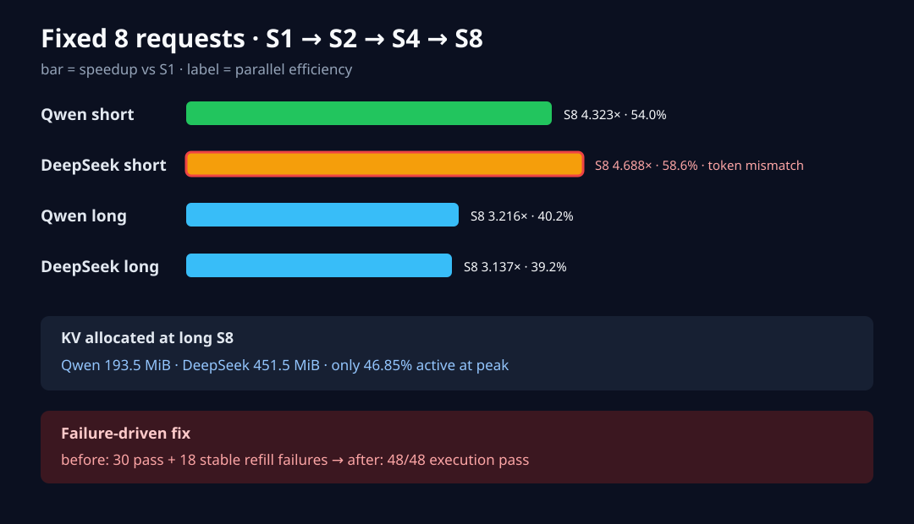

fast path增加“所有layer Storage未定义”条件，并给CPU/HIP补单slot不同长度refill门后，原矩阵
48/48执行通过。Qwen short S8相对S1为4.323×，DeepSeek为4.688×；long S8只有3.216×/3.137×，
效率约40%。同时long S8 KV分配翻到193.5/451.5MiB，byte利用率仅46.85%。

执行通过仍不等于精度通过：DeepSeek short的S1/S2和S4/S8形成两组答案，第6条请求从第5个
生成token开始分叉。summary明确分开execution pass与accuracy failure。下一步要看首个分叉位置
的logits margin，并研究长度感知Cache，而不是把S8吞吐当成免费收益。

## 121. Experiment 104：0.000669的差距足以改写整段回答

默认关闭的selection diagnostics记录每次选择的request/slot/position、logit来源与真实batch、GPU
argmax和top-2 margin。DeepSeek分叉点的两个候选正好是23606与1196：S1/S2 margin为0.015623/
0.011353，S4/S8只剩0.000669并交换第一名。GPU与host top-1完全一致，排除了argmax错误。

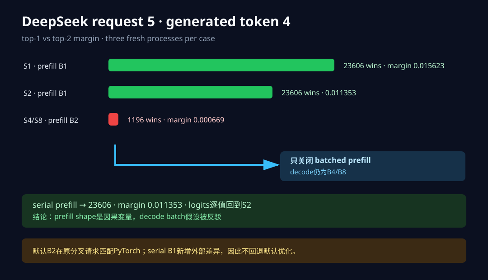

只关闭等长prompt batching，S4/S8仍使用positions-aware B4/B8 decode，但logits逐值回到S2，完整
输出也回到S1组。由此推翻decode batch假设，确认prefill B1/B2是因果变量。

这不等于应该回退：默认B2在原分叉请求选择1196，与PyTorch full-BF16相同；serial B1改成23606，
反而新增外部差异。于是诊断API和反驳开关保留，生产默认仍batch prefill。下一节点继续交换和复制
B2 local rows，区分正常GEMM shape漂移与row/copy缺陷。

## 122. Experiment 105：如果是row错误，交换以后它应该跟着走

显式prompt offsets把同一个P5分别放在B2 row1和row0，再把两行都设成P5。12/12 fresh processes
中，四条B2 P5的prefill top-2/logits逐值相同，完整16-token输出也相同；B1仍形成另一条输出。


差异没有跟local row、physical slot、P4/P5顺序或duplicate copy移动，因此local row stride和KV
prefix copy假设被反驳。剩余最强解释是BF16 GEMM从M32到M64时的数值路径差异。下一节点要看完整
logits和每个block的误差增长，不能用top-2相同就宣布全部batched算子已证明正确。

## 123. Experiment 106：embedding exact，第一处差异在block 0

graph-free inference接入默认关闭的layer TraceSession。相同P5的B1与`[P5,P5]` B2完整捕获embedding、
28个block、final norm和151936维logits。三对fresh process逐字段相同，B2重复行31个stage全部exact。

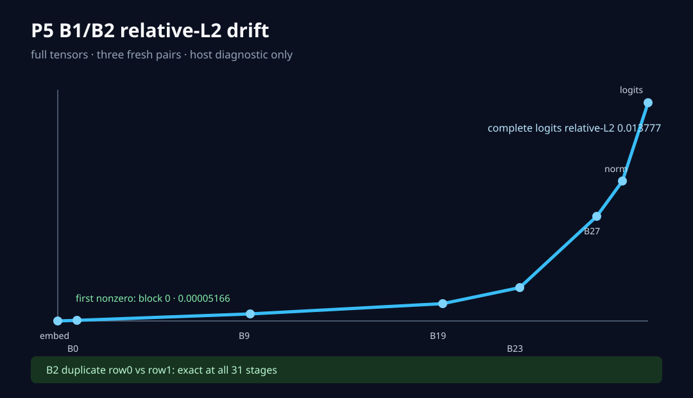

embedding差异为0；block0首次出现max 0.001350、relative-L2 0.00005166。RMS/relative-L2总体逐层
累积，block27达到max1.9003/relative0.006261，最终logits为max0.1530/relative0.013777。这个max仍
在既有官方BF16 0.2门内，却足以在0.000669 margin改变greedy token。

下一节点只拆block0的norm、QKV、RoPE、Attention、residual和FFN，不再扩大scheduler矩阵。

## 124. Experiment 107：不是Attention，第一处差异只在FFN output

block0新增12个细粒度stage。attention norm、Q/K/V、RoPE、value、context/output、residual和FFN
norm的B1/B2完整值全为exact。第一个非零点是fused BF16 FFN output：max0.0013504、relative-L2
0.00007269。B2重复行43个stage仍全部exact。

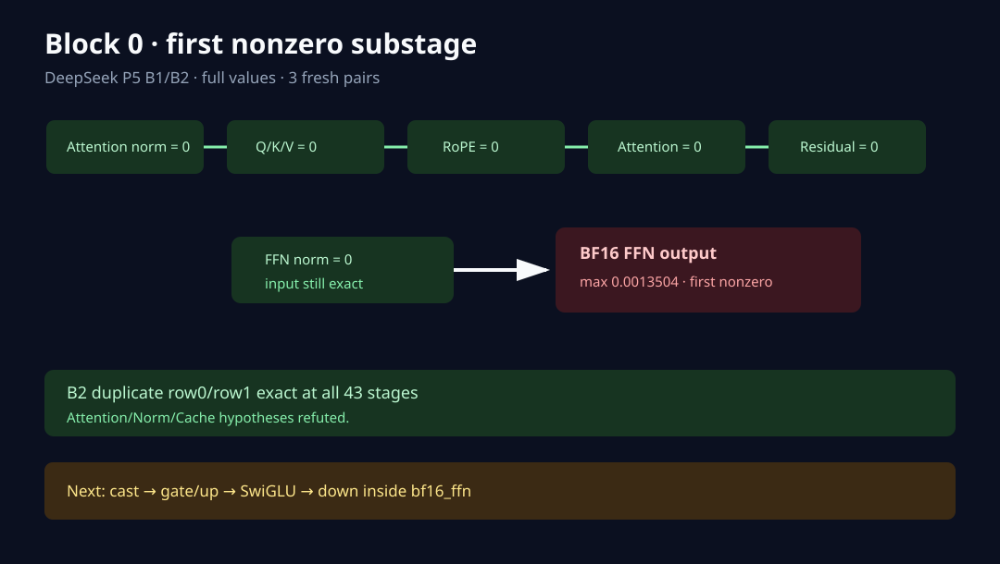

这反驳了Attention、RoPE、Cache、norm和residual解释，也说明不是所有换M的BF16 GEMM都会产生可见
差异。下一节点只打开`bf16_ffn`，检查cast、gate/up、SwiGLU和down。

## 125. Experiment 108：cast exact，gate GEMM先出现0.015625差异

第一次运行被合同拦住：TraceSession把BF16 values静默写空。修复全部浮点dtype捕获和截断语义后，
三对48-stage数据稳定。input cast exact；gate max0.015625最先非零，up独立差0.001953125，SwiGLU
和down继续传播。B2重复行全exact。

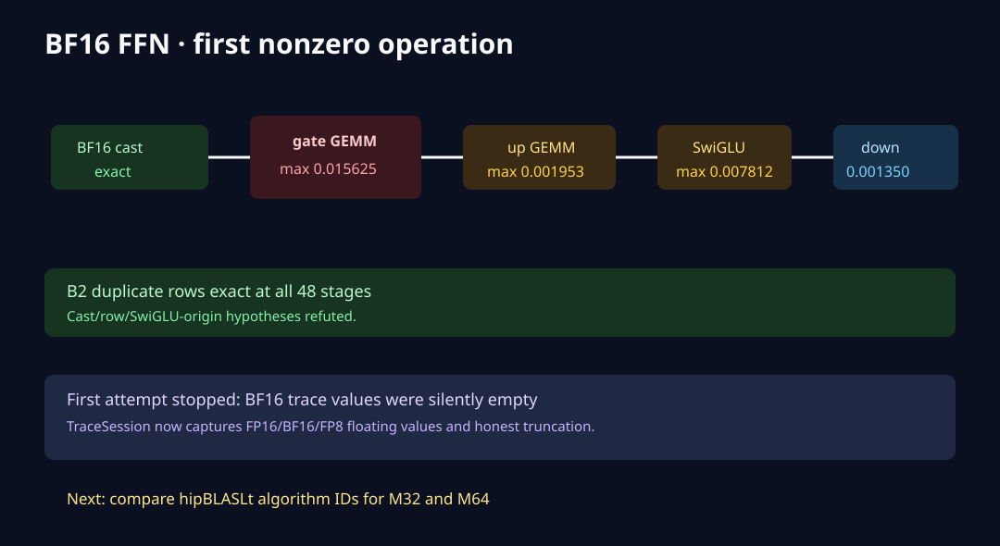

证据已收敛到M32/M64的BF16 gate/up hipBLASLt路径。下一步记录algorithm ID并尝试same-algorithm
反驳，不能直接用FP32回退掩盖问题。

## 126. Experiment 109：M32/M64有53个共同solution

默认调用的algo为null，所以先用相同descriptor查询64个heuristic候选。两种shape各返回64个，在
32MiB workspace限制下交集为53。same-algorithm反驳可做；index仅对当前hipBLASLt版本有效。

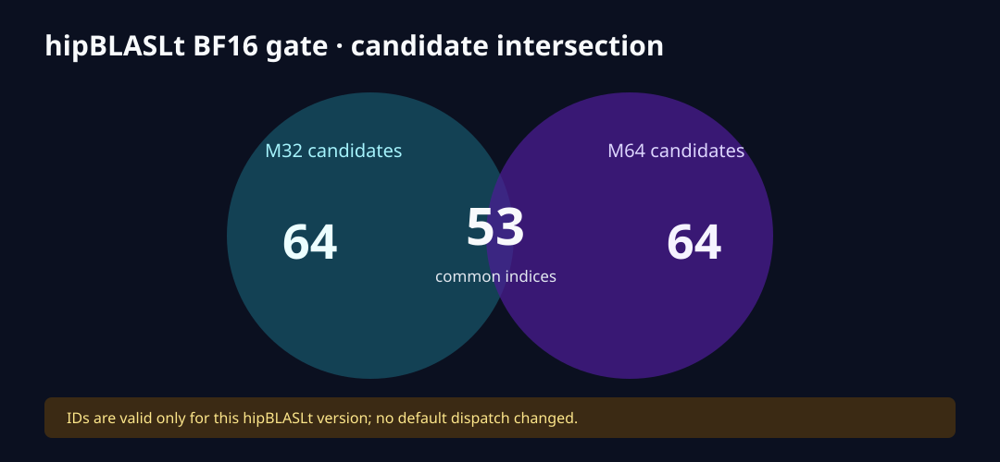

## 127. Experiment 110：全阶段exact的成本是1.3%–3.8%

共同index75892让B1/B2的48个stage和完整logits全部exact。无trace A/B显示B1/B2吞吐为默认的
0.9623×/0.9873×。保留显式、版本局部strict registry，不硬编码为默认。

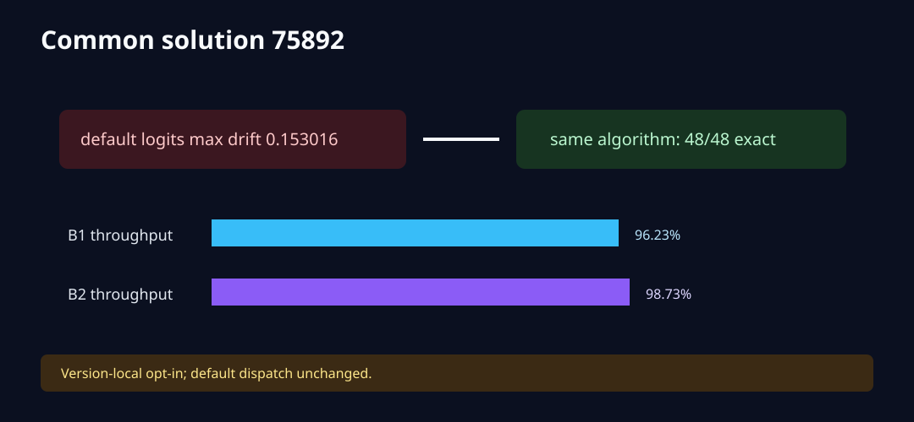

## 128. Experiment 111：Qwen 75789不慢，但也不exact

75789的B1/B2性能为默认0.9932×/1.00045×，但完整logits仍有0.083515 max drift，首差仍在gate。
它被拒绝为strict策略，保留原始数据并继续扫描其它共同候选。

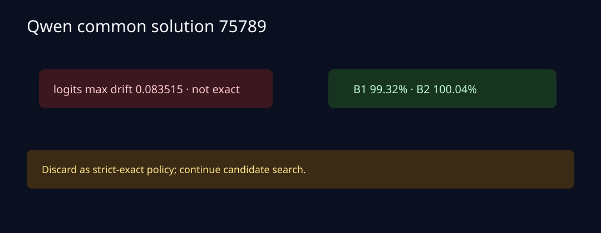

## 129. Experiment 112：56个共同候选没有一个tensor exact

完整logits门扫描全部56个共同index，全部受支持但0 exact。最佳RMS0.015268；候选聚成少量相同
signature。Qwen token本已稳定，关闭当前heuristic strict搜索，不用FP32回退。

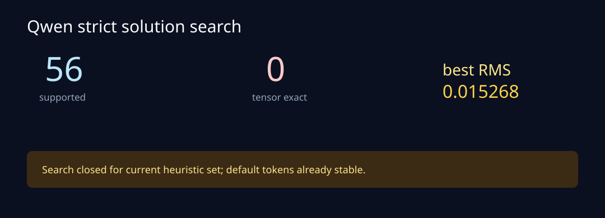

## 130. Experiment 113：长context不是slot越多median越低

48条矩阵加入逐请求TTFT/completion和P50/P95。short S8最好；long S4的TTFT p50低于S8，而S8
吞吐最高、KV利用率仅46.85%。在线长请求先选S4，离线吞吐再选S8。

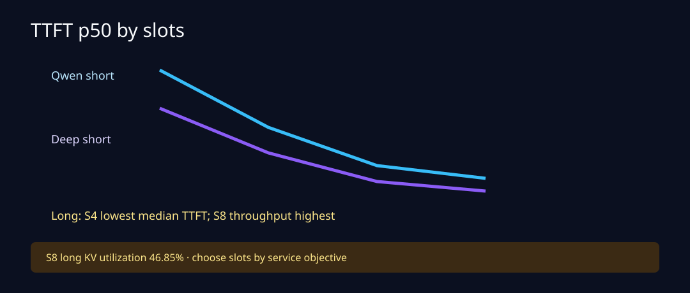

## 131. Experiment 114：省52.9% KV，不等于整机更快

统一S8为所有row按最长请求预留Cache；四个B2长度桶共享同一份权重，只拆KV。Qwen/DeepSeek
12个Release进程全部通过且token exact。KV backing下降52.91%，利用率46.85%→99.49%，median
TTFT下降56%–57%。但B8 decode被拆成四个B2，吞吐下降约42%，completion p50增加74%–76%，
TTFT p95也增加约20%。engine peak只降6.5%–7.5%，说明权重和临时Tensor仍是大头。

保留为显式memory/median-TTFT policy，不改默认。下一节点测1/2/4桶Pareto，而不是直接增加paged
Cache复杂度。

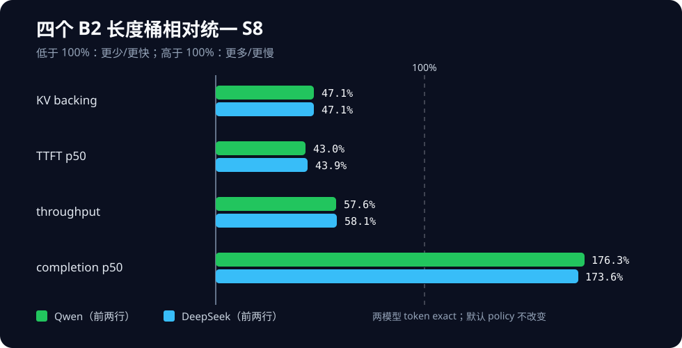

## 132. Experiment 115：两个B4桶是当前Pareto拐点

先拒绝一轮“程序18/18成功、但DeepSeek阶段被外部作业占60%–96% VRAM”的假性能结果，并给
runner增加每个fresh process前后的物理GPU显存门。正式18条pre均0%、post最大2%，两模型跨
1/2/4桶token exact。

两个B4桶相对统一B8：KV少37.4%，median TTFT改善约35%，吞吐只损失约14%；completion p50
增加约19%–20%，TTFT p95增加约7%。四个B2桶继续省KV，但吞吐损失陡增到42%。默认仍用一个
桶；两个桶保留为balanced opt-in。下一步测试偏斜请求和延迟到达，不能从完美均分负载直接设计
slot stealing。

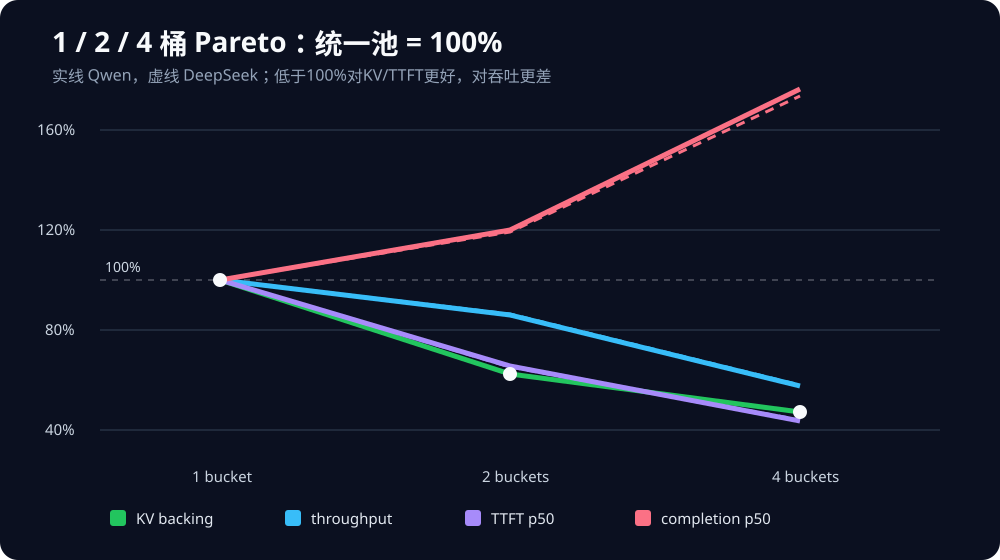

## 133. Experiment 116：P50改善70%，P95却慢三倍

两次被设备门阻断后，physical GPU2连续三次0/0，正式36进程全部通过且六组token exact。
short-heavy中两个B4桶让TTFT P50改善约70%，但排队请求的P95变成uniform的3.28×/3.14×；
long-heavy吞吐只剩57%，P95约3×。delayed流量没有收益，吞吐与延迟全面小幅回退。

固定桶不能根据median自动启用。下一候选只允许短请求溢出借用兼容的大桶slot，并以focus P95
为主门；长请求装不进小桶的反例继续保留。

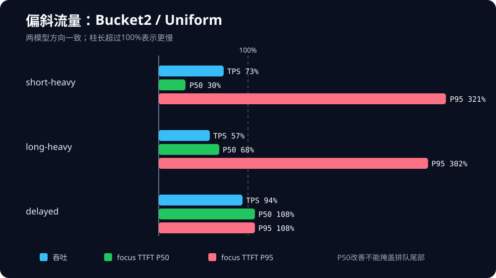

## 134. Experiment 117：借两个兼容slot，P95恢复六成

第一次正式运行被route合同拦下：pending被双计，4-slot桶在2条请求时就误判满。修复并增加
4-slot阈值测试后，54进程全部通过。short-heavy中第5/6条短请求进入大桶，吞吐相对fixed提高
约13%，TTFT P95下降61%–62%，completion P95下降约40%；long/delayed无overflow时保持中性。

候选仍比uniform少约17%吞吐，P95高23%–35%，所以保留显式开关但不改默认。long-heavy无法
借小桶，下一节点比较slot比例或paged Cache，而不是继续叠加错误的“万能”规则。

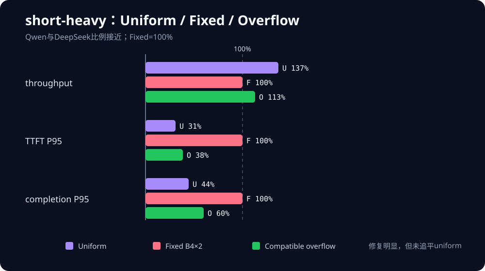

## 135. Experiment 118：短流量6:2，长流量2:6

48进程证明静态最优随长度分布翻转。short-heavy的6:2保留84%–85%吞吐、KV少56%，TTFT P95
反而低约59%；long-heavy的2:6保留约87%吞吐、KV少19%，TTFT P95只高6%–7%。反向配方会
把P95放大3×–5×。

因此不按模型名硬编码ratio。已知稳定流量可显式配置；流量会变时，下一问题是动态capacity，
不是继续搜索第四个静态数字。

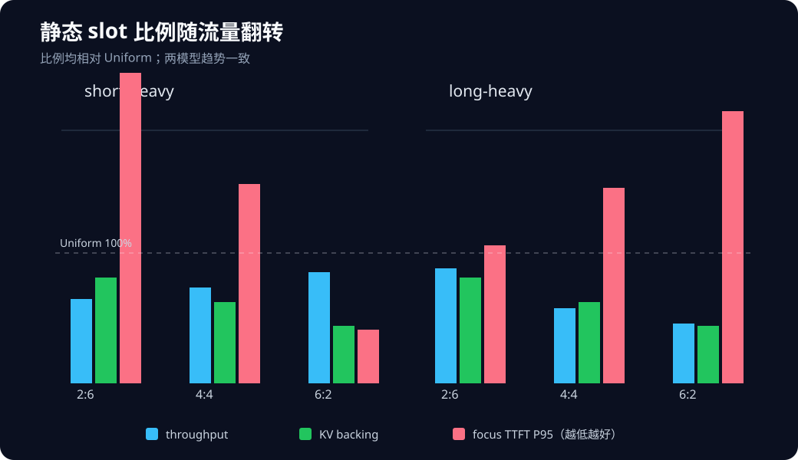

## 136. Experiment 119：FP8只在1024³快10.7%

20条executed precision记录全部过精度门。FP8在128–512比FP32慢3%–8%，1024³才快10.7%；
该点13.62TFLOPS只占官方FP8峰值0.52%。1024³实际最快是FP16 18.63TFLOPS。当前shape远未
饱和MI300X，不能用2.6PFLOPS直接推导模型tokens/s，也不能说低精度天然更快。

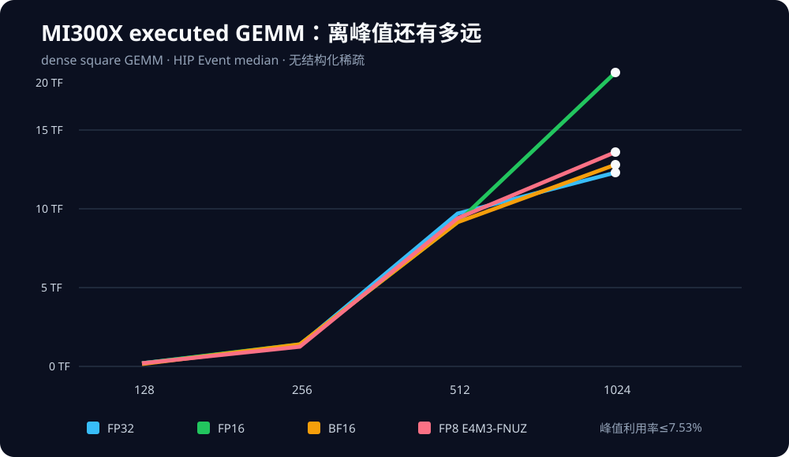

## 137. Experiment 120：4096³ FP8达到477TFLOPS

显式FP32 GPU reference解除CPU大矩阵瓶颈。2048/4096的FP8分别为99/477TFLOPS，相对FP32
1.73×/4.31×，相对FP16 1.10×/1.42×。FP32在4096达到官方峰值67.8%，FP8却只有18.25%，
说明低精度已经有真实加速但仍未饱和。reference边界、0.04级误差和无INT8执行都写进raw。

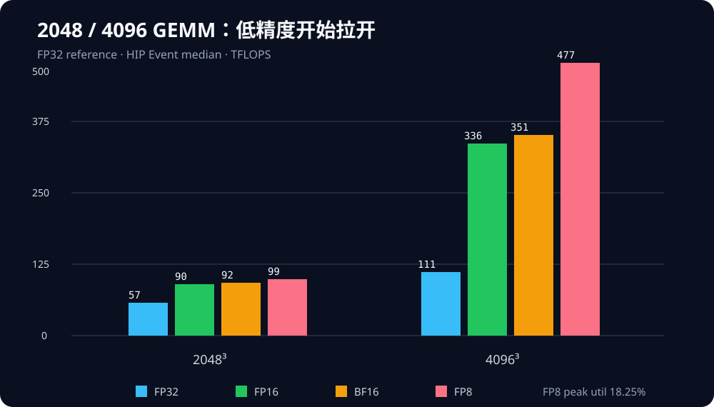

## 138. Experiment 121：INT8真实跑到416 TOPS

能力表升级为executed证据：raw hipBLASLt INT8×INT8→INT32覆盖128–4096，六个shape每个5个
CPU抽样点exact。4096达到416TOPS、官方峰值15.91%。这仍不是公共Tensor或模型INT8；scale、
zero-point、量化器和Transformer路径全部明确未实现。

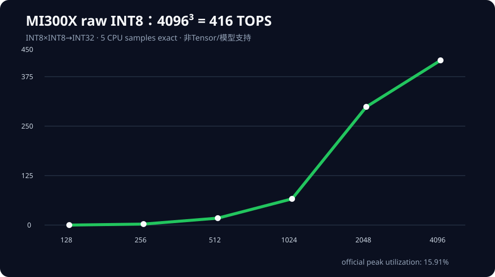

## 139. Experiment 122：FP8权重减半，四个精度门全红

单份FP8 Linear权重和persistent scale让Qwen/DeepSeek official worker完整执行。Deep T8的
M8×8960×1536不支持native FP8，精确记录为1个shape/112次BF16软件回退。FP8 resident仅为
FP32的35%–46%，Deep T512比BF16快4.4%；但四个FP8 aggregate max/RMS均巨大，Qwen T512
top token翻转。保留基础设施，拒绝静态全局scale和默认FP8。

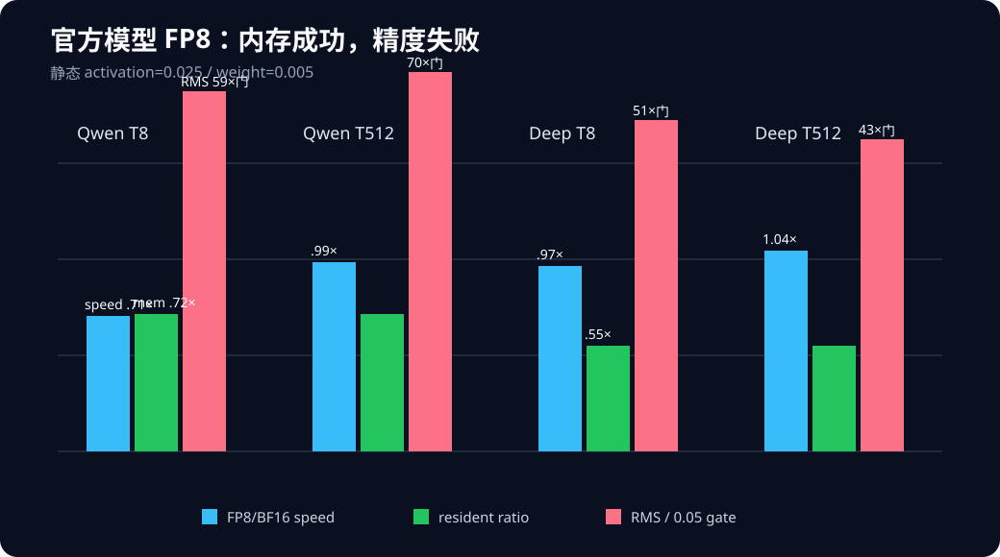

## 140. Experiment 123：32个scale全失败，边界却还没封死

两个官方模型各用1个FP32完整logits参考筛16个预先固定的FP8 scale对。34/34进程执行成功，
但32个候选0个通过精度门。Qwen最好RMS从2.96降到1.92，仍是门的38倍；DeepSeek最好保留
top token的候选RMS为2.54。Qwen最优activation正好落在0.05上边界，所以只拒绝当前网格，
下一节点扩展到0.1/0.2后才决定是否转向per-tensor amax。

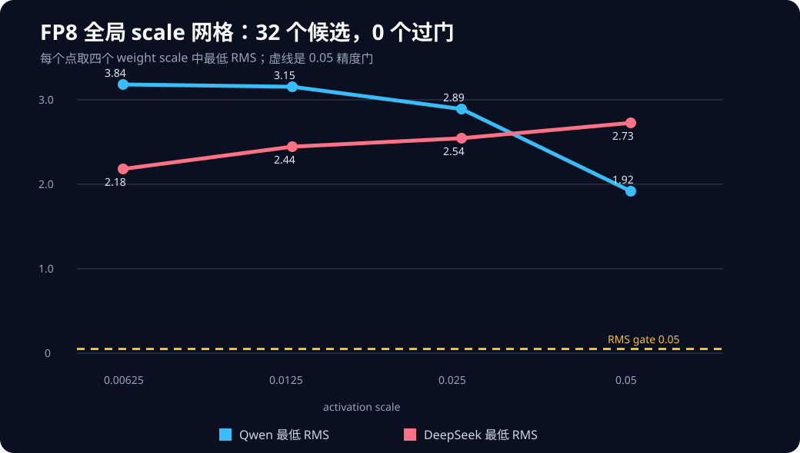

## 141. Experiment 124：边界放大四倍，RMS再降一半

只把activation scale扩到0.1/0.2，两个模型18/18进程执行成功、0/16候选过门。Qwen最佳RMS
从1.921降到0.669，DeepSeek从2.542降到1.170；原“0.05已接近谷底”的解释被推翻。但两个
最佳点又都在0.2上边界，因此下一节点继续0.4/0.8，找到转折后才停止全局scale搜索。

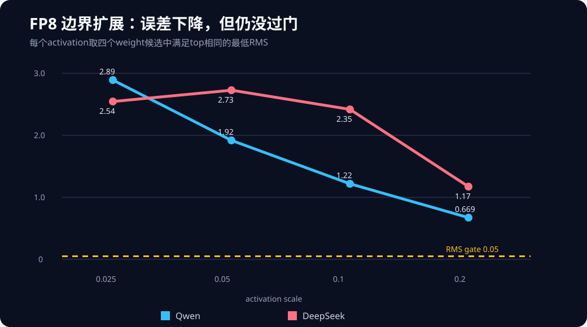

## 142. Experiment 125：DeepSeek转弯，Qwen继续下降

activation 0.4/0.8的18个进程全部执行、0/16过门。DeepSeek保留top token的最佳RMS从1.170
回升到1.235，误差谷底已经越过；它在0.8的更低RMS会翻转top token，因此被门拒绝。Qwen继续
降到0.303但仍是门的6倍且位于边界。停止DeepSeek搜索，Qwen只再扩一次1.6/3.2。

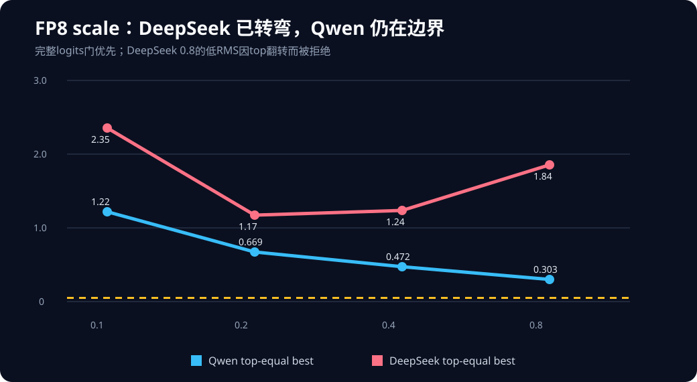

## 143. Experiment 126：没有假装转弯，也停止盲搜

Qwen 1.6/3.2的9个进程全部执行，8/8 top相同但0/8过门。最佳RMS继续降到0.217，仍为门的
4.33倍，没有字面转弯。结合DeepSeek的谷底在0.2附近和weight最佳值漂移，本项目停止跨模型
全局数字搜索，但不声称数学上推翻所有scale。下一节点让每个Linear weight按自己的amax选scale。

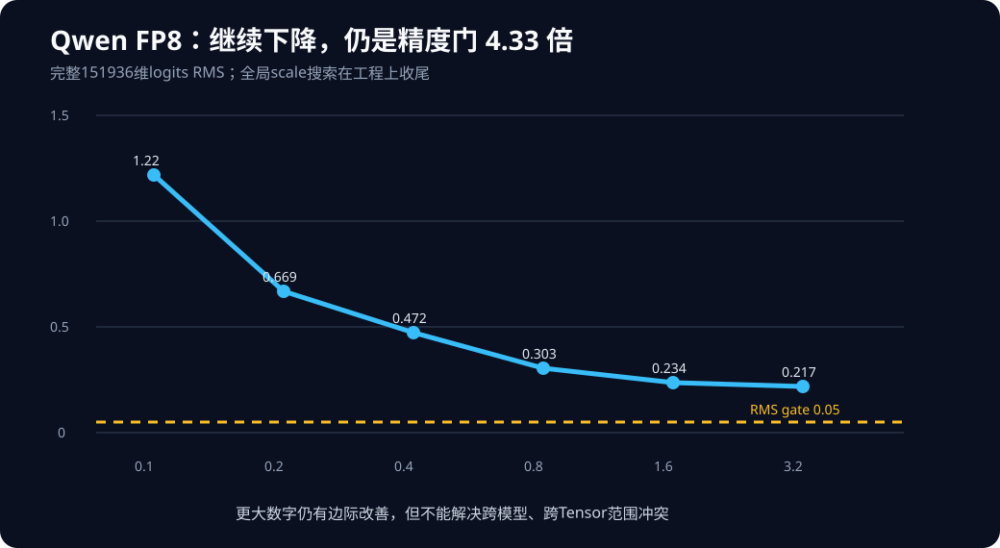

## 144. Experiment 127：每层权重自己的尺子，仍差activation

`tensor-amax`让168/197个Linear各自使用weight scale，Qwen scale跨度近20倍。完整36进程
让四个RMS相对最初静态点下降39%–78%，但仍是门的13–26倍。Qwen/Deep FP8准备分别扫描
1.43/6.17GB并耗时约2.8/12.2秒；热路径没有重复D2H。保留opt-in基础设施，拒绝默认，下一步
测activation层级范围。第一轮丢失准备计时的15条部分数据也被保留并拒绝。

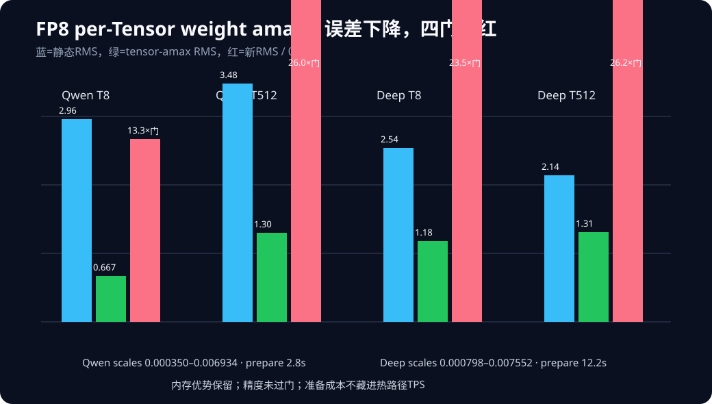

## 145. Experiment 128：同一把activation尺子既太短又太粗

全层FP32 trace得到Qwen96、DeepSeek112个Linear输入范围。固定0.2对应±48，16个潜在饱和点
全部在FFN；最大activated超过范围35.9×/64.2×。但Attention context的P50 amax仅2.59/2.97，
放大全局scale会让普通层量化更粗。第一次Qwen因缺24个FP32 activated观测点按72/96停止并
保留。下一节点先做device per-input-Tensor amax，不越级声称必须per-token。

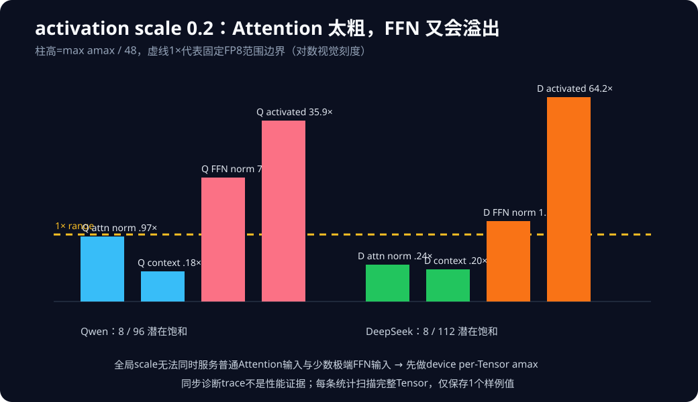

## 146. Experiment 129：误差降八成，T512慢二十倍

device Tensor amax让scale全程留在GPU，四个RMS相对weight-only再降63%–81%，但仍全部超过
完整logits门。更严重的是单个256-thread block扫描完整Tensor：Qwen/Deep T512吞吐只剩BF16的
5.27%/4.40%。保留host-free device-scale合同，拒绝当前模型策略和reduction Kernel；下一步先看
Tensor内部row/token范围，再决定粒度。

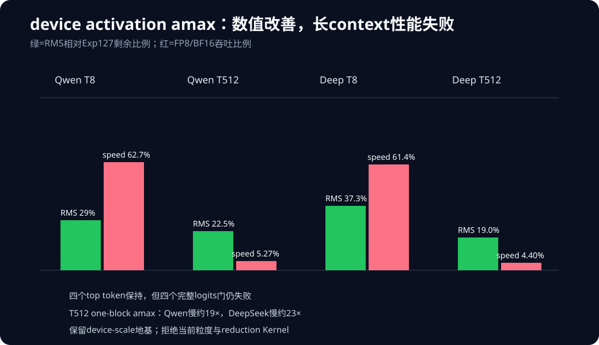

## 147. Experiment 130：一两个异常token支配整块scale

208个T8 Tensor的逐row amax显示，Qwen/Deep FFN median row spread约3.8–4.8×，极端activated
达到1106×/2076×；Qwen FFN norm有41.1% rows只用tensor范围四分之一。Deep Attention则几乎
均匀。证据支持FFN定向per-row，不支持所有Linear统一加开销。完整值trace约95MB不进Git历史，
仓库保留全部逐row amax、复现命令和trace manifest。

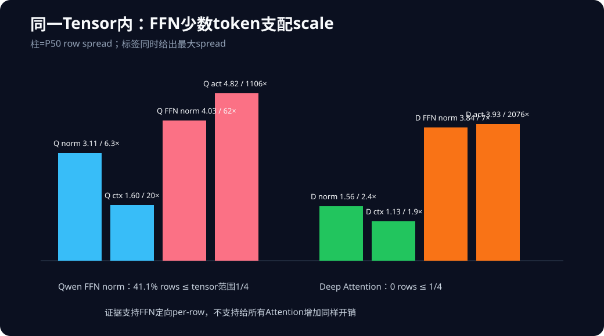

## 148. Experiment 131：T512恢复十六倍，四个门仍红

FFN-only OuterRow把Qwen/Deep T512相对全Tensor动态提升14.1×/16.2×，达到BF16的约0.71–0.75×。
DeepSeek RMS继续下降，Qwen T512却退到0.396；四个精度门仍全失败。gfx942 native status为0，
每worker精确记录288/336次device BF16 fallback。保留路由与计数，拒绝默认模型策略。

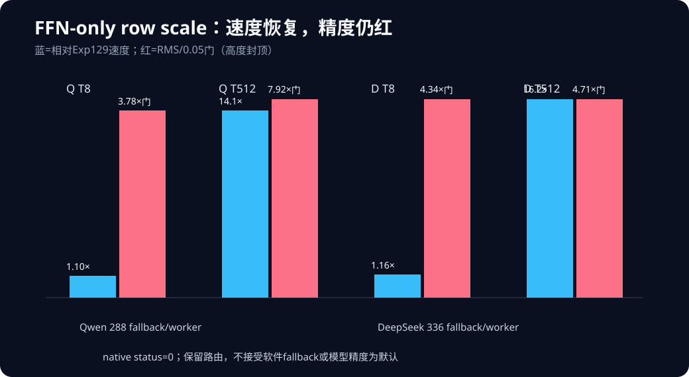

## 149. Experiment 132：冷启动快5.8倍，先修掉一个假绿CLI

device weight amax让Qwen/Deep准备从约2.9/12.3秒降到0.50/2.11秒，host权重payload D2H归零，
热TPS在host基线±2.3%。首次pilot先抓到stale binary，fresh build又暴露CLI编译错误；修复后
binary contract转绿才正式跑36进程。logits不bit-exact、四个精度门仍失败，所以只保留准备优化。

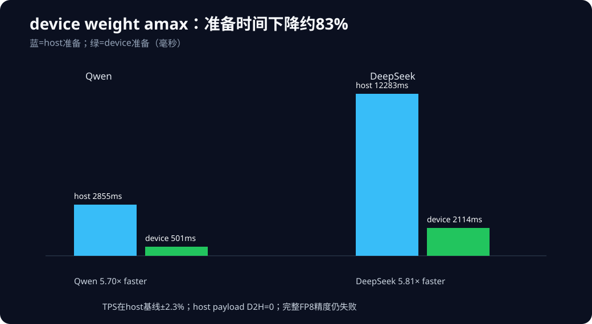

## 150. Experiment 133：冷启动快73倍，T512快21倍

最多1024个partial blocks加finalize block，让Qwen/Deep weight准备从501/2112ms降到20/29ms；
全Tensor dynamic activation T512从4874/2181提升到75518/44975 TPS。两套完整logits误差与
single-block逐值相同，证明是纯性能优化。FP8精度门仍失败且仍慢于BF16，模型策略不改。

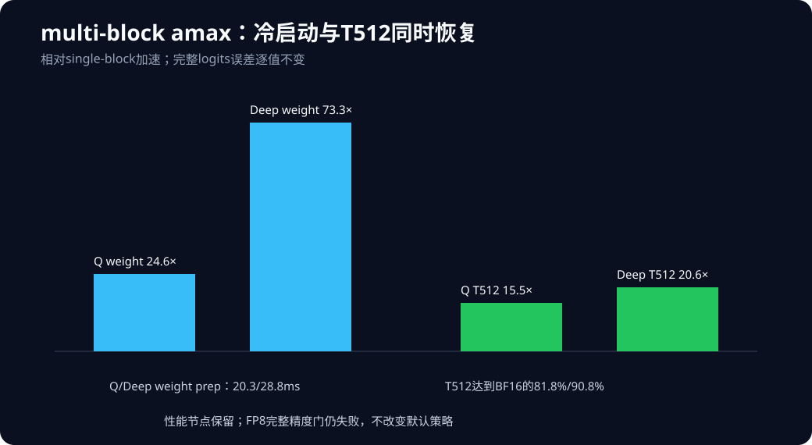

## 151. Experiment 134：动态量化占可归因时间四成

T512 rocprof显示Qwen/Deep dynamic scale+finalize+quantize为2.12/3.11ms，GEMM为3.12/5.52ms；
前者占两类合计40.5%/36.0%。168/197次调用说明每个Linear都独立量化，尽管QKV和gate/up共享
输入。whole-process cast热点来自加载，不冒充前向。下一节点共享QKV与gate/up量化结果。

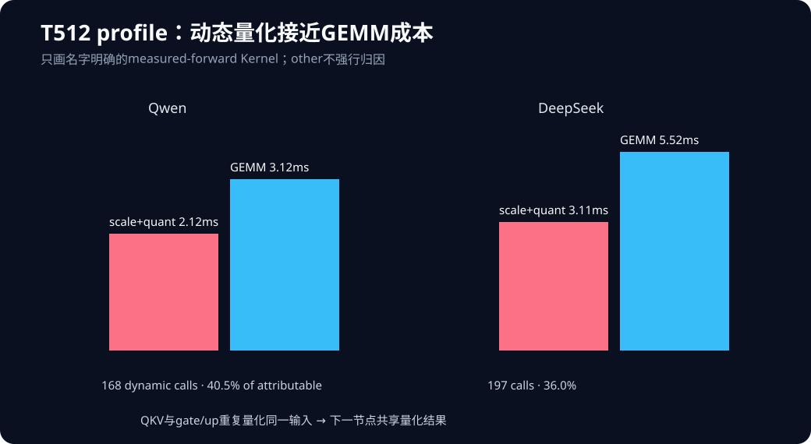

## 152. Experiment 135：Deep T512首次快过BF16，精度仍红

QKV和gate/up共享量化让每forward动态调用Qwen168→96、Deep197→113。T512吞吐提升
12.81%/12.39%，Deep达到BF16的1.028×。完整max/RMS与Exp133逐值相同，但仍是精度门的
5.85×/4.98×。保留无损性能优化，不把速度胜出写成FP8模型可用。

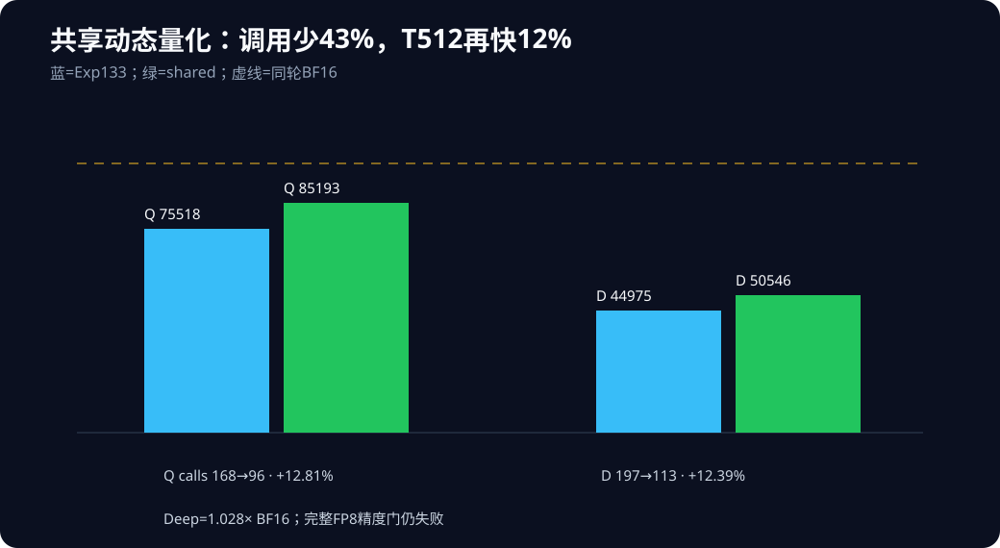

## 153. Experiment 136：profile确认收益，优先级转回精度

共享后Qwen/Deep dynamic三段降45.6%/43.6%，known-forward降20.5%/17.1%；launch少216/252，
GEMM与other calls不变，隔离归因成立。GEMM现占可归因时间约72%/75%，但Deep已快过BF16，
而FP8精度仍差约5倍门槛。暂停增加性能复杂度，转向逐层精度证据。

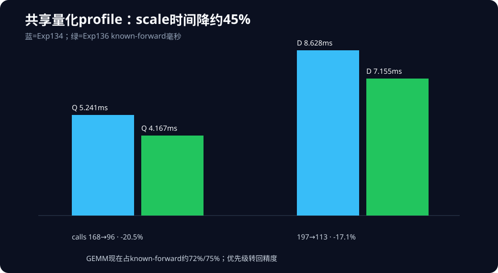

## 154. Experiment 137：Qwen21层突变，Deep27层放大

FP32/FP8完整block快照显示Qwen block2–20相对误差长期低于1%，block21突然到21.2%；Deep在
block26/27升到3.9%/11.5%，最终词表投影放大到24.1%。4份trace零截断。下一节点只展开
Qwen21和Deep27内部子阶段，避免全层盲查。

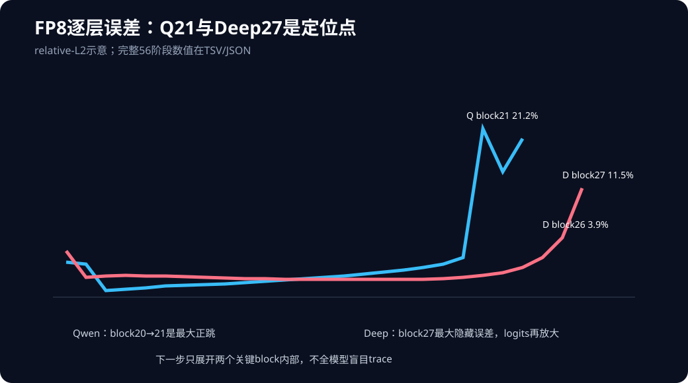

## 155. Experiment 138：FFN只有2%误差，相加后变成21%

Q21/Deep27内部完整值显示FFN output rel-L2仅1.74%/3.24%，block output却跳到21.21%/11.50%；
gate/up并未爆炸。证据支持残差抵消放大解释，但缺block input，尚未证明。下一步记录input并做
关键block FP32、上游仍FP8的反事实。

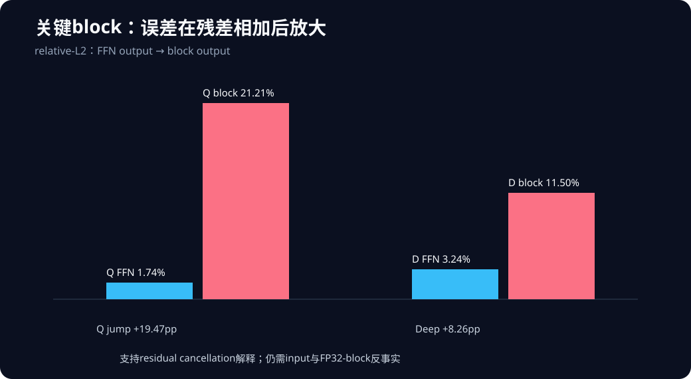

## 156. Experiment 139：Qwen残差抵消达到17倍

完整值代数证明Q21 residual/FFN cosine=-0.9935，cancellation factor17.02×；relative误差放大
12.17×中，分母收缩贡献8.38×。Deep27 factor4.45×。block和误差向量均精确重构。抵消存在已
证明；下一mixed FP32 block只回答“能否修复”，不再用于证明几何现象。

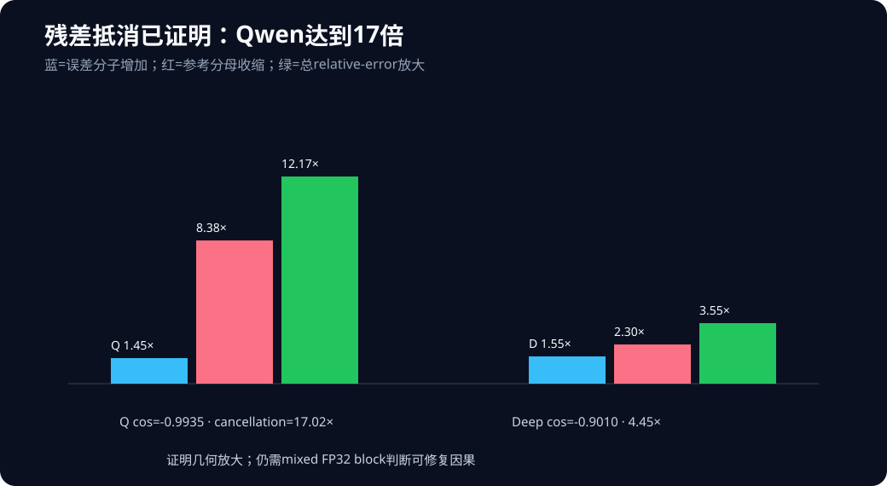

## 157. Experiment 140：关键层改回FP32，长上下文反而更差

只把Qwen block21和DeepSeek block27的7个Linear保留为FP32，其余层仍走相同FP8路径。
两模型各18个worker正常结束，每个worker比较151,936个完整logits。T8 RMS改善3.21%/13.41%，
但T512 RMS反而恶化3.89%/6.05%，常驻权重多42.66/133.87 MiB，吞吐低1.47%/3.49%；
四个精度门仍全红。

这推翻“误差主要在高抵消block内产生，改回FP32就能修好”的解释。高抵消block是误差放大的
地点，不等于主要误差源。保留选择性FP32 API做诊断，不设默认；下一步分别隔离权重和激活量化。

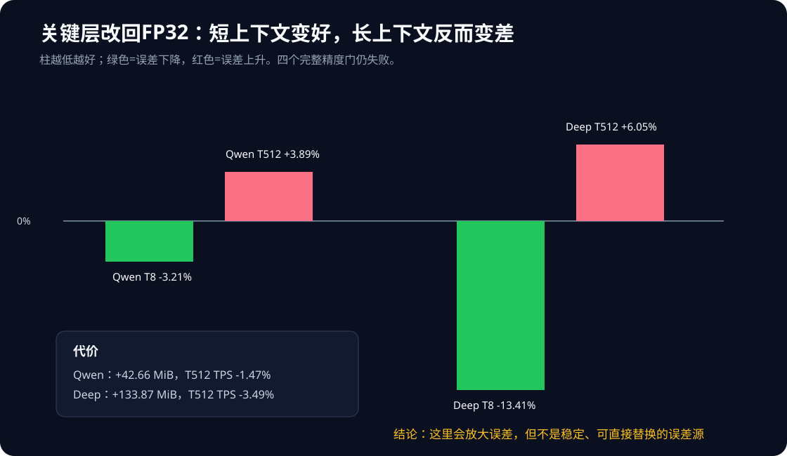

## 158. Experiment 141：Qwen偏权重，DeepSeek偏激活RMS

把FP8 Linear拆成weight-only和activation-only，两条都还原后使用FP32 GEMM。Qwen T8/T512的
权重RMS分别比激活大1.37×/1.62×；DeepSeek激活RMS反而大1.45×/1.13×，而T512 Max又由
权重主导。24/24 worker执行成功，八个诊断精度门全红，top token全相同。

没有跨模型的单一坏边。两条diagnostic native dispatch都为0，TPS不进入性能结论。下一步让
两边同时舍入但继续用FP32 GEMM，区分共同舍入传播与真实FP8 GEMM。


## 159. Experiment 142：原生GEMM改变方向，却没有让总RMS更坏

同一组量化值分别走原生FP8 GEMM和双侧还原后的FP32 GEMM。四组direct RMS达到full总RMS的
54.8%–76.9%，全部完整向量门失败；原生数学显然不是小扰动。但full/both总RMS比只有
0.765×–1.002×，没有一组超过预设1.05门，三个case的full反而更低。

因此拒绝“换FP32 GEMM即可修精度”，both自己的四个FP32门也失败。继续优化scale，同时要求
所有候选回到native full验证，不能把软件反事实当最终模型结果。

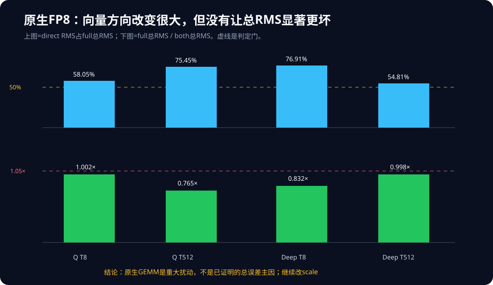

## 160. Experiment 143：DeepSeek RMS降59%，Qwen反而升29%

per-output-channel权重scale让DeepSeek T8/T512 RMS改善59.0%/33.5%，Qwen却恶化28.8%/27.8%；
四个完整精度门仍全红。每个native Linear新增一次post-scale，Qwen/Deep T512吞吐下降
13.09%/12.86%，也都越过5%拒绝门。scale只多约1.2/3.2 MB，launch才是主要结构代价。

拒绝跨模型默认，保留算子和opt-in策略。下一步探测权重侧outer-vector能否由当前MI300库原生
执行；不把Deep单模型比例改善写成完整FP8可用。

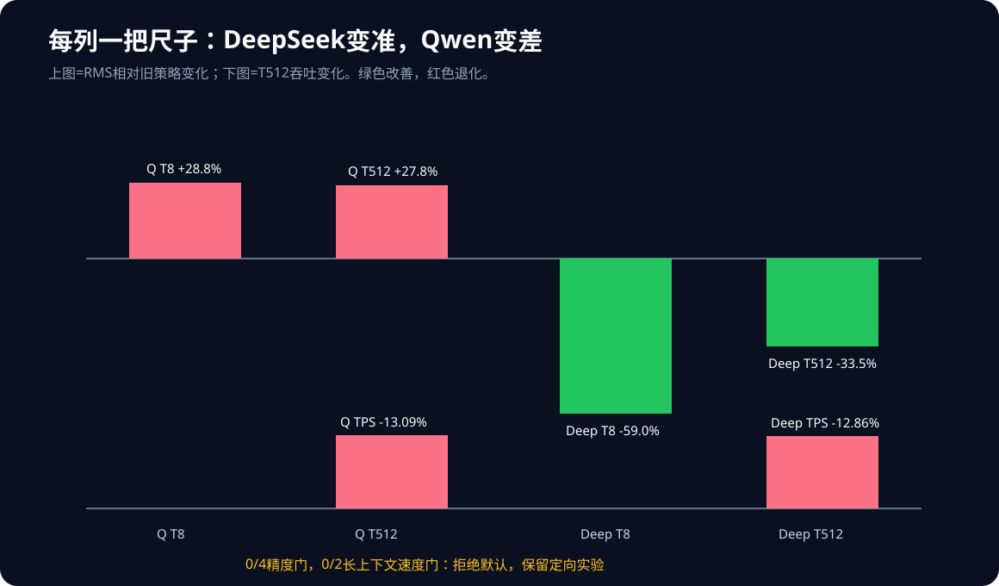

## 161. Experiment 144：API存在，不等于MI300运行时支持

权重侧outer-vector真实提交返回status 0；128² probe仍通过，因为引擎缓存拒绝结果后执行原生
scalar FP8 GEMM + device post-scale。Qwen/Deep T512分别精确记录336/394次post，等于全部Linear
乘两次forward；hot column quantize和software GEMM fallback均为0。

因此关闭“打开一个库属性就拿回13%”的解释。后续只研究减少per-column范围或融合post-scale，
不再把头文件能力写成硬件实测。

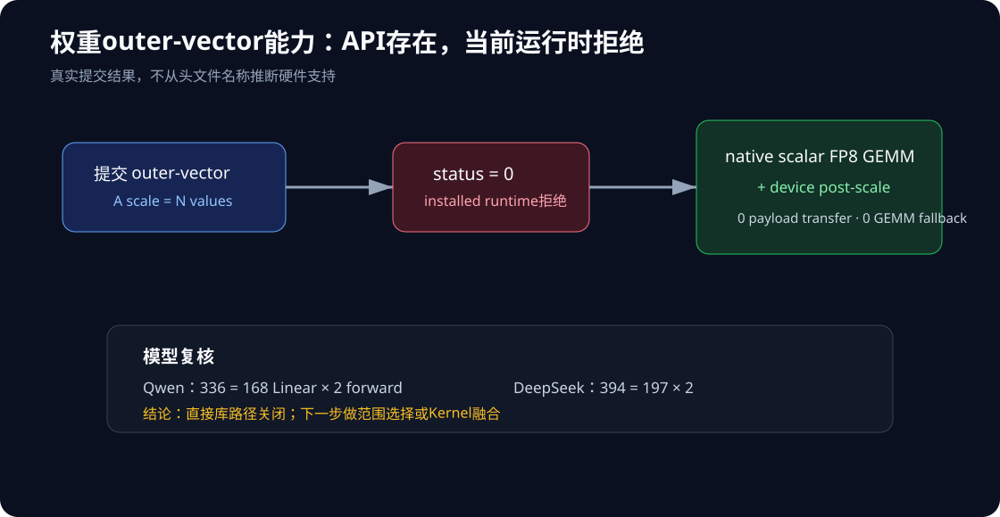

## 162. Experiment 145：权重改善不到1%，模型误差却能变化59%

365个官方Linear的外部PyTorch ROCm重建显示，per-column相对scalar只改善Qwen 0.72%、Deep
0.40%；最佳分组是Q Attention 1.05%和Deep output head 0.97%。这远小于Exp143模型级
+28%到-59%的变化，直接证明传播和抵消不能从权重SSE预测。

下一最小实验只改Deep独立LM head；Qwen tied head应保持baseline。外部审计只选范围，最终仍
回到native完整logits。

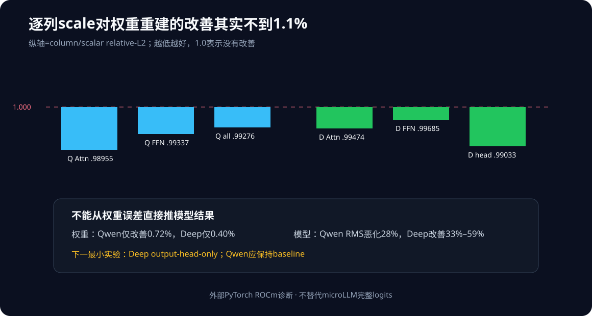

## 163. Experiment 146：先拒绝错误基线，再发现收益为零

最初Exp129/135看似支持Deep output head，但旧host Tensor-amax不能对比当前device Tensor路径。
追加同binary完整control后，两模型T8/T512 Max/RMS全部精确不变。T512只慢0.85%/0.52%，
Deep多607,740B和每forward一个post，但预设数值改善条件失败。

targeted keep=false，完整门仍0/4。删除这个scope，保留“发现基线错误并改写结论”的全过程。

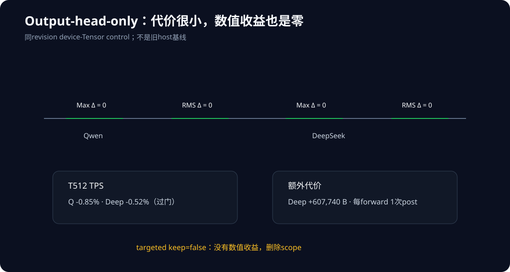

## 164. Experiment 147：八项改善七项，唯一红条仍然否决keep

Attention Q/K/V/O逐列scale后，Qwen T8与Deep两context全部Max/RMS改善；Qwen T512 Max也改善
10.2%，但RMS恶化8.91%。两模型T512只慢4.26%/4.42%，都过门。预设规则不允许用7/8平均
盖住一条长上下文回归，因此keep=false，完整门仍0/4。

下一步只测O projection，隔离Q/K/V的长上下文非线性影响。

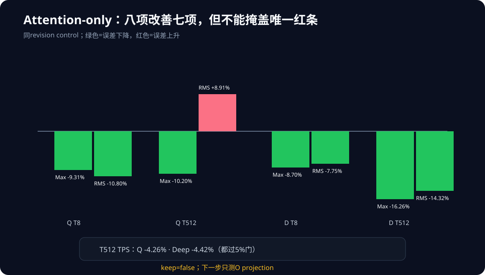

## 165. Experiment 148：只改O projection，定向keep通过

O-only让Qwen两context Max/RMS完全不变；Deep T8改善8.70%/7.75%，T512改善16.26%/14.32%。
T512只慢3.74%/1.50%，八项无回归、至少一项改善、两速度门全部成立，targeted keep=true。

它以更少post保留Exp147全部Deep收益并消除Qwen红条，因此保留O-only、删除更宽Attention-only。
完整precision仍0/4，下一步转向activation。

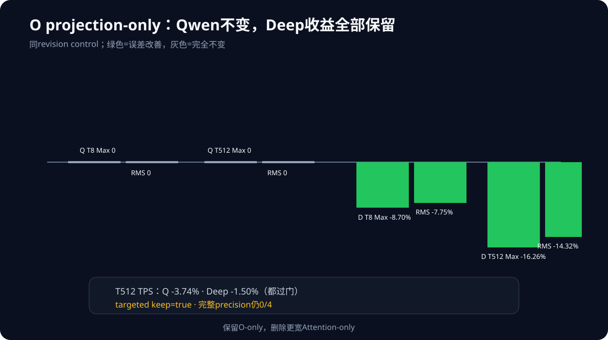

## 166. Experiment 149：没有答案，因为GPU被外部任务占用

fraction=1预检3次均空闲，但运行中post gate检测22% use/9% VRAM并退出；下一fraction首次预检
已17%/10%，后续长期72%–100% use、57% VRAM。已写3行全部排除，有效suite=0/4。

不选fraction、不报TPS、不拼接retry。严格门正确阻止了一次假结论，GPU空闲后从1.0重跑。

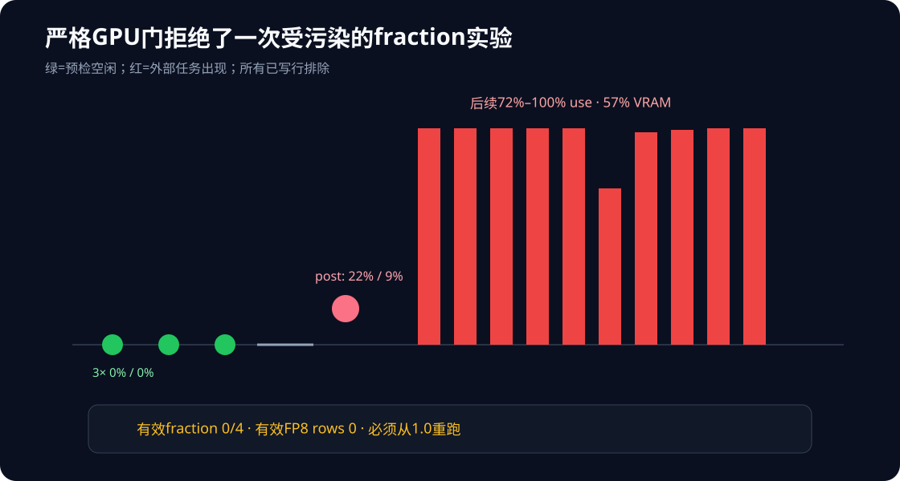

## 167. Experiment 150：GPU干净、程序跑完，实验仍然无效

新runner完成20 worker/16 comparison，但硬编码weight minimum0.0001；retained O-only使用0.005。
fraction=1四组Max/RMS全部不匹配，所以“1.0最好”的runner结论也作废。执行合同有效，数值选择
无效。

修复为显式参数、默认0.005，并让合同直接检查命令。新实验必须全新重跑。

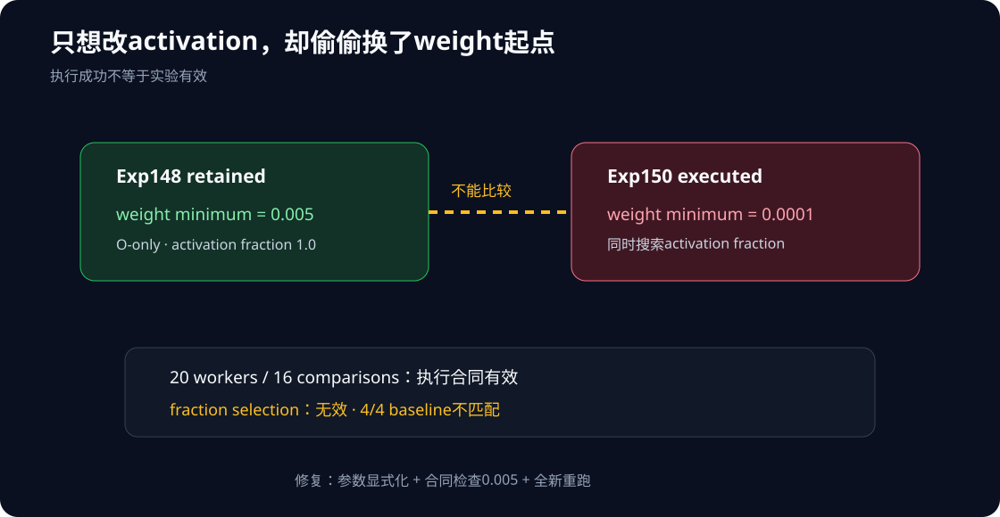

## 168. Experiment 151：fraction 0.75已让worst RMS恶化6.55倍

修正weight minimum后，fraction1四case与Exp148逐值一致。0.75/0.5/0.25的worst RMS分别为
control 6.55×/9.51×/12.18×；后两者还翻转top。计数证明所有dynamic activation确实被裁剪。

关闭≤0.75，但不越过0.75–1.0空白；下一步只测0.95/0.9/0.85。

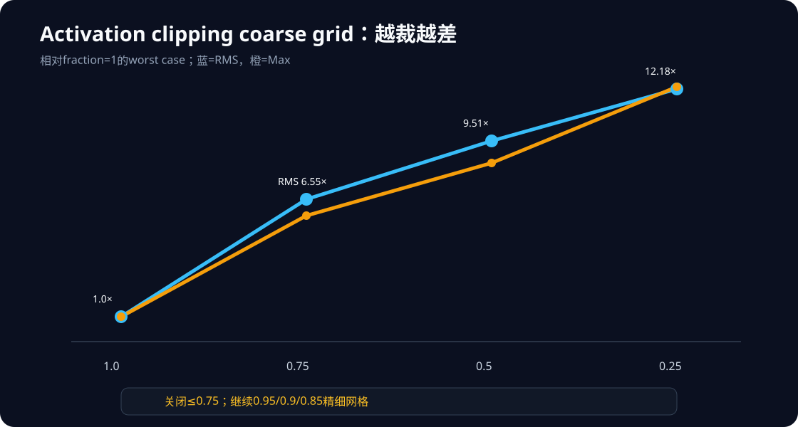

## 169. Experiment 152：只裁5%，worst RMS也翻2.15倍

0.95/0.9/0.85精细网格的worst RMS是fraction1的2.15×/4.98×/8.25×，所有top虽稳定，完整向量
明显更差。结合coarse grid，0.25–0.95全部关闭。

删除模型/CLI clipping和专用pilot runner，保留底层C++算子；下一主线不再调全局amax fraction。

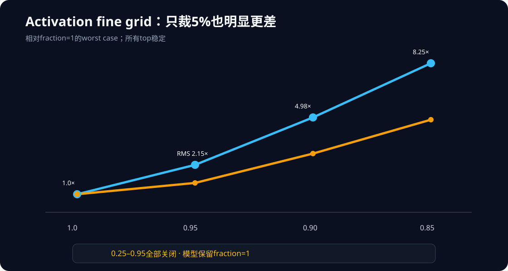

## 170. Experiment 153：指数范围更大，完整误差反而最多恶化3.43倍

E5 candidate与E4 control使用同revision、同binary、同动态amax和O-only权重scope。两套72个
worker全部成功，24个FP8行各比较151,936个logits。E5的八项Max/RMS无一改善：Qwen为
1.51×–2.12×，DeepSeek为2.06×–3.43×。两项T512吞吐变化只有+0.06%/-0.30%，显存增量为零，
但完整precision仍0/4。

这否定“更大指数范围可能改善当前动态量化模型”的解释。动态amax已经适配范围，少一位尾数
成为更直接的损失。模型、CLI和通用matrix的E5策略删除；Tensor dtype、量化/反量化、独立
operand autograd与MI300原生E5×E4测试保留，清楚区分“硬件会算”和“模型可用”。

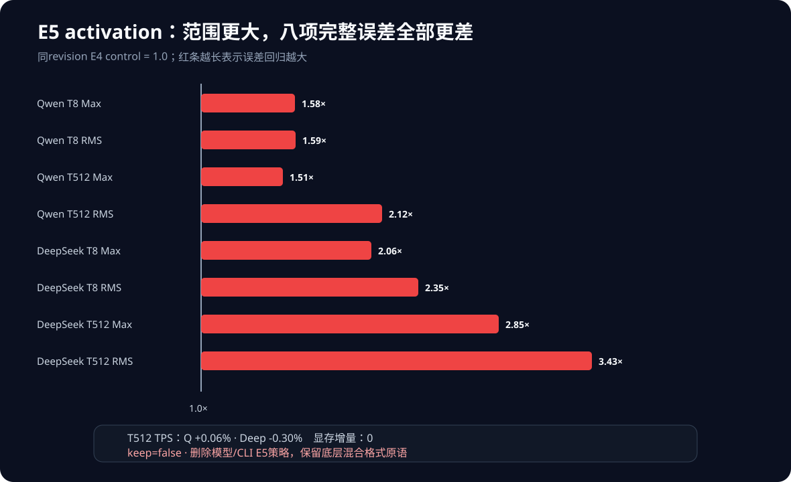

## 171. Experiment 154：Qwen layer 9改善三成，Deep却没有一个安全单层

不再根据drift图猜层，而是穷举Qwen 24层和DeepSeek 28层。56个fresh worker全部成功，每行
比较151,936个logits。Qwen layer9把Max/RMS降到baseline的0.713×/0.666×，20/24层两项都不
退化；Deep的RMS最佳也是layer9的0.994×，但Max变成1.022×，28层没有一个同时守住两项。

这否定跨模型共享单层策略，也再次说明误差传播高度依赖模型。Deep单层方向关闭；Qwen layer9
只进入T8/T512三进程正式反驳。搜索轮吞吐未轮换、未重复，明确不参与选择。

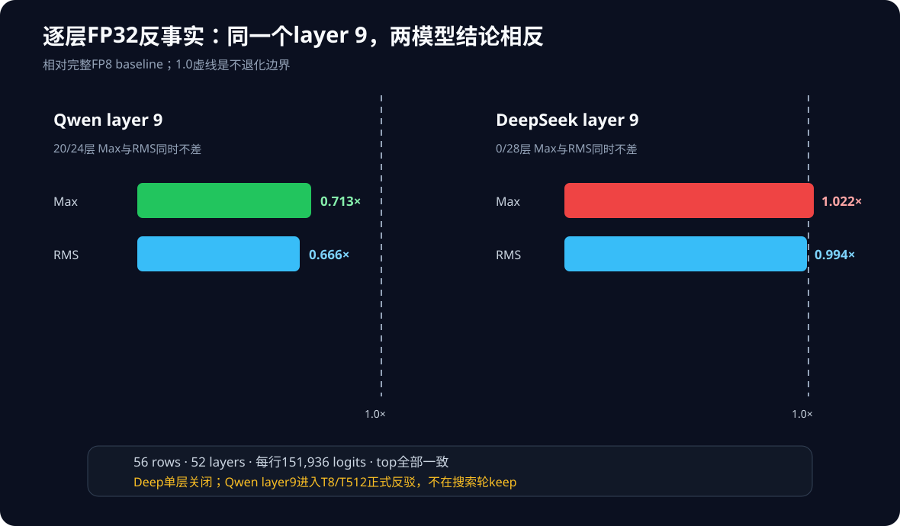

## 172. Experiment 155：搜索最优层，到长上下文RMS反而恶化36%

Qwen layer9在正式T8复现了搜索收益：Max/RMS改善28.74%/33.42%。但同revision T512的Max/RMS
同时恶化5.26%/36.40%。T512吞吐只慢0.88%且过门，resident/peak增加44,724,712B，完整
precision仍0/2。

候选和control各18个worker，完整logits与routing计数都稳定，所以不能归因于单次噪声。搜索只
回答“短上下文谁最好”，不能把答案外推到长上下文。结合Deep 0/28安全层，单FP32 block方向
关闭，诊断API保留但不设模型默认。

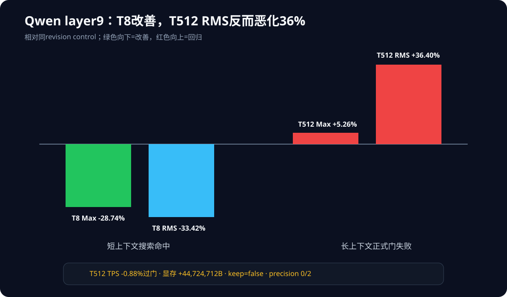

## 173. Experiment 156：偶发token不是噪声，而是少了一个barrier

Registry完整回归中的token偶发失败在旧revision也能1/20复现。换成完整logits后修复前只有2/20
通过；固定Q/K/V直接跑fused causal GQA，20次全部不同，worst Max差0.0677。trace把首个分叉
定位到block0 Attention context。

block reduction最后一次同步发生在读取`scratch[0]`之前，快lane会开始下一次reduction并覆盖
结果。改成“读入寄存器→全block barrier→再复用”后，直接Attention 20/20 bit-exact，完整shape
20/20进程通过。T128/B8 tiny train中位数231,623→231,940 tok/s，无性能回退。

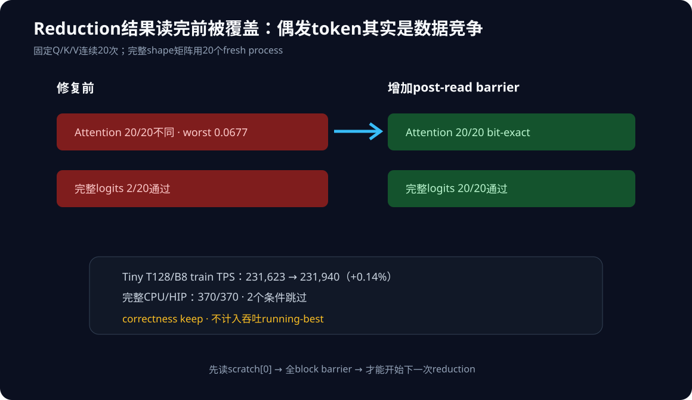

## 174. Experiment 157：一次处理四个数，不等于训练会更快

旧AdamW基准只抽查首尾参数，而且Auto没有shape、对齐和环境隔离。新tuner先克隆参数、梯度、
一阶/二阶moment和可选BF16 mirror，对每个元素完成Max/RMS与finite检查，之后才记录默认Stream
Event和墙钟P50/P95。筛选不改调用者状态，也不改live registry；接受与持久化必须显式执行。

5个case、15个fresh process全部跑完。对齐Vectorized相对Scalar为1.000×、0.860×、0.959×、
1.010×，0/4达到1.05门；未对齐反例在计时前拒绝，两种时间都是0。tiny T128/B8训练
231,940→231,047 token/s（-0.38%，中性）。因此保留精确key、事务cache、完整状态门和CLI，
但Auto继续Scalar，不把微基准噪声写成全局优化。

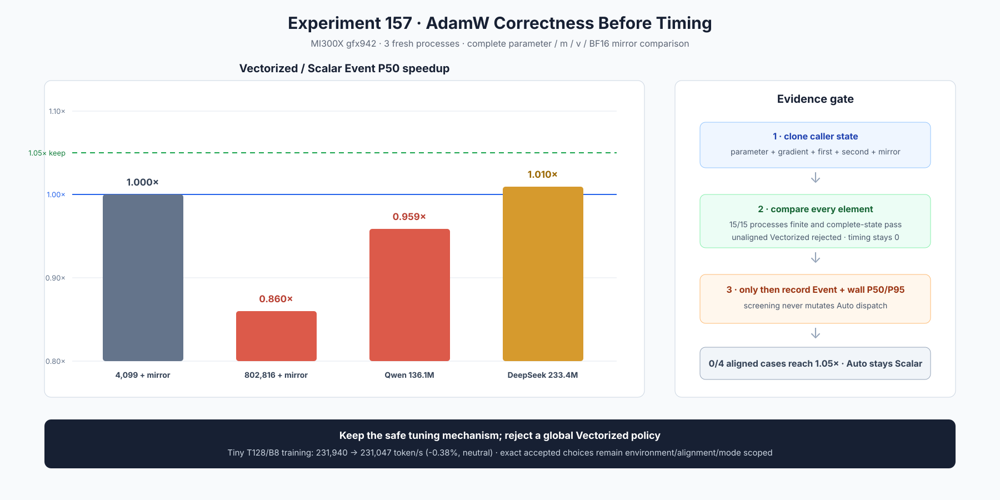

## 175. Experiment 158：横着连续读，竖着八个人一起加

最新训练热点bias gradient让一个线程串行扫描全部rows。直接“一列一个block”会让wave按大步长
读内存，所以新Kernel用32个连续column×8个row lane：横向仍合并访存，纵向并行归约。

13 shape×2实现×3进程共78行全部过完整输出门。16 rows只有1.005×，32 rows在不同width已达
1.106×–1.135×，因此Auto阈值定为32。T512真实width加速3.21×–3.27×，1024×256为4.22×。

同revision Scalar/Cooperative各三进程：Qwen 11,688→14,283 tok/s（1.222×），DeepSeek
5,525→6,141（1.111×），peak不变。求和顺序改变，worst final-loss相对差0.442%，固定参数guard
仍相等。rocprofv3中216次Kernel从26.00→4.01 ms（6.49×），占比18.74%→3.44%。候选保留。

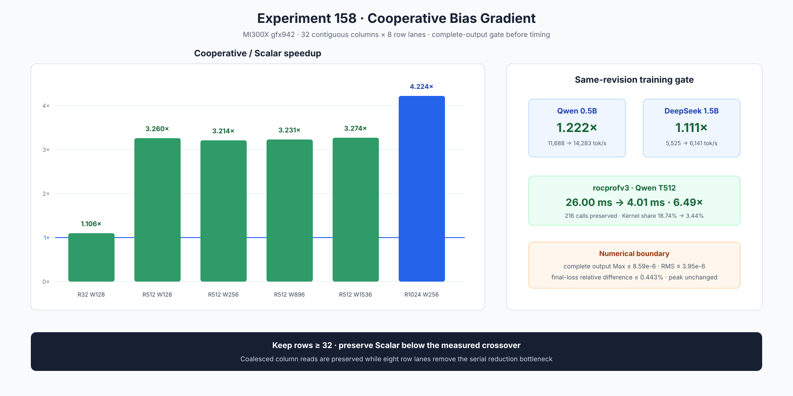

## 176. Experiment 159：整段录像里的热点，不一定属于训练

普通profile混合权重加载、warm-up和measured step。bias优化后，cast-transpose看似排到前列，
但用“load+3步减load+1步，再除2”按精确Kernel名做差后，它没有正调用增量：168次全属加载。

训练每步可归因Kernel约35.50 ms，其中hipBLASLt GEMM 18.98 ms（53.47%）、AdamW 5.66 ms
（15.95%）。AdamW现有路线已被Experiment157关闭；真正最大且开放的方向变成exact training
GEMM solution-index枚举。下一节点不再优化假热点，也不重复已失败方案。

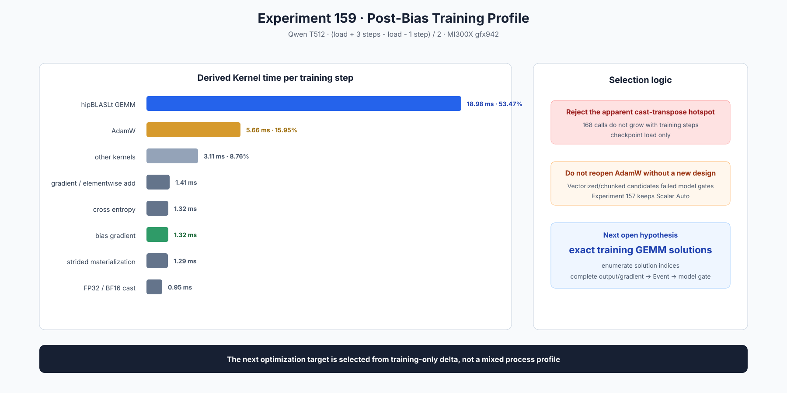

## 177. Experiment 160：单题快19%，整机仍然不过门

新tuner对8个BF16训练shape各跑3个fresh process，每进程筛64个solution；1536次候选全部先过
完整输出，再记录Event/墙钟。算子中位改善1.031×–1.189×，但只有Qwen down在三进程里选中
同一个单次冠军，其他shape的最快index会漂移。

显式接入全部四shape后，Qwen/Deep为0.995×/1.005×；删除低收益gate/up也只有
1.020×/1.007×。peak最多增0.028%，loss差小于0.328%，参数guard相同——这是纯性能拒绝。
保留诊断tuner、matrix和process-local CLI，不设默认、不持久化版本相关index。

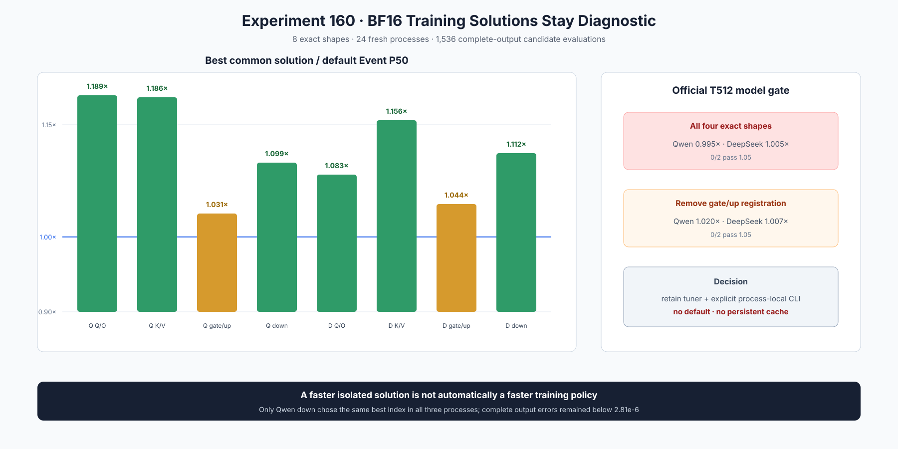

## 178. Experiment 161：别为512行，再造一张1.36亿格的大表

新诊断把121次gradient add按来源和shape拆开。Qwen tied embedding/head这一条独占1.361亿
added elements（71.2%）：先到的是dense `matmul_right`，后到的是只有512个token行的
`embedding_backward`。旧路径却分配、清零544MB dense表再全量相加。

唯一Storage门允许后，embedding贡献直接atomic scatter-add进已有dense head gradient。Qwen峰值
13.025→11.969GB（-8.11%），吞吐1.018×；Deep untied零命中、1.006×中性。loss差0.0207%，
参数guard相等。profile少3次add和3次fill，总Kernel 116.41→113.20ms。按内存门保留。

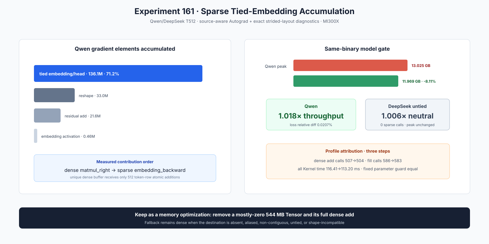

## 179. Experiment 162：同一张表换个读法，不应该先完整抄一遍

Attention里的Q/K投影原本是一张`[批次, token, 头, 每头宽度]`的四维表，后面的计算喜欢
`[批次, 头, token, 每头宽度]`。旧图先做transpose view，再把整张表按新顺序复制；反向还要
复制回来。就像老师只想按“班级”而不是按“座位号”读成绩，旧程序却先抄了一本新花名册。

新Kernel在读取时直接计算旧位置，在写出时直接计算新位置，同时完成bias和RoPE。反向做相反
映射，得到的`[B,T,H,D]`又能直接reshape给bias gradient，不再抄中间表。独立PyTorch图检查了
前向、输入梯度和bias梯度；HIP检查还证明热路径没有偷跑host。

正式T512必须传513个原始token，因为最后一个会被shift成target。纠正这个口径后，三进程中位数
显示Qwen吞吐0.9996×、DeepSeek 1.0104×；峰值各少48.2/102.8MB。两模型strided-copy字节都少
60%。profile里copy时间3.656→1.471ms，虽然新RoPE Kernel自己的索引多花约1–2%，总Kernel仍
112.22→110.51ms。按布局/内存门保留，不把Qwen的中性结果写成速度胜利。

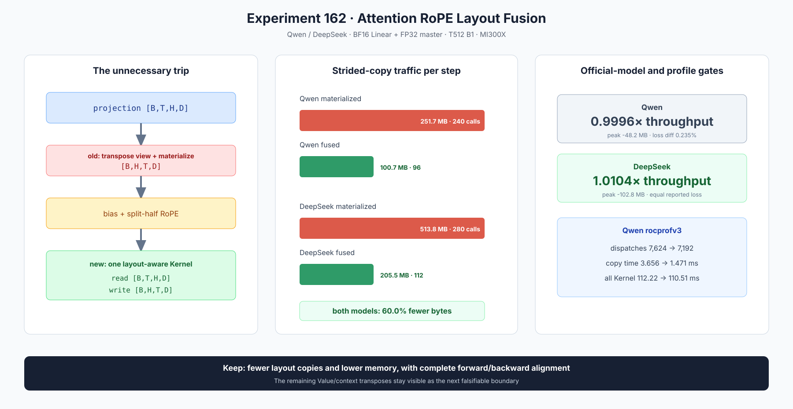

## 180. Experiment 163：让矩阵库隔着座位读每个组

上一步还剩最大的context换序。只把换序塞进BF16 cast并不诚实：反向算weight gradient时仍需要
FP32 BTHD，复制会原样回来。真正的出口是让Attention的`概率×Value`直接写BTHD。

可以把一行token想成H个相邻小组，每组D个人。固定一个head时，相邻token之间跨`H×D`格；换到
下一个head只跨D格。hipBLASLt的leading dimension与batch stride刚好能描述这件事，不用先把
每个小组抄成独立名单。

5 shape×2路径×3进程共30行全量输出都是bit-exact，计时区H2D/D2H为0。小到2×2×3×2只有
1.006×，Qwen T512为1.415×，DeepSeek T512为2.200×。收益随T/D增长，支持“省的是布局搬运”
这个解释。原语保留，但在反向和整图接入前，不把它写成模型加速。

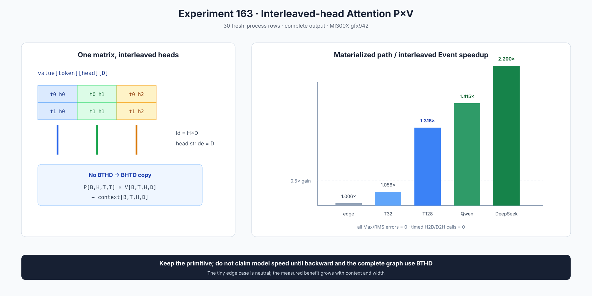

## 181. Experiment 164：前向不抄，反向也不能偷偷抄回来

只有P×V直接写BTHD还不够。反向有两道题：`dP=dO×Vᵀ`和`dV=Pᵀ×dO`。它们也用同样的
`H×D`行跨度和D head跨度；GQA的Value repeat/reduce则从head-major的dim1改到token-major的dim2。
这样Value从投影出来到梯度回去、context从Attention出来到output Linear，始终不换表。

CPU、PyTorch、HIP分别核对output、probability、dP以及Q/K/V所有梯度；T256 HIP还逐项对照saved
forward/backward并确认零host payload。正式同二进制T512中，Qwen 1.0336×、DeepSeek 1.0256×，
峰值再少100.4/205.5MB。diagnostics最重要的结果是两边都从剩余96/112次strided copy降到0。

profile也没有反转：dispatch 7,192→6,907，总Kernel 111.73→110.67ms。至此Experiment161发现的
四种Attention布局搬运全部关闭；不是“找不到”，而是计数和字节都精确为零。

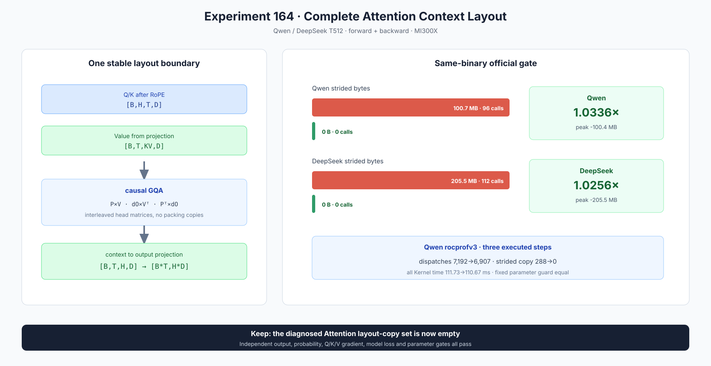

## 182. Experiment 165：旧热点归零后，要重新拍一遍录像

把旧profile继续当地图会追着已经不存在的transpose跑。当前版本重新做`(load+3步-load+1步)/2`：
每步Kernel 33.35ms，GEMM 56.55%、AdamW 16.76%，strided copy不再出现。GEMM solution和AdamW
实现已有完整拒绝实验，不能因为柱子最大就重复抽奖。

新边界在host：每层P×V、dP、dV都新建3个matrix layout和1个description，Qwen/Deep每步72/84
次。算子wall减Event约9微秒/次，外推约0.67/0.74ms/步。这个数字混有通用host开销，只够提出
“缓存exact immutable plan”假设，不够宣布收益。下一节点会用同revision两模型门反驳它。

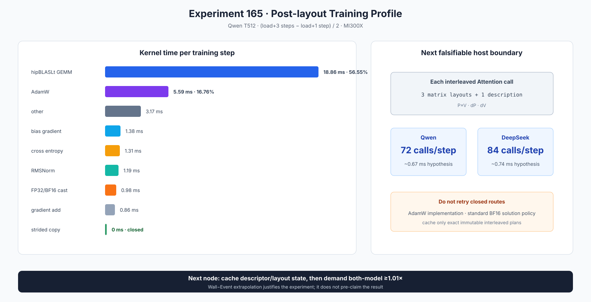

## 183. Experiment 166：小测验快了，不等于整堂课提前下课

cache按`{P×V/dP/dV,H,T,D,device}`保存不含指针的layout/description。单测精确看到3种mode先
3 miss，再3 hit；换shape出现第4项；关闭时始终0/0/0。24个算子进程全量输出bit-exact，Qwen/
Deep shape的wall分别快1.067×/1.069×。

但整机三进程中位数是相反结论：Qwen 0.9902×、Deep 1.0005×，都不过1.01门；peak、allocation、
参数guard不变。单步route smoke虽显示3 miss后Qwen69 hit、Deep81 hit，却含lazy setup且只有一个
进程，不能推翻warmed正式矩阵。

因此cache实现和统计API保留给诊断，engine/CLI默认改为false。我们记录“算子赢、模型没赢”，
而不是用漂亮小测验覆盖最终考试。

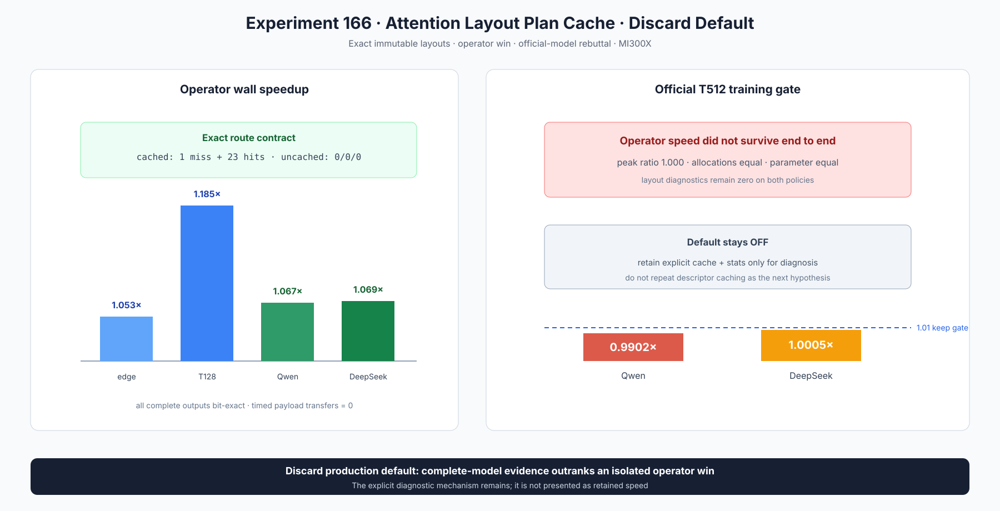

## 184. Experiment 167：少两个Kernel，也可能把乘法顺序改坏

旧图先算`Q×scale`再GEMM，反向先算`dScore×scale`。hipBLASLt alpha可以直接算
`scale×(A@B)`，每层少两个Tensor。CPU/PyTorch/HIP都对齐在容差内，profile也证明144次scale
Kernel归零、dispatch少146次。

但浮点乘法顺序变了，不是bitwise同一件事。正式T512里Qwen只有0.9869×；Deep虽1.0107×，固定
参数从2.124970913变成2.124971151。loss仍在0.5%门内，却不能无视参数guard。候选少Qwen 96、
Deep112次allocation，Qwen peak少12.3MB，仍不足以合入默认。

scaled matmul作为通用、可测试原语保留，Attention alpha开关默认false。这一失败说明“Kernel数更少”
必须同时过速度和数值路径门。

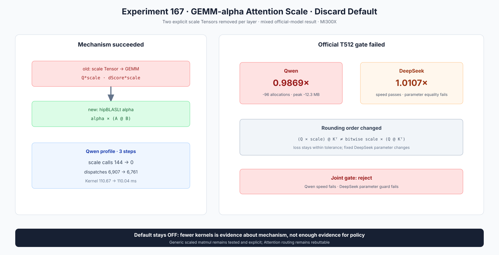

## 185. Experiment 168：两趟合成一趟，线程却背了两份行李

GQA的K是BHTD、V是BTHD。新Kernel用同一个`(b,h,t,d)`同时写两种布局；反向也用两个accumulator
一起归并。CPU、PyTorch、HIP四个输出都精确相等，零host copy。

profile看起来成功：repeat family 432→216 calls、2.105→1.330ms，总Kernel少1.18%。但Storage和
总字节没少，每线程要做两套地址、读写和累加。正式T512的Qwen降到0.9758×，Deep也只有1.0084×。
因此默认false，不能用插桩总时间覆盖unprofiled模型结果。

下一次GQA优化必须不生成expanded Tensor，或改变GEMM的batch mapping；只把两次copy绑在一起的
方向已经关闭。

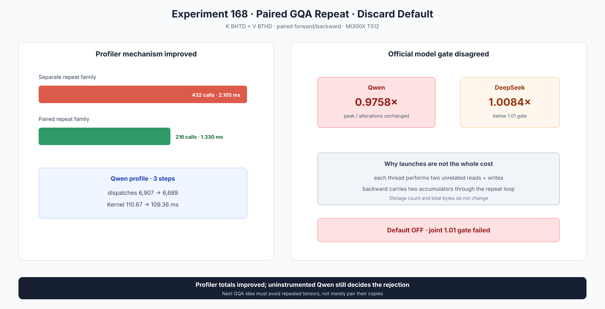

## 186. Experiment 169：同一份Value可以广播，但不是每种宽度都划算

对一个KV head的多个query head，hipBLASLt把Value batch stride设成0，就能反复读同一T×D矩阵，
不用expanded Value。B2地址、完整输出和零host copy都通过，worst误差只有7.6e-8。

速度却按shape分叉：Qwen T128/T512为0.946×/0.937×，Deep T512是1.603×，MHA反例仅0.726×。
原因是广播路线把一个H-batch GEMM拆成每KV head一次；width64省下的copy不够付额外提交，width128
才划算。

因此不设全局默认。原语保留，下一步只为D≥128补dP/dQ与完整backward，并要求Qwen继续走旧路。
这不是按模型名字硬编码，而是由head width这个执行shape决定。

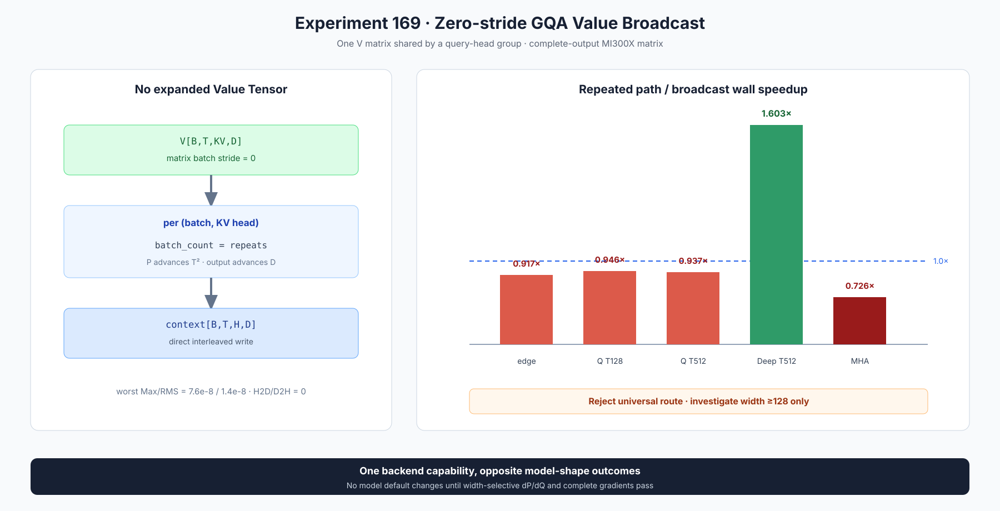

## 187. Experiment 170：前向快，不代表它的反向同样快

我们只让D≥128走零stride P×V和dP，Qwen D64保持旧路。T256完整output、probability、Q/K/V
梯度通过；Deep每个正式进程少112次allocation。

但Qwen只是0.9948×噪声，Deep也只有0.9972×。Deep profile解释了为什么：Value repeat
336→168，可每个dP/P×V从一个H-batch GEMM拆成两个KV-group GEMM，总dispatch仍是8058，Kernel
反而261.73→263.48ms。

因此完整广播默认false。最后只剩forward-only：P×V用已证明1.60×的广播，dP继续expanded后一次
H-batch GEMM。如果它仍不过整机门，zero-stride路线就完整关闭。

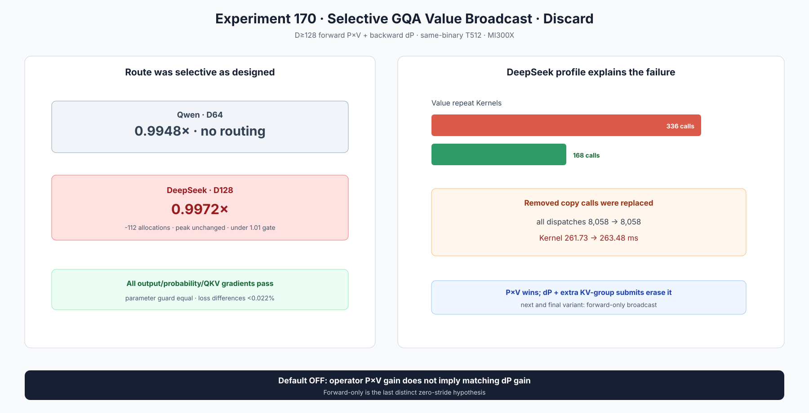

## 188. Experiment 171：只改前向，仍然付了额外GEMM账单

最后一次只让D≥128前向P×V广播，backward恢复旧dP。完整T256梯度通过，Deep每进程少56次
allocation；Qwen仍不路由。

结果Deep只有1.0009×、peak不变，且参数guard改变；Qwen同路径的0.9822×是进程漂移。profile中
repeat forward 336→252，可总dispatch仍8058，因为少84次copy恰好多84次KV-group GEMM；Kernel
261.73→264.04ms。

至此universal、完整selective、forward-only三种zero-stride模型策略都有反例，搜索空间关闭。原语
保留用于backend能力和未来完全不同的grouped-GEMM设计，不能再被当作当前默认优化。

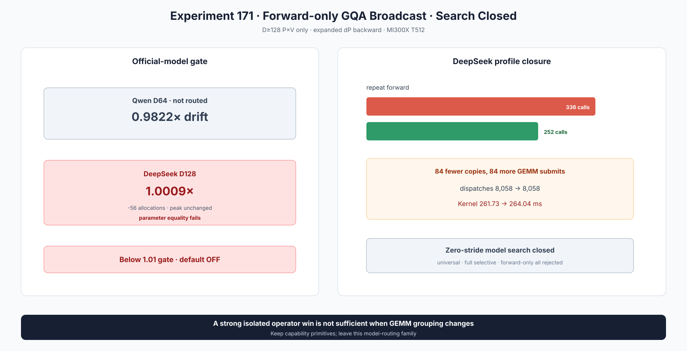

## 189. Experiment 172：少申请内存，不等于少做计算

这一次先不猜。诊断器告诉我们：Qwen每步121次dense梯度相加中，有72次目标确实只有一个长期
Storage主人，形状全部是`[512,896]`；Deep是84次`[512,1536]`。残差、embedding和共享leaf都
没有被误判。就像一张草稿纸只有一个人在用时才能直接在上面续写，多人还拿着同一张纸时必须
另开一张。

新路径只在“独占、连续、FP32、不与来源重叠”时原地相加。CPU测试证明少一次allocation，
`add(x,x)`仍走安全fallback；HIP保持地址、没有payload搬运；安装后的外部项目也真实链接该符号。

两模型正式结果却提醒我们，计数器不是速度：两步少144/168次engine allocation，但Qwen只有
1.0042×、Deep反而只有0.9952×，没同时越过预先写下的1.01线，peak也完全不变。

profile给出因果解释。Qwen三步少216次engine allocation和216次cache reuse，可backend allocation
仍是1027次，HIP malloc/free仍是2071/452次，总Kernel仍6905次，add Kernel仍504次。旧路径的
临时块早已由exact-size cache接住；新路径只是少做了主机侧账本操作，没有少发任何GPU计算。

所以默认false，原语和candidate/executed诊断保留。下一次若仍只换一个`use_count`条件，就是重复
失败；必须让add Kernel本身消失，或由整张计算图统一规划梯度寿命。

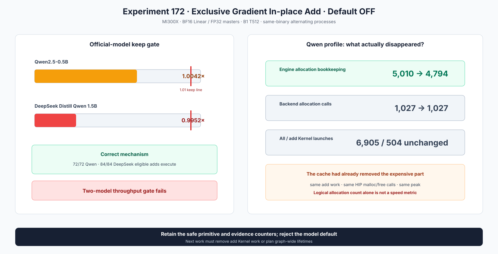

## 190. Experiment 173：把几百张工单装进一个文件袋

上一步少了allocation账本，却没有少发Kernel。HIP Graph换了更大的边界：第一次把一串GPU工作
录下来，以后CPU只提交一次“重放整串工作”。但它也有硬条件——录下来的每个地址必须一直有效，
capture期间不能偷偷做同步malloc/copy/free。

我们先实现最小而真实的runtime原语，不直接包装Transformer。调用者先拥有input/output Storage，
再用一条显式Stream capture、instantiate、replay。一次故意在capture里创建Tensor的测试发现：
分配虽然正确失败，HIP还留下sticky error，下一次合法Kernel也会被“previous error”连坐。修复后的
异常路径会结束废弃capture、清掉sticky error、保留原异常，然后同一Stream可以继续合法capture。

MI300X上做了60个fresh进程。1/8个add节点时Graph只有0.59×/0.83–0.89×，因为文件袋本身也要
成本；32个节点开始超过1，128个达到1.50–1.57×，512个达到1.73–1.91×。两种元素规模全部精确、
零payload传输，node count也恰好是N次add加1次fill。

profiler进一步说明它优化了什么：128节点×20次时，执行Kernel同为2583次；eager在host发2580次
Kernel launch，Graph只在capture时发129次，再做20次graph launch。总HIP API从12990降到802。

所以runtime原语keep，但不能写“Qwen已经Graph加速”。当前model/autograd没有把同一Stream传到底，
中间Tensor又会动态申请和释放。下一步必须先做caller-owned的真实vendor GEMM区域，再解决Stream和
liveness；直接在`model.loss()`外套begin/end capture已经被证据否定。

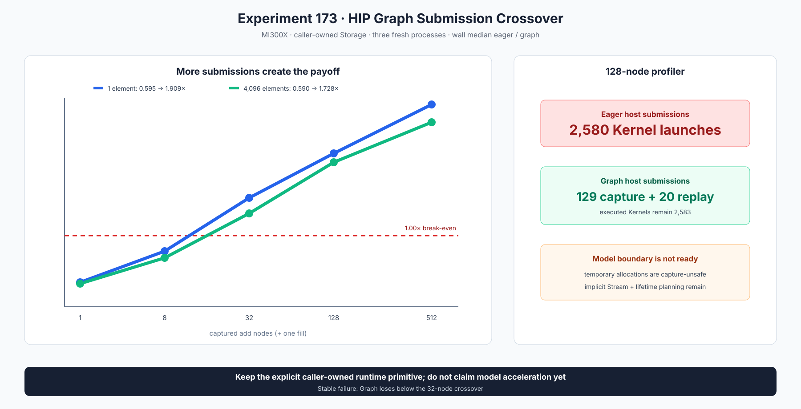

## 191. Experiment 174：小包裹省跑腿，大机器却主要在干活

Graph已经证明能压缩很多小Kernel提交，下一问是hipBLASLt。我们给matmul补了caller-owned output：
输出形状、dtype、device、连续性都先检查，和输入共享Storage就拒绝。这样capture录下的是长期有效地址，
而不是函数结束就消失的临时Tensor。

当前MI300X确实支持：真实Qwen/Deep T512 GEMM都能capture，每次GEMM正好一个node，36个正式进程
全部bit-exact、地址不变、零payload传输。兼容性问题解决了，性能结论却是否定的。

Qwen重复1/8/32次分别0.906×、0.995×、1.022×；Deep是0.902×、0.989×、0.990×。只有Qwen32次
勉强过1.02，不能覆盖Deep反例。profile里Deep 32×10执行Kernel仍322次；host module launch从
321降到33，再加10次graph launch，可Kernel总时间8.40→8.60ms。

原因很直白：小Kernel主要付“递交工单”的成本，宽GEMM主要在GPU里真正算数。文件袋减少跑腿，
不会让机器里的乘法变少。所以`matmul_out_`作为稳定地址基础设施保留，vendor-only Graph策略拒绝。
下一步只能捕获混合区域：GEMM前后的cast、activation、norm、reduction一起进入，并且地址寿命可计划。

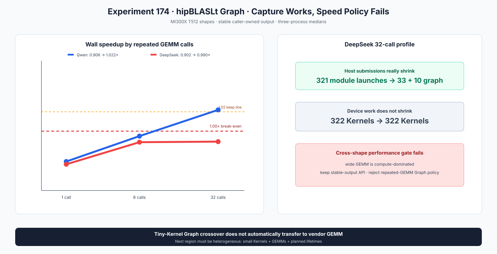

## 192. Experiment 175：车换了路线，货却提前被仓库收走

要让现有model进入显式Stream，最省改动的想法是一个线程局部scope：scope里面所有默认
`OpContext{}`自动用同一Stream，显式context仍优先。嵌套、子线程隔离、caller-owned Graph都通过。

但第一次tiny Transformer完整logits就把它否掉了。三次Max/RMS分别是1.412/0.475、
3.846/0.931、1.412/0.475，远远不是浮点舍入。故意触发capture allocation失败后，下一次embedding
还报previous capture error。

原因是执行路线和货物寿命必须一起改。默认Stream下原来的临时Tensor析构时机勉强符合旧假设；
换成异步非默认Stream后，C++临时对象已经释放Storage，排队的下游Kernel还要读它。就像卡车改走慢车道，
仓库却仍按旧到达时间把货架拆了。

给每次析构加同步当然可能“修好”，代价是把模型彻底串行化，所以直接拒绝。Scoped API、ambient状态、
package暴露和正向测试全部移除，只保留失败证据。下一步必须先有deferred release或activation arena，
让Storage活到Stream真正用完，再谈model-wide Stream/Graph。

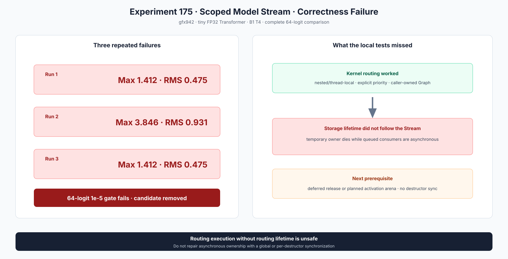

## 193. Experiment 176：货架先不拆，等整条车道跑完

上一步说明临时Storage死得太早。最粗暴的正确办法是每产生一个新Tensor就同步一次，确认旧Tensor
没人再读才释放；正确，但32个节点就同步32次。

新scope只管lifetime，不偷偷改Stream。调用者仍显式传`OpContext.stream`；同一线程、同一设备上
被析构的raw allocation进入固定容量表，region结束只同步一次，再统一free。析构路径不动态申请内存，
scope不能嵌套；容量用完会安全同步、flush后继续。

36个MI300X进程全部精确、零payload传输。8/32/128节点在1元素下是2.28×/2.69×/2.43×，
4096元素下是2.33×/2.66×/2.74×。profile中32×10的Kernel仍323、malloc/free仍322/322，
Stream synchronize从320降到10。

它不是免费午餐：128×4096会暂留127块、2,080,768字节。逻辑Tensor已经析构，所以旧
`engine_peak_bytes`看不到这些物理驻留；我们单独报告pending bytes，不能藏起来。

原语keep，但还不是model或Graph优化。下一步才允许把它和显式model Stream路由放在一起，复测
Experiment 175的完整logits；即便正确，也必须同时报告速度与pending memory。

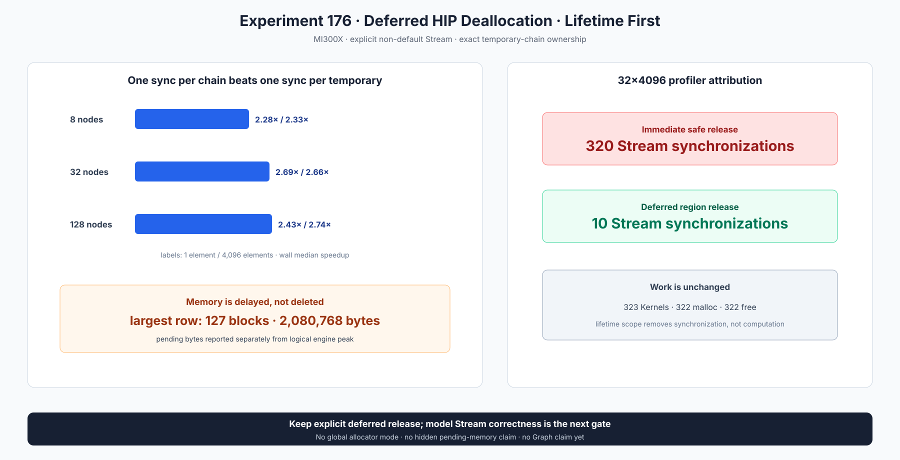

## 194. Experiment 177：货和车终于同路，但沿途不能复用货架

这次把前两步真正接起来：scope里所有默认`OpContext`和底层strided-copy都走同一条HIP Stream，
临时Tensor析构时只结束逻辑所有权，raw allocation等车道完成后再统一释放。显式传入另一条Stream、
另一张卡、嵌套scope都会报错；子线程看不到父线程状态。

正确性问题完全解决。Experiment 175三次失败的64个tiny logits现在全部通过`1e-5`门；完整
forward/backward的每个参数梯度也一致。正式48进程里，Qwen和DeepSeek、T32/T512、inference和
training的完整logits、loss、参数更新全部bit-exact。

但它不是速度优化。Qwen inference T32/T512只有0.800×/0.125×，training是0.562×/0.235×；
DeepSeek分别是0.862×/0.147×和0.575×/0.406×。最坏的DeepSeek T512训练单步暂留
15,591,456,776字节。

profiler解释了反差。Qwen T512两边都是2,751个Kernel，Kernel总时间甚至略降；可非默认Stream
按当前安全合同永久关闭只适用于legacy default Stream的exact-size pool。整个profile的
malloc/free从1,180/867次变成2,559/2,557次，二者API总时间约39.6ms变成183.0ms。

因此scope作为正确性基础设施保留，但模型默认路径不启用。继续扩大deferred表不会让地址复用，
重复写另一个ambient wrapper也不是新实验。下一步必须是同Stream有序allocator或activation arena，
让旧地址能在不等待整个region的情况下安全回收。


## 195. Experiment 178：两间机房不能共用一把只认门牌的钥匙

完整回归把一个旧问题翻了出来：RCCL的all-reduce都通过，但只要同一进程先跑GPU0模型、再跑GPU1，
hipBLASLt就报`invalid device ordinal`。在修改前提交`adcd642`上做全新detached build，错误完全相同，
说明它不是上一实验引入的。

原因是handle所有权。普通GEMM、BF16/FP8和Attention曾各自保存静态handle；第一次在GPU0创建，
第二次切到GPU1仍拿同一个。就像钥匙内部记住了第一间机房的门牌，搬到隔壁当然打不开。

新实现先选择device，再从线程局部的`device index → handle`表取对应对象。已有BF16/Attention plan
key本来就含device，现在也拿同设备handle构造。一个不依赖RCCL的小测试按0→1→0→1交替执行
FP32/BF16 GEMM，输出全部精确，plan统计为两次miss、两个entry、随后两次hit。

结果是多卡测试6/11→11/11，CLI和两个package consumer也通过。为了防止“修多卡、拖慢单卡”，
又用上一提交raw做边界：Qwen/DeepSeek T512 inference/training的12个新进程分别为
1.023×、1.000×、0.998×、1.001×，输出摘要、loss和参数更新完全一致。

所以按device持有handle保留。它解决的是vendor资源所有权，不等于通信计算重叠、跨节点或生产
one-process-per-GPU已经完成。

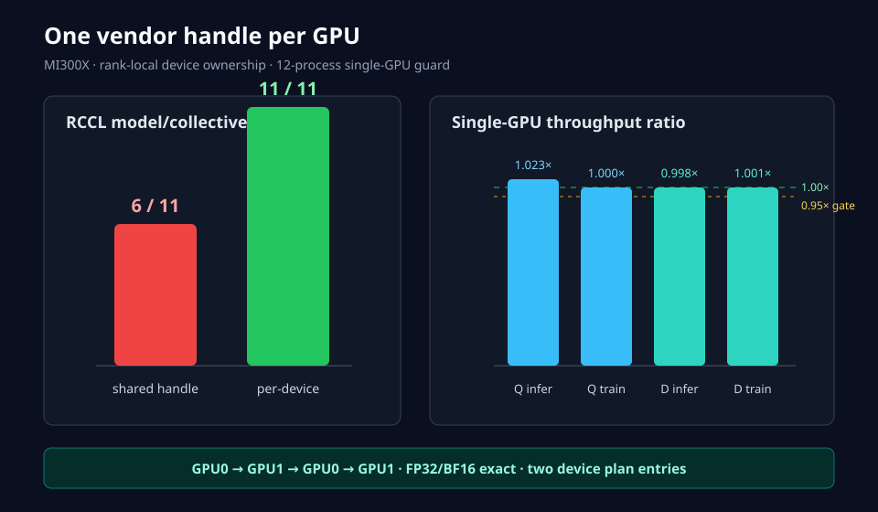

## 196. Experiment 179：只用两个货架，却多了一套昂贵调度

Experiment 177慢在非默认Stream不能使用旧cache，于是自然想到HIP的Stream Ordered Memory
Allocator。官方合同允许`hipMallocAsync`/`hipFreeAsync`按同一Stream顺序复用，还能在capture时生成
allocation/free节点。

我们先做显式buffer，不碰普通Storage。能力查询、pool的used/reserved current/high、threshold、trim、
move/release和Graph节点都有测试。当前MI300X/ROCm 7.13支持这些API；小测试还发现，即使threshold设成
8MiB，同步后reserved current仍可回到0，所以不能凭配置声称跨同步保留。

72个正式进程给出更反直觉的结果。eager async在8/32/128/512节点里始终只用两个地址，却只有
deferred的0.619×–0.709×，pool high固定128MiB。把它capture也没有变成两个地址：每个allocation
node拥有独立地址，N个临时就有N个地址，完整Graph恰好`3N+1`节点，速度只剩0.036×–0.048×。

profile中128×4096三条路径都执行2,971个Kernel。Kernel总时间却从deferred 5.60ms变为async
7.89ms、Graph 10.96ms。Graph确实把host Kernel launch从2,967压到129，再加23次Graph launch，
但device上的allocation依赖已经压过提交收益。

因此显式Beta原语保留，Tensor/model策略全部拒绝。下一步不再换allocator名字，而是预先申请一块
稳定activation arena，在replay外完成大分配，再用liveness规划内部偏移。

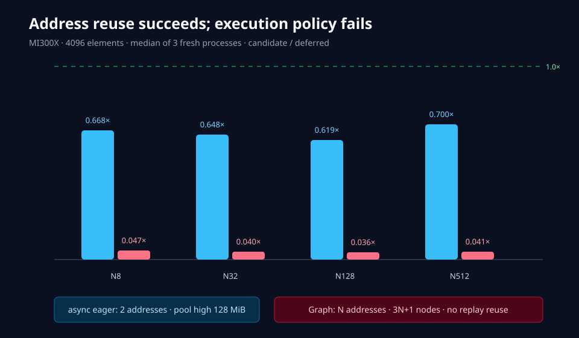

## 197. Experiment 180：先画好两个固定货位，Graph终于只录计算

上一轮最后只剩一个不同方向：不要在replay里分配，先申请一整块稳定backing，再根据liveness把互不
重叠的临时值放回相同offset。第一版arena故意简单，只做对齐、越界、稳定地址和plan reset，不假装
能自动推导整张Transformer图。

两slot链足以验证因果。Arena在capture外只malloc一次，两个地址交替承接N个中间结果。捕获后的
Graph恰好`N+1`个add/copy Kernel，没有allocation/free节点。CPU拒绝、alignment、overflow、reset、
析构前Stream完成和双次replay都有测试。

最终72进程里，eager arena八项全部提高1.071×–1.768×；arena Graph提高1.314×–3.066×。
N128×4096 profile三条路径仍各执行2,971个Kernel，arena把malloc/free从2,948/2,948降到5/5，
Graph再把host Kernel launch从2,967降到129。

但setup不能藏。capture+instantiate固定约14–16ms，N8要1,174–1,280次replay才回本，N512只需
9–10次。于是结论不是“所有Graph都快”，而是stable arena解决了地址和allocator问题，真实模型还要
固定shape、完整logits、真实异构区域和setup摊销门。

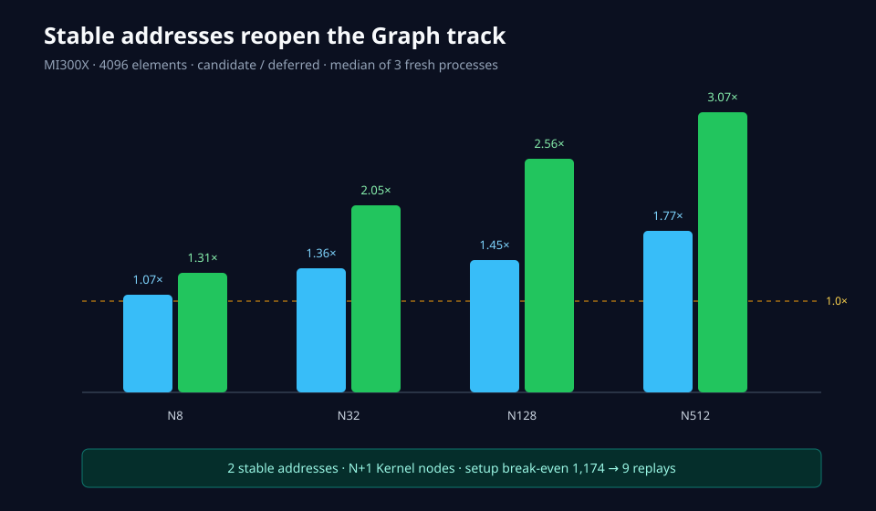

## 198. Experiment 181：从加法练习走进真正的FFN

Arena micro通过后，下一步不再堆add，而是用官方Qwen/DeepSeek的hidden和intermediate尺寸执行真实
四算子区域：gate GEMM、up GEMM、SwiGLU、down GEMM。三个GEMM走hipBLASLt，中间值放进Arena，
最终输出由调用者长期持有。

为此补了两个所有权边界：`Storage::from_external`只解释调用者内存、绝不释放；`swiglu_out_`把结果写入
指定Storage。生命周期没有“自动变安全”，Arena和Stream仍必须活到工作完成。

36个fresh进程全部完整输出bit-exact，Graph恰好四个节点。Qwen R32/R512是1.202×/2.970×，
DeepSeek R512是1.679×；DeepSeek R32只有1.005×，因此全局策略被反例关闭。setup回本分别是
23、1、568、2次replay。

Qwen R512 profile里三条路径都101个Kernel，Arena把malloc/free从80/79降到11/10，Graph把直接
host Kernel launch从100降到12，再加23次Graph launch。数学没改，收益来自所有权和提交边界。

这仍不是模型默认：当前生产推理FFN使用BF16权重，而这一步是FP32 official shape。下一节点必须补
caller-owned BF16 output，并用完整模型logits决定是否接入。

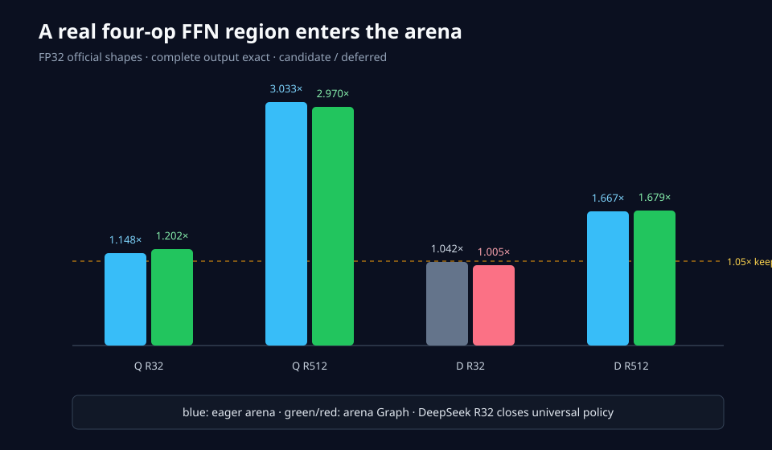

## 199. Experiment 182：低精度不能靠删掉“不听话”的shape

FP32 Arena通过后，真正的生产路径还差一层：BF16输入和权重的GEMM不保证每个shape都能直接写
FP32。Qwen decode的R1就是已知反例。如果为了Graph只保留支持direct输出的shape，测试会很好看，
框架却不能生成下一个token。

新`Bf16FfnWorkspace`因此有五块调用者内存：input cast、gate、up、activated和down fallback。
hipBLASLt能直接写FP32时，整个区域是5节点；拒绝时先写调用者BF16 fallback、再cast到调用者FP32
output，成为6节点。两条路都不允许隐藏分配，dtype、shape、device、连续性和别名全部检查。

54个fresh进程覆盖Qwen/DeepSeek的R1/R32/R512。所有完整输出bit-exact。Arena eager与Graph各有
5/6行超过1.05：Qwen R512是5.548×/5.049×，DeepSeek R512是4.057×/3.837×。反例也保留：
DeepSeek R32 eager 1.064×，Graph反而只有0.970×。

Qwen R512 profile三条路径都执行130个Kernel。Arena把whole-process malloc/free从127/126降到
12/11；Graph把两类direct launch API合计129次降到19次，再用23次Graph launch提交。数学没有少，
只是地址和提交不再反复建立。

所以保留caller-owned API与Arena，不把Graph塞进模型。下一节点只允许做完整Qwen/DeepSeek eager
Arena：必须对齐全部logits并测端到端；再跑一轮operator shape不是新解释。

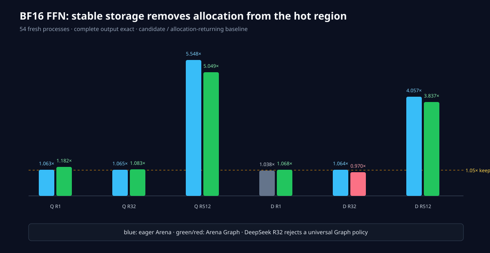

## 200. Experiment 183：单个房间省下来的搬家，不等于整栋楼提速

这一步把BF16 workspace真正接进Transformer，但没有给每层各存一份。模型按device和flattened rows
缓存一块backing，所有block在default Stream上顺序复用；T512 Qwen只常驻18.61MB，不是24倍。
API和CLI默认关闭，公开entry/hit/miss/capacity；切换device会清空，详细value trace仍走旧diagnostics。

正式60进程覆盖两模型、T32/T512、B1/B4和cached decode。每个完整last-position logits都是bit-exact，
decode token也全部相同。分配确实下降：Qwen decode B1从10630降到7750，DeepSeek从23650降到16930。

但速度只在三行跨过1.01。Qwen/DeepSeek T512为1.022×/1.020×，Qwen decode B1为1.031×；另外七行
是0.998×–1.001×。好消息是没有低于0.98的严重回退，坏消息是“到处开Arena”没有成为普遍优化。

Qwen T512 profiler两边都5,642个Kernel，Kernel时间49.07/49.44ms；malloc/free从1879/1567降到
1637/1327，launch次数不变。说明收益只来自host allocation，device数学甚至略慢。

因此基础设施keep、全局策略reject。下一次只允许使用两模型都支持的共同证据：flattened rows≥512。
不能因为Qwen R1单独变快，就写一个模型名字判断。

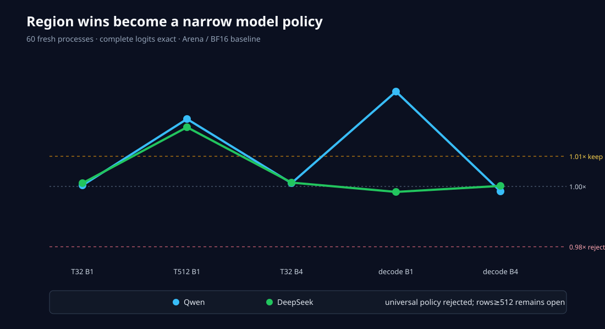

## 201. Experiment 184：选择优化时，没选中的路径必须真的没变

上一轮只支持一个不含模型名字的共同解释：两套模型都在flattened rows 512改善。于是API增加
`minimum_rows`，cache每次明确记eligible或bypassed。bypass必须返回空entry并走旧`bf16_ffn`，不能
先分配Arena再假装没用。

我们没有复用旧的八个短case，而是用相同revision、warmup、steps和交替顺序重跑全部60进程。
Qwen/DeepSeek T512分别1.019×/1.022×，entry为1，分配3495→2895和4075→3375。

其余八行的entry、capacity、eligible全部为0，bypassed为正；allocation和peak逐项等于baseline，
速度保持0.999×–1.005×。全部完整logits bit-exact，decode token一致。这证明短路径不是“优化后恰好
差不多”，而是根本没有进入候选。

Qwen T512 profiler仍是5,642个Kernel，launch数不变；malloc/free从1879/1567降到1637/1327。
所以rows≥512策略keep。FFN阈值搜索在现有证据上结束；下一块应是长prefill共享cast的BF16 Q/K/V，
而不是在128和512之间挑一个没有实测意义的数字。

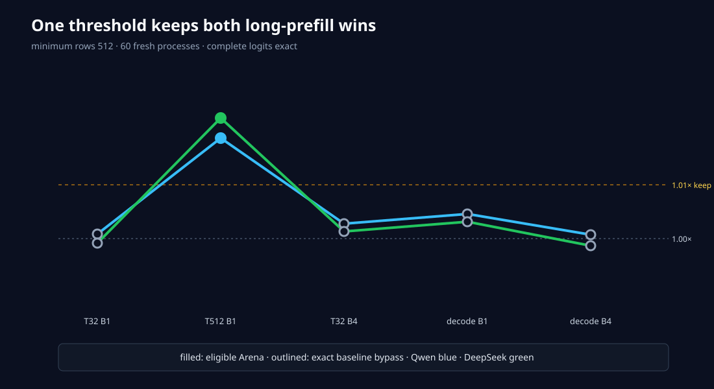

## 202. Experiment 185：分配次数继续下降，速度已经不再跟着走

这次baseline已经包含保留的FFN rows≥512，candidate只增加QKV：一次caller-owned BF16 input cast、
三个FP32 output和三个shape-specific fallback。model仍只按rows≥512启用，短case明确bypass。

60个fresh进程的完整logits和decode token全部一致。Qwen T512 allocation 2895→2415，DeepSeek
3375→2815；但吞吐只到1.004×/1.005×，都过不了1.01。QKV backing还增加4.46/7.86MB常驻。

Profiler给出更直接的反驳：Qwen两边都是5,642个Kernel，launch为4000+1519；malloc/free从
1637/1327降到1446/1135，Kernel时间49.63/49.27ms。分配删除是真的，可整机已经由Attention/GEMM
设备计算主导，这一组host开销只值0.4%左右。

所以model QKV策略discard、默认关闭；caller-owned算子和显式诊断接口保留。下一步不能继续猜“再把
某个Tensor放进Arena”，必须先记录剩余allocation size/source分布，再提出可反驳的新liveness计划。

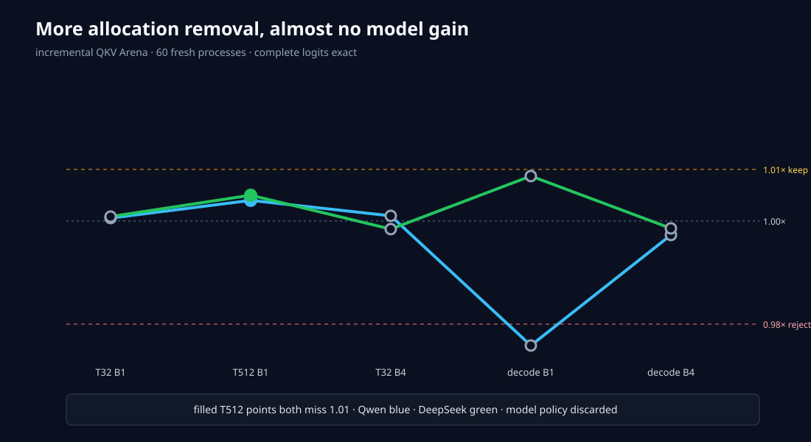

## 203. Experiment 186：别再看代码猜，直接问每一块内存从哪里来

新的diagnostic不存动态字符串，而是用固定`AllocationSource`枚举。RAII tag支持嵌套恢复和thread-local；
关闭时一次分支后no-op。开启时按source、device、exact bytes聚合逻辑allocation，cache reuse也算请求，
但不会冒充backend malloc。

CLI只允许zero-warmup、single-prefill，避免把load和warmup混进来。Qwen/DeepSeek T512各跑三进程，
每一条source×size记录完全一致。

答案非常明确：Qwen总580次/1.080GB，`attention.core`是144次/572.5MB，占53.0%；DeepSeek总
676次/1.817GB，core是168次/792.7MB，占43.6%。最大shape分别是14,680,064×24和
12,582,912×28，正是causal score/probability规模；另一族是hidden-width Tensor，每层5次。

第一次编译因`model.cpp`漏include diagnostics头直接失败，补头后门通过。这也说明编译门不是仪式。
下一节点现在有唯一依据：Attention core exact liveness；projection、FFN和随便挑Tensor的路线关闭。

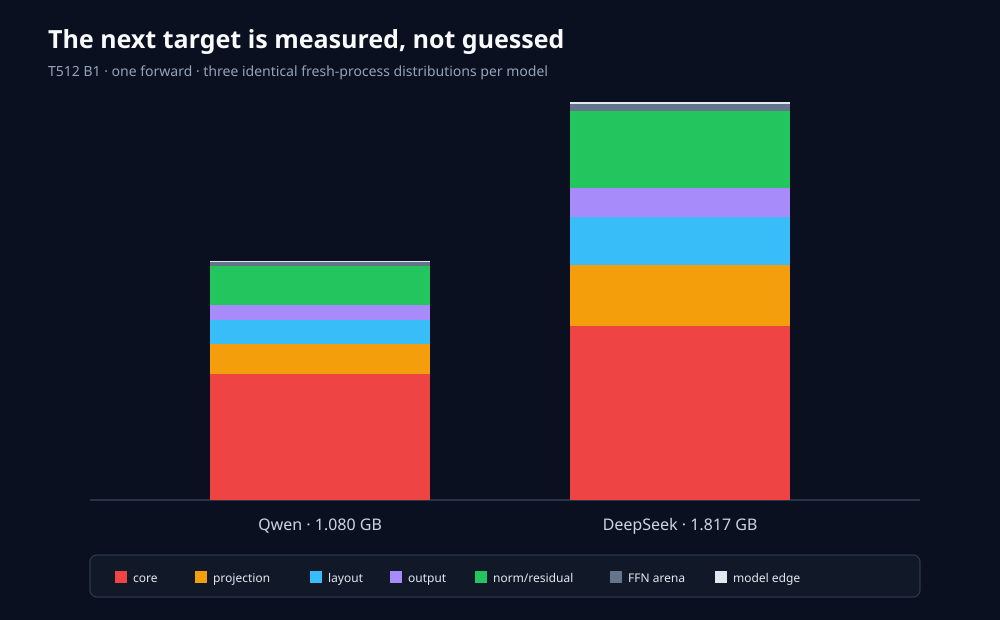

## 204. Experiment 187：最大分配来源也删了，速度还是不动

根据上一轮数据，我们为Attention core画出exact liveness：scaled Q和expanded K同时用于QK；QK提交后，
expanded K的槽可以改放expanded V；probabilities原位softmax并活到PV；output独立。一个跨block backing
因此只需`probability + 3×hidden`，替代每层`probability + 5×hidden`逻辑分配。

CPU、T1 fused HIP、T256 hipBLASLt、MHA/GQA、别名和零transfer全部通过。正式60进程logits和token也
完全一致。Qwen分配2895→2295，DeepSeek 3375→2675。

但吞吐只有1.004×/1.002×，都没过1.01；backing还让peak增加2.75/4.72MB。Profiler中两边都是
5,642个Kernel和4000+1519次launch，malloc/free 1637/1327→1395/1087，Kernel时间47.67/46.78ms。

结论很硬：连实测最大allocation source都不能推动整机，persistent Storage路线饱和。model策略discard，
out原语保留。下一步必须动Attention设备数学，例如exact FP32 QK/PV algorithm，而不是再申请一块Arena。

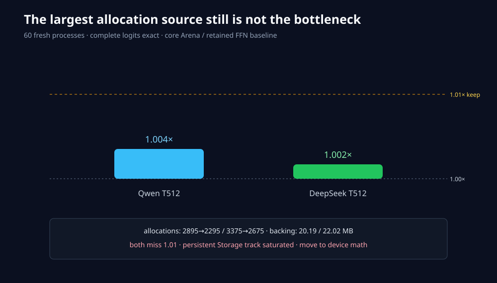

## 205. Experiment 188：不再搬内存以后，终于轮到真正的设备数学

新的tuner复刻框架row-major、transpose和strided-batch descriptor，直接枚举当前hipBLASLt heuristic。
QK是`[H,T,D]×[H,T,D]ᵀ`，PV是`[H,T,T]×[H,T,D]`。candidate先把完整输出拷回检查finite、Max、RMS，
通过后才做2次warmup和5次Event/wall。

四个shape各跑三进程，按共同index的median选推荐。每个shape都有64个共同passing solution。
Qwen QK/PV是1.324×/1.198×，DeepSeek是1.253×/1.114×；最大Max/RMS只有
4.47e-7/6.64e-8，workspace全为0。

这一次四行都过1.05，说明device math方向成立。但index是当前版本局部事实，所以本节点只keep
inventory和推荐，不直接改默认。下一节点必须做exact key registry，再用完整logits和整模吞吐决定。

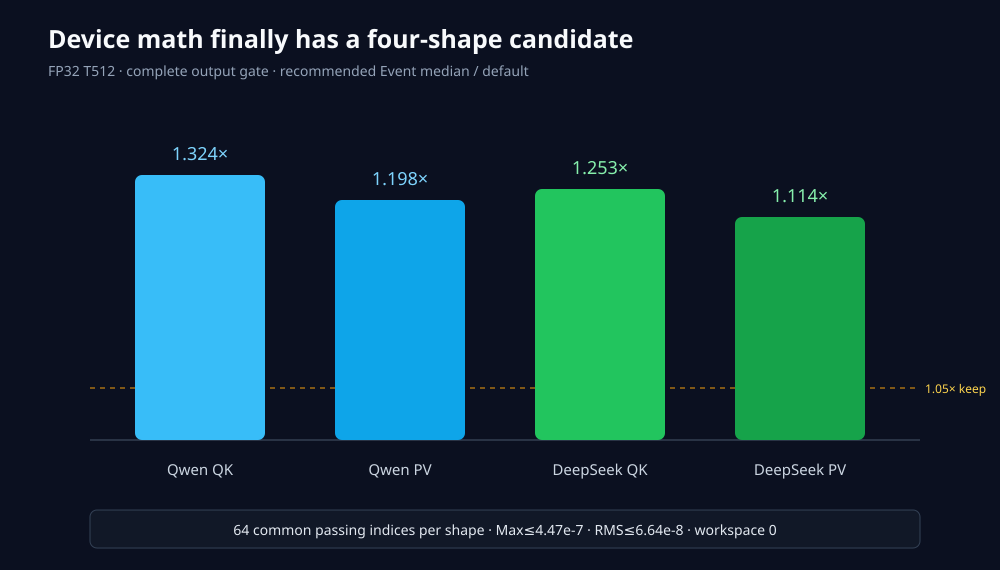

## 206. Experiment 189：算子只差一点点，经过很多层也可能变成大误差

我们先把算法编号关进一个精确key：batch、实际行列、stride、transpose、alpha、workspace、GPU、HIP、
driver和hipBLASLt版本少一个都不匹配。第一次命中还要让当前库验证descriptor，之后才缓存。
CLI只接受显式QK/PV编号，默认路径完全不注册。

第一轮整模pilot立刻推翻了“算子误差小就安全”。最快QK在单算子只有约1e-7误差，但24/28层以后，
Qwen/DeepSeek完整logits Max变成0.07290/0.04437。PV仍bit-exact。我们没有把容差放宽，而是回到
64个候选，换成输出bit-exact且仍较快的QK `311017/305423`。

正式24进程中，六个模型×策略组合全部bit-exact，显存和allocation不变。可速度也给出第二个反例：
Qwen的QK/PV/both只有1.009×/1.004×/1.008×，DeepSeek为0.999×/1.003×/1.004×。没有一条共同跨过
1.01，因此默认策略全部拒绝，精确registry和诊断保留。

这个节点把两类错误分开了：近似QK是数值不合格；bit-exact QK/PV是端到端收益不够。下一次不能再
枚举编号，而要用profile选择更大的融合区域，把scale、softmax或layout的一部分也从提交路径中拿掉。

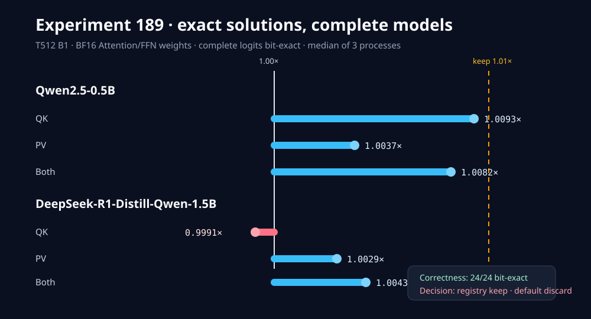

## 207. Experiment 190：GroupedGemm 快不快，取决于指针会不会动

整进程trace一开始说BF16 weight cast占36%/59%，但那是只做一次的准备。我们改成
`load+6 prefill - load+1 prefill`，再除以5。真正每次forward里，GEMM占Qwen 53.6%、
DeepSeek 61.9%；DeepSeek单是84次Q/K/V投影就用掉2.661ms。

Experiment 13在M=1 FP32没有GroupedGemm heuristic，但它明确留下“BF16、大M再试”。T512时，
直接grouped FP32输出仍然0支持；grouped BF16输出有10,227个候选。筛前16个以后，稳定指针的
Qwen/DeepSeek Event达到1.881×/1.225×，输出误差只有2.44e-4以内。

反例同样重要：每次重新`setProblem+initialize`只有0.908×/0.815×。所以我们没有写一个普通函数
假装少两次launch就会快，而是把shape、环境、device、Stream和全部指针放进plan key。QKV Arena
稳定输入/输出地址，每个block因权重地址不同建立一份plan。

完整12进程结果再次分叉。Qwen为1.0317×，DeepSeek只有1.0015×；logits Max/RMS分别
0.09360/0.01978和0.06300/0.02044，top token一致，peak增加0.34%/0.17%。于是primitive keep，
默认策略discard。现在不能写`if (model == qwen)`；需要更多checkpoint证明hidden或宽度规则。

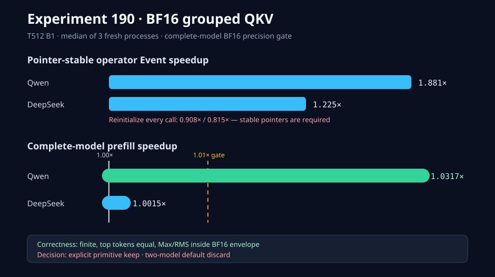

## 208. Experiment 191：多找48个候选，DeepSeek终于过线，但首次成本不能藏

上一轮“DeepSeek不适合GroupedQKV”的解释并不成立，真正缺的是搜索覆盖。64候选在三个独立
进程中稳定选出Qwen `64713`、DeepSeek `64755`，算子Event到2.010×/1.692×。最终完整模型
中位数为1.0458×/1.0295×，两者都过1.01；logits、top token和peak门继续通过。

我们也犯了一次测量错误：一开始把operator runner和model runner同时放到GPU0。发现后立即中止，
并串行独占重跑，污染数据没有提交。之后phase delta显示Qwen/DeepSeek每步GEMM调用
217→169、253→197，总Kernel时间改善1.019×/1.021×；新增三次输出cast吃掉了一部分收益。

还有一个更隐蔽的问题。每个block独立initialize会让首次forward约5.7秒。改用一个共享kernel和
device user arguments后，每个block只准备小参数，总共不到0.7ms。但hipBLASLt第一次kernel初始化
仍要约204–208ms，超过100ms门。因此steady policy keep，默认/一次性CLI仍off。未来scheduler可以
在接收请求前显式prewarm，再测真实TTFT，不能继续增加warm-up假装首次请求不存在。

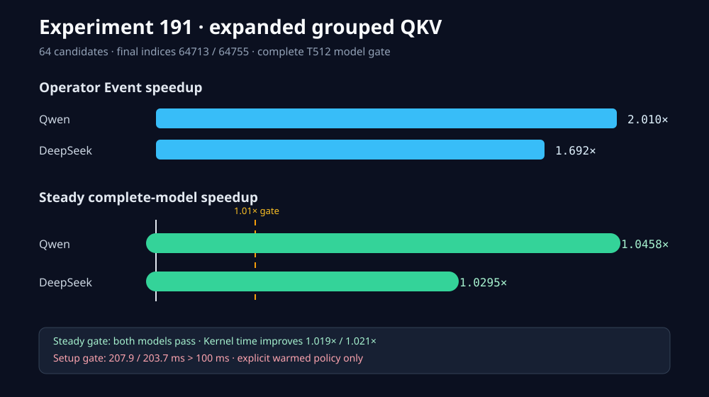

## 209. Experiment 192：预热不是消除工作，而是决定谁来等

零warm-up测试先纠正一个直觉：普通BF16模型第一次T512 forward本来就约5秒，因为许多vendor
plan和GPU代码首次使用才准备。lazy grouped把首请求推到5744/5741ms。

新`prewarm_bf16_grouped_qkv(512)`在admission前用dummy activation建立同一套Arena和pointer plans。
Qwen/DeepSeek预热915/886ms，之后首个真实请求4852/4795ms，比lazy grouped少等892/947ms。
但prewarm+request仍为5767/5681ms，与lazy总成本接近：我们移动了等待者，没有删除计算。

报告还拆出shared grouped kernel初始化208/201ms和全部device arguments准备0.64/1.15ms。
相同rows重复预热直接返回already-warm；移动设备或重设Arena会失效。API keep，默认不调用；只有
明确拥有“准备完成后再接客”生命周期的serving scheduler才适合使用。

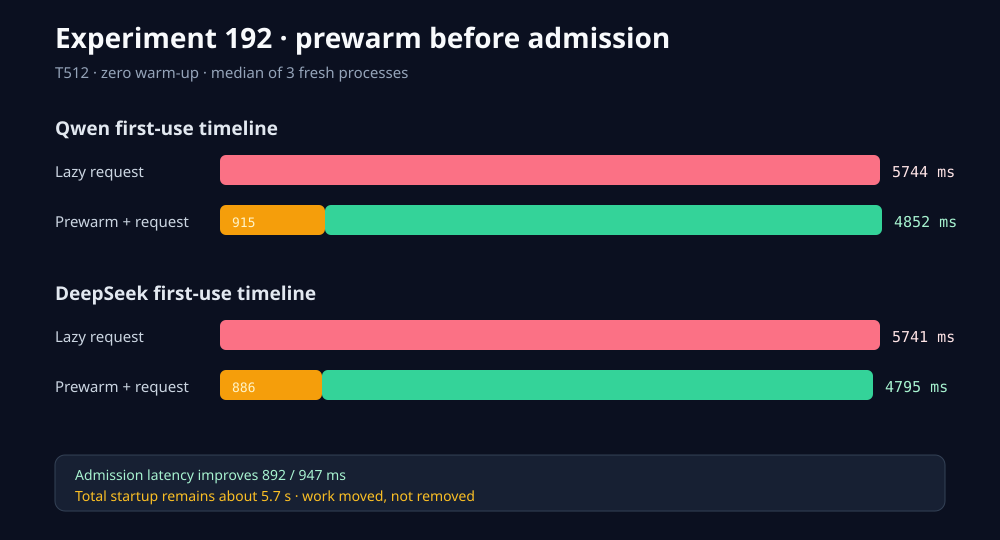

## 210. Experiment 193：把仓库全搬出来，不等于更快找到一个零件

Experiment 192留下约5秒普通首forward。我们先用FP32做反驳：Qwen/DeepSeek即使不用BF16，
第一次T512仍要3582/3564ms。说明一大块成本属于进程第一次使用ROCm和vendor库，不是某个
BF16 Tensor或模型图写错。

hipBLASLt提供全kernel预载开关。它听起来像能消除lazy加载，但正式18进程结果完全相反：
Qwen BF16从5030ms变成17190ms，DeepSeek从4968ms变成17123ms，分别慢3.417×/3.447×。
包含加载和退出的进程wall也慢3.140×/2.938×，显存峰值一字节都没有下降。

完整logits仍通过Max/RMS门，所以失败原因不是数值。全预载只是把远多于当前模型需要的库存
都准备了一遍。这个策略discard，默认不变，也不再增加一个包装完整forward warm-up的API。
下一条启动优化必须只选择真实会用的kernel，或者让常驻服务进程摊销一次初始化；不能只隐藏
第一次请求。

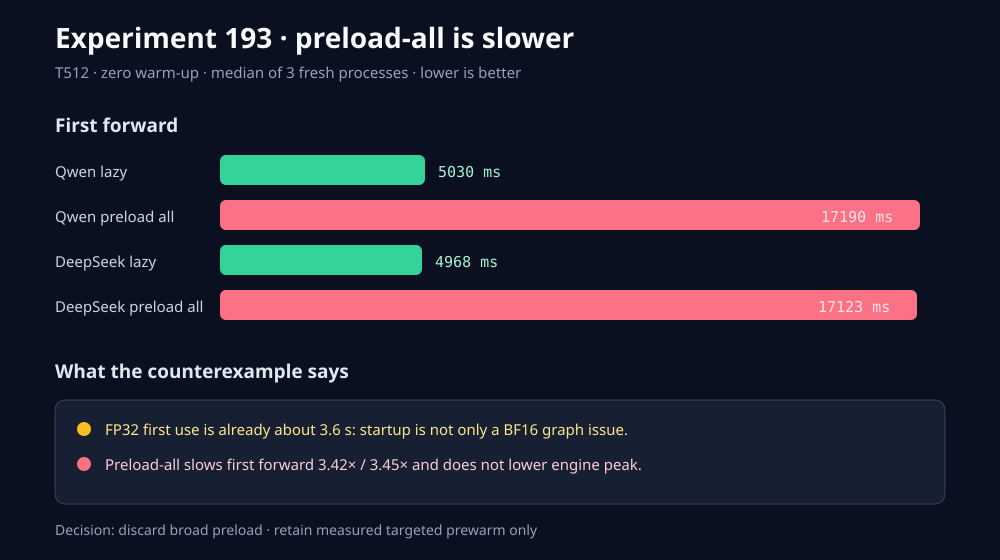

## 211. Experiment 194：只挑一个快零件，仍不能缩短开机

全kernel预载太宽，所以这次只挑FFN gate/up真正使用的BF16-output GEMM。每个模型启动三个
tuner进程，64个候选必须三次共同通过完整输出，再按Event中位数选择。Qwen编号76074快
1.059×，DeepSeek编号76091快1.032×；局部收益是真实的。

可是24个模型进程给出第三次相同教训。Qwen/DeepSeek cold只有0.990×/0.996×，连完整进程wall
也只有0.978×/0.981×。steady时Qwen退到0.973×，DeepSeek的1.007×又没有跨过1.01共同门。
全部logits bit-exact，peak完全相同，所以不能把拒绝归咎于精度或显存。

这轮关闭两个误区：换第一个GEMM编号不会让vendor库更快完成首次模块加载；单算子Event提升
也不能直接外推到完整模型。下一轮若继续碰启动，必须拿到真正的module lifecycle控制，或由
常驻进程摊销一次初始化。

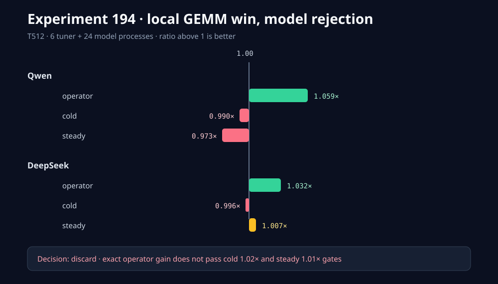

## 212. Experiment 195：gate和up可以一起提交，但地址必须稳定

启动shortcut关闭后，我们回到steady trace。FFN gate和up读取同一个input，shape也相同，却一直
分两次提交。新probe把现有GroupedGemm扩成两个group，先不动模型。

Qwen/DeepSeek各三个进程都看见10227个算法，前64个完整输出全部bit-exact。稳定GroupedGemm
Event为1.203×/1.139×；真正适合多block的device user arguments仍有1.188×/1.155×。

反例决定实现边界：如果每次都setProblem和initialize，速度只剩0.823×/0.940×。所以不能增加
一个无状态grouped_gate_up函数就结束。下一节点只能把plan绑定到FFN Arena的稳定input、gate、
up和每层权重地址，再做完整Qwen/DeepSeek gate。这个节点只keep benchmark能力，生产默认没变。

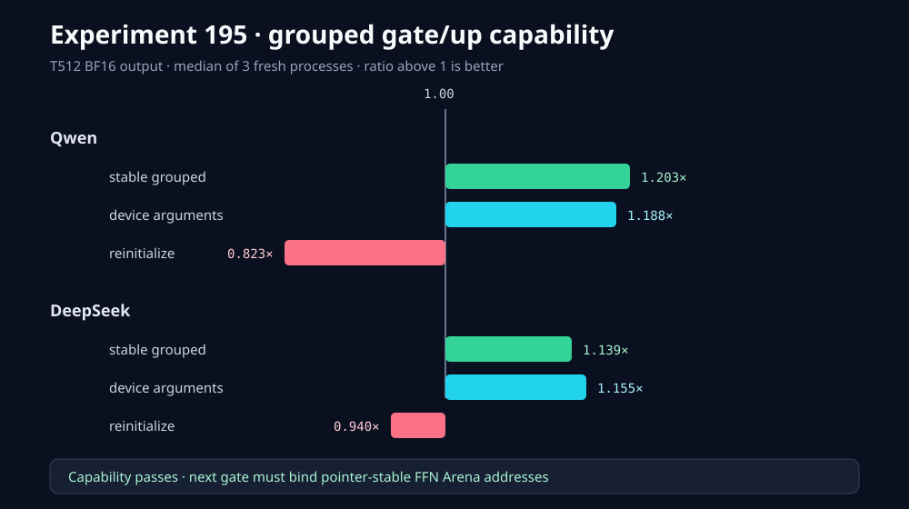

## 213. Experiment 196：一个共享Kernel，24或28份小参数

生产接入只发生在FFN Arena路径。exact key记录shape、架构和三种backend版本；共享kernel按
shape、编号、device、Stream缓存。Qwen的24层和DeepSeek的28层只各自保存一份device arguments，
把自己的gate/up权重地址绑定到同一Arena input/output。

12个正式进程中，Qwen从93471到95118 tok/s，DeepSeek从50157到50746 tok/s，分别1.0176×/
1.0117×。Max/RMS为0.07028/0.01538和0.06139/0.01029，top-1不变，peak只多约10KB。
kernel setup约57ms，所有block参数总准备不到0.7ms。

phase delta也准确少24/28次GEMM提交，GEMM时间改善1.035×/1.020×。但插桩DeepSeek总Kernel
是0.998×，所以我们同时保存这个反例，最终keep依据仍是未插桩三进程中位数。

显式策略keep，默认仍off。没有注册精确环境和shape时，代码逐字走旧两GEMM路径；非Arena和
短shape也不会偷偷建立无法复用的plan。

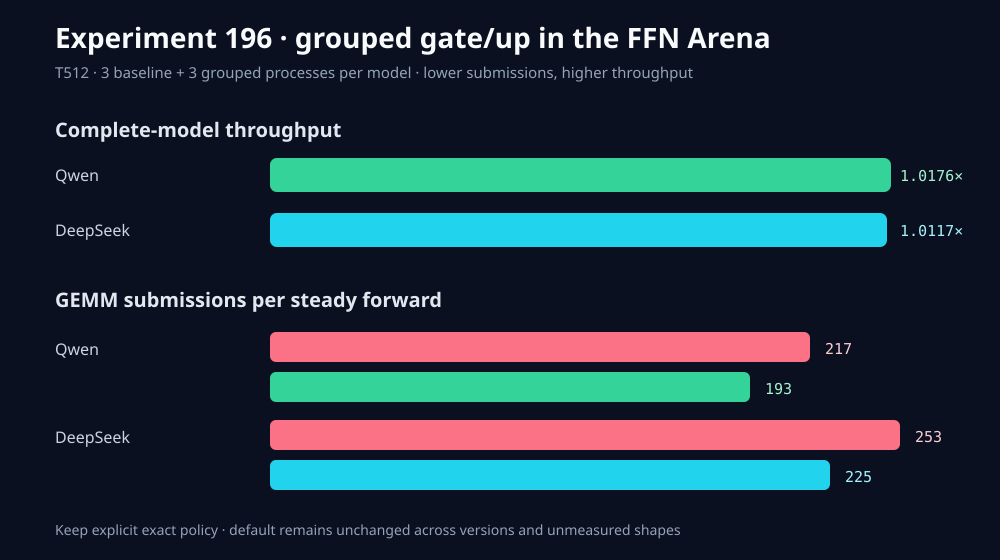

## 214. Experiment 197：两个优化都命中，收益还能继续相加

两个registry一起开可能互相清理、只命中一个，或者两个Arena让peak越界。我们因此用四策略而不是
只测before/after：baseline、QKV-only、gate/up-only、both，每个模型各三进程。

Qwen both/base为1.0655×，DeepSeek为1.0474×；相对QKV-only还能增加1.0199×/1.0172×。
每个打开的策略都准确dispatch 168/196次，关闭侧为0。24个完整输出top-1相同，Max/RMS和peak
继续过门。

组合还有一个setup交互：QKV先初始化后，gate/up shared kernel只花0.249/0.239ms；但QKV本身仍
让combined setup达到214.5/205.6ms。所以组合keep为显式warmed策略，不会偷换one-shot默认。

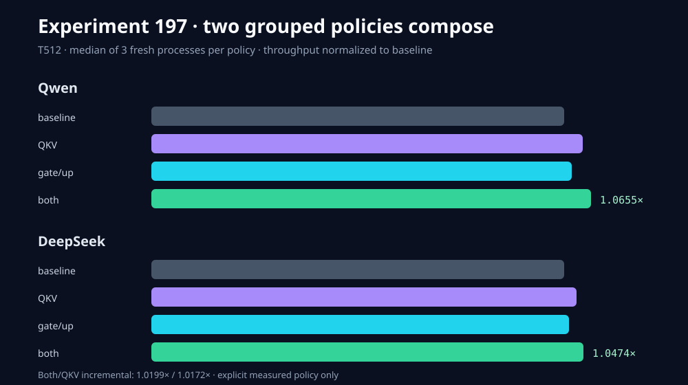

## 215. Experiment 198：rows换成256和1024，先别急着推广

我们为Qwen/DeepSeek的QKV和gate/up各加rows256/1024，共8个case、24进程。每次重新筛64个
candidate，不拿T512编号硬套。所有case通过，device arguments Event为1.124×–1.695×。

最重要的不是“又快了”，而是pilot纠错。一次DeepSeek rows256 QKV曾显示每次reinitialize也有
1.051×；三进程中位数变成0.964×。稳定地址仍是正式设计，单进程没有权力改合同。

rows1024可能来自B1/T1024，也可能来自B2/T512。GEMM shape一样，Attention和batch却不同。
所以下一节点必须拆开两种完整模型，不把operator shape等价写成workload等价。

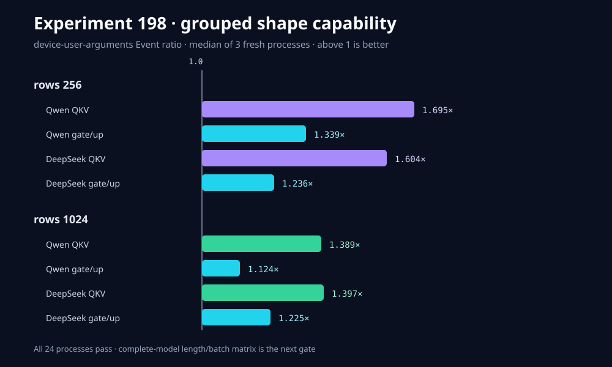

## 216. Experiment 199：B2文件少一行，性能矩阵先停下来

完整矩阵第一次没有产出summary。模型内部B2 logits是两行，但CLI的logits-output只写B0。我们先
修边界：last写全部batch，full为每个batch各取自己的最后token。真实tiny Qwen fixture现在强制
B2 last/full都有2×vocab，并与两个B1行一致。

修完后重跑36进程。Qwen三个case为1.1075×/1.0280×/1.0311×，DeepSeek为
1.0755×/1.0212×/1.0223×。每个batch行top-1、BF16误差、peak和setup都通过。

B1/T1024和B2/T512都映射rows1024，却得到不同收益。这个结果把“projection key”和“workload key”
明确分开：前者负责安全dispatch，后者负责性能结论。

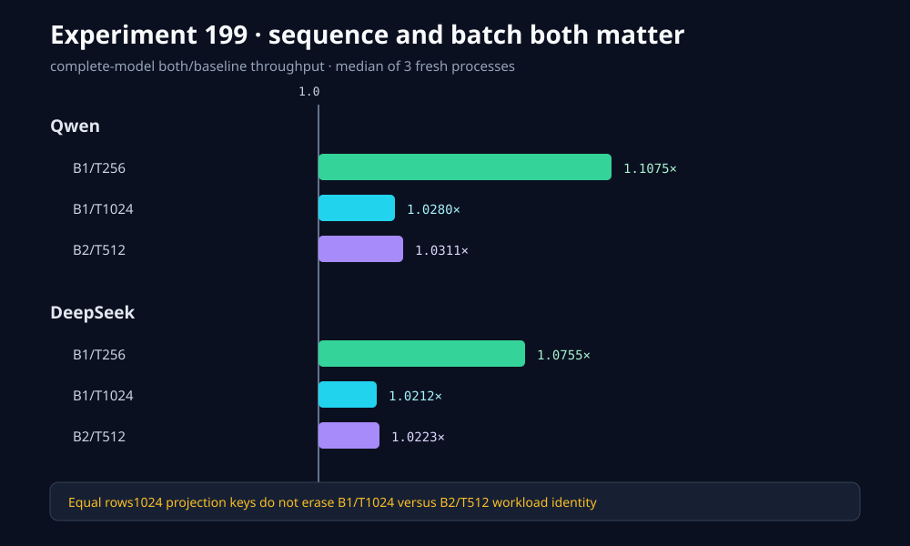

## 217. Experiment 200：每层少三次提交以后，GEMM仍是最大块

最终组合的phase delta不再是QKV-only的169/197次，而是145/169次。QKV每层省2次，
gate/up每层省1次，所以Qwen正好省72，DeepSeek省84。

GEMM时间改善1.182×/1.099×，总Kernel改善1.009×/1.034×。但GEMM仍占46.8%/59.1%，
cast和strided copy又占18.9%/14.8%。这说明独立projection分组已经做完，剩余不是再找
一对相同输入就能解决。

下一候选必须改变更大的Attention、cast或layout边界，并继续过完整模型门。

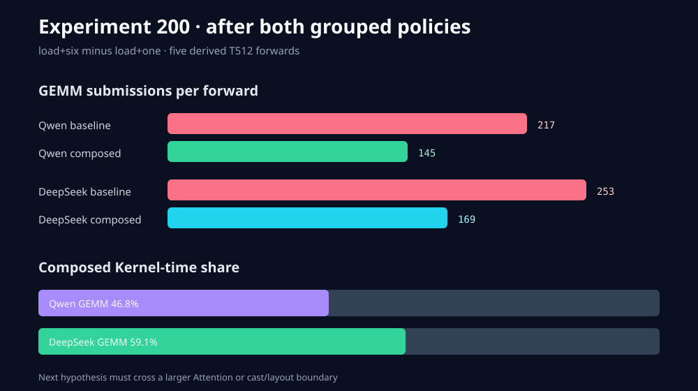

## 218. Experiment 201：96/112次copy全部来自Attention

过去strided诊断只有shape/stride，不能区分模型区域。现在复用AllocationSource作为聚合键。
三个进程每模型得到完全相同的三条记录：

Qwen 96次、100.7MB，DeepSeek 112次、205.5MB。每层都是Q/K/V三次BTHD→BHTD，再把context
做一次BHTD→BTHD。FFN、embedding、output和unspecified全部为0。

因此下一步明确为推理BTHD Attention island。把通用copy Kernel写快只会继续搬同样字节，
不满足最小解释。

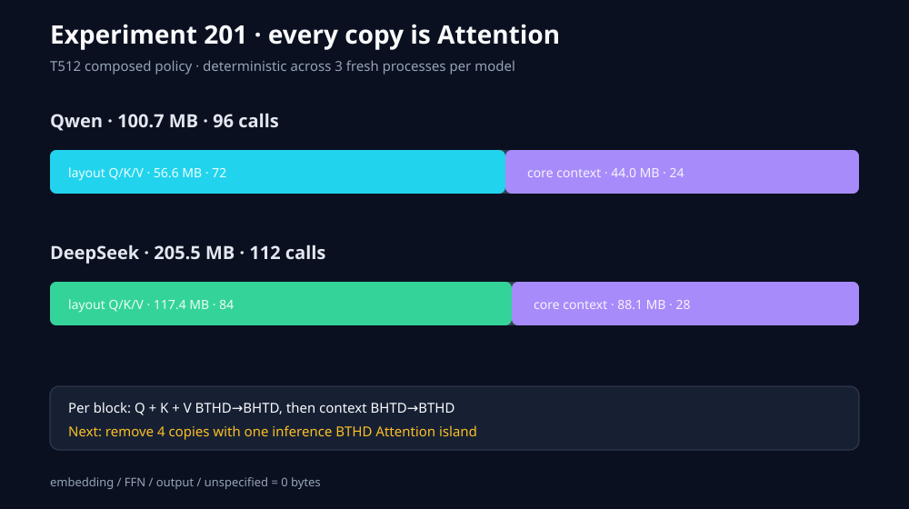

## 219. Experiment 202：不写新Kernel，也能删掉四次copy

训练路径已有两个primitive：一个把Q/K的bias、split-half RoPE和布局转换一起做；另一个直接读
BTHD V并写BTHD context。推理policy把它们接起来，没有新增数学Kernel。

12个未插桩进程显示Qwen/DeepSeek快1.1146×/1.0936×；另外12个诊断进程证明96/112次copy
严格变0，100.7/205.5MB全部消失。logits bit-exact，peak下降4/7MiB。

支持域仍很窄：HIP、T≥256、BF16、split-half+bias、无prefill-cache写入、无value trace。
其他路径不猜测，继续走旧fallback。

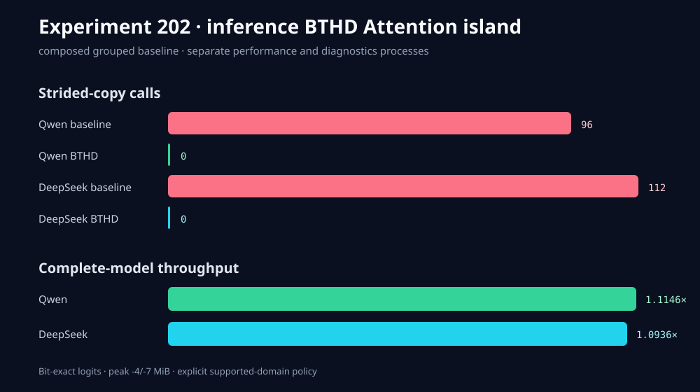

## 220. Experiment 203：B2还有一次copy，但它不属于Attention

六个sequence/batch case的BTHD速度为1.0852×–1.1421×，logits bit-exact，peak下降2–14MiB。
所有Attention source copy都是0。

第一次诊断门要求“总copy=0”，因此B2停止。归因后发现剩下的是一次unspecified last-row选择，
Qwen 7168B、DeepSeek 12288B，位于Attention island之外。正式门改成Attention严格为0，其他
source单独报告。

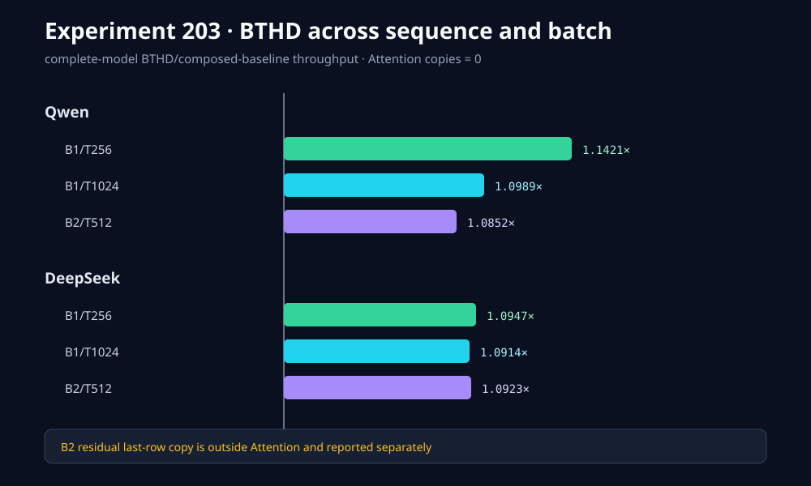

## 221. Experiment 204：strided已经是0，下一步看cast

BTHD后的phase trace里，strided category彻底消失。总Kernel相对组合baseline快1.169×/1.118×。
现在GEMM占55.6%/65.2%，cast为0.519/0.757ms，softmax约0.483/0.519ms。

Q/K grouped输出BF16后立刻转FP32，再进入bias+RoPE融合。下一最小候选让融合直接读BF16，
每层少两次cast；V暂时不改，避免一次改变两种精度边界。

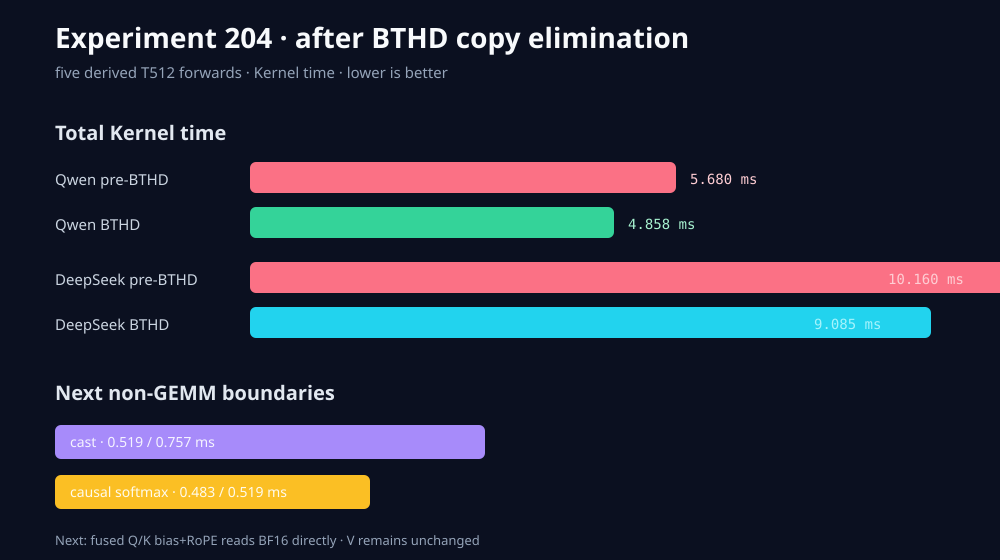

## 222. Experiment 205：删掉目标cast以后，三进程仍可能给错结论

GroupedGemm已经把Q/K写成BF16，但旧路径先转FP32，融合bias+RoPE再读回来。新路径只在精确
grouped计划命中时把Q/K fallback直接交给融合Kernel；V、Attention输出、cache和训练都不改。
任何miss都会返回原FP32边界，不让性能策略变成隐式精度策略。

算子、两层整模和官方完整logits都位级一致。第一次三进程中，Qwen快1.0227×，DeepSeek只有
1.0068×，所以按1.01门应当拒绝。Phase trace却显示目标工作确实消失：Qwen cast 144→96，
DeepSeek 168→112，正好每层两次；总Kernel分别快1.0787×/1.0600×。

因为收益只有约2%，我们没有用profile替代端到端门，而是把独立进程扩大到五个。新中位数为
1.0224×/1.0238×，两模型通过，peak不变。三进程失败仍作为噪声反例保留。策略因此keep为
显式/default-off；在sequence/batch和其他GPU扩展前，不改默认。

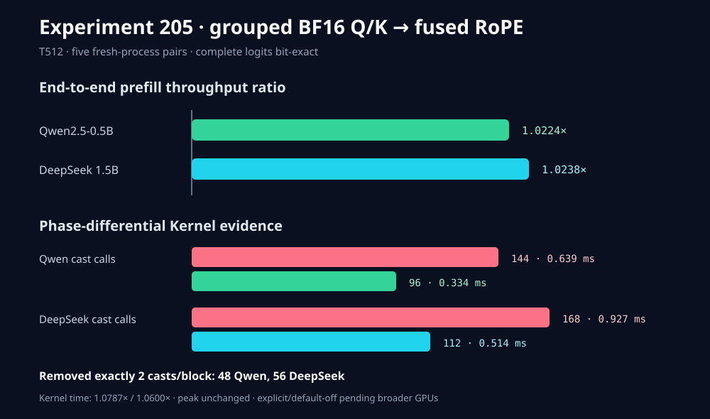

## 223. Experiment 206：rows相同，不代表B1/T1024等于B2/T512

我们把直接BF16 Q/K扩到B1/T256、B1/T1024、B2/T512。后两者的GEMM rows都是1024，
但Attention shape和batch导出不同，所以必须分开测。

三进程pilot有五项通过，Qwen B2/T512只有1.0091×。固定门没有降；扩大到五进程后，六项为
1.0128×–1.0244×。60个正式进程全部logits bit-exact，B2两行top-1相同，peak不变，
retained dispatch逐项等于block数乘7次forward。

这关闭了当前cast边界的shape扩展。策略继续显式/default-off；下一步回到profile里尚未处理的
causal softmax，而不是把一个gfx942结果自动推广到所有AMD GPU。

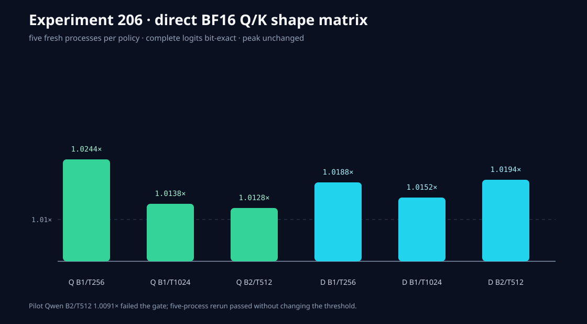

## 224. Experiment 207：一次快2%，三进程只剩0.7%

T512 register softmax的256线程跨4个wave规约。128线程候选让每线程多保留几个exp，但少两个
wave。为了支持它，reduction stride改读`blockDim.x`；默认256线程的树不变。

单次pilot里Qwen/DeepSeek T512都约快2%。三进程算子矩阵却只有Qwen保持1.0255×，DeepSeek
降到1.0071×。六个T256/512/1024 case只有4/6过1.01门，最大数值误差仍仅1.86e-9。

因此整模门没有运行，模型/CLI开关也被删除。显式Rows128 primitive和benchmark保留，Auto仍
是256线程。这个反例关闭“只调block size”方向；再做64/128/256扫描没有足够解释力。

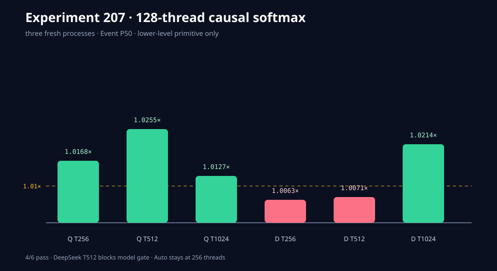

## 225. Experiment 208：少一次Kernel，小B1快，B2不动

候选把grouped V的BF16→FP32 cast与GQA repeat合成一次typed Kernel。第一次benchmark误用
`Tensor::cast`，20轮各产生H2D/D2H，被transfer门拒绝；改成设备`ops::cast`后正式重跑。

48进程完整输出逐项一致。Qwen/DeepSeek B1/T256达到1.253×/1.345×，但B2/T512只有
1.004×/0.995×；八项仅三项过1.05。大输出时写expanded V才是主成本，删除小cast不够。

因此不接模型、不加CLI，显式primitive保留。下一步若处理V，必须避免expanded Tensor本身，
而不是继续融合它前面的微小准备工作。

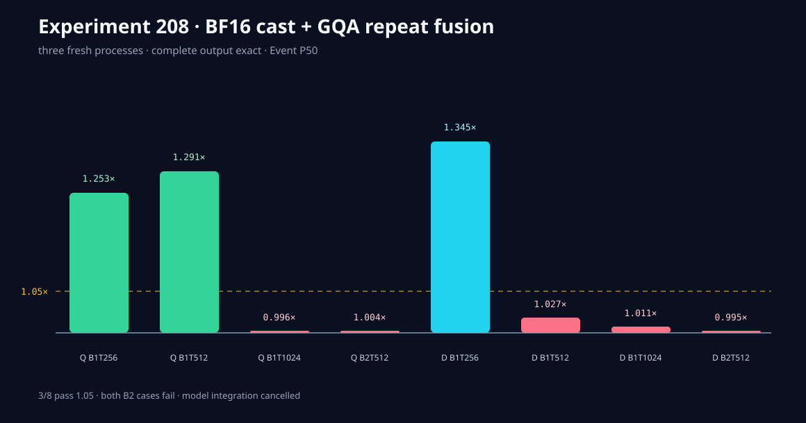

## 226. Experiment 209：该停止微融合，换问题尺度了

当前T512 Kernel里GEMM已占57%/67%。softmax、cast、repeat即使各自完美消失，DeepSeek理论上
也只有1.062×、1.061×、1.035×。现实里后两次候选又分别只有4/6和3/8算子case过门。

已有可读fused Attention不物化T²，却只有library路径0.36×；缺少MFMA tile和online数据复用，
省内存不会自动变快。因此当前微融合track关闭，不再盲扫线程数和单launch。

下一次Attention工作必须是独立online/tiled设计，或者等待其他子系统改变后重新profile。

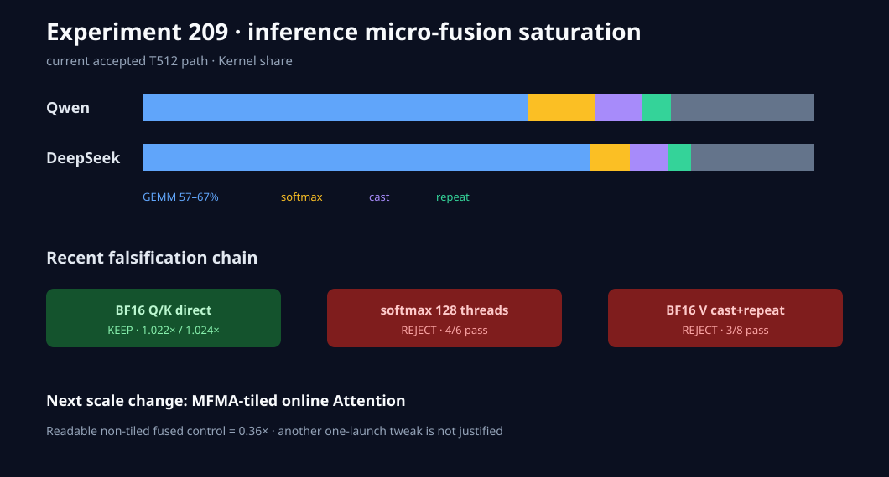

## 227. Experiment 210：少72次启动，为什么训练反而没快

训练里的残差加法后面紧跟RMSNorm，看起来很适合复用已有融合Kernel。但训练图不能把残差和
藏起来：它同时流向残差支路和归一化支路。我们用两个Autograd节点保留这个分叉，并分别对齐
两个前向结果和left/right/weight梯度。

HIP profile证明候选不是“开关没生效”：Qwen两步少72个add、少72个独立RMSNorm，多72个
融合Kernel，总launch从6,903降到6,831。可总Kernel时间只少0.045%。正式三进程中，Qwen和
DeepSeek分别只有0.9785×和0.9980×，显存不变，DeepSeek的固定参数还有末位差异。

所以模型和CLI路由删除，只保留已经由CPU、HIP、PyTorch三层证明的Autograd原语。以后如果
再做训练融合，目标必须覆盖更大的残差分支或来自新的profile热点。

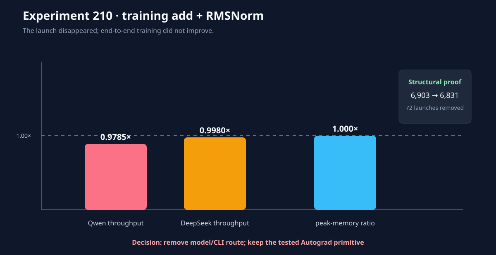

## 228. Experiment 211：把339次启动合成一次，为什么还不够

旧AdamW每个参数Tensor启动一个Kernel。multi-tensor版本用稳定block map和每步地址卡，让
Qwen/DeepSeek的870/1,017次启动变成3次。第一版同步上传地址卡会等待backward，DeepSeek直接
回退；第二版用pinned staging和同Stream异步copy，才让队列重新连续。

五进程中Qwen达到1.0573×，DeepSeek只有1.0094×，刚好没过预先写下的1.01门。Profile进一步
解释：Qwen AdamW快1.4699×，DeepSeek只有1.0828×。大Tensor已经主要受四组FP32读写带宽限制，
减少launch改变不了必须搬运的数据。

因此训练器和CLI接入删除；multi-tensor原语、异步metadata生命周期、完整状态测试和profile
保留。下一版要改block/descriptor读取，而不是再包装一次相同Kernel。

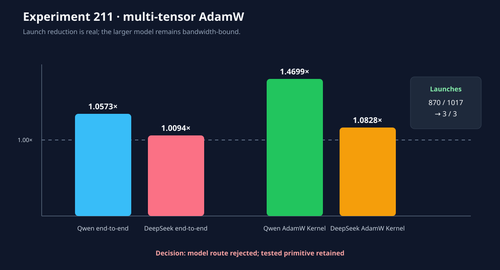

## 229. Experiment 212：少了cast，eager图却没有稳定变快

Q/K/V会把同一个输入转三次BF16，gate/up会转两次。多输出原语把它们各自合成一次cast，
同时保留每个输出独立的weight梯度边。CPU、HIP和PyTorch都比较了全部输出与梯度。

Profile证明目标工作精确消失：Qwen/DeepSeek三步少216/252次cast，cast Kernel快1.456×/
1.431×。但总Kernel只快1.0116×/1.0095×。五进程组合策略为1.0066×/1.0179×；拆成
QKV-only后是0.9804×/1.0039×，gate/up-only是0.9911×/1.0012×。

所以三个模型路由都删除，只保留多输出原语。下一次要让它和grouped GEMM或图级调度一起工作，
不能把“少一次cast”直接当成端到端优化。

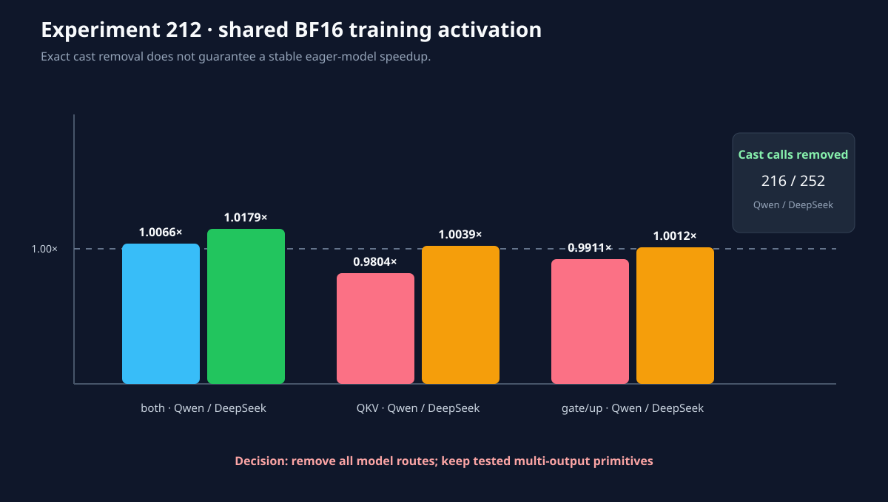

## 230. Experiment 213：先减掉加载，再决定训练还能优化什么

整程序profile会把权重转置和mirror准备混进训练。我们用“load+3步”减去“load+1步”，得到
两个纯训练step。Qwen/DeepSeek的GEMM占55.87%/62.25%，AdamW占16.85%/21.52%，合计
72.71%/83.77%。

其余单类别即使完美消失，DeepSeek最高上限也只有约1.024×。现实中residual-Norm、multi-tensor
AdamW和shared BF16 cast又连续未过两模型门。因此训练微融合track关闭。

下一阶段必须改变GEMM分组/算法、AdamW实际内存流量，或进入图级liveness与异构HIP Graph；
继续删除一个cast、add或Norm launch不再构成新假设。

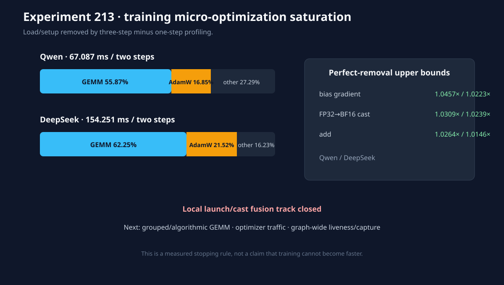

## 231. Experiment 214：把AdamW状态减半，先别急着全部改成BF16

AdamW每个参数保存一阶和二阶moment，两份FP32状态形成大块读写。显式BF16 moment把Qwen/
DeepSeek峰值降到0.833×/0.808×，optimizer快1.069×/1.196×，端到端只有1.023×/1.036×。

32步PyTorch对齐和100步CPU rounded reference通过，但Qwen optimizer没有过1.10门。因此这不是
“所有Tensor都换BF16”的结论，而是进入按Tensor大小分层的下一实验。

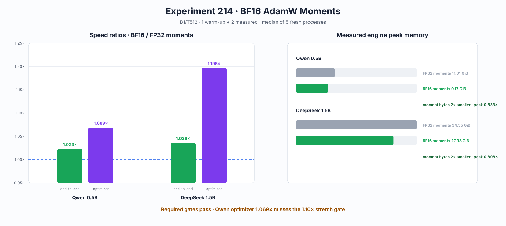

## 232. Experiment 215：小Tensor留FP32，1M阈值比“越大越好”更可靠

六个阈值的新进程矩阵显示，HIP Auto在1,048,576元素以上使用BF16 moment，以下保留FP32。
Qwen/DeepSeek optimizer达到1.240×/1.263×，整步达到1.049×/1.053×。阈值拉到16M时，
DeepSeek optimizer反而只有0.896×，端到端0.980×。

这说明低精度状态的收益来自大连续流量；小Tensor更容易被转换、分派和舍入成本吃掉。

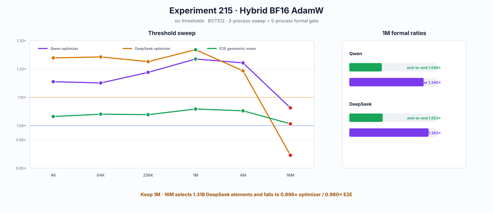

## 233. Experiment 216：optimizer优化后，GEMM成为真正主边界

重新做load-subtracted profile后，Qwen/DeepSeek每步为32.12/72.91ms。GEMM占59.33%/63.81%，
AdamW降到12.82%/17.61%。相对旧profile，AdamW时间快1.372×/1.293×。

因此下一轮不再继续包AdamW启动，而是检查能否把多个weight-gradient GEMM组成更大的设备工作。

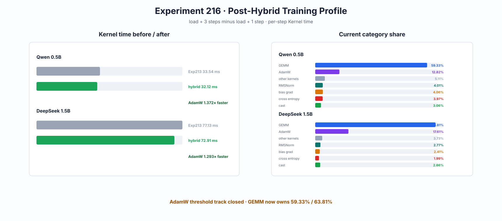

## 234. Experiment 217：GroupedGemm先过能力门，再谈接Autograd

QKV和gate/up的weight gradient共享输入，看起来像天然的GroupedGemm。我们测试direct NT与
materialized shared-transpose NN，两模型共八个格子。当前hipBLASLt FP32 GroupedGemm返回的
supported candidate全部为0。

能力都不存在时，接入模型只会增加复杂fallback。因此没有建立Autograd路由。

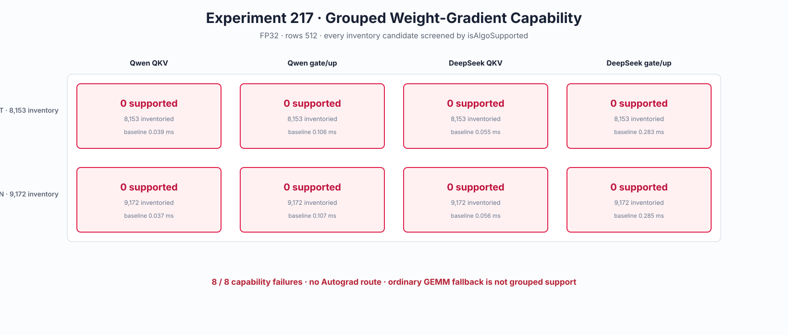

## 235. Experiment 218：打包后一个大GEMM，仍然要为打包付钱

下一反驳把多个gradient和输出打包，再执行一个大GEMM。完整输出误差通过，但把D2D pack计入
后，Qwen QKV/gate-up只有0.979×/0.835×，DeepSeek只有0.897×/0.931×；还增加大块临时显存。

“少调用几次GEMM”不是免费操作。只要输入本来不连续，打包流量可能比提交成本更贵。

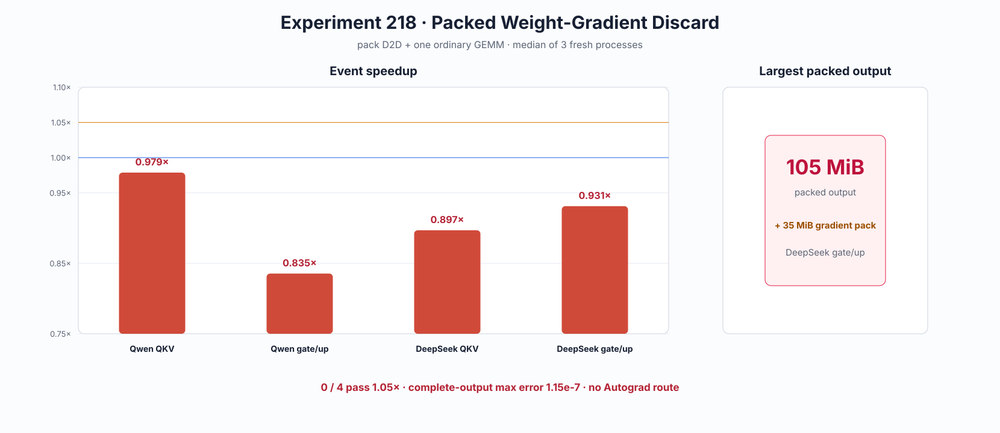

## 236. Experiment 219：局部GEMM快13%，整步仍然可能慢

rank-2 exact solution筛出Qwen/DeepSeek稳定index，算子中位数快1.077×/1.133×。模型也精确命中
144/168次，但端到端只有0.993×/0.996×。这排除了“registry没走到”的解释。

默认和持久化index都不保留；局部winner只能作为诊断，不是训练优化结论。

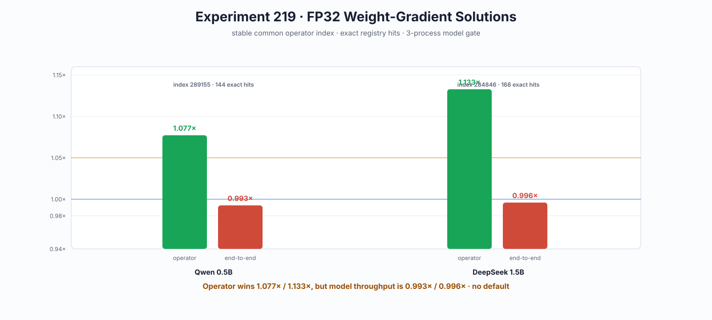

## 237. Experiment 220：录下21个Kernel，为什么还不是一次训练

完整训练Graph探针第一次在`hipMalloc`处使Stream进入Invalidated。runtime现在在碰驱动前拒绝
capture中的动态Tensor Storage，并用同一Stream随后成功捕获`add_out`证明恢复真实有效。

FP32/BF16的forward、backward、full-step都因动态Storage安全拒绝；AdamW能捕获21个设备节点，
但重放后主机step仍从1停在1。前者需要图级liveness和稳定workspace，后者需要device-owned
optimizer状态。24/24新进程恢复干净，所以保留保护与探针，但拒绝完整训练Graph声明。

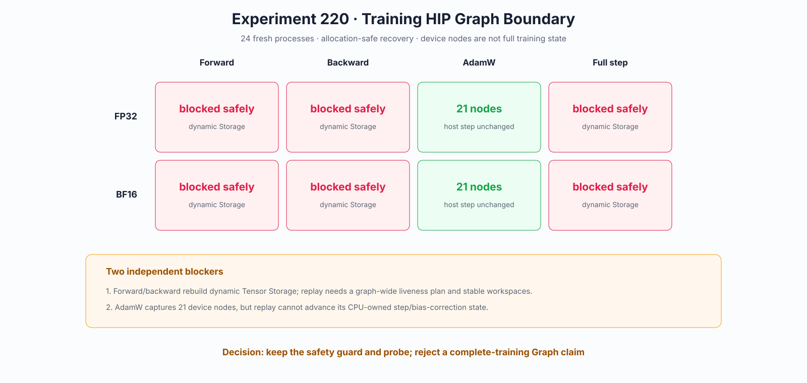

## 238. Experiment 221：把计分牌放进录像，step才能跟着重放

`AdamWGraphStepState`把step和两个bias correction放到稳定GPU Tensor。Graph第一个节点做
`step++`，后续更新读同一地址；checkpoint前显式同步一个Int32。未同步时普通step、state和
load都会拒绝，避免保存旧步数。

FP32/BF16 moment连续三次重放、再回到普通step 4，参数、两个moment和mirror全部对齐；PyTorch
标准AdamW oracle也扩到第三步。60进程却显示性能强烈依赖shape：FP32 64/256个1K Tensor快
1.427×/1.436×，BF16所有case和16×256K全部更慢。

因此语义原语与FP32窄候选保留，默认关闭。下一实验只尝试稳定descriptor的两节点multi-tensor
Graph；如果它仍救不了大Tensor/BF16，就关闭optimizer-only Graph方向。

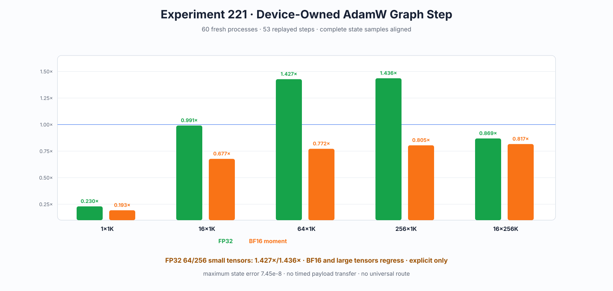

## 239. Experiment 222：点名册只传一次，256个更新变成一个grid

新workspace在capture前验证并上传parameter/gradient/moment/mirror地址，此后descriptor不可修改。
Graph永远只有step/correction和multi update两个节点。90进程、53步完整状态继续对齐，timed
region没有descriptor或payload copy。

BF16 64/256个1K Tensor从per-Tensor Graph的0.767×/0.806×变为10.813×/36.929×，BF16
16×256K也到1.630×；FP32小Tensor同样最高36.162×。但FP32 16×256K仍只有0.908×，单Tensor
也更慢，说明带宽与固定成本边界仍在。

候选显式保留，不接模型。真正阻塞现在不是Kernel或descriptor，而是下一次backward会不会替换
gradient Storage地址；先测地址，再决定stable buffer还是optimizer-phase model gate。

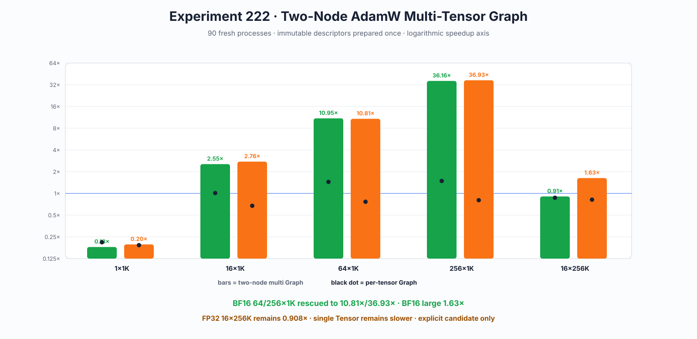

## 240. Experiment 223：箱子尺寸相同，不代表回到同一格货架

Graph descriptor保存gradient真实地址；`zero_grad`后下一次backward只保证shape相同。新benchmark
先warmup并打开exact-size pool，再比较两次steady backward，输出是否相同但不泄露指针值。

18进程里Qwen BF16 T8/T512都是290/290稳定，DeepSeek T8是339/339稳定；DeepSeek T512却有
198项换地址，覆盖112个Attention、84个FFN和embedding/head，共7,107,772,416字节。Tiny两种
精度也固定有四个K/V gradient变化。

因此eligibility必须绑定实际snapshot与context。下一步只测Qwen T512、DeepSeek T8的optimizer
Graph；DeepSeek T512直接fallback，不用未定义地址去“试速度”。

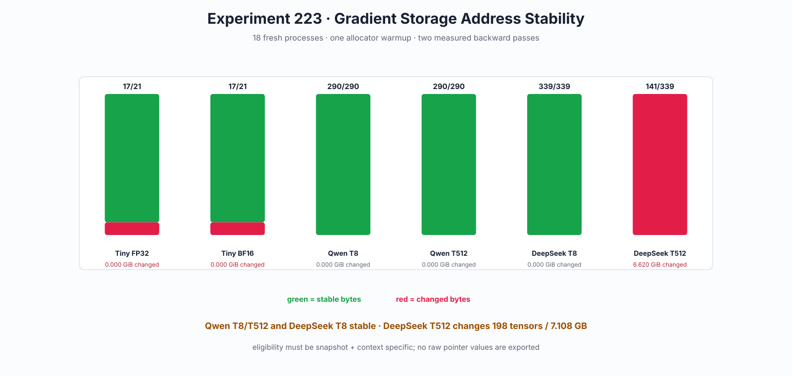

## 241. Experiment 224：第二条队伍出现，第一条队伍不能随便复用桌子

上一轮Qwen地址稳定，但真正的HIP Graph必须创建非默认Stream。runtime为避免跨Stream
use-after-free，会永久关闭只对default Stream安全的exact-size pool。allocator行为一变，Qwen/
DeepSeek T8/T512四个snapshot全部失配。

正式12进程中pool enabled全为false、snapshot match全为false、Graph launch为0。安全门在读过期
地址前停止，所以没有伪造速度数字。

optimizer-only model Graph方向关闭。下一实验必须先做可证明的quiescent Stream handoff或
Event-aware retirement；不能简单把pool布尔值重新打开。

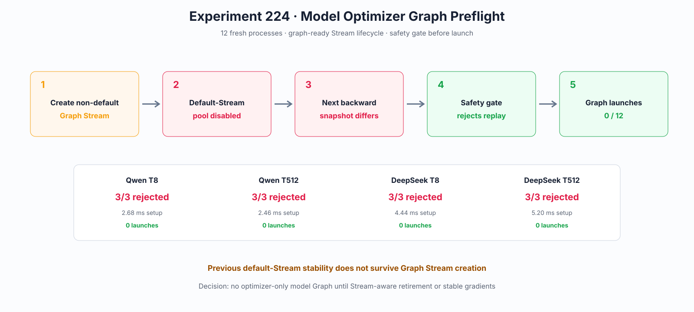

## 242. Experiment 225：先清空路口，才能让default Stream重新用内存池

新API先做device-wide synchronize，再开启新的default-Stream-only阶段；任何Graph/Event/copy/
显式Kernel提交都会再次关闭。runtime测试证明8KiB地址重新复用，而旧Stream一记录Event就立即
关池，不能靠遗忘Stream对象维持假安全。

24进程中关闭策略四case全拒；handoff每run执行三次，救回Qwen T8/T512和DeepSeek T8。
DeepSeek T512仍拒，保留了真实allocator顺序反例。

下一步只给三个安全case运行Graph optimizer，并把device-wide handoff成本算进端到端；若同步
吃掉收益，就转Event粒度，不降低正确性门。

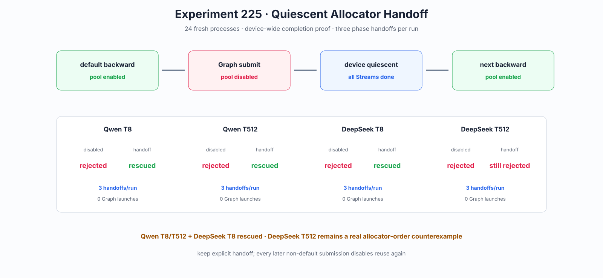

## 243. Experiment 226：micro快36倍，模型optimizer却只有0.66×–0.81×

最后21进程只launch三个snapshot安全case。两步loss、参数、step都精确一致，Graph固定2节点，
optimizer metadata H2D从每步1次变0。可Qwen T8/T512 optimizer只有0.798×/0.807×，DeepSeek
T8只有0.656×；完整step只有Qwen T8孤立1.050×，另两项回退。

真实模型的大Tensor让通用multi grid输给现有Hybrid大Tensor路径。optimizer-only Graph track关闭，
不再调阈值或block size；原语保留给未来graph-wide方案。

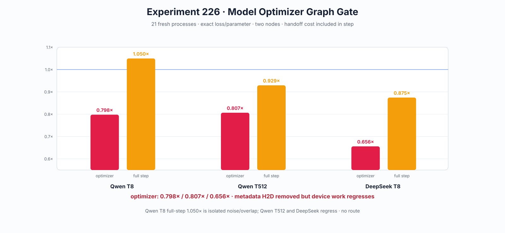

## 244. Experiment 227：先测矩阵积木，不先宣布Flash Attention

推理微融合已经饱和，下一步需要MFMA tile和online softmax。但我们先把问题缩成
`Q[T,D] × Kᵀ[D,T]`：CPU完整reference、标量HIP、rocWMMA和hipBLASLt读取同一语义输入，
输出同一张FP32分数表。

16个shape、每格3个新进程，48次完整输出全部对齐。筛出的32×32×16、一个wave/block在
T512 D64/D128比同二进制hipBLASLt快1.784×/1.654×，T1024仍快1.666×/1.342×；但T2048
D128跌到0.688×。矩阵硬件可用和长上下文反例同时成立。

因此只准入下一阶段原型，不建立模型路由。真正的候选必须不写T² score，完成online max/sum、
causal、GQA、tail和PV，并重新过完整Attention、KV、显存与双模型logits门。

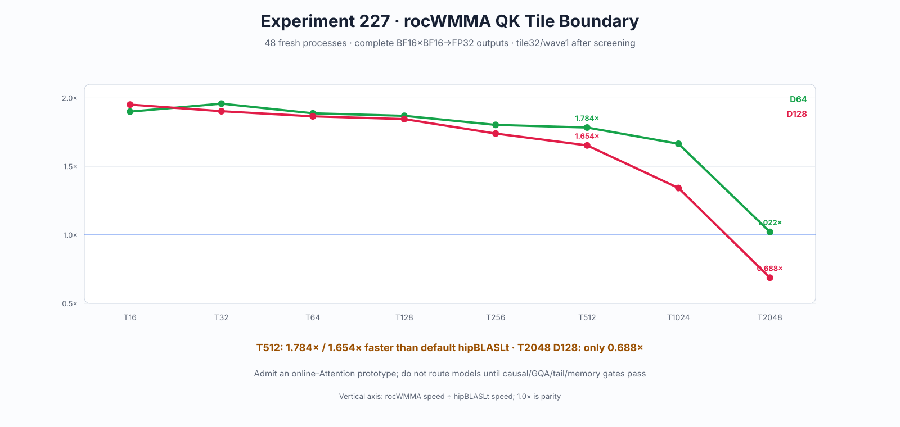

## 245. Experiment 228：边算边忘，终于删除T²分数表

第一版online kernel只用一个wave算QK，再用普通循环做PV，T512 D128只有标量fused的0.047×。
扩到第二个wave时，完整输出门抓到shared写重叠造成0.029误差；修好线程步长后，512-thread标量
PV仍只有0.172×。真正的转折是把softmax权重显式转BF16，再用2/4个wave执行rocWMMA PV。

单head仍喂不满MI300X。加入Qwen H14/KV2/D64和DeepSeek H12/KV2/D128的真实GQA网格后，
42个fresh processes覆盖T32–2048，全部完整输出过门。相对当前`causal_gqa_attention_bthd`
为1.260×–4.041×；T2048不再写224/192MiB全局score。

候选Max/RMS最高约5.66e-4/1.16e-4，明确不是bit-exact。短标量fused也仍更快。因此下一步只
准入带batch/tail/architecture fallback的公共operator，模型路由继续关闭。

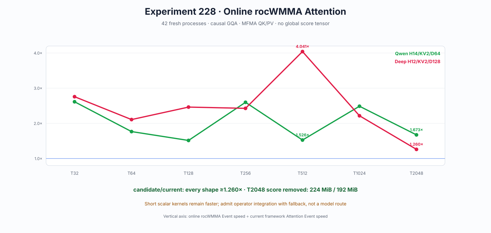

## 246. Experiment 229：快kernel终于有了公共合同

新`online_causal_gqa_attention_bthd`固定BF16 Q/K/V、FP32 BTHD输出。gfx942、T整32、
D64/128走online；其他合法shape显式cast FP32并调用当前路径。native/fallback计数让测试能证明
真正dispatch，而不是看到好数字后猜。

CPU fallback、PyTorch BF16-rounded oracle、HIP batch2和T33全部通过。42进程公共API矩阵中，
10个native case为当前路径1.534×–2.456×且timed payload transfer为0；4个T31/T33/D32 fallback
数值精确，但只有0.607×–0.696×。慢fallback被保留为真实代价。

CMake Config新增`microLLM_WITH_ROCWMMA`，header-only实现不会泄露成外部SDK强制链接项。下一步
只做显式模型A/B；operator保留不等于模型默认启用。

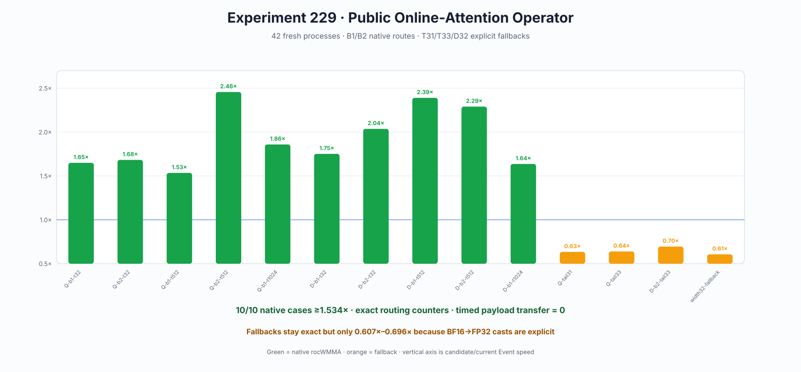

## 247. Experiment 230：算子快两倍，模型只剩0.76×–0.88×

模型candidate在每层RoPE后把Q/K/V三次cast BF16，再调用public online operator。36进程精确
命中Qwen 168次、DeepSeek 196次native，全部零fallback。六格top token相同，peak少3.5–57MiB。

但六格prefill全部回退到0.761×–0.884×；Qwen完整151936 logits的Max/RMS最高0.511/0.112，
失败预设0.2/0.02门。三次cast与24/28层误差累积推翻了“operator快就接模型”的解释。

模型路由拒绝、默认不变，public operator继续保留。只有RoPE能直接产生BF16 Q/K/V并消除三次
cast时，才允许用同一门重开。

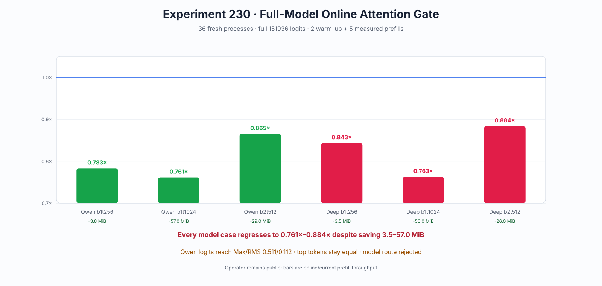

## 248. Experiment 231：三次cast全删了，解释还是倒了

grouped QKV现在可保留BF16 V，V bias和bias+RoPE都直接写BF16，Attention core前不再有三次cast。
同一36进程模型门中六格都略有恢复，证明cast有成本；但仍只有0.777×–0.906×，Qwen Max/RMS
仍到0.485/0.110。

这推翻了“cast是主要瓶颈”。online kernel逐层执行效率与BF16 probability误差才是更大边界。
direct-BF16 bias/RoPE原语和public operator保留，online模型track关闭，不再调局部tile或threads。

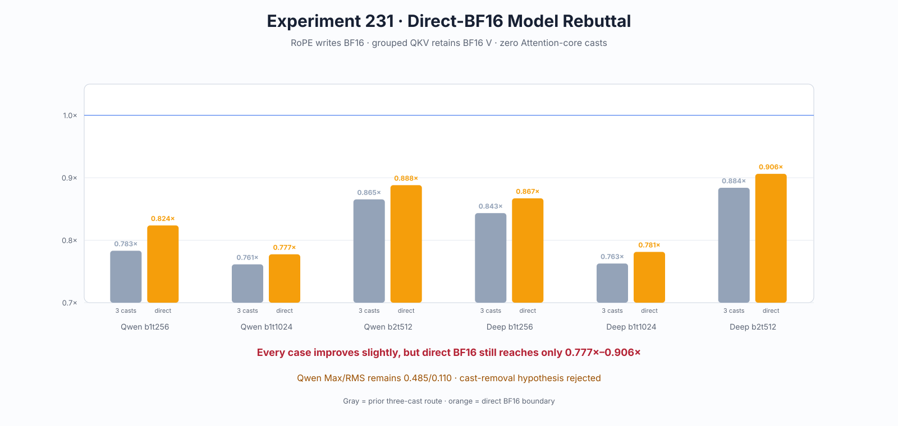

## 249. Experiment 232：路线关闭后，重新看默认程序

当前B1T1024默认策略做四个rocprof进程，用`(load+6−load−1)/5`去掉启动。Qwen/DeepSeek
Kernel时间8.315/14.862ms，hipBLASLt GEMM占59.7%/66.8%，softmax占14.8%/9.2%。

softmax虽是最大单kernel，但旧T1024线程候选局部只有1.013×/1.021×，理论整步不足0.3%；online
模型也已关闭。因此下一步只筛exact T1024 QK/PV solution，不能从红色条直接跳到旧方案。

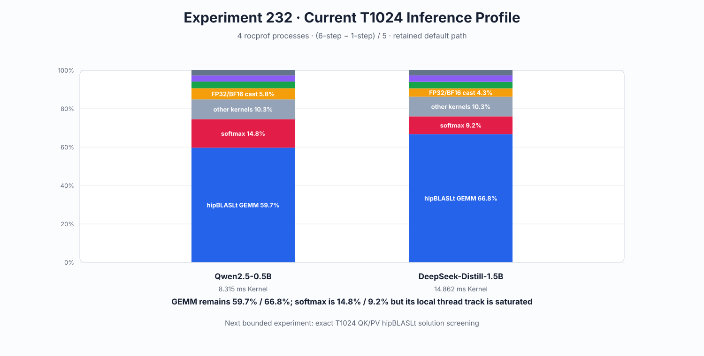

## 250. Experiment 233：四个小测都赢，整个模型仍然不能用

对当前B1T1024的QK和PV各筛64个hipBLASLt算法，四个operator shape都找到三进程共同正确的
winner，局部速度为1.060×–1.538×。但模型里的PV使用interleaved BTHD descriptor，与
tuner里的普通BHTD不是同一道题；注册后只得到175次miss、0次dispatch。

只保留真正命中的QK再做12进程整模门。Qwen的确快到1.051×，但完整logits
Max/RMS误差扩大到0.0733/0.0157；DeepSeek数值完全相同，却只有1.002×。两个模型
各通过一半验收门，不能拼成一个默认策略。

四个局部winner、PV descriptor反例和两个整模结果全部保留，但不注册任何默认index。
exact Attention solution track再次关闭，下一轮必须回到profile选一个新热点。

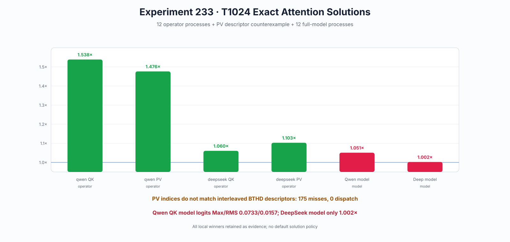

## 251. Experiment 234：小零件快两成，整辆车只快千分之五

当前profile中最大的未关闭非Attention kernel是BF16 SwiGLU。新候选让每个线程处理4个
BF16值，并为4099这种不整除shape保留tail。第一次测量误把输出分配算进Event，与
profile差一个数量级；换成caller-output API后才重跑正式门。

12进程operator门中，Qwen/DeepSeek快1.249×/1.190×，完整BF16输出bit-identical。
可12进程整模门只有1.0073×/1.0005×；DeepSeek没过事先定义的1.005×。

显式vector operator和测试保留，Auto恢复scalar。这个反例说明下一步必须跨过FFN
operator边界，例如处理grouped GEMM epilogue，而不是继续打磨同一个小kernel。

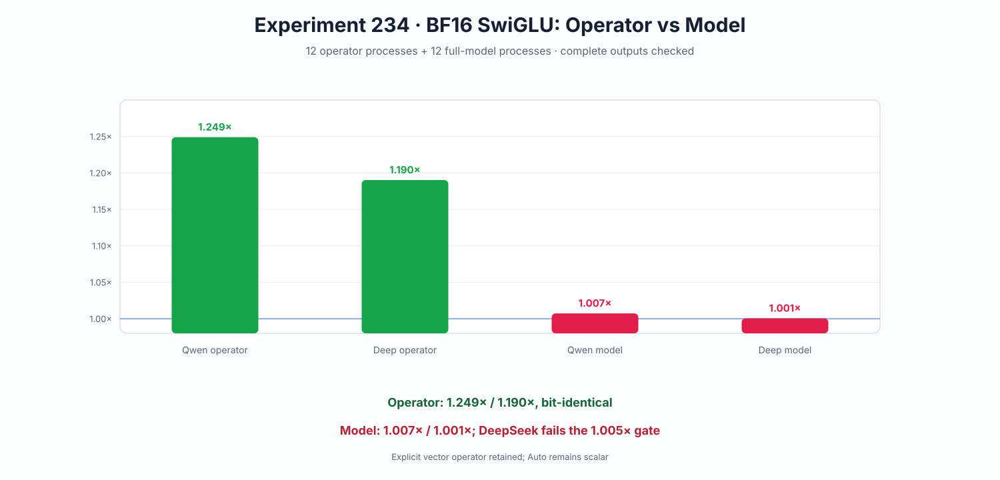

## 252. Experiment 235：把SiLU塞进矩阵乘法，整模还是没变快

本机hipBLASLt支持Swish epilogue，却不支持双输入SwiGLU。候选让gate GEMM直接写
SiLU(gate)，再用一次BF16 multiply与up合并。plan key显式加入epilogue位，避免错用旧plan。

6进程能力门里，两个shape的64个候选全部正确，pointer-stable路径快1.097×/1.069×；
每轮重建plan仍是0.851×/0.862×。这只证明它值得进入整模门。

12进程same-binary A/B中，Qwen只有1.00015×，DeepSeek退到0.99114×；完整logits
Max为0.0973/0.0362。局部速度和数值误差都没有转化成可接受的模型政策。

显式开关保留但默认关闭；BF16 FFN activation局部路线关闭。

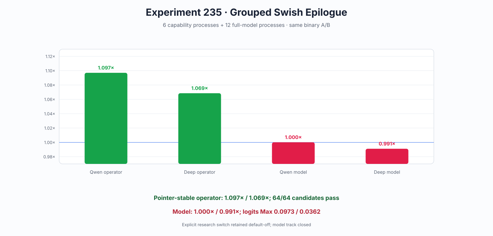

## 253. Experiment 236：不写那张马上要丢掉的FP32表

profile里FP32到BF16 cast仍占4%–6%。FFN的RMSNorm输出会马上被cast进BF16 Arena，
所以新operator保留FP32 reduction和乘法，只把最后store改为BF16。

第一次测试错把CPU reduction当成bit-exact oracle，对少数1-BF16-step差异正确报错。候选
真正替换的是GPU RMSNorm + GPU cast；改用这条reference后，所有shape完整输出位级相同。

6进程正式门中，Qwen/DeepSeek Event加速1.866×/2.070×，wall加速1.399×/1.511×，
计时payload transfer为0。operator准入，模型路由继续关闭，留给下一个独立节点。

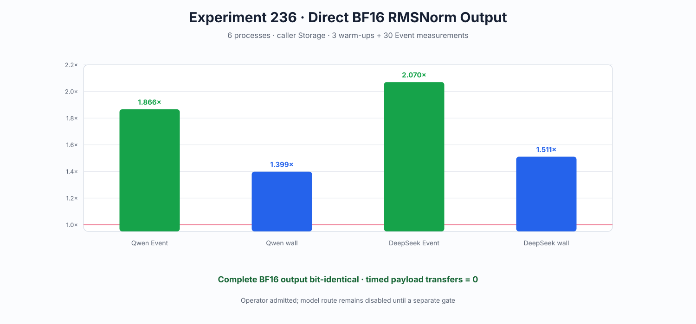

## 254. Experiment 237：这一次，小算子收益真的进了整模

只在BF16 FFN Arena命中且没有详细trace时，FFN Norm直接写`workspace.input_bf16`，
再用`bf16_ffn_precast_out_`跳过cast。cached、training、trace和bypass都不变。

第一版bypass fallback会再查一次Arena，现有测试通过计数器抓到双重记录；修复后一个
请求只做一次决策。

12进程same-binary门中，Qwen/DeepSeek快1.0122×/1.0092×，完整logits Max/RMS都为0，
峰值不变，allocation刚好减120/140。未显式传flag的Qwen运行也报告路由已启用。

BF16 FFN Arena现在默认使用该路径，显式`false`保留为反驳门。

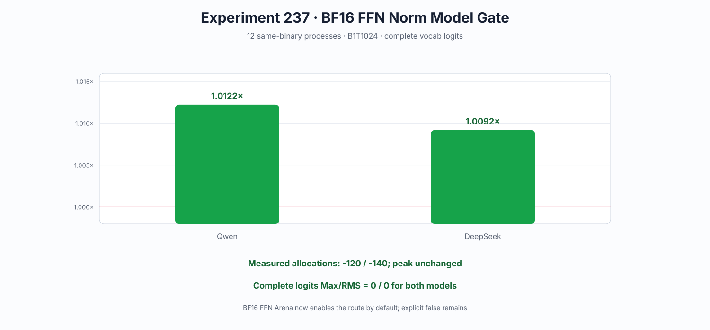

## 255. Experiment 238：默认路径变了，性能地图也要重画

四个rocprof进程用`(six-one)/5`排除加载和plan setup，并强制检查FFN Norm默认已启用。

Qwen/DeepSeek Kernel时间从8.315/14.862 ms下降到8.208/14.659 ms，cast调用从
96/112降到72/84，正好每层少一次。GEMM占比升到60.9%/68.2%。

剩余cast中的下一个可分离问题是Attention Norm直入QKV Arena。下一节只改这一个边界。

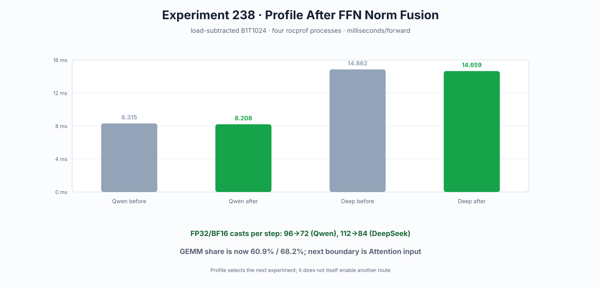

## 256. Experiment 239：Attention Norm也直接写入BF16 Arena

A/B两边都保留FFN Norm默认收益，只切换Attention Norm是否直入QKV Arena。
precast API检查全部workspace和alias，bypass也只做一次cache决策。

12进程里Qwen/DeepSeek为1.01309×/1.01303×，完整logits Max/RMS为0，allocation减
120/140，峰值减3,670,016/6,291,456 bytes。

BF16 QKV Arena现在默认开启该路径，显式`false`保留。

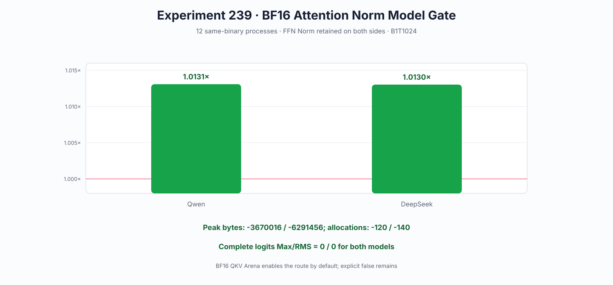

## 257. Experiment 240：每层cast只剩一进一出

同时验证FFN和Attention Norm默认开启后，四进程profile得到Kernel 8.069/14.489 ms，
cast 48/56。每层恰好各剩一次FP32→BF16和BF16→FP32。

下一节先归因这两个边界，不从kernel名称直接跳到新融合。

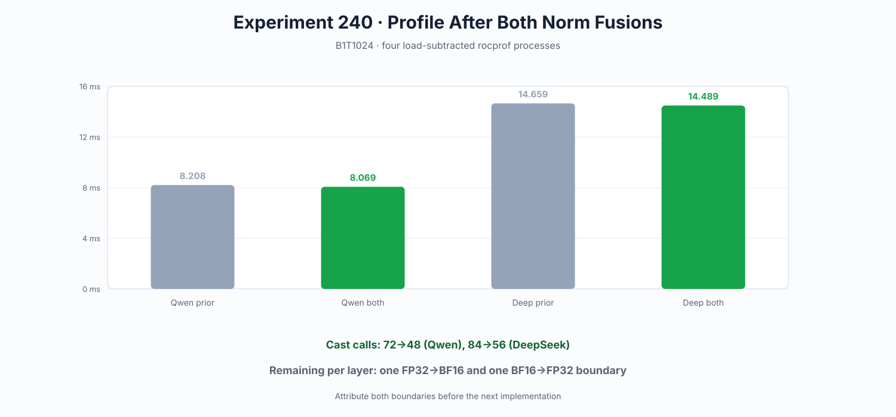

## 258. Experiment 241：P×V直写BF16在能力门就停下

剩余FP32→BF16归因到Attention context进入O projection。最小候选只改P×V输出dtype，
但普通BTHD和zero-stride GQA都返回hipBLASLt status 6。

0个case计时，0个模型路由，临时API已撤回。后续若重开，必须换kernel/consumer。

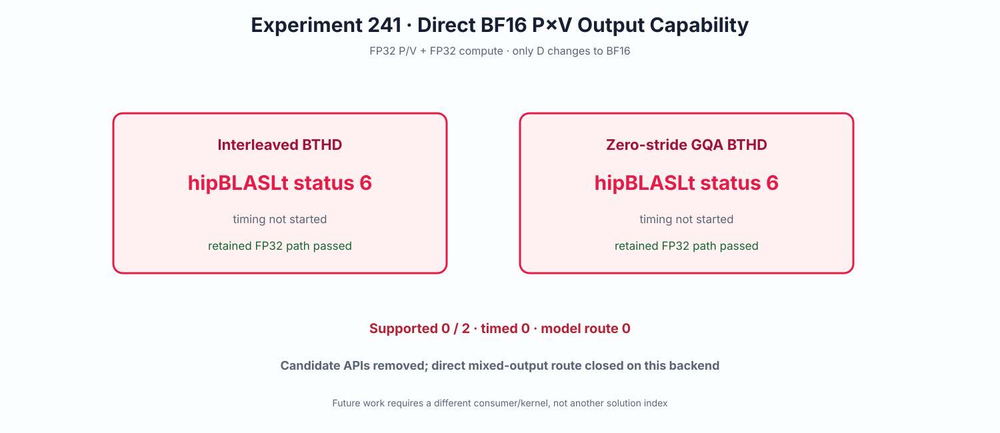

## 259. Experiment 242：反向mixed-dtype也在能力门停下

这次保留BF16 V，probabilities、compute和context仍是FP32。BTHD/GQA两种布局仍均返回
status 6，0计时、0模型路由，临时API撤回。

剩余一进一出的vendor mixed-dtype捷径全部关闭。

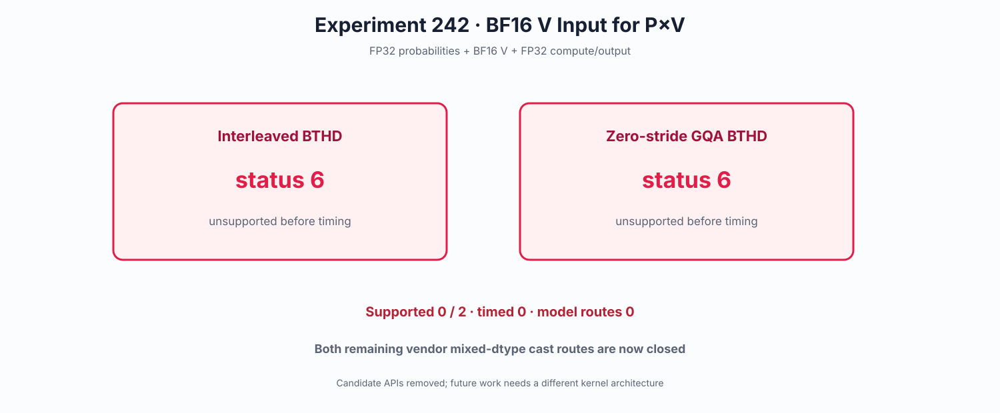

## 260. Experiment 243：给当前局部搜索画一条边界

两次保留的cast只占Qwen/DeepSeek Kernel时间2.694%/1.841%。即使免费删除，
Kernel-only上限也只有1.0277×/1.0188×。

再把相邻六条已由整模反例或能力门关闭的路线放在一起，结论不是“推理完成”，而是
“当前默认路径的局部旋钮已经不值得继续调”。下一轮必须进入新的custom kernel、
graph-wide融合或新后端/硬件矩阵。

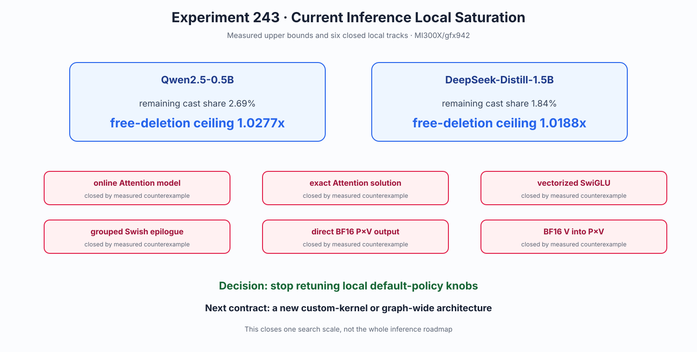

## 261. Experiment 244：用当前二进制重画训练地图

新的自动runner采了四个隔离进程。Qwen/DeepSeek稳定Kernel时间是31.327/71.873ms，
GEMM占58.56%/63.43%，AdamW占13.22%/18.16%。

相对Experiment 216，整步Kernel时间改善1.0252×/1.0144×，但热点排序没有翻转。
所以下一轮继续进入训练GEMM或graph-wide架构，不重新拨AdamW阈值。

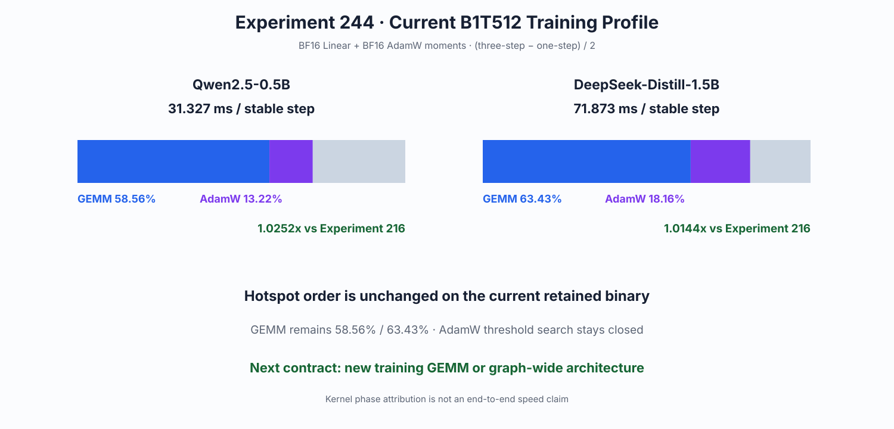

## 262. Experiment 245：低精度梯度只在大shape上划算

候选计时把input cast+transpose和dY cast全部算进去。18个进程显示，Qwen/DeepSeek
gate/up达到1.459×/1.890×，但query/KV只有0.718×–0.976×。

因此正式API和PyTorch对齐测试可以保留，但模型开关只能覆盖gate/up且默认关闭。
下一节必须用完整模型证明局部胜出没有被分配、cast或精度代价吃掉。

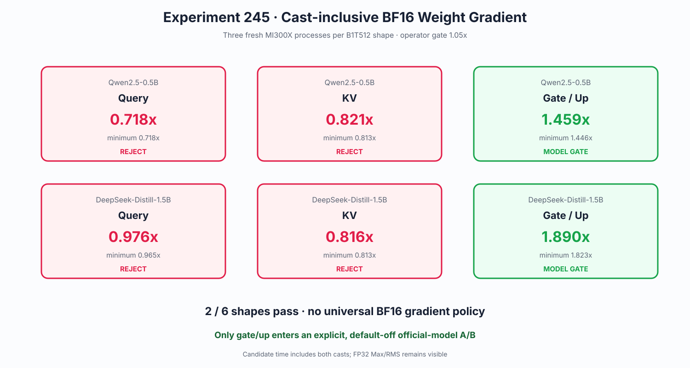

## 263. Experiment 246：局部胜出终于穿过完整模型

只切换gate/up weight gradient后，Qwen/DeepSeek端到端训练达到
1.0213×/1.0638×，峰值不变，48/56次路由与loss门全部通过。

这仍不是默认准入：每两步多192/224次逻辑分配，而且两步训练太短，不能证明长期质量。
下一节增加逐步loss和gate/up参数误差轨迹。

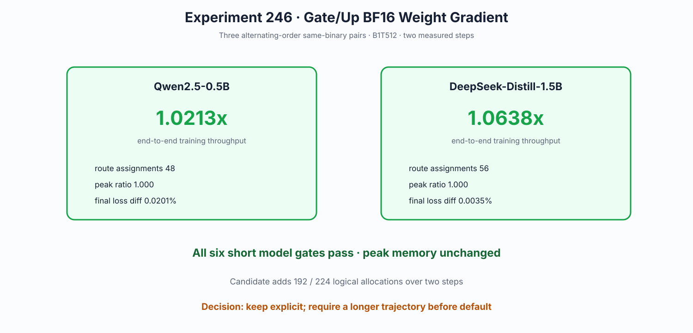

## 264. Experiment 247：短跑胜出被二十步推翻

Qwen长跑只剩1.0006×；DeepSeek仍有1.0528×，但两模型完整Parameter Max都失败，
Qwen的loss和Parameter RMS也失败。五个聚合门只有峰值通过。

因此删除模型接线和候选runner，保留独立算子与通用证据工具。这个反例说明短A/B只能
进入下一门，不能直接成为默认。

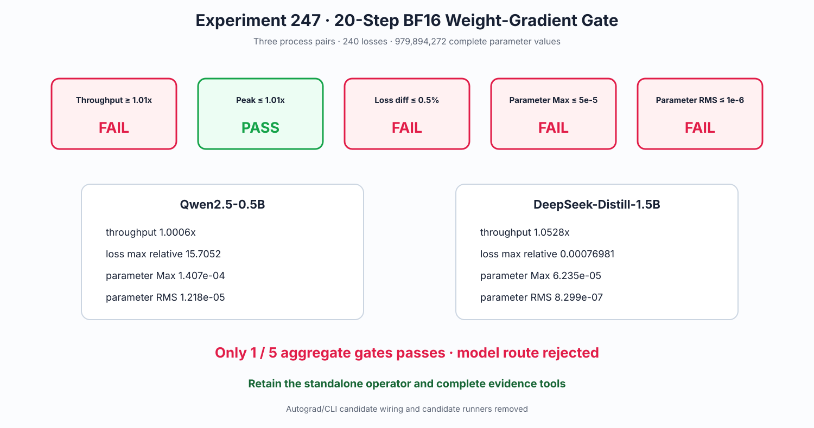

## 265. Experiment 248：逻辑分配多，不等于显存真的多分配

Qwen/DeepSeek每次route恰好多两块Storage，字节数正好等于input cast+transpose和dY cast。
但backend allocation、peak和cached bytes增量全部是0，额外调用全被cache reuse吸收。

所以暂时不能凭allocation calls设计workspace。下一节直接测allocating与preallocated的
wall/Event差异。

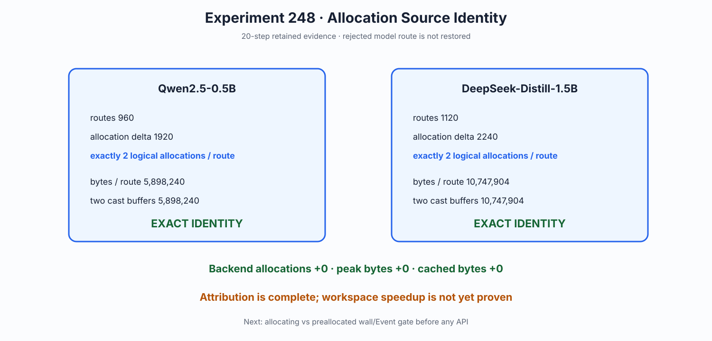

## 266. Experiment 249：预分配也要过整段wall门

公共API已经只做cache reuse，但preallocated的Qwen/DeepSeek wall仍只有0.986×/0.889×；
DeepSeek Event也更慢。0/2 shape过门，所以不增加workspace API。

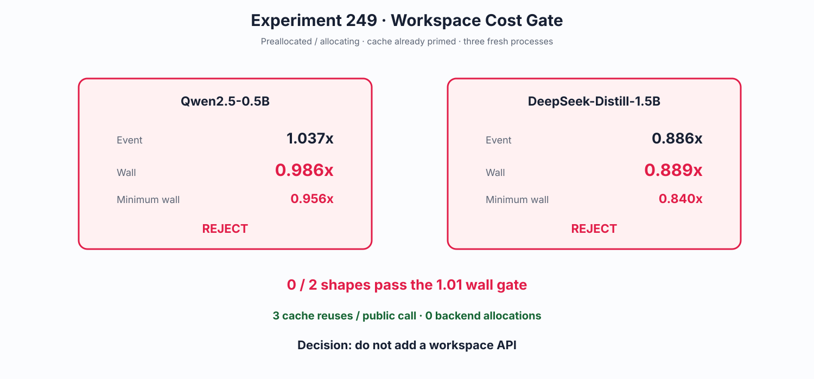

## 267. Experiment 250：训练局部搜索也要有停止门

当前GEMM和AdamW占绝对多数；cast免费删除上限只有1.0332×/1.0277×。Grouped、packed、
exact-index、optimizer Graph、BF16长轨迹和workspace六条相邻路线已关闭。

所以停止局部默认策略调参。下一阶段进入新kernel/graph尺度，或回到课程主线中的production
data-parallel reducer。

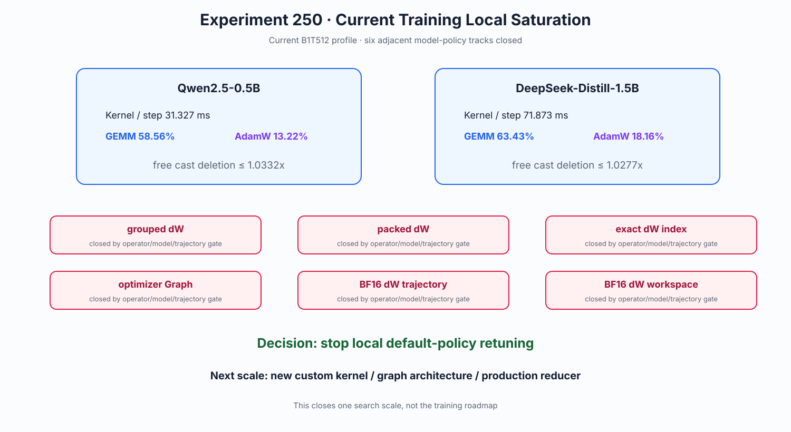

## 268. Experiment 251：多卡先分清“训练”和“审计”

当前双卡14/14通过，20-step参数差为0。steady total 2.290ms中，通信0.350ms，而没有单列的
全参数host一致性检查约0.305ms，占13.32%。tiny模型只有一个bucket，不能证明overlap。

因此第一个production节点先增加verification_ms和检查interval，默认语义不变。

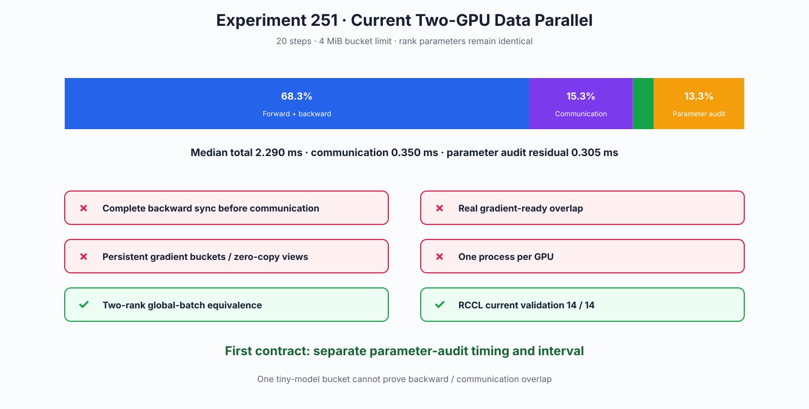

## 269. Experiment 252：默认检查保留，性能测量显式变稀

每步、末步、关闭三种审计的20-step loss完全相同。末步审计相对每步1.244×，关闭为1.175×。
更重要的是，optimizer完成等待已从host审计中拆出，跳过检查不再改变step生命周期。

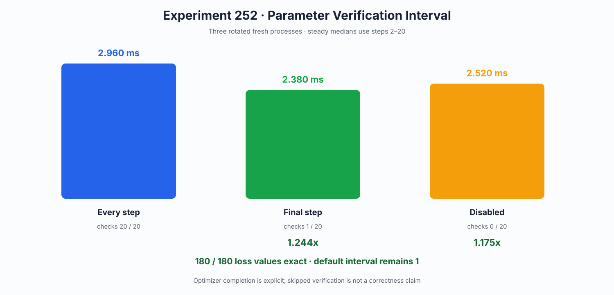

## 270. Experiment 253：没有多bucket，就没有真实overlap问题

tiny在4KiB和4MiB下都只有一个bucket；人为切成12个bucket后，通信从0.34–0.39ms升到
1.18–1.26ms。240个loss完全一致，差异纯粹来自通信/pack颗粒度。

因此下一步增加Model-S自然多bucket workload，而不是在tiny上制造overlap。

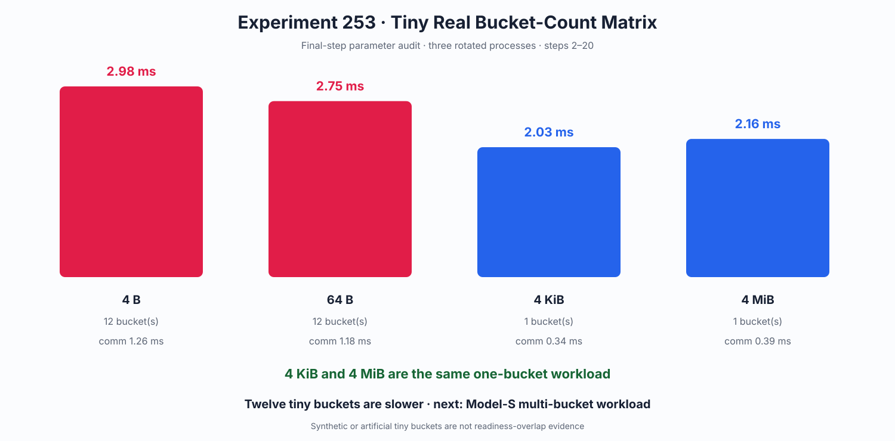

## 271. Experiment 254：Model-S终于给出自然多bucket

25MiB产生3个bucket并以19.76ms胜出；4MiB的12bucket是28.29ms，1MiB的45bucket为21.76ms。
三bucket每卡peak比4MiB多54.3MB。45bucket胜12bucket也说明count不是唯一解释。

下一节先记录pack/unpack copy和temporary恒等式，再设计gradient view/readiness。

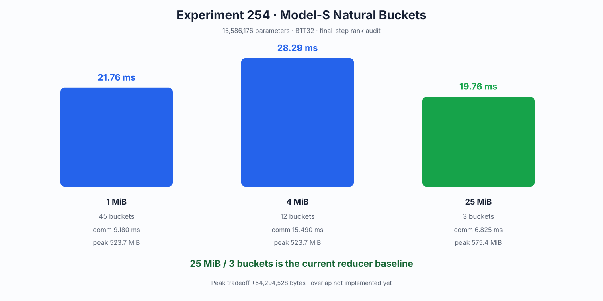

## 272. Experiment 255：一次通信为何申请126个Tensor

3bucket路径包含6个rank-local bucket、6个average输出和114个unpacked gradient；每步还做
228次D2D copy。374,068,224临时字节与allocation ledger完全相等，且126次全是backend申请。

因此persistent reducer有真实证据。第一步先把average改为原地，保证bucket地址稳定。

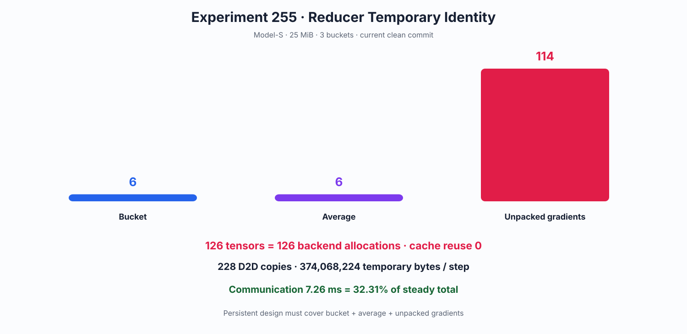

## 273. Experiment 256：average原地做，bucket地址终于稳定

原地average删除6个Tensor和124,689,408临时字节，communication 1.269×，Model-S total
1.107×，peak不变，30个loss与末步参数完全一致。

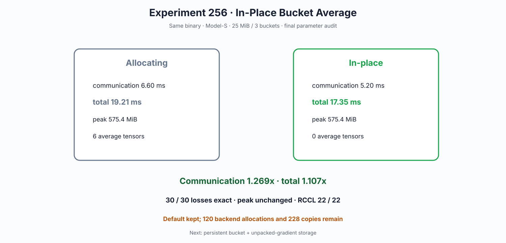

## 274. Experiment 257：地址复用变快了，但显存账单必须写出来

move-only plan在第一次真实backward后建立6个bucket和114个unpacked gradient Tensor。
后续step只pack、all-reduce、原地average和unpack，communication backend allocation从120
降到0。三轮交错同二进制A/B里，communication从7.070降到4.205ms（1.681×），total从
21.025降到16.360ms（1.285×）；30个loss与6次末步rank参数检查完全一致。

但“更快”不是完整结论。plan让live增加124,689,408B、peak增加157,958,408B，因为它长期
持有两套梯度表示。因此保持显式、不设默认。下一步让parameter gradient直接成为reduced
bucket的连续view，删除114个Storage和114次copy，再看速度与显存是否同时改善。

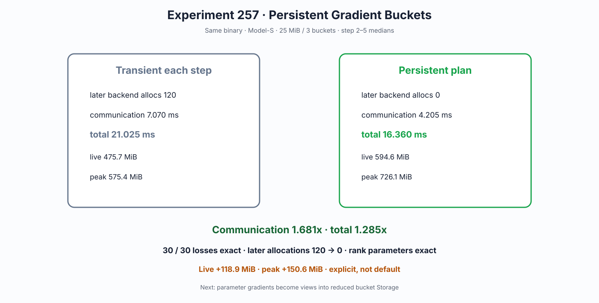

## 275. Experiment 258：gradient本来就可以是bucket的一段

每个parameter仍看到自己的shape和连续stride，但其Storage改为reduced bucket，offset是此前
参数元素的前缀和。这样114个unpacked Storage和114次D2D copy同时消失，plan容量从
249,378,816减半到124,689,408B。

三策略轮换A/B中，view相对persistent-copy的communication/total为1.131×/1.067×，相对
transient为1.937×/1.367×；45个loss和9次末步参数检查完全一致。live已经等于transient，
但peak仍多33,269,000B，因为backward仍先创建普通gradient，再做114次pack。

所以仍不设默认。下一节让Autograd从一开始就向bucket view累加，目标是同时删除pack copy和
双表示peak，而不是用更快的communication掩盖backward内存。

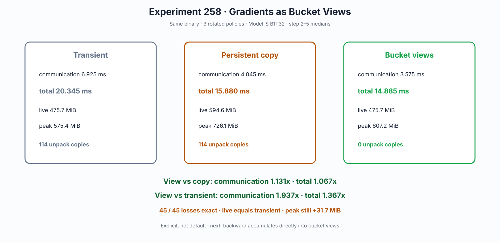

## 276. Experiment 259：copy全没了，为什么total还是更慢

我们先把persistent bucket清零，再把114个parameter leaf的gradient设成对应view。backward后
地址/shape/offset必须不变，reducer直接all-reduce，不再pack。通信确实从3.585降到1.650ms，
相对view为2.173×，peak也少13.2MB。

但当前producer仍先生成普通gradient Tensor，leaf target随后再launch add。于是
forward/backward从10.400升到12.535ms（只有0.830×），total从14.900升到15.035ms（0.991×）。
45个loss和9次参数门完全一致，所以这是很干净的性能反例。

模型route撤回。leaf accumulation target作为独立模块保留，但只有某个producer能直接写目标
地址、同时删除临时output与leaf add，并在operator Event/wall过1.05门，才允许重新接模型。

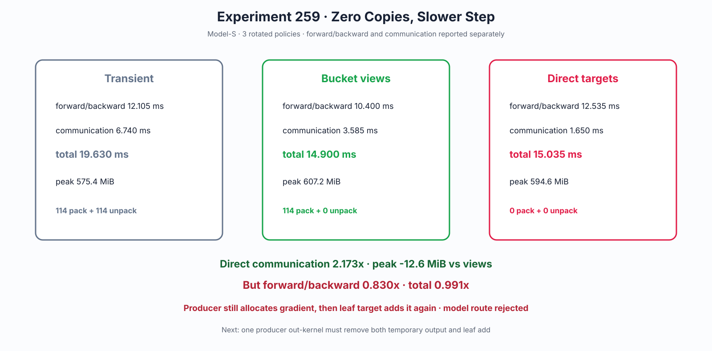

## 277. Experiment 260：不是预设target，而是producer必须直接写target

新`matmul_weight_gradient_out_`计算rank-2 `input^T @ dY`并直接写caller-owned Tensor。
baseline是allocating producer再做leaf add，candidate删掉两者之间的临时Tensor和add。

Model-S head/FFN/Attention T32、head T512和tiny共5个shape、15个fresh process全部位级一致，
logical allocation每次1→0。Event提高1.178×–1.873×，Wall提高1.101×–1.612×，连tiny反例也
过1.05门；CPU、HIP、PyTorch oracle同时通过。

这只准入scoped Autograd门：right leaf必须是显式零初始化、fresh且尚无贡献；任何重复使用、
非leaf、非连续或已有值都回到普通accumulate。还没有模型或DDP route。

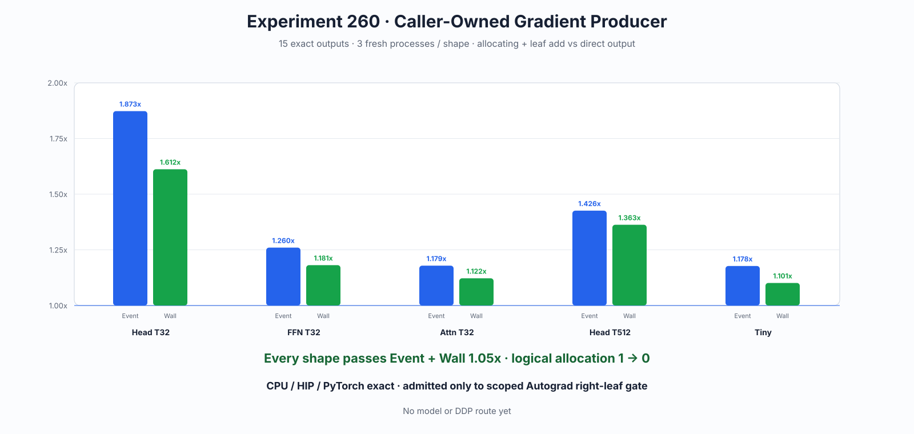

## 278. Experiment 261：普通first assignment已经没有leaf add

把同一producer接入已构建graph的重复backward后，15个gradient仍exact、target地址保持，每次
logical allocation少1。但5个shape没有一个同时过Event/Wall 1.05：Event范围0.976×–1.035×，
Wall 0.991×–1.018×。

原因和上一反例不同。普通Autograd的第一个leaf contribution直接接管producer Tensor，本来就
没有leaf add；scoped candidate只省了已被cache吸收的逻辑allocation，同时引入target状态管理。
因此撤回Autograd dispatch、overwrite/zero target与runner，保留独立caller-owned operator。

下一步不再做leaf微优化，先记录Model-S两个rank的gradient-ready顺序，证明自然bucket是否真的
有机会在backward结束前开始通信。

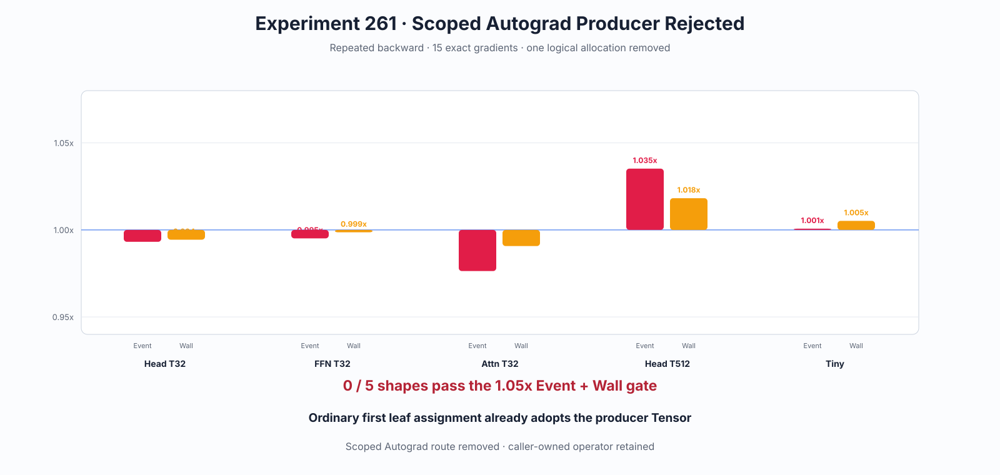

## 279. Experiment 262：先证明bucket什么时候ready，再谈overlap

hook不是在parameter第一次收到gradient时触发，而是backward预先统计leaf所有入边，最后一条
贡献累加完成入队后才记录。Model-S三个进程、每个3step、两个rank共18条order完全一致，57个
parameter恰好按注册顺序逆序ready。

25MiB自然bucket 2只有output head，在1/57完成；bucket 1在35/57完成；bucket 0包含embedding和
前半blocks，直到57/57。两个bucket因此具备backward内结构性通信窗口。

这还不是性能结果。下一步才记录compute Stream Event，让communication Stream等待并异步
all-reduce，同时保留同步control和最终optimizer前wait。

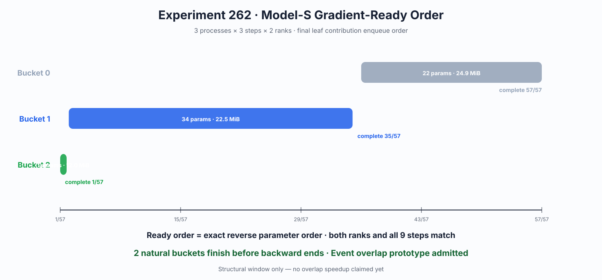

## 280. Experiment 263：结构窗口变成了1.59%的total收益

两个rank的bucket都ready时，各自default Stream记录Event；communication Stream等待后pack，
enqueue RCCL sum和原地average。optimizer前只做一次finish wait。step 1同步建plan，后续step
全部3 bucket异步enqueue。

三策略9进程中，overlap total为14.790ms，同步views为15.025ms，只有1.0159×；finish wait从
3.560降到1.550ms（2.297×），peak与sync view相同。45个loss和9次参数门全部通过。相对
transient虽然total 1.382×，peak仍多33.3MB。

所以显式保留但不默认。单进程按rank0→rank1顺序backward，天然压小了窗口；下一步必须先做
one-process-per-GPU的rank/unique-ID/timeout/故障合同。

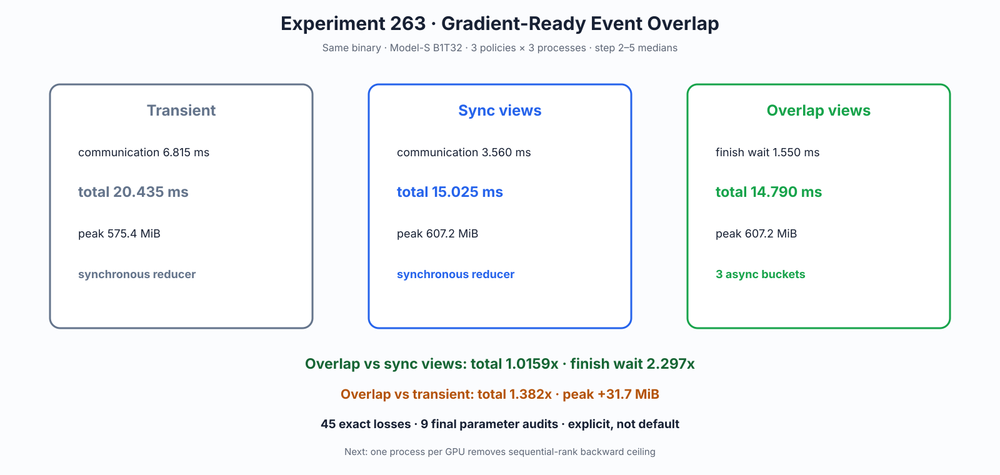

## 281. Experiment 264：每张GPU终于由独立进程负责

rank0生成opaque RCCL ID并原子发布文件，rank1有限时等待；每个进程只有一份tiny模型、AdamW和
本地GPU。三个fresh launch共6个rank、18个rank-step，12个Tensor/728个值跨rank位级一致，
相对CPU global batch最大差1.19e-7。

故障门把rank1改成非法rank2：它返回1，rank0已进入RCCL init等待；launcher检测peer失败后发送
SIGTERM，返回-15，组没有永久挂起。rank-group初始化+训练median约5.27s，只是bootstrap成本，
不是吞吐结论。

当前每个parameter各发一次collective。下一步先做rank-local同步bucket，保持等价/timeout合同，
再把ready Event overlap迁移过来。

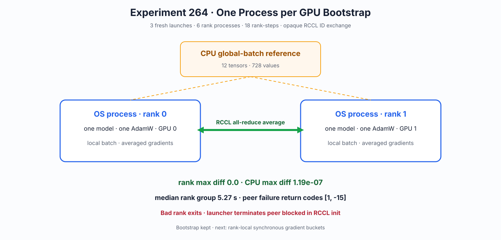

## 282. Experiment 265：collective少12倍，wall只快0.37%

rank worker增加同步bucket：pack、RCCL average、unpack都在本rank communication Stream顺序执行。
tiny的12个参数、728元素放进一个4KiB bucket，三步collective/rank从36降到3。

两策略各三次fresh双进程launch中，bucket组时间5268.46ms，逐参数5287.78ms，仅1.0037×；参数、
CPU和peer failure全过。绝大多数时间是进程、ROCm、RCCL启动，因此只保留正确性baseline。

下一步用Model-S B1T32 one-step：逐参数57次collective，对比25MiB自然3 bucket，再决定persistent
rank bucket和ready overlap迁移。

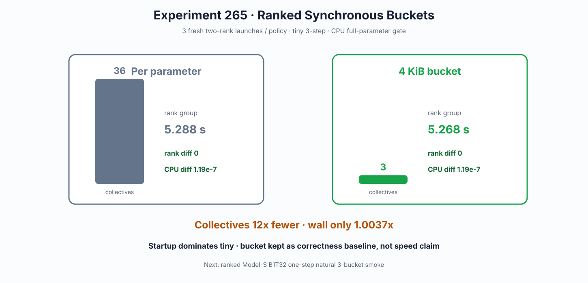

## 283. Experiment 266：collective少19倍，为什么还不能说通信快了

Model-S `B1×T32/rank`终于让两个独立进程拥有真实多bucket负载。25 MiB把57个参数分成3个
bucket；两策略各三个fresh进程组，逐项比较全部15,586,176个参数值与CPU `B2×T32`参考。

Reducer中位数从54.51ms降到32.48ms，表面是1.678×；但bucket三次为19.55、32.48、
158.52ms，CV高达89.3%。完整训练只从5657.56ms到5648.32ms（1.0016×），组wall也只有
1.0023×。图中保留min–max，不能只展示好看的中位数。

rank间Max/RMS为0，CPU Max/RMS为0.0062738/3.483e-6，loss均值差9.555e-7；peer failure仍
能终止等待rank。这个节点证明bucket语义和测量边界，不能证明steady通信加速。下一实验在同一
fresh进程中记录多步，单独标记第一步cold，再决定persistent Storage或ready overlap。

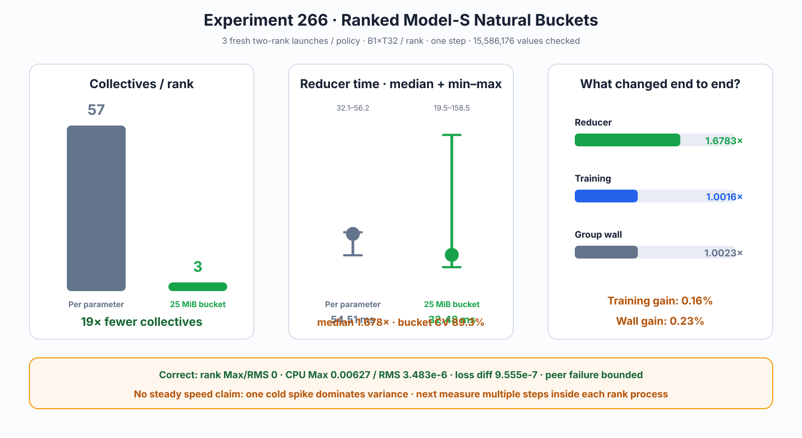

## 284. Experiment 267：第一次看起来快，后面为什么反而慢48%

这次每个fresh双rank进程连续跑三步，不扔掉第一步，而是明确标记cold；步骤2–3构成每策略
6个steady样本。结果发生反转：cold bucket快1.321×，steady bucket却只有`0.6747×` Reducer
speedup，完整step也只有`0.8527×`。

逐参数steady Reducer为2.837ms，transient bucket为4.205ms；bucket用时多48.2%。完整step
从8.864ms变成10.396ms，用时多17.3%。bucket steady CV仅2.72%，不是一次坏运气。

计数解释了反例：每个steady bucket step仍做60次backend allocation、分配124,689,408 bytes，
再做57次pack和57次unpack；逐参数路径这些计数为0。collective从57变3是真的，但临时Storage
和114次copy更贵。

三步完整参数、CPU、loss和peer-failure门全过。transient bucket继续作为可读正确性路径，性能
解释被拒绝。下一实验只把bucket/unpack Storage变成persistent，先证明warmup后60次后端分配
归零，再谈通信重叠。

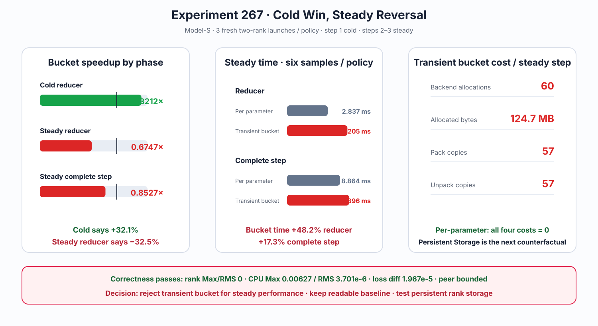

## 285. Experiment 268：分配归零以后，显存账单是多少

`RankGradientBucketPlan`第一次为3个bucket和57个输出gradient准备Storage，后续step复用地址。
三策略各三个fresh双rank进程中，persistent warmup后的backend allocation从60降到0。

相对transient bucket，persistent Reducer从4.440ms降到2.886ms（1.539×），完整step从
10.311ms降到8.251ms（1.250×）。相对逐参数，完整step是1.056×，但Reducer仍是0.933×，
说明57 pack + 57 unpack仍有成本。

显存账单同样明确：plan容量124.69MB/rank，current比两条控制多62.34MB；peak比逐参数多
124.69MB、比transient多72.38MB。速度改善不能把这部分藏起来。

三步参数、CPU、loss与故障门全过。persistent copy显式保留、不默认。下一实验不改collective，
只让57个gradient成为bucket view，删除独立unpacked Storage和57次unpack，再看能否同时改善
Reducer与显存。

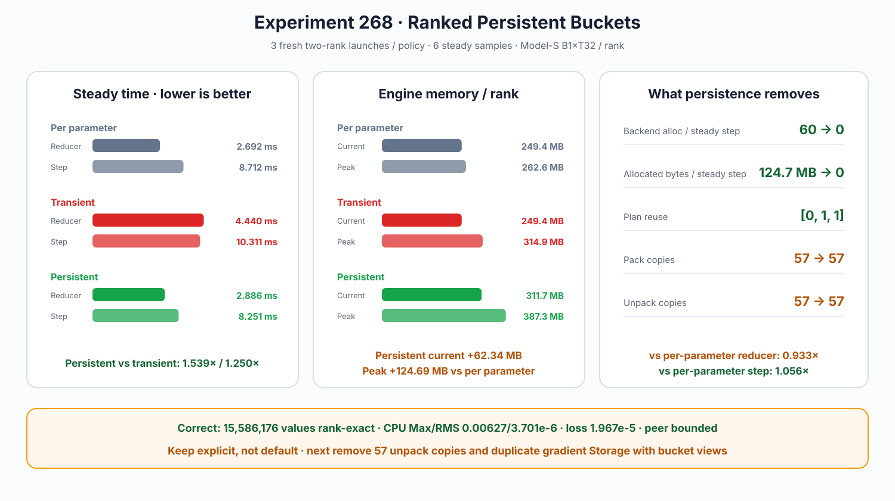

## 286. Experiment 269：不复制输出，只换一种Tensor解释

bucket-views不再为57个输出gradient分配独立Storage。每个gradient只是3个bucket之一的连续view，
shape、stride和offset在plan第一次建立时固定。后续step仍pack 57次并做3次collective，但unpack
从57降到0。

四策略各三个fresh双rank进程中，views相对persistent-copy Reducer/完整step为
1.120×/1.006×，相对transient为1.763×/1.274×。相对逐参数Reducer略慢（0.984×），完整step
为1.055×。

plan容量从124.69MB减半到62.34MB，final current回到逐参数的249.38MB。peak仍是324.93MB，
比逐参数多62.34MB，但比persistent-copy少62.34MB。内存并没有被一句“共享Storage”带过。

24个rank进程的完整参数、CPU、loss和故障门通过。views显式保留、不默认。现在单进程阶段已经
证明前两个自然bucket有ready窗口，下一实验终于可以把Event + ready-bucket enqueue迁移到真正
one-process-per-GPU路径。

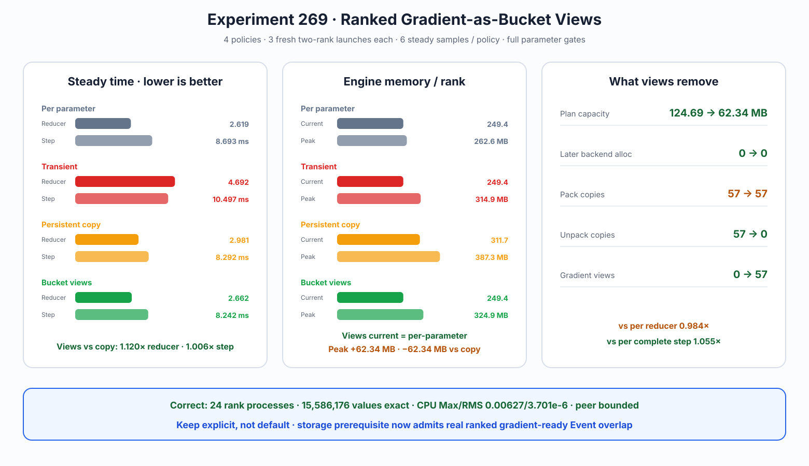

## 287. Experiment 270：最后等待快2.18倍，训练为什么只快0.52%

两个独立rank现在都在backward期间按固定`bucket 2→1→0`顺序进入RCCL。default Stream记录
ready Event，communication Stream等待后pack/all-reduce，optimizer前只等通信尾部。

效果局部很明显：同步views finish wait 3.080ms，overlap只要1.413ms，改善2.180×。但工作没有
消失，它的一部分移进了backward host区间：5.257ms变成6.456ms，增加1.199ms。完整step最终
只从8.195ms到8.152ms，即1.0052×，未过1.01门。

allocation仍为0，current/peak完全相同；每个steady step overlap 3个bucket，30个rank进程的
完整参数、CPU、loss和peer failure全过。正确不等于值得默认。

overlap实现作为显式教学/研究入口保留，Model-S T32 ranked reducer局部搜索关闭。下一实验必须
改变context尺度，至少比较T32/T128；不能继续在同一T32数据上微调计时边界。

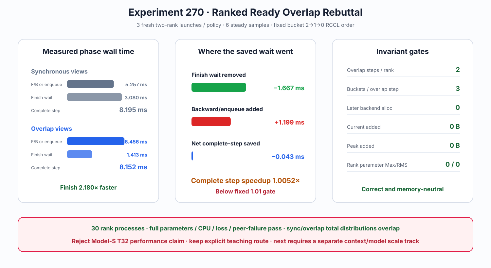

## 288. Experiment 271：同一套overlap，为什么T32没用、T128快9.2%

这次不改代码路径，只改变context。T32/T128分别比较同步views和overlap views，每个组合三个
fresh双rank进程、6个steady样本。

T32同步/overlap为8.015/8.019ms，ratio `0.9995×`；T128为9.289/8.504ms，ratio
`1.0923×`。两尺度finish都快约2×，区别在backward/enqueue added：T32是1.178ms，T128只有
0.466ms，后者留下真正的端到端收益。

T128同步CV为6.80%，所以我们做了敏感性检查：完全删除最慢的process_run 1，同步/overlap仍为
9.093/8.504ms，`1.069×`，继续过1.01门。不是单个异常值制造的结论。

两尺度current/peak增量都是0；T128完整参数、CPU Max/RMS `0.003842/2.595e-6`、loss与故障门
通过。结论是context-selective：当前Model-S/two-MI300X/25MiB轨道T32同步、T128 overlap。
它不是其他模型/GPU/world size的一般默认。

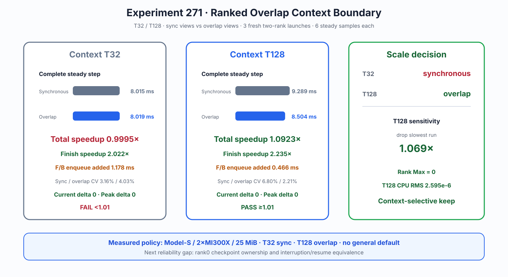

## 289. Experiment 272：恢复的是权重，还是同一次训练

两个rank先跑2步，完成optimizer和barrier后只有rank0写checkpoint。它包含模型、AdamW两组moments、
optimizer step、global step、data cursor、seed和配置。rank1不写，只等`step=2` marker并读取验证。

新的两个rank恢复后再跑3步；控制组从同一seed不中断跑5步。两个final checkpoint都是10,796
bytes且逐字节相等，所有rank/轨迹参数最大差0。这比“加载后还能运行”强得多。

故障实验让rank0在barrier后、写文件前返回1。marker不会出现，launcher终止等待rank1，返回−15；
checkpoint、ready、tmp和communicator ID均没有残留。第一次5秒故障门被进程启动抢先触发，修正
为15秒后才证明根因来自写失败。

这是可靠性证据，不是I/O性能结论。下一节点使用Model-S完整model+moments，记录实际checkpoint
大小和恢复时间，并在验证后删除大文件。

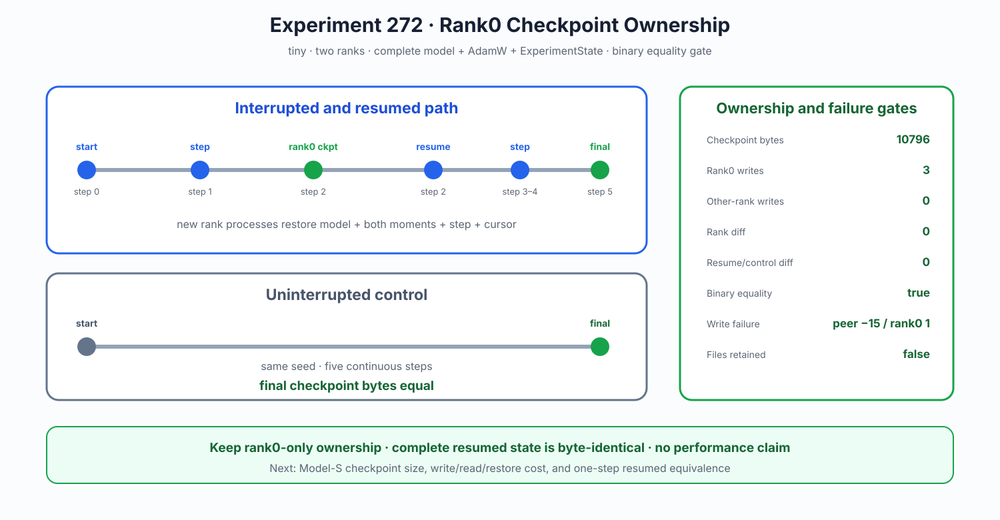

## 290. Experiment 273：完整Model-S状态有多大，恢复要多久

Model-S有15,586,176个FP32参数。完整checkpoint还要保存AdamW first/second moments，所以文件为
187,042,096 bytes，约178.4MiB，不是一个62MB权重文件。

两个rank跑1步后rank0写中断点；新rank恢复再跑1步，对照不中断2步。resumed/uninterrupted final
checkpoint逐字节相等，三组57个Tensor/15,586,176值跨rank Max/RMS均0。

当前环境三次写为1.022–1.068s，rank1等待最大1.069s，checkpoint读取验证最大532ms，两个rank
load+restore最大740ms。它们是单次资源记录，不是磁盘性能排名。

成功后所有187MB checkpoint、临时safetensors、marker、tmp和ID都删除。失败传播复用共同层的
tiny注入，rank0=1、peer=−15。Model-S checkpoint smoke完成；下一缺口是把worker/launcher从
写死2卡泛化到world-size，并诚实复现当前4卡共享内存边界。

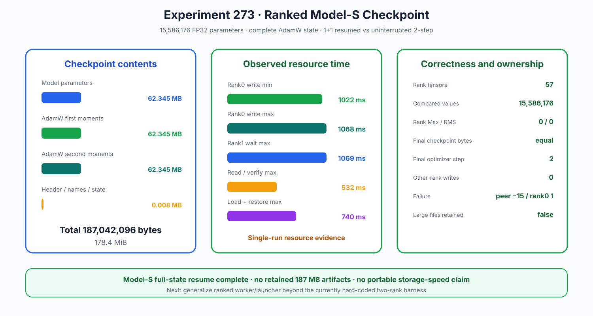

## 291. Experiment 274：有4张卡，不等于4个rank能初始化

worker和launcher不再写死2：可以启动N个进程、生成N份不同local batch、拼CPU global batch并
比较全部rank。world1/2 tiny一步完整门分别通过，CPU最大参数差1.4e-8/6.0e-8。

world4没有被包装成成功。四个进程都在`ncclCommInitRank`返回`unhandled system error`，return
code全是1，组在2.756秒结束，没有挂死。机器暴露4个MI300X VF，但容器`/dev/shm`只有
67,108,864 bytes（64MiB），与之前四卡失败一致。

新增`group-init`模式把环境能力失败变成结构化证据；如果未来初始化成功，它会继续正常训练和
CPU门。结论是：一般world-size接口保留，当前环境world4不可用，绝不写“4卡已支持”。

下一节点用RCCL debug和资源preflight把不透明system error变成可操作诊断，再等待资源变化重测。

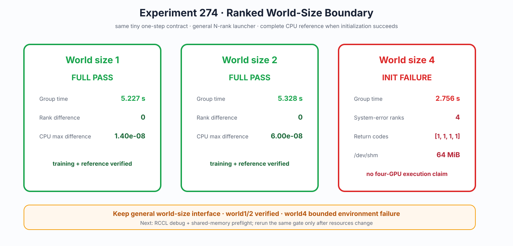

## 292. Experiment 275：RCCL到底在哪一步用完共享内存

按AMD官方troubleshooting建议，我们给每个rank设置独立`NCCL_DEBUG_FILE`，并采集INIT/SHM/NET/
ALLOC。只设`NCCL_DEBUG=INFO`没有stderr输出；加入per-process文件和当前包兼容的日志级别后得到
4份完整日志。

preflight看到4张GPU，world size也为4，但`/dev/shm`总量67,108,864 bytes、启动前只剩
43,724,800 bytes。4/4日志都在创建21,823,872-byte segment时收到`No space left on device (28)`。
RCCL版本是2.28.3。

21.8MB只是某个失败segment，不是四rank总需求；系统仍把required total写成unknown。world2在
同一preflight下完整通过，诊断不会误拒绝可用配置。507,069-byte verbose日志提取后删除。

当前world4仍不声明成功。下一开发节点不等待外部资源，转向两卡可做的uneven local-batch权重
合同；四卡只在共享内存资源变化后重跑同一门。

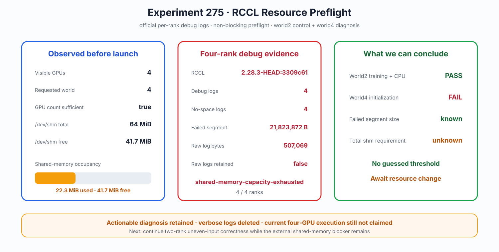

## 293. Experiment 276：一个rank有4个token，另一个有8个，怎样求全局平均

如果每rank loss都是local mean，直接把两个gradient平均会让4-token rank和8-token rank各占一半，
这不等于12-token global mean。默认`equal-only`先用RCCL交换token count；看到4和8后，两rank在
任何参数collective前共同返回1，不允许静默训练。

显式`token-weighted`计算average tokens=6。rank0 gradient乘4/6=0.666666687，rank1乘
8/6=1.333333373，然后做普通RCCL average。结果正好是按12个token加权的global gradient。

tiny三步中，rank参数Max/RMS为0；相对CPU拼接B3，参数Max/RMS为8.18e-8/8.79e-9，local loss
加权与global loss最大差1.94e-7。公式由完整轨迹验证，不只是一张手算表。

weighted ready overlap仍拒绝，因为bucket可能在backward期间、全局scale前已经enqueue。下一节点
只做Model-S同步weighted smoke，不同时改通信时机。

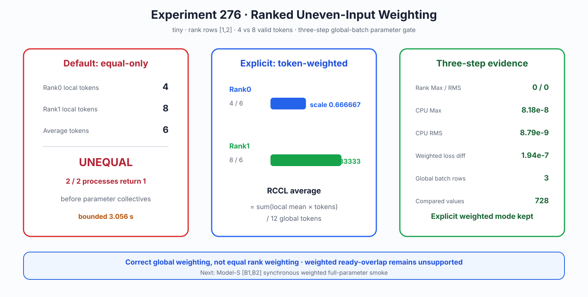

## 294. Experiment 277：同一个权重公式，放到Model-S还成立吗

Model-S T32使用rank0 B1、rank1 B2，也就是32/64有效token。average为48，gradient scale仍是
0.666666687/1.333333373。equal-only先交换count并让两个rank共同拒绝。

token-weighted一步比较57个Tensor、15,586,176个值：rank Max/RMS为0，CPU B3参数Max/RMS为
0.007760/3.639e-6，加权loss差3.20e-7。engine peak 275,790,348 bytes。一步时间被首次初始化
主导，不作性能结论。

同步weighted语义现在从tiny扩展到Model-S。下一问题是顺序：overlap不能等backward结束再scale。
我们需要在leaf ready hook里先scale，再让plan记录Event和pack bucket。

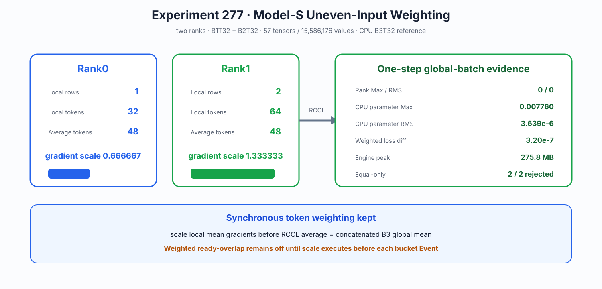

## 295. Experiment 278：通信明明提前了，为什么整步反而更慢

Model-S T128使用rank0 B1、rank1 B2。每个leaf gradient ready时先乘本rank权重，再记录Event并
启动对应bucket通信。三轮同步/overlap最终57个Tensor、15,586,176个值逐项完全相同，CPU
Max/RMS为0.004938/3.218e-6，因此顺序是正确的。

但正确不等于快。finish从2.664ms降到1.381ms，快1.930x；57次leaf scale却让forward/
backward增加1.520ms。steady step由8.954ms升到9.332ms，只有0.9594x。逐轮中甚至有一轮是
1.027x，然而leave-one-pair-out仍全在0.952x–0.973x，不能挑最好的一轮宣布成功。

所以我们拒绝当前性能路由，保留正确性原语。下一次只移动scale位置：leaf不再逐个scale，等
3个bucket各自ready并pack后，在RCCL Stream上每bucket scale一次。若57→3仍不能让整步过
1.01门，weighted overlap优化track就到此关闭。

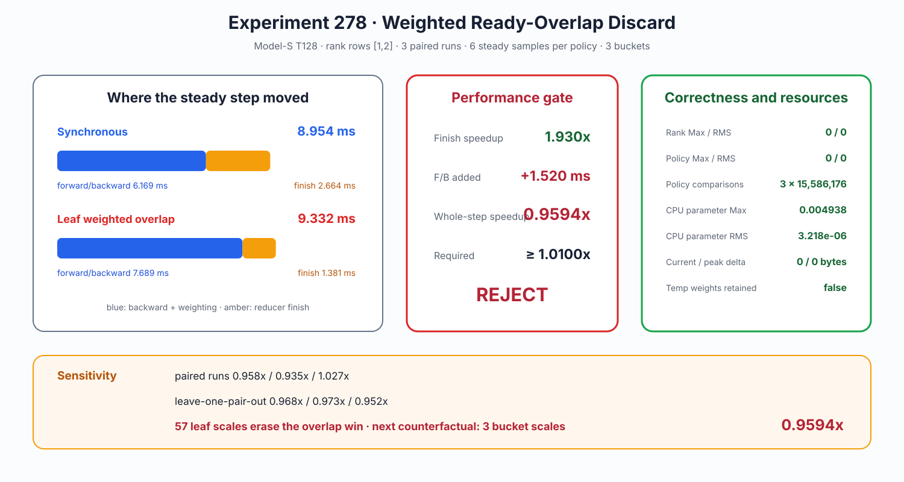

## 296. Experiment 279：不要给57个叶子逐个称重，给3个桶称重

Step 101的数学没有错，粒度错了。新路线让leaf只报告ready；通信Stream等Event、pack完整
bucket，再乘一次local token weight。每步scale因此从57次变成3次。

Model-S T128三轮里，finish从2.771ms降到1.361ms，快2.035x；forward/backward只增加
0.641ms。steady step由9.262ms降到8.687ms，达到1.0661x。三轮策略最终15,586,176个
参数逐项完全相同，CPU和显存门也通过。

我们保留显式T128路由，但不把它写成默认：三轮速度比分别0.951x、1.044x、1.113x，
leave-one最低只有1.0027x。下一步尝试把57次pack copy和3次scale融合为3次持久
gather-scale Kernel；如果数值通过但速度或敏感性不改善，这条局部优化线就停止。

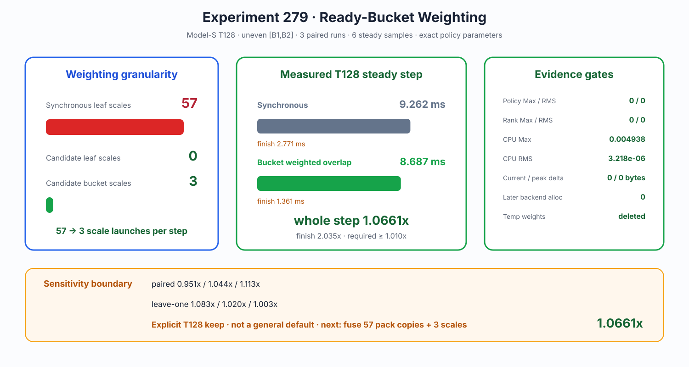

## 297. Experiment 280：少了57次copy，也不代表系统更快

gather-scale把每步57次device copy和3次独立scale变成3次融合Kernel。描述表每步只有1,368
bytes，完整参数、CPU和失败门全部通过。

但steady step只从本轮同步的8.901ms降到8.778ms，即1.0140x。Step 102已经做到8.687ms和
1.0661x；新候选反而慢0.090ms，还多1,368 bytes持久空间与每步描述传输。逐轮有一次0.990x，
leave-one最低1.0078x。

因此“相对同步过1.01”不够，候选没有改善running best，性能路线拒绝。Kernel和显式policy
作为研究原语留下，Step 102仍是当前显式T128最佳。ranked reducer局部优化到此停止，下一步
回到端到端profile重新找主要瓶颈。

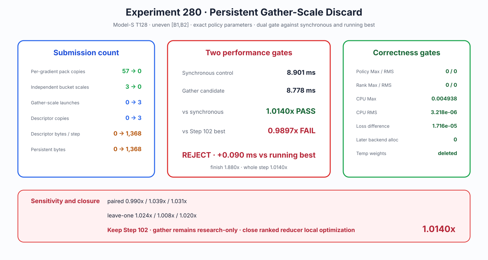

## 298. Experiment 281：当前DeepSeek长上下文差距到底在哪里

T2048/B2/N64当前三对结果是microLLM 133.50 tok/s、PyTorch 163.64 tok/s，即0.8158x；64个
token完全一致。microLLM峰值更低，但速度差距仍在。

1-step/3-step rocprof差分显示，一次完整generation有1.051s聚合Kernel时间。cached Attention
占647.3ms/61.57%，GEMM占270.4ms/25.72%。Attention共1,792次，正好28层×64 token。

allocator不是当前根因：backend allocation增量0，36,963次逻辑申请全部复用。KV store只有
0.65%。`hipMemcpy` API时间会吸收前序GPU等待，也不能被误写成327ms纯复制。

所以Step 105先做score/context微架构矩阵，完整对齐score、probability和context；在算子门
通过前，不改模型默认路由。

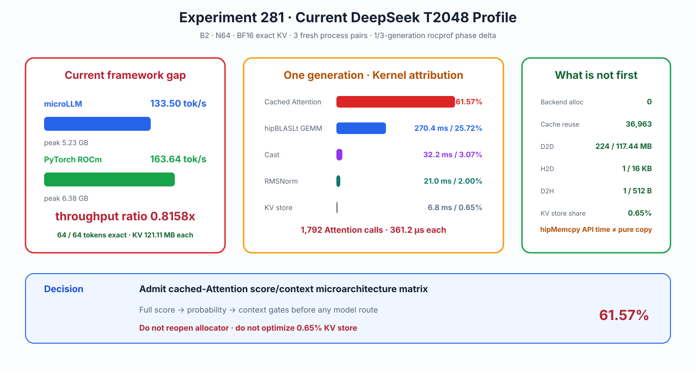

## 299. Experiment 282：拆开的softmax很慢，不等于融合里的softmax也占七成

新的分段工具固定DeepSeek H12/KV2/D128，跑T512/T2048、B1/B2和FP32/BF16 cache。8格各3个
新进程，每项3次热身、20次正式Event/wall测量；24条记录都通过完整score、probability、context
和fused精度门，计时区间没有payload传输或backend allocation。

透明三段中softmax占65.46%–73.56%，T2048约72%–74%。但当前fused比透明pipeline快
2.72x–4.16x，它没有global score/probability，不能把透明比例直接贴到融合Kernel上。BF16 fused
又比FP32快1.313x–1.534x，说明cache流量仍是事实。

当前fused一项`batch × head`只发一个block，B1/B2仅12/24 blocks，而MI300X有304个CU。旧的缩
线程、shared query、pair load和预归一化都已有反例，因此下一步不再排列标量写法，而是测试
split-sequence：多个blocks先算局部max/denominator/weighted value，再用log-sum-exp合并。
T512和B2会直接检验额外partial buffer与combine launch是否抵消占用率收益。

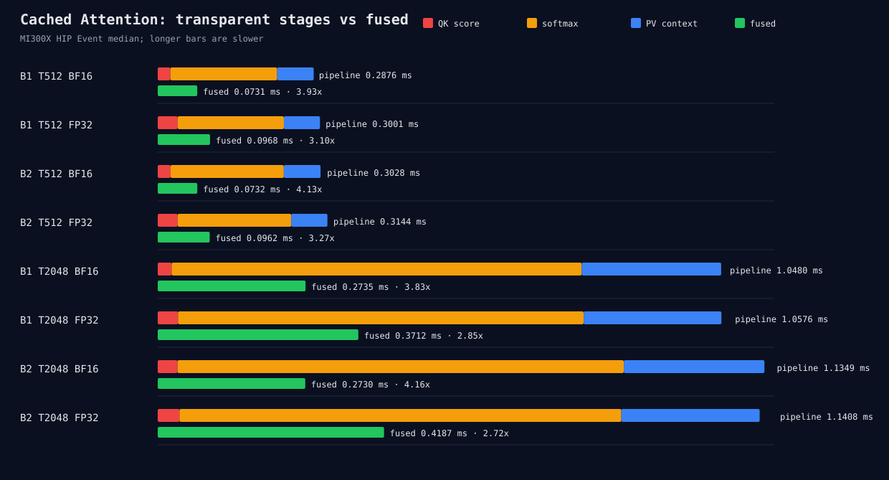

## 300. Experiment 283：把长序列分给更多Block，单算子真的快了

初始S1/2/4/8/16搜索的8个winner都贴在S16上界，所以把边界扩到S32并重跑完整矩阵。最终是
144个新进程、48个candidate、8个shape winner。

T512四格都选S16，Event快2.381x–3.211x；T2048除B2/FP32选S16外，其余选S32，快
5.511x–8.096x。winner wall仍快2.084x–6.988x，最大partial只有399,360 bytes，完整context
Max/RMS最多3.90e-9/1.09e-9。

关键反例是S1八格全输，最低0.546x；它承担两阶段代价却没有增加并行度。S2八格全过1.05，最低
1.185x。S32也不是越多越好，T512和T2048/B2/FP32都会回落。这支持shape相关的block并行解释，
不支持“所有shape固定最大S”。

候选只准入官方DeepSeek模型A/B，默认路由仍不变。下一关是完整logits/token、allocation/peak和
T2048/B2/N64三对fresh process。

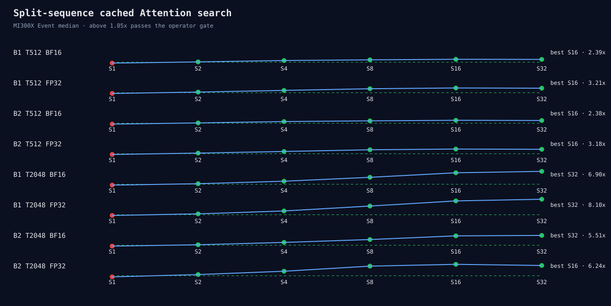

## 301. Experiment 284：快2.22倍，token也相同，还是被精度门拒绝

DeepSeek T2048/B2/BF16/S32/N64三对fresh process中，current中位133.27 tok/s，split为
297.02 tok/s，稳定快2.2223x。峰值和KV bytes不变，64个生成token逐项完全相同。

但每对303,872个完整cached logits都得到同一个Max/RMS：0.05691/0.01370。partial
log-sum-exp改变了归约树，微小context差异经过28层和64步被放大。top-1没变不能替代完整分布门，
所以模型默认拒绝，不能拿表面的1.815x PyTorch比值作胜出声明。

下一反驳实验保留当前归约顺序：第一个Kernel并行物化逐position score，第二个Kernel按旧fused
顺序完成max、softmax和P·V。若logits恢复但global score流量吃掉速度，原解释同样会被推翻。

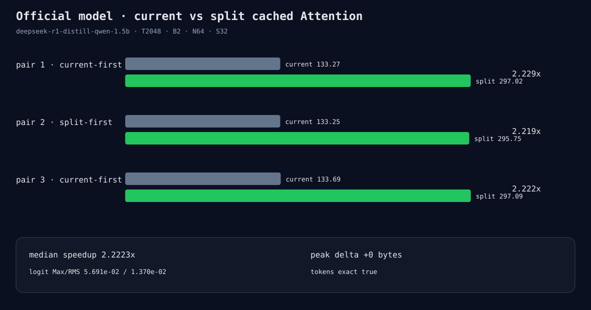

## 302. Experiment 285：只并行QK，完整context终于位级相同

新路径先并行物化每个position score，再用一个finalize Kernel按旧fused的原线程映射完成max、
softmax与P·V。它没有使用partial log-sum-exp，因此不改变归约树。

T512/T2048、B1/B2、FP32/BF16的24进程全部位级相同。Event快1.298x–2.617x，wall快
1.249x–2.543x；T2048/B2/BF16目标格为1.752x/1.717x。最大score buffer 196,608 bytes，
两次逻辑allocation全部复用，热backend allocation为0。

这支持“并行QK是有效部分”，也推翻“必须一起拆softmax/PV才会快”。候选只准入官方模型A/B，
下一步沿用三对完整logits与N64协议。

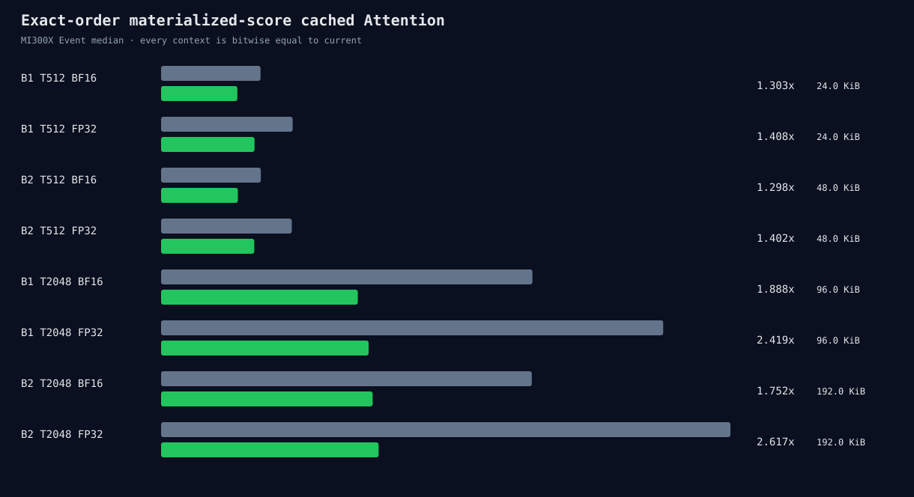

## 303. Experiment 286：换回原归约顺序，DeepSeek既快又位级相同

同一T2048/B2/BF16/N64三对模型门中，current为133.78 tok/s，materialized为176.64 tok/s，
中位1.32068x，三组leave-one都约1.3205x。303,872个完整cached logits与64 token全部位级相同，
peak和KV bytes不变。

相对固定PyTorch 163.64 tok/s参考是1.0794x。代价是+8,960逻辑allocation和+64冷backend
allocation，后者与64个递增prefix score尺寸一致。显式路径保留；在Qwen/DeepSeek、T512/T2048、
B1/B2扩大模型门之前，不写成一般默认。

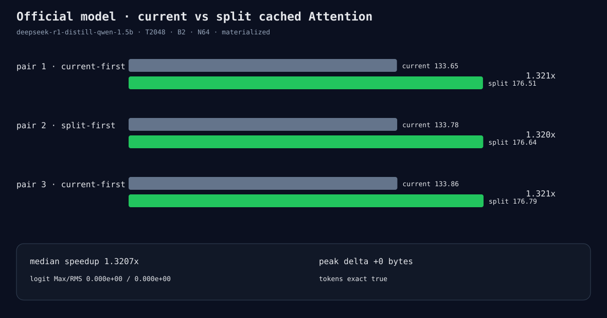

## 304. Experiment 287：Qwen T512差0.002，也不能把门线向下挪

八格官方矩阵的完整logits全部位级相同。DeepSeek T512已经快1.105x左右，但Qwen T512/B1/B2
只有1.0479x/1.0484x，leave-one同样稳定未过1.05。Qwen T2048为1.1840x/1.1747x，DeepSeek
T2048为1.3688x/1.3209x。

所以跨两模型的单调minimum是2048。自动策略只准入gfx942、BF16 KV、uniform decode和这两个已测
head签名；其他硬件、dtype、模型结构与divergent serving不推广。

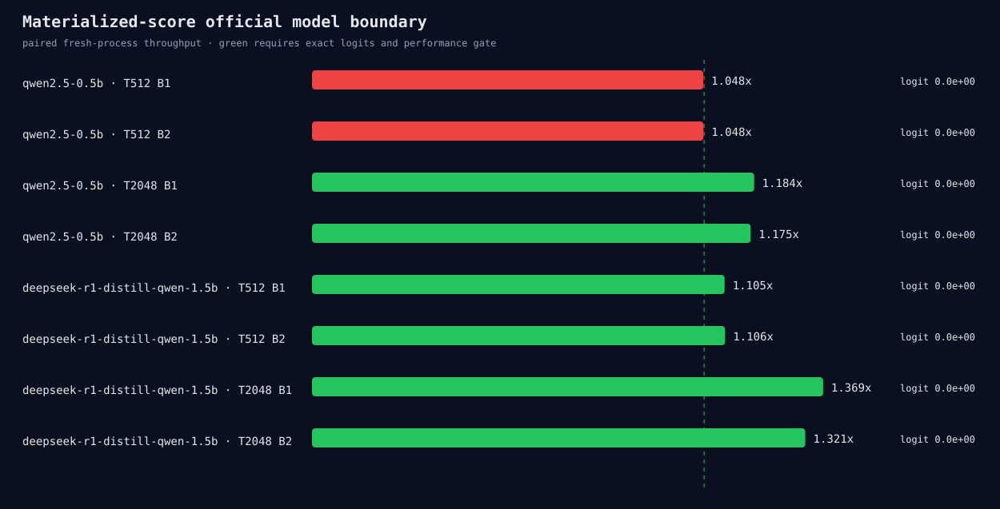

## 305. Experiment 288：不传开关，也必须证明默认真的走了新路

current显式off，candidate完全不传开关且JSON必须报告auto-enabled。Qwen T2048/B1/B2分别快
1.1836x/1.1777x，DeepSeek快1.3687x/1.3259x；四格完整logits、token与peak全部通过。

因此保留有界auto：gfx942、BF16 KV、uniform decode、已测head签名且prefix至少2048。其他硬件、
dtype、模型与positions-aware路径不推广。旧61.57% Attention profile已经过期，下一步重新profile。

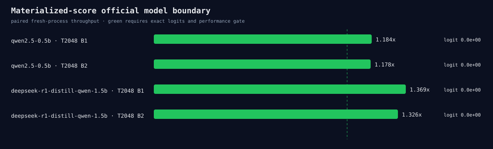

## 306. Experiment 289：优化成功后，旧profile也会过期

新默认启用后，我们用同一个DeepSeek T2048/B2/N64重新做1次与3次generation差分。两个进程都
必须报告`auto-enabled`，否则测到的就不是用户默认路径。

新的总Kernel时间为831.31ms，旧profile是1051.29ms；应用generation由历史991.48ms降到
776.14ms。Attention不再是一个黑盒：并行score只占64.81ms/7.80%，保持原累加顺序的finalize
占349.17ms/42.00%，两者合计49.80%；GEMM是272.79ms/32.81%。

这次profile也拒绝了一个看似自然的方向。每代有38,755次逻辑申请，但backend新分配是0，全部
命中缓存，所以先写workspace不会消除稳态热点。Step 107只改finalize线程映射，并要求完整
context与模型logits门；若单算子快而模型不快，我们就接受反例并转向下一个系统边界。

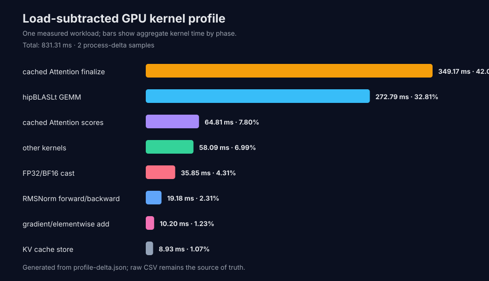

## 307. Experiment 290：256个线程只有128个算column，砍半却没有更快

我们让64/128个物理线程模拟原来的256个逻辑lane。每条局部position流、共享归约树和P×V累加
顺序完全不变，所以96个fresh process的16格context全部位级相同。

但128-thread相对256的Event只有0.9901x–1.0121x，wall为0.9808x–1.0121x；64-thread更差，
Event只有0.5548x–0.9651x。目标DeepSeek T2048/B2/BF16虽然是最好一格，也只有1.0121x，
0/16过性能门。

这推翻了“闲着的线程就是主要浪费”。每个column仍必须按T串行读value并累加；少线程没有缩短
这条链，反而让每个线程模拟更多逻辑lane。默认不变。下一实验保留exact score和exact softmax，
只拆P×V，直接测试value累加顺序能否在完整模型里承受。

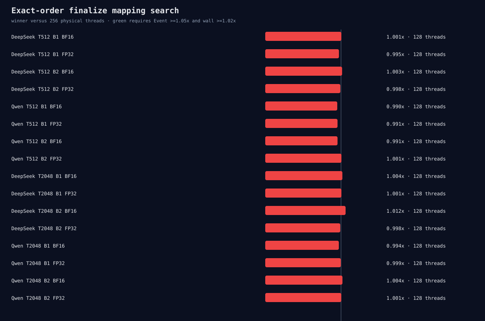

## 308. Experiment 291：Softmax不动，只把P×V分段

S1保留exact score和softmax并走新buffer/launch，但不真正切序列。16格S1全部与current位级相同，
也全部更慢，说明接口真的只隔离了P×V，额外阶段本身不是免费优化。

扩大到S2/4/8/16后，160个fresh process的16格都选择S16。Event为1.2749x–2.9549x，wall为
1.2372x–2.6373x；最大context Max/RMS只有3.90e-9/1.09e-9。目标DeepSeek T2048/B2/BF16为
2.2908x/2.1372x。

这说明finalize热点主要能由P×V序列并行缓解，也说明先前全split的精度问题不必来自score。但算子
1e-9误差经过28层×64步仍可能放大；下一步只做三对完整DeepSeek logits门，不提前改模型或Auto。

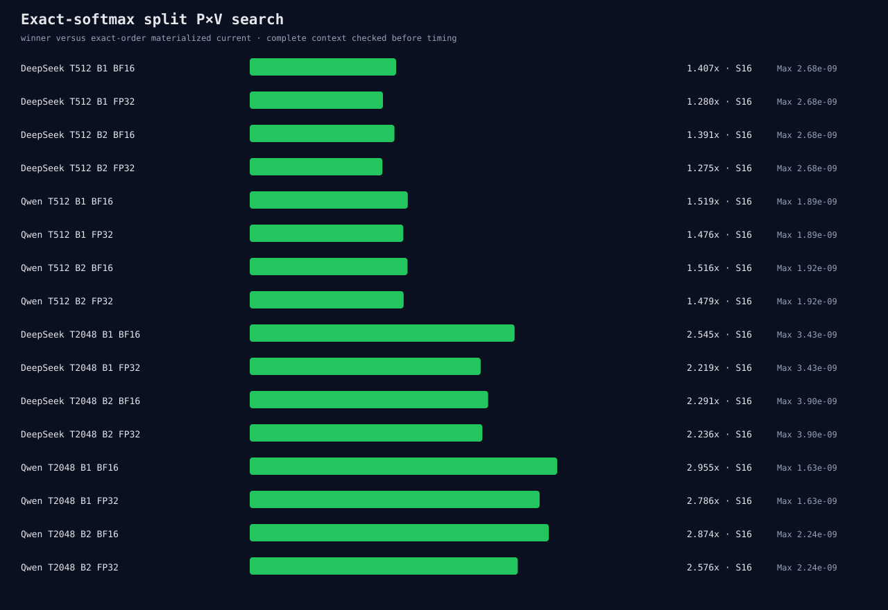

## 309. Experiment 292：只改P×V，1e-9也会被模型放大

三对DeepSeek T2048/B2/N64中，split-P×V从177.52提高到263.20 tok/s，中位1.4834x，所有
leave-one约1.483x–1.486x。64 token、peak和121,110,528-byte KV都不变。

但三对303,872 logits都得到Max/RMS 0.064486/0.011488，远超门线。Experiment 291已经锁住score
和softmax顺序，S1也位级相同，所以这次能把放大来源定位到P×V累加树本身。

模型路由拒绝，不跑边界矩阵，不改Auto。下一候选只能在保持每个head position 0→T顺序的前提下
减少工作：多个GQA query heads复用同一value load。若它不能补回额外probability Tensor成本，
exact-finalize局部优化线就关闭。

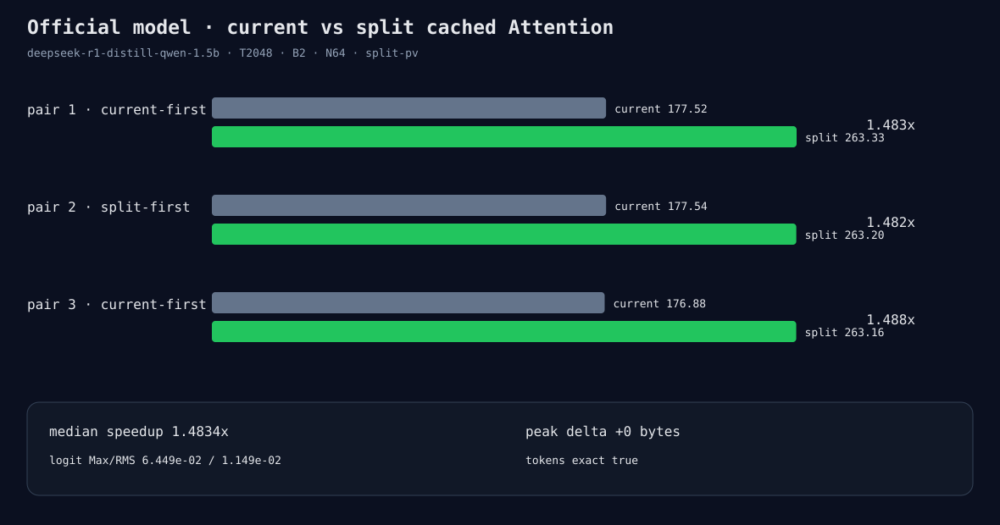

## 310. Experiment 293：Value只读一次，Probability却要多走一趟显存

新Kernel让6/7个GQA query heads保留各自position 0→T累加，只共享value load。128个fresh process
全部与materialized current位级相同。

首版运行时accumulator数组只有约0.099x；把repeats实例化为1–8后恢复到约0.5x，确认私有内存spill
是真问题。但正式16格winner仍只有Event 0.4540x–0.6349x、wall 0.4695x–0.6637x，0/16过门。

原因是为了跨Kernel复用，exact softmax概率必须先写全局显存再读回；省下的BF16 value load补不回
FP32 probability流量和launch。模型/Auto不变，exact-finalize局部线关闭。下一步测B1/B2/B4/B8
服务batch扩展，用不改变数学的并发轴填充GPU。


## 311. Experiment 294：Batch是精确并行轴，但B8不是免费午餐

当前no-flag Auto固定T2048/N64，Qwen/DeepSeek测B1/2/4/8并与PyTorch ROCm三进程配对。Qwen B8
达到B1的6.585x、效率82.3%，仍比PyTorch快1.210x；DeepSeek B8为6.282x/78.5%，却只有
PyTorch的0.859x。每请求peak随batch下降，KV按batch线性。

第一轮PyTorch被AMDSMI零设备阻断；正式轮显式记录fallback，24条都在可见HIP设备执行。Qwen四格
token相同；DeepSeek B2/B4相同，B1/B8从index 2分叉。由于两框架precision policy不同，不能把
分叉草率归因，也不能设置scheduler默认。

下一步导出microLLM B1/B2/B4/B8 step0/1/2完整logits和每行结果。先证明自身batch一致，再讨论
模型特定batch policy。

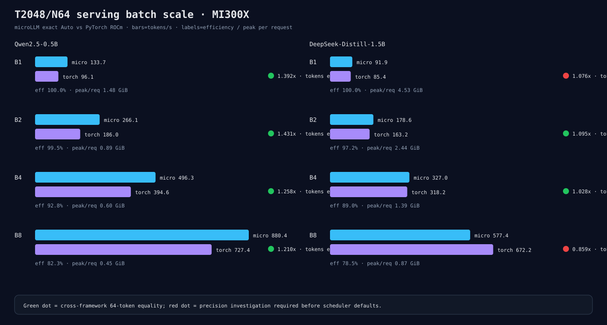

## 312. Experiment 295：Batch内每行都对，Batch之间却从step0就不同

DeepSeek B1/2/4/8在step0/1/2各导出完整151,936 logits，两次fresh process。24/24进程确定、每个
batch内部行位级相同、host argmax与device token全相同，因此排除行混写和采样错误。

但跨batch从step0已经漂移，B2/B4/B8相对B1 Max为0.04968/0.06757/0.05165；最终全局Max/RMS
达到0.19780/0.04613。step2正好B1/B8选151643，B2/B4选3555，完整解释上一实验的序列分组。

下一步只测step0的全FP32、BF16-FFN-only、BF16-Attention-only和当前双BF16。若FP32也漂移，查
通用batch GEMM；否则定位首次放大的低精度island。scheduler默认继续冻结。

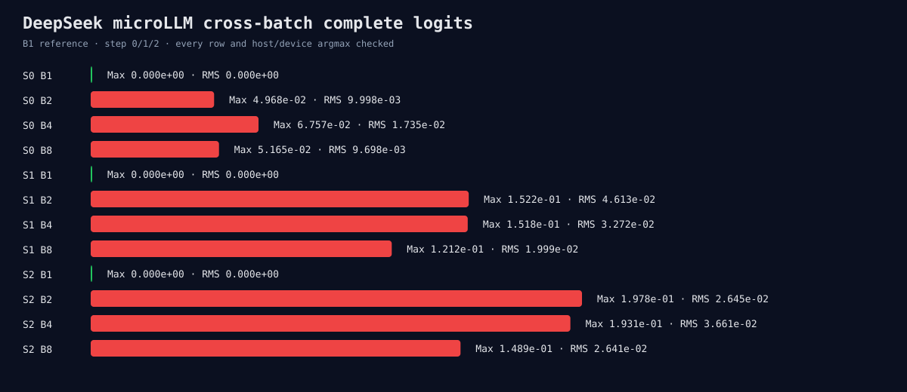

## 313. Experiment 296：FFN是Batch漂移的主要放大器

保持BF16 KV和同一Auto Attention，只切Linear权重岛。FP32 Linear的Max/RMS为
0.001354/0.000229；Attention-only为0.020970/0.004278；FFN-only为0.062985/0.025171；当前
both为0.067570/0.017350。

32进程确定、converted tensor计数与四策略完全一致、host/device argmax全过。FP32底噪说明通用
GEMM也随batch shape变化，但FFN-only把Max放大46.5倍，是主要来源；Attention是次要贡献。

下一步不改精度，给cached step0增加诊断trace。先只看embedding、28个block、final norm和logits，
找到第一个放大层，再打开该层gate/up/down细节。

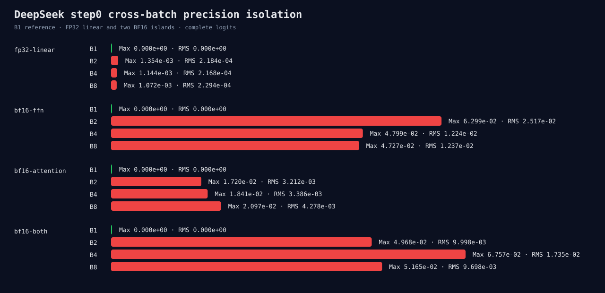

## 314. Experiment 297：别只看最终Logits，误差在第0层已经跳起来了

我们把DeepSeek cached step0拆成31个完整边界：Embedding、28个Transformer block、final norm和
logits。B1与B2第0行输入完全相同，FP32 Linear和BF16 FFN-only各跑两个fresh process。

Embedding位级相同。第一个差异出现在Block 0：FP32 Max/RMS只有7.62e-6/1.91e-6，BF16 FFN-only
却是0.003909/0.000348，Max放大512.88倍。误差随后穿过全部28层，到Block 27达到
0.582840/0.054506，再被final norm压回最终logits的0.062985/0.025171。

这说明只盯最终logits会错过中间最大的漂移，但“Block 0输出不同”仍不等于“已经找到具体算子”。
所以默认precision和scheduler继续冻结；下一步只打开Block 0内部的attention residual、BF16 FFN
input、gate/up/activated/down，找到第一处真正的跃迁。

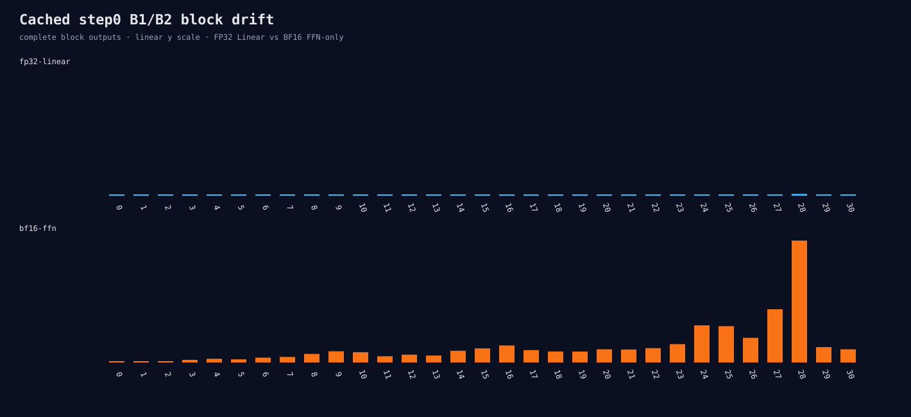

## 315. Experiment 298：不是Q/K/V，第一处低精度放大发生在FFN输入Cast

我们继续打开Block 0。Attention norm、Q/K/V投影和RoPE在B1/B2间全部位级相同；materialized
Attention context第一次产生5.62e-5 Max小差异。经过Attention输出、残差和FFN norm后，Max只剩
2.98e-6，仍属于FP32底噪。

真正的跃迁从FP32→BF16输入cast开始：Max变成0.000488，relative-L2变成0.000101，分别是前一
边界的163.84倍和23.38倍。gate继续到0.0078125，是FP32 gate误差的约1008倍；down projection
的relative-L2达到本层峰值0.001143。两次fresh process完全重复，B2两行仍位级相同。

这仍不能证明“只修第一层就够了”。下一步保持其余27层BF16，只让Block 0 FFN使用FP32。如果完整
logits明显收敛，才进入前N层边界搜索；若几乎没变，就拒绝层选择策略，转向每层都重复注入的cast或
GEMM算法一致性。默认precision和scheduler不动。

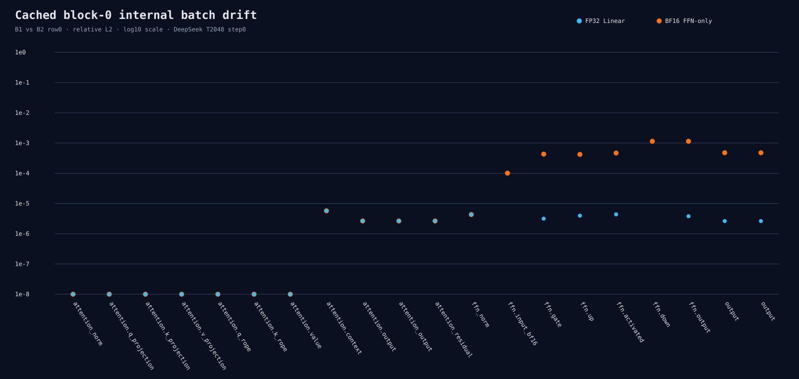
