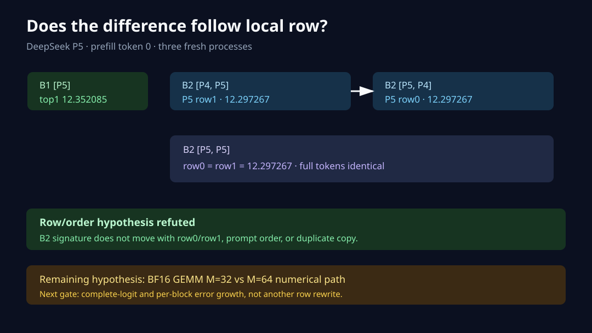

# Experiment 105 — 差异不跟着B2 local row移动

Experiment 104把因果变量缩到batched prefill。本节点固定目标P5，交换B2 row顺序并复制相同prompt，
检查差异究竟跟M shape还是local row/copy走。

## 合同与结果

12/12 fresh processes通过，四个case各三次逐字段稳定。

| case | P5 row | prefill top-1 | top-1 logit | top-2 logit | 完整输出组 |
|---|---:|---:|---:|---:|---|
| single_5 | 0/B1 | 151643 | 12.352085 | 10.704218 | B1 |
| pair_4_5 | 1/B2 | 151643 | 12.297267 | 10.771706 | B2 |
| pair_5_4 | 0/B2 | 151643 | 12.297267 | 10.771706 | B2 |
| duplicate_5 row0 | 0/B2 | 151643 | 12.297267 | 10.771706 | B2 |
| duplicate_5 row1 | 1/B2 | 151643 | 12.297267 | 10.771706 | B2 |

`pair_4_5`与`pair_5_4`的P5 prefill signature逐值相同；duplicate两行也逐值相同。所有B2 P5
完整输出相同并在generated index4选择1196，B1选择23606。

## 反驳结果

- 差异不跟local row 0/1移动；
- 不跟P4/P5提交顺序移动；
- 相同prompt放两行不会产生row间差异；
- device argmax全部与top-1一致。

因此row index、stride和KV prefix copy解释被反驳。剩余主解释是B1/B2把BF16 GEMM的M从32改到
64，引起稳定的数值路径差异。默认B2已在Experiment 104原分叉请求上匹配PyTorch，不做回退。

下一节点需要完整logit误差与block级增长证据，不能仅靠top-2宣布所有batched算子正确。

数据见[`105-data`](105-data/)。
