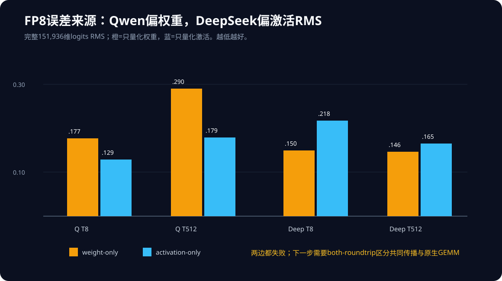

# Experiment 141：权重和激活都不能忽略

## 问题

Linear像“输入数字乘一张权重表”。完整FP8会同时把输入和权重变粗。如果答案不准，我们先
分别只把一边变粗，另一边保持FP32。这样能问：误差主要从哪边进来？

两个诊断都在量化后还原为FP32，再用FP32 GEMM。它们故意不走原生FP8 GEMM，只用于误差归因。

## 完整logits结果

| 模型/上下文 | weight-only Max / RMS | activation-only Max / RMS | 主要观察 |
|---|---:|---:|---|
| Qwen T8 | 0.7665 / 0.1774 | 0.5741 / 0.1291 | 权重两项更大 |
| Qwen T512 | 1.1862 / 0.2901 | 0.8475 / 0.1794 | 权重RMS大1.62× |
| DeepSeek T8 | 0.6945 / 0.1501 | 0.6880 / 0.2176 | Max近似，激活RMS大1.45× |
| DeepSeek T512 | 0.8872 / 0.1464 | 0.7363 / 0.1654 | 权重Max大，激活RMS大 |

Qwen可以说权重舍入主导当前四个指标；DeepSeek不能用一个来源解释所有指标。八个诊断精度门
全部失败，虽然top token全部相同。top token只看151,936个坐标中的第一名，不能替代全向量门。

## 机器合同

- fresh build 50/50，CLI binary contract通过；
- 两套各12/12 worker正常退出，stderr为空；
- weight-only覆盖/转换Qwen 168/168、Deep 197/197，动态激活调用为0；
- activation-only覆盖/转换168/0、197/0，动态调用96/113；
- 两套native和software fallback调用均为0，证明只执行选中的FP32诊断数学。

## 决定

不接受“只修权重”或“只修激活”作为跨模型默认策略。下一步加入`both-roundtrip`：权重和激活
都按当前FP8规则量化，但两者都还原后用FP32 GEMM。它与真实`full`的差异将回答：剩余恶化主要
来自双侧舍入在模型里的共同传播，还是来自原生FP8 GEMM的执行数学。
