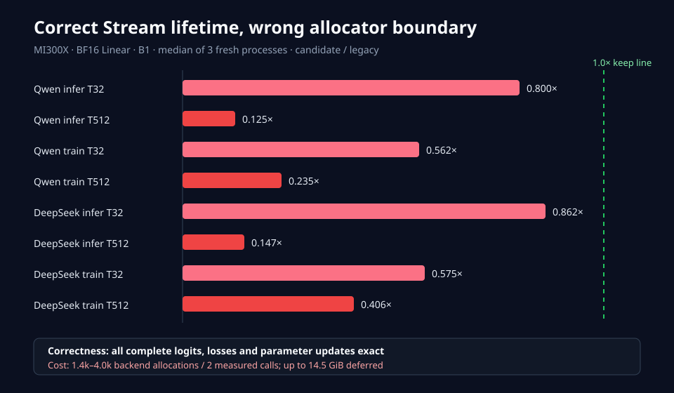

# Experiment 177 — lifetime-safe model Stream routing is correct but not fast

Status: `keep` as explicit correctness infrastructure; `default off`

## Question

Experiment 175 routed model work to a non-default Stream and corrupted complete logits because
temporary Storage died too early. Experiment 176 made explicit-Stream temporary release safe.
Does binding both behaviors restore model correctness, and does it improve official inference or
training?

## Contract

`runtime::ScopedDeferredHipStream` is thread-local, non-copyable, non-movable and non-nestable.
Inside its lexical region:

- otherwise-default `OpContext` work uses its HIP Stream;
- runtime strided layout copies use the same Stream;
- destroyed same-device HIP allocations stay alive until that Stream completes;
- an explicit different Stream or another HIP device is rejected;
- the child thread sees no parent scope;
- capacity overflow remains the safe intermediate synchronization from Experiment 176;
- `finish()` removes routing first, then synchronizes and releases retained blocks.

This is not Graph capture: allocation remains synchronous and addresses are not planned.

## Correctness

The exact one-layer failure from Experiment 175 now passes three times at the original `1e-5`
complete-logit gate. A second test runs a full Transformer loss/backward and compares loss plus
every named parameter gradient with the legacy HIP path. Default ops, explicit-same Stream,
strided-copy, conflicting Stream/device, nesting, CPU and thread isolation are separately tested.

The official matrix contains 48 new processes and 24 pairs. Every Qwen/DeepSeek inference vector
is bit-exact. Every paired training loss and observed updated parameter is also bit-exact.

## Official MI300X matrix

BF16 Linear, B1, one warm-up, two measured operations, three fresh processes per policy:

| Model | Mode | T32 speed ratio | T512 speed ratio | T512 deferred bytes |
|---|---|---:|---:|---:|
| Qwen2.5-0.5B | inference | 0.800× | 0.125× | 1,485,307,904 |
| Qwen2.5-0.5B | training | 0.562× | 0.235× | 7,110,592,008 |
| DeepSeek Distill 1.5B | inference | 0.862× | 0.147× | 2,685,403,136 |
| DeepSeek Distill 1.5B | training | 0.575× | 0.406× | 15,591,456,776 |

Logical engine peak is unchanged because it stops counting a Tensor when ownership ends. The
separate deferred-byte field reports raw memory that remains physically live. No formal row
overflowed 8,192 records.

## Profiler attribution

Qwen BF16 inference B1 T512 has identical work:

| Counter | Legacy | Scoped deferred |
|---|---:|---:|
| Kernel calls / duration | 2,751 / 25.64 ms | 2,751 / 25.47 ms |
| `hipLaunchKernel` | 1,976 | 1,976 |
| extended module launches | 651 | 651 |
| `hipMalloc` calls / duration | 1,180 / 11.25 ms | 2,559 / 42.92 ms |
| `hipFree` calls / duration | 867 / 28.40 ms | 2,557 / 140.11 ms |

The non-default Stream permanently disables the current legacy-default-Stream-only exact-size
pool. Candidate measured forwards therefore perform 1,398 backend allocations instead of 19.
The GPU computation is not slower; synchronous allocation/free dominates the host path.

## Decision

Keep the safe scope, routing seam, runtime layout routing, tests, benchmark and counters. Do not
enable it in model APIs or claim a speedup. It is the correctness prerequisite for future
heterogeneous Graph work, not the final execution policy.

The next distinct hypothesis is a same-Stream ordered allocator or planned activation arena that
can recycle addresses without waiting for the whole region. Repeating ambient Stream routing,
raising the deferred table capacity, or hiding physical bytes is closed by this matrix.

Raw evidence is in
[`benchmarks/results/2026-08-24-scoped-deferred-model-stream/`](../../../benchmarks/results/2026-08-24-scoped-deferred-model-stream/).
