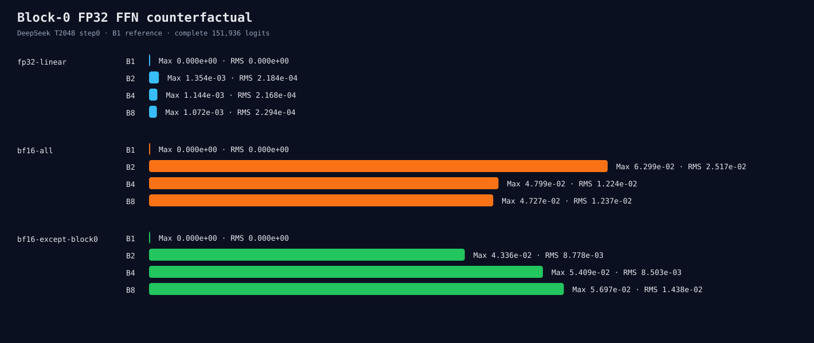

# Experiment 299：只让Block 0回到FP32，不够稳健

Status: precision policy rejected

## 最小反驳实验

固定DeepSeek T2048、BF16 KV、materialized Attention和step0，测B1/B2/B4/B8，两次fresh process：

- FP32 Linear：0个BF16 FFN权重；
- 全BF16 FFN：84个；
- 只有Block 0 FFN保持FP32：81个。

| 策略 | 最大跨Batch Max | 最大跨Batch RMS | 相对全BF16 |
|---|---:|---:|---:|
| FP32 Linear | 0.001354 | 0.000229 | — |
| 全BF16 FFN | 0.062985 | 0.025171 | 1.0x |
| Block0 FP32 | 0.056969 | 0.014383 | Max 0.9045x / RMS 0.5714x |

全局数字看似改善，但按batch拆开后结论不稳：B2 Max降到0.6885x，B4却变成1.1271x，B8变成
1.2051x；B8 RMS也变成1.1625x。只保留三份FP32权重还固定增加82,575,360 peak bytes，B2/B4/B8
吞吐分别为全BF16的0.9976x/0.9942x/0.9936x。

24个进程重复位级相同、host/device argmax全过，step0 token全为151643。另一方面，B>1的相同行
在三种策略中都不是位级相同，连FP32 Linear也存在这一现象；所以它不是“Block0 BF16独有索引错”。

## 工具失败也保留

第一轮24个worker全部成功，但summarizer误读了不存在的throughput字段，在写raw前失败。该轮不拼接、
不发布；`985fe2a`修正为应用真实的`decode_tokens_per_second`并增加正值合同，然后24进程完整重跑。

## 决定

拒绝Block0-only FP32，不搜索前N层。下一步先枚举M=1/2/4/8、K=1536、N=8960的共同BF16
hipBLASLt solution，再用同一version-local index注册四个decode shape。若完整logits明显收敛，支持
“默认algorithm随M变化”；若不收敛，再检查down projection和Attention context。默认不变。

证据：[`layer counterfactual`](../../../benchmarks/results/2026-08-26-deepseek-bf16-ffn-layer-counterfactual/)
