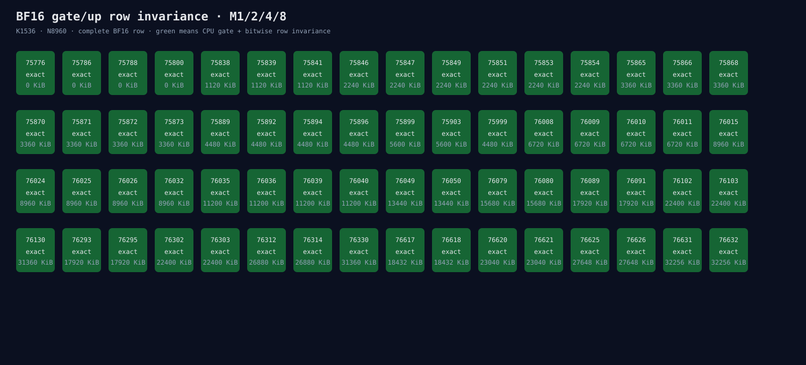

# Experiment 301：64个共同solution全部row-invariant

Status: gate/up solution search closed

## 把模型拿掉，只给GEMM相同输入

固定DeepSeek gate/up的`K=1536,N=8960`和BF16输出。构造一行确定性BF16输入，原样重复成
M1/2/4/8。对Experiment 300的64个共同solution逐个检查完整8960输出、CPU BF16 reference和Event。

结果不是“找到一个好候选”，而是更强的排除证据：

- 64/64 support；
- 64/64完整CPU BF16 reference位级相同；
- 64/64在M1/2/4/8的第0行以及M内部所有重复行位级相同；
- 最大reference error和row error都是0；
- 4个候选workspace为0；本轮最快0-workspace候选是75788；
- 75892算子也exact，四个M Event和为0.118631ms。

因此Experiment 300的失败不能解释为“75892面对不同M会把同一BF16行算出不同答案”。完整模型在
gate前已经收到不同BF16输入；固定solution只能对不同输入稳定计算，不能消除上游差异。

## 决定

关闭gate/up solution搜索，不从64个exact候选中挑一个默认。下一步导出Block 0 full prefill结束后的
BF16 K/V cache前缀，比较B1与B2/B4/B8第0行。如果cache已不同，根因位于prefill的Attention投影/
上游hidden；如果cache exact而decode context不同，再审查materialized cached Attention。

证据：[`row invariance`](../../../benchmarks/results/2026-08-26-bf16-decode-row-invariance/)
