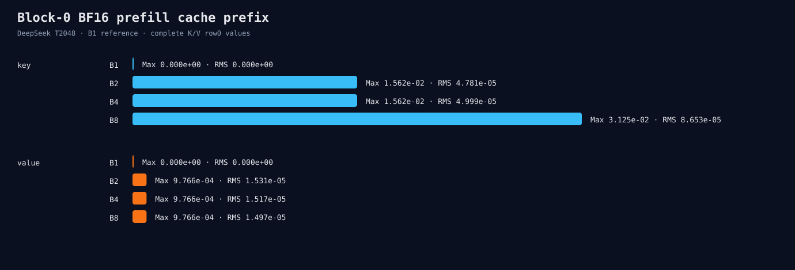

# Experiment 302：漂移在Decode开始前已经写进Cache

Status: prefill block-0 trace selected

## 导出真正的BF16位模式

固定DeepSeek T2048、FP32 Linear、BF16 KV，full prefill结束后、decode开始前导出Block 0完整K/V。
每个文件第一行是JSON元数据，后面是packed BF16原始字节；B1/2/4/8各两个fresh process。

| Tensor | 最大Max | 最大RMS | 最大relative-L2 |
|---|---:|---:|---:|
| Key | 0.03125 | 8.653e-5 | 9.039e-7 |
| Value | 0.0009765625 | 1.531e-5 | 4.538e-5 |

每次比较覆盖一行完整524,288个BF16值。两个process位级重复；B2内部两行仍exact，但B4/B8内部行
已经不同。也就是说Experiment 298看到的第一个decode Attention context漂移，至少部分来自它读取的
K/V前缀本来就不同，而不是decode materialized kernel第一次创造差异。

## 决定

不改decode Attention，也不继续搜gate/up solution。下一步让`forward_prefill_cached`拥有与普通
forward同样的Block 0诊断边界：embedding、attention norm、Q/K/V projection、RoPE/current value、
packed BF16 K/V。若FP32 projection已漂移，检查大M GEMM；若projection exact而packed cache不同，
定位cast/store。

证据：[`prefill cache prefix`](../../../benchmarks/results/2026-08-26-deepseek-prefill-cache-prefix/)
