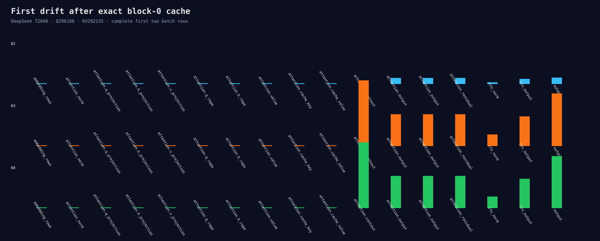

# Experiment 306：Cache之后，第一处新差异是Attention Context

Status: Attention core decomposition selected

## 用Exact Cache继续向后走

固定Q=296100、K/V=292135后，Q/K/V projection、RoPE、current value和BF16 cache在B1/2/4/8
全部位级相同。17个Block 0边界、两个fresh process：

第一处重新出现的差异是Attention context：

| Batch | Context Max | Context RMS | 同Batch两行 |
|---:|---:|---:|---|
| B2 | 9.775e-6 | 1.176e-7 | exact |
| B4 | 0.00033218 | 1.783e-6 | exact |
| B8 | 0.00033218 | 1.783e-6 | exact |

O projection之后同batch行也开始不同。B8的O/FFN/Block Max分别为0.00016308、0.00014853和
0.00026321。所有指标在两个process中一致。

这说明不能先优化O projection：它确实增加了另一类within-batch差异，但跨batch首差已经在context。

## 决定

下一步拆full-prefill Attention core的QK scores、causal softmax和P×V。若scores先漂移，做QK batched
FP32 solution row-invariance；若softmax先漂移，审计归约线程/顺序；若P×V先漂移，做PV solution门。
QKV候选仍default-off。

证据：[`post-cache trace`](../../../benchmarks/results/2026-08-26-post-cache-block0-trace/)
