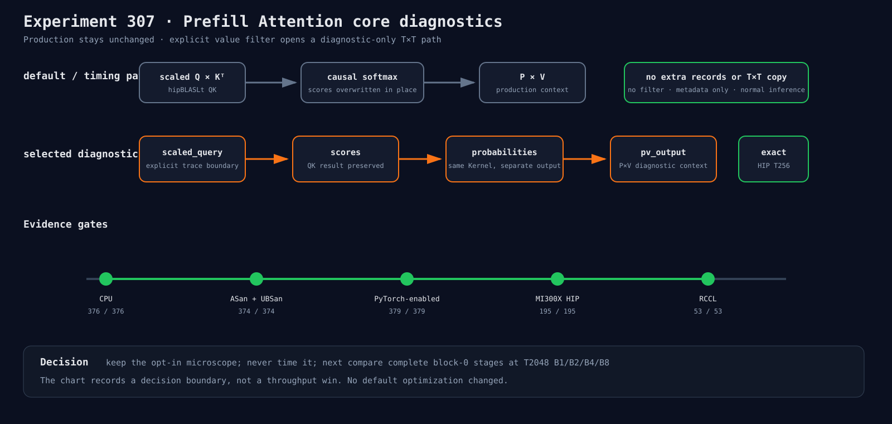

# Experiment 307：给Prefill Attention装一台不影响默认路径的显微镜

Status: infrastructure keep

## 假设

Experiment 306 已经把首差缩到 Attention context，但 context 是 QK、causal softmax 和 P×V 的
合成结果。若能在不改变普通推理的条件下记录这三个阶段，就能用下一次 B1/B2/B4/B8 实验判断
应该研究 GEMM solution、softmax 归约，还是 P×V 加法树。

## 实现合同

- 公开诊断结果包含 scaled Q、未覆盖的 scores、probabilities 和 P×V output；
- HIP T≥256 复用生产 QK/P×V 的 hipBLASLt 描述，softmax 只从 in-place 改为同 Kernel 的
  out-of-place 写法，以保留 scores；
- 模型只在 cached-prefill value filter 点名阶段且允许 capture 时进入诊断；
- 无 filter 和 metadata-only trace 不增加阶段记录，也不改变默认 dispatch；
- 诊断路径有额外 T×T 存储，禁止作为性能基线。

## 结果

CPU 手工组合路径的四个阶段全部对齐。MI300X/gfx942 的长序列门中，diagnostics 最终输出与
生产 in-place-softmax 输出逐元素完全相同。tiny cached-prefill 的最终 logits 在 `1e-6` 内一致，
K/V cache 完全相同。

完整回归：CPU 376/376、ASan/UBSan 374/374、PyTorch-enabled CPU 379/379、HIP 195/195、
RCCL 53/53。

## 决定

保留诊断 API 与显式 trace 路由，不改变任何默认优化。下一步做 block-0、T2048、B1/2/4/8 的
逐阶段完整值比较；先定位第一处非零，再提出一个最小 Kernel 或 solution 反驳实验。

证据：[`verification.json`](../../../benchmarks/results/2026-08-26-prefill-attention-core-diagnostics/verification.json)
