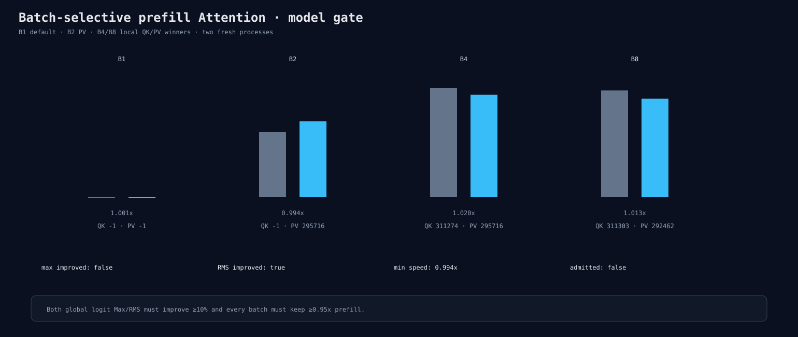

# Experiment 311：性能全过，RMS改善，但Max只改善6.1%

Status: rejected; prefill Attention solution track closed

## Policy

B1保持default；B2只用PV295716；B4用QK311274/PV295716；B8用QK311303/PV292462。上游
Q=296100、K/V=292135保持不变。16个precision与16个反向顺序performance process。

## 结果

| Batch | QK | P×V | prefill speedup | upstream Max | selective Max |
|---:|---:|---:|---:|---:|---:|
| B1 | default | default | 1.001× | 0 | 0 |
| B2 | default | 295716 | 0.994× | 0.00074697 | 0.00087082 |
| B4 | 311274 | 295716 | 1.020× | 0.00125325 | 0.00117731 |
| B8 | 311303 | 292462 | 1.013× | 0.00122690 | 0.00113106 |

全局RMS从0.00029084降到0.00022811，改善21.6%；全局Max只改善6.1%，未达到10%门。B2 Max/RMS
分别恶化约16.6%/15.6%。所有batch性能、peak、allocation通过仍不能替代完整数值门。

## 决定

拒绝policy并关闭QK/P×V solution路线。version-local scope和benchmark保留为教学/反事实工具，默认不变。
下一独立问题使用Experiment 310的exact-core诊断控制，向后定位O projection、残差和FFN的第一处差异；
这不是继续调Attention solution。

证据：[`result directory`](../../../benchmarks/results/2026-08-26-fp32-prefill-attention-selective-gate/)
