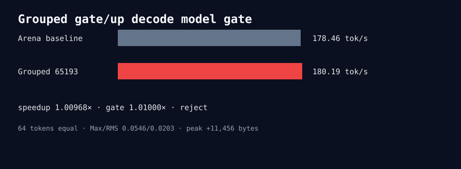

# Experiment 326 — 1.00968×不能写成1.01×通过

DeepSeek T2048/B2/N64 grouped65193为180.19 tok/s，Arena baseline为178.46 tok/s，speedup 1.00968×，
略低于事先声明的1.01门。64 token相同，logit Max/RMS 0.0546/0.0203，peak只增加11KB，但候选仍拒绝。
decode CLI扩展和runner随后删除，rows2 operator证据保留。

