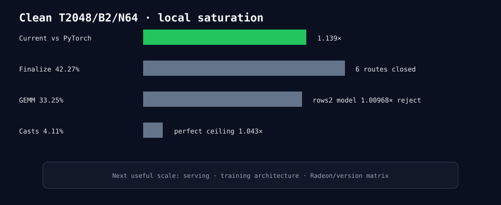

# Experiment 327 — 当前固定长上下文局部搜索停止

microLLM当前为PyTorch的1.1393×，tokens exact且峰值更低。finalize六条路线关闭；grouped rows2虽在算子
上1.814×，整模只有1.00968×并已撤回；cast占4.11%，免费删除理论上限1.043×且相邻路线已有反例。

这不是说框架优化完成，而是说继续微调同一T2048/B2/N64路径缺少有实质收益的新假设。下一阶段必须
换到serving并发、训练架构或Radeon/版本矩阵。

