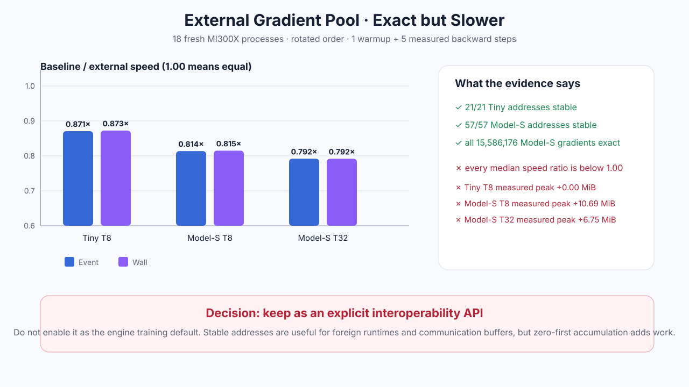

# Experiment 328 — 外部梯度池地址稳定，但为什么更慢

Status: `correctness keep; default model policy discard`

## 假设

如果每个参数梯度直接写入一块预先分配的大显存，就不必在后面复制梯度，并且地址每步稳定。
这可能减少分配和峰值显存。

反驳条件也很明确：若完整梯度不一致、任一地址变化、时间中位数不改善，或测量区峰值增加，
就不能把它设为普通训练默认。

## 方法

MI300X上运行18个新进程，覆盖Tiny T8、Model-S T8和Model-S T32。每格轮换
`baseline first`与`external first`，每种顺序三次；进程内热身一次、测量五次。

计时范围是`zero_grad + forward + backward`。计时结束后才把全部梯度复制到host验证，因此
验证开销不在Event/wall内。每个命名参数都检查目标地址；所有15,586,176个Model-S梯度元素
逐项比较Max/RMS。

## 结果

| workload | 地址 | 梯度Max/RMS | Event baseline/external | Wall baseline/external | 测量峰值变化 |
|---|---:|---:|---:|---:|---:|
| Tiny T8 | 21/21 | 0 / 0 | 0.871× | 0.873× | +0.005 MiB |
| Model-S T8 | 57/57 | 0 / 0 | 0.814× | 0.815× | +10.688 MiB |
| Model-S T32 | 57/57 | 0 / 0 | 0.792× | 0.792× | +6.750 MiB |

外部路径每五步只少5次logical allocation，却需要先把固定池清零，再把第一份贡献也原地相加。
普通Autograd可以直接接管第一份producer Tensor。因此“固定地址”成立，“自然更快、更省峰值”
不成立。

## 决定

保留`bind_grad_buffer`作为显式互操作能力：PyTorch、RCCL或外部执行器确实可能要求稳定地址。
不把它接入默认`Trainer`，也不写成性能优化。若未来producer能够直接写入最终pool并删除首次
加法，必须作为新的图级实验重新过完整门，不能复用本次结论。

证据：[`benchmarks/results/2026-08-26-autograd-external-gradient-pool`](../../../benchmarks/results/2026-08-26-autograd-external-gradient-pool/)

