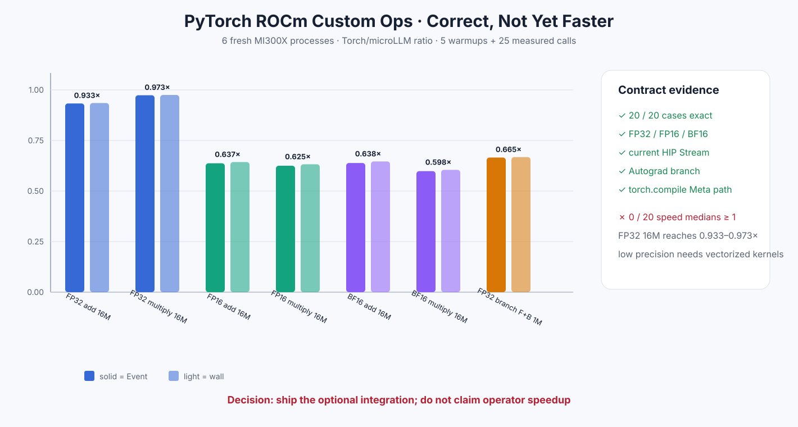

# Experiment 329 — PyTorch ROCm注册跑通，为什么仍然比Torch慢

Status: `integration keep; performance claim reject`

## 要解决的问题

仓库原来有`torch.ops.microllm.add/multiply`的schema和CPU证据，也写了ROCm使用的`CUDA`
dispatch key，但“写了注册代码”不等于“在真实PyTorch ROCm中能用”。真实门必须覆盖：

- PyTorch拥有输入和输出显存，microLLM不能复制或接管所有权；
- Kernel必须进入PyTorch当前HIP Stream；
- FP32、FP16、BF16和边界shape；
- Autograd分支；
- `torch.compile(fullgraph=True)`需要的Meta实现；
- 与原生Torch同进程、同输入、轮换顺序的Event/wall/峰值。

## 实现

C++ dispatcher把PyTorch pointer、shape、stride、dtype和device映射成非拥有`TensorView`，
输出仍由`at::empty_like`分配。FP16/BF16低层caller-owned add/multiply补齐，HIP launch接收
`getCurrentHIPStream`的非拥有handle。Python加载器注册明确的add/multiply反向公式；C++ Meta
key只做shape/dtype合同，不访问数据。

## 正确性

六个新进程覆盖20格：18个forward格和2个forward+backward格。全部完整输出、梯度和loss的
Max/RMS为0。额外单测覆盖空Tensor、4K尾部、多维/大shape、不连续输入、错误dtype/shape、
当前Stream和fullgraph compile。

## 性能反例

速度定义为`Torch / microLLM`。20个中位数都小于1：

- FP32 16M：add `0.933×`，multiply `0.973×`，接近但仍慢；
- FP16 16M：add `0.637×`，multiply `0.625×`；
- BF16 16M：add `0.638×`，multiply `0.598×`；
- FP32 1M add+multiply分支前反向：`0.665×` Event；
- 两条路径的PyTorch allocator测量峰值相同。

这说明dispatcher、所有权和Stream合同成立，但当前scalar typed HIP Kernel不如Torch的向量化
elementwise实现。Custom Op的价值是允许更大的融合算子接入，而不是用两次简单逐元素Kernel
宣称超过Torch。

## 决定

保留并公开ROCm适配、低精度、Autograd和Meta能力；README明确写成兼容性接口，不写性能领先。
下一实验若优化这一线，只允许比较向量化typed load/store，且必须同时覆盖三种dtype、尾部和完整
PyTorch矩阵。更重要的长期方向是把多个Torch算子融合为一次microLLM Custom Op。

证据：[`benchmarks/results/2026-08-26-pytorch-rocm-custom-ops`](../../../benchmarks/results/2026-08-26-pytorch-rocm-custom-ops/)

