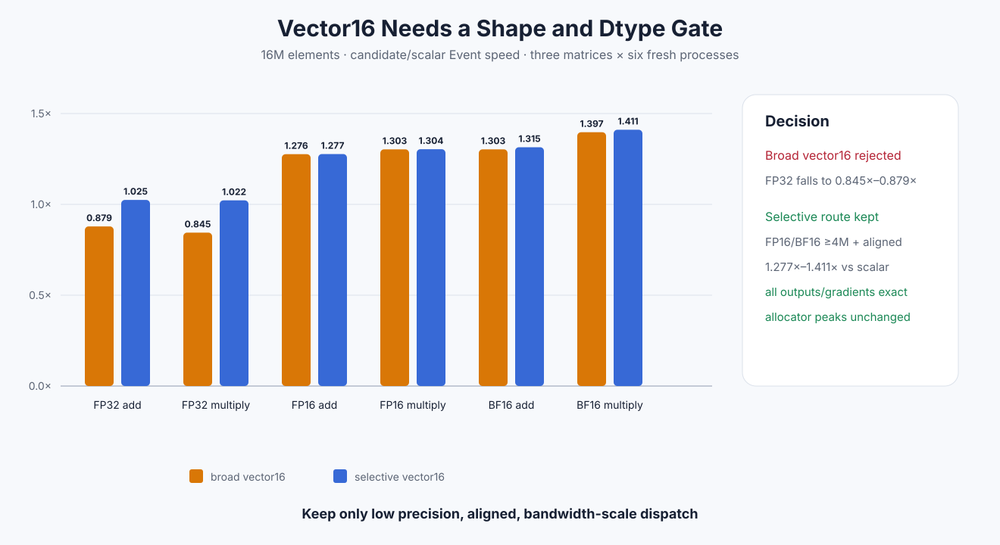

# Experiment 330 — 为什么vector16只能选择性启用

Status: `selective keep; broad policy reject`



## 假设与门

Experiment 329显示低精度16M elementwise只有原生Torch的约0.60×–0.64×。假设是scalar
load/store没有吃满带宽。第一版用16-byte packet同时处理4个FP32或8个FP16/BF16元素。

通过门不是“某一格变快”，而是：20格仍完整exact、allocator peak不增、四个低精度16M格
相对microLLM scalar至少1.05×，FP32带宽格不得低于0.95×。

## 第一次反例：所有dtype都vectorize

广泛策略保留了全部正确性，低精度16M确实提高约1.28×–1.40×；但FP32 add/multiply相对
scalar只剩0.879×/0.845×。4K和1M也没有稳定收益。因此“对齐就vectorize”被拒绝，raw矩阵
完整保留。

## 最小修正

最终Auto predicate同时要求：

```text
dtype 是 FP16 或 BF16
AND elements >= 4,194,304
AND left/right/output 都 16-byte aligned
```

否则走原scalar Kernel。vector Kernel内部对最后不足一个packet的尾部逐元素处理；未对齐view
不会偷偷复制，而是明确fallback。

## 正式结果

三套矩阵各6个新进程。selective相对scalar的四个低精度16M Event提升为：

- FP16 add/multiply：`1.277× / 1.304×`；
- BF16 add/multiply：`1.315× / 1.411×`。

FP32带宽相对scalar为`1.025×/1.022×`，通过0.95噪声门；全部20格输出、梯度、loss为0误差，
峰值不变。相对原生Torch，最终低精度仍只有约0.816×–0.842×，所以结论是“microLLM内部
明显改善”，不是“超过Torch”。

## 决定

保留selective Auto route，拒绝broad route。相邻的packet宽度、block size和阈值搜索只有在新
trace显示仍由typed elementwise主导时再开放；当前更有价值的Custom Op方向是融合多个节点。

证据：

- [scalar baseline](../../../benchmarks/results/2026-08-26-pytorch-rocm-custom-ops/)
- [broad vector反例](../../../benchmarks/results/2026-08-26-pytorch-rocm-custom-ops-vector16/)
- [selective结果](../../../benchmarks/results/2026-08-26-pytorch-rocm-custom-ops-vector16-selective/)

