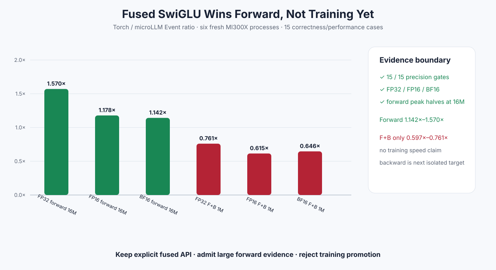

# Experiment 331 — 真正融合后，前向赢了，训练为什么还没赢

Status: `API and large-forward keep; training promotion reject`



## 边界

前两个Torch adapter实验只替换单个add/multiply，没有减少图节点。SwiGLU是第一个真正融合边界：

```text
PyTorch: silu(gate) -> intermediate -> multiply(up)
microLLM: swiglu(gate, up) -> output
```

Custom Op输出仍由PyTorch分配，当前HIP Stream由非拥有handle传入。C++注册forward与内部
`swiglu_backward`，Python Autograd保存gate/up；Meta key允许fullgraph compile。FP32 backward
走microLLM fused Kernel，FP16/BF16先保留可读Torch公式。

## 矩阵

六个新进程、15格、每格5次热身和25次测量：三dtype × 4K/1M/16M forward，以及三dtype ×
64K/1M forward+backward。Max/RMS/loss按dtype显式设门，不把低精度舍入误写成bit-exact。

## 前向结果

16M Event速度`Torch / microLLM`：

- FP32 `1.570×`；
- FP16 `1.178×`；
- BF16 `1.142×`。

三种dtype的PyTorch allocator测量峰值都减半，因为不再保存独立SiLU中间Tensor。4K受dispatch
影响约0.97×–1.00×；1M也并非全部稳定胜出，所以结论只覆盖带宽规模。

## 训练反例

1M forward+backward只有FP32/FP16/BF16 `0.761×/0.615×/0.646×`。FP32 fused backward虽然只有
一个microLLM Kernel，但scalar实现仍慢；低精度当前使用多个Torch公式节点，测量峰值约为原生
路径两倍。梯度全部在精度门内，说明这是性能反例，不是正确性失败。

## 决定

公开并保留SwiGLU Custom Op、Autograd/Meta合同和大forward证据；不把它宣传成训练加速，也不把
它自动改写进任意Torch模型。下一节点只测FP32 fused backward的向量化/producer；低精度 backward
必须先有typed数学合同，不能用更多Python节点伪装成融合。

证据：[`benchmarks/results/2026-08-26-pytorch-rocm-custom-op-swiglu`](../../../benchmarks/results/2026-08-26-pytorch-rocm-custom-op-swiglu/)

