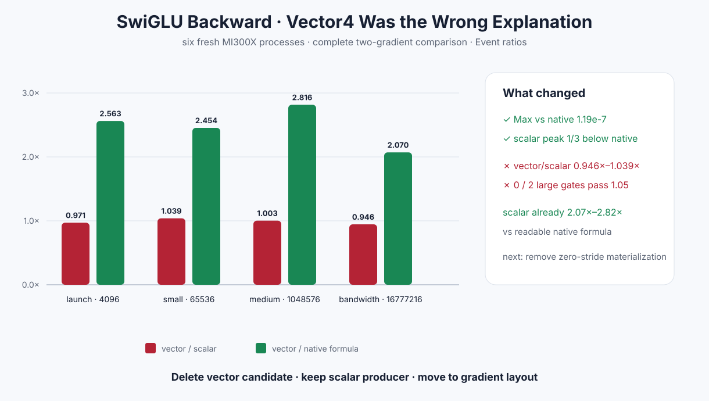

# Experiment 332 — backward慢，不是因为没用float4

Status: `vector candidate removed; scalar producer retained`

## 原假设

Experiment 331的1M forward+backward只有0.761×原生Torch。最直接的解释是microLLM
`swiglu_backward`每线程只算一个FP32元素，load/store没有向量化。

我们增加显式scalar/vector4 selector，vector一次读取gate、up、output gradient并写两个float4
梯度。尾部安全，五个pointer都要求16-byte aligned。只有1M/16M均≥1.05×才允许进入Autograd。

## 六进程结果

| elements | vector/scalar Event | vector/native可读公式 | 结论 |
|---:|---:|---:|---|
| 4K | 0.971× | 2.563× | vector更慢 |
| 64K | 1.039× | 2.454× | 未过1.05 |
| 1M | 1.003× | 2.816× | 未过1.05 |
| 16M | 0.946× | 2.070× | 明显回退 |

完整两份梯度相对native Max为`1.19e-7`；vector/scalar Max为`2.98e-8`。scalar/vector峰值
相同，均比可读native公式少三分之一。

## 被推翻的解释

没有任何目标scale过门，说明scalar算术不是整图慢的主要原因。事实上，保留的scalar fused
producer已经比可读native公式快2.07×–2.82×。vector Kernel、selector、专用测试和runner均删除，
只保留raw结果和图。

## 下一假设

PyTorch的`sum()` backward给SwiGLU一个zero-stride expanded scalar。当前Python Autograd公式调用
`gradient.contiguous()`，会物化与activation同大的Tensor。下一实验应让Kernel直接读取一个
scalar/zero-stride seed，并测提交次数、peak和完整F+B；不能继续调block或packet。

证据：[`benchmarks/results/2026-08-26-pytorch-rocm-custom-op-swiglu-backward`](../../../benchmarks/results/2026-08-26-pytorch-rocm-custom-op-swiglu-backward/)

