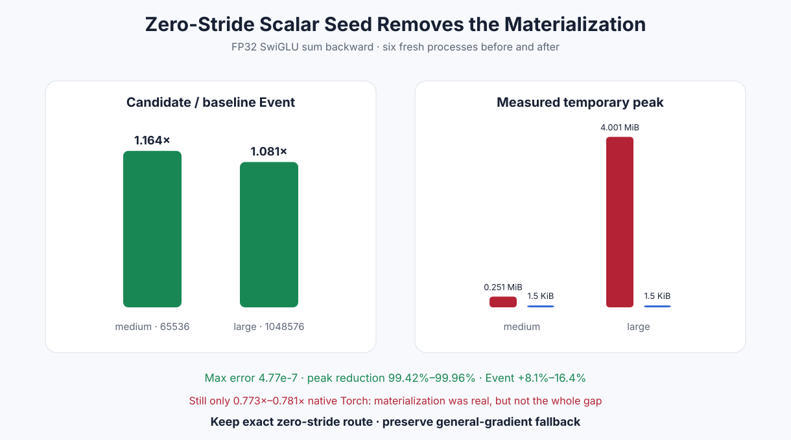

# Experiment 333 — 4 bytes的gradient为什么被扩成4MB

Status: `keep exact zero-stride route; general fallback unchanged`

## 先看布局，不先改Kernel

对1024元素SwiGLU输出注册hook：

| loss | output gradient stride | storage | contiguous |
|---|---|---:|---|
| `out.sum()` | `(0,)` | 4 B | false |
| `out.mean()` | `(1,)` | 4096 B | true |
| weighted sum | `(1,)` | 4096 B | true |

PyTorch用一个设备标量和zero stride表示sum的全1梯度。旧bridge无条件调用
`gradient.contiguous()`，于是1M元素先物化4MiB，再调用已经很快的fused backward。

## 窄合同

只有同时满足FP32、`numel>0`、每个stride都是0时，Python bridge才用`as_strided((1,), (0,))`
取一元素view并调用`swiglu_backward_scalar_seed`。Kernel对每个元素读取同一设备标量。

mean、weighted、一般连续gradient仍调用原`swiglu_backward`；不接受“只看第一个值”的危险捷径。
CPU/HIP测试覆盖0.5 seed、错误seed数量、无payload transfer和完整两份梯度。

## 六进程前后对比

| FP32 F+B | Event改善 | old peak | new peak | native Torch比 |
|---|---:|---:|---:|---:|
| 64K | 1.164× | 263,680 B | 1,536 B | 0.773× |
| 1M | 1.081× | 4,195,840 B | 1,536 B | 0.781× |

Max/RMS为`4.77e-7/8.38e-8`。peak减少99.42%–99.96%，速度也过1.05。路由保留。

## 被推翻的部分

物化确实是可测问题，却不是全部差距：去掉后仍没有超过Torch。下一步应测Python
`register_autograd`/dispatcher和sum周边的host/device提交成本，不能再修改已经证明更快的scalar
backward数学Kernel。

证据：[`benchmarks/results/2026-08-26-pytorch-rocm-custom-op-swiglu-scalar-seed`](../../../benchmarks/results/2026-08-26-pytorch-rocm-custom-op-swiglu-scalar-seed/)

