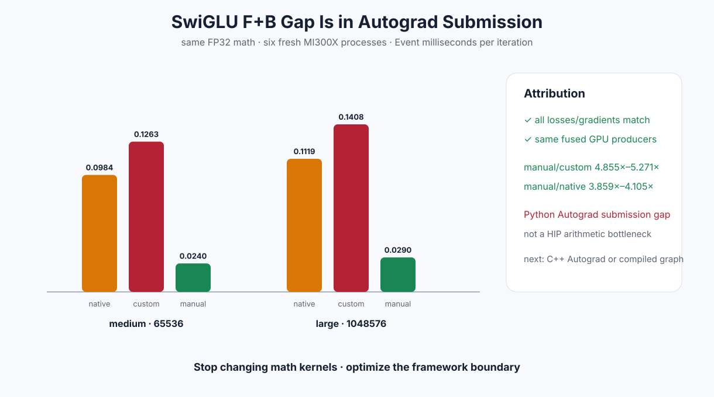

# Experiment 334 — 同样三个GPU算子，Autograd为什么慢五倍

Status: `attribution complete; move boundary to C++ Autograd or compiled graph`

## 三条同数学路径

在FP32 64K/1M上轮换：

1. native Torch：`F.silu * up -> sum -> backward`；
2. custom Autograd：microLLM fused forward -> sum -> Python `register_autograd` -> scalar-seed backward；
3. manual fused：同一microLLM forward、sum、scalar-seed backward，但不进入Autograd callback。

六个新进程，每种策略都5次热身、25次测量。loss和两份完整梯度Max为`4.77e-7`。

## Event结果

| shape | native | custom Autograd | manual fused | manual/custom | manual/native |
|---|---:|---:|---:|---:|---:|
| 64K | 0.0984ms | 0.1263ms | 0.0240ms | 5.271× | 4.105× |
| 1M | 0.1119ms | 0.1408ms | 0.0290ms | 4.855× | 3.859× |

manual与custom调用相同GPU producers。差异来自Python注册的Autograd callback和engine在Kernel之间的
host提交空洞，而不是数学或显存带宽。

manual peak不能当生产显存结论：归因loop同时保留显式output、loss和gradient tuple。它只回答时间
因果。正式内存结论仍来自上一节点的真实Autograd矩阵。

## 决定

关闭SwiGLU数学Kernel局部优化。下一候选二选一：C++ Autograd Function减少Python callback，或
`torch.compile`捕获注册公式。必须用同一完整loss/双梯度/peak矩阵；若仍不能接近manual上界，停止
这条adapter训练线。

证据：[`benchmarks/results/2026-08-26-pytorch-rocm-swiglu-autograd-attribution`](../../../benchmarks/results/2026-08-26-pytorch-rocm-swiglu-autograd-attribution/)

