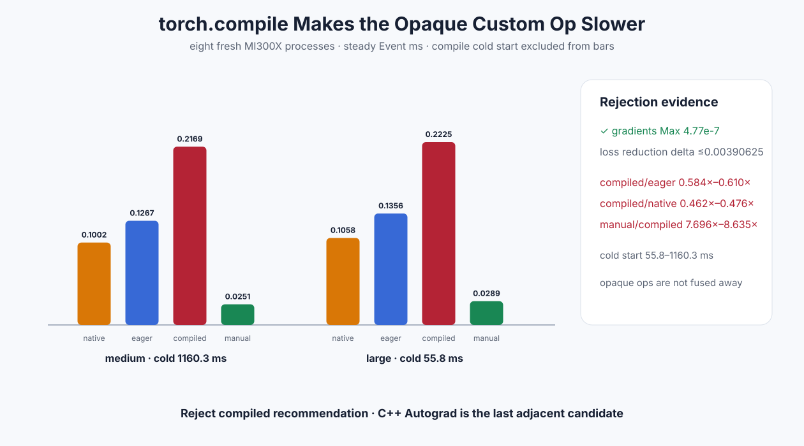

# Experiment 335 — torch.compile为什么让opaque Custom Op更慢

Status: `compiled recommendation rejected`

## 候选

希望AOTAutograd捕获Python注册的SwiGLU backward，减少callback空洞。八个新进程轮换native eager、
custom eager、custom compiled和manual fused，覆盖64K/1M FP32 F+B。

预发布Torch环境先暴露一个独立故障：`is_available=True`、HIP runtime有设备，但AMDSMI device
count为0，使Dynamo的Triton capability检查访问空properties。runner只在这三个条件同时成立时让
AMDSMI返回fallback，故障和workaround都写入raw。

## 结果

| shape | compiled/eager | compiled/native | manual/compiled | cold compile |
|---|---:|---:|---:|---:|
| 64K | 0.584× | 0.462× | 8.635× | 1160.3ms |
| 1M | 0.610× | 0.476× | 7.696× | 55.8ms |

梯度Max为`4.77e-7`。1M compiled sum改变归约顺序，loss差`0.00390625`，单独记录而不混进梯度
阈值。peak与custom eager同为1,536B，说明回退来自提交/编译边界，不是显存。

## 决定

不推荐compiled SwiGLU，也不把冷启动藏在warmup里。opaque Custom Op没有被Inductor融合，AOT路径
反而更慢。相邻的最后候选是把Autograd Function本身移入C++，删除Python callback；若它仍无法
明显关闭manual上界，adapter训练局部线关闭。

证据：[`benchmarks/results/2026-08-26-pytorch-rocm-swiglu-compile`](../../../benchmarks/results/2026-08-26-pytorch-rocm-swiglu-compile/)

