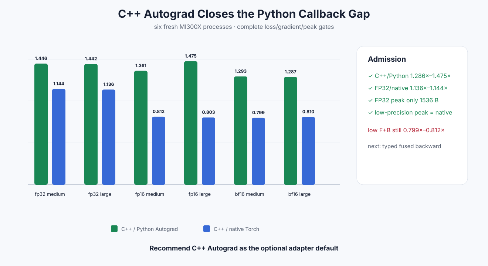

# Experiment 336 — 把Autograd callback移进C++以后

Status: `keep and recommend C++ Autograd adapter`

## 改动边界

GPU producers完全不变。`torch::autograd::Function`在C++保存gate/up、识别FP32 zero-stride seed，
再直接调用已有general/scalar-seed backward。Python loader不再为SwiGLU注册callback；add/multiply
仍保留轻量Python公式。

FP16/BF16当前仍用ATen可读公式，但在C++ `NoGradGuard`内用in-place中间量，避免Python callback和
不必要的graph/lifetime。FakeTensor没有backing pointer时只返回Meta shape，保持forward fullgraph合同。

## 六进程15格结果

C++/Python Autograd的六个F+B格全部提升`1.286×–1.475×`，完整loss/gradient仍过原dtype门。

| dtype | 64K C++/native | 1M C++/native | C++ peak vs native |
|---|---:|---:|---:|
| FP32 | 1.144× | 1.136× | 1,536B vs 263,680/4,195,840B |
| FP16 | 0.812× | 0.803× | equal |
| BF16 | 0.799× | 0.810× | equal |

FP32已经超过native Torch并保留scalar-seed峰值优势。低精度没有达到速度parity，但C++路径同时提高
速度并把旧Python路径两倍的临时peak降回native水平。

## 工程边界

GCC 13会在Torch `custom_function.h`内部`vector<bool>::reserve`触发已知式的array-bounds误报；只对
可选adapter target关闭GCC的array-bounds/stringop-overflow误报，不影响核心框架warning。C++
Autograd不承诺double backward。

## 决定

推荐C++ Autograd作为可选adapter默认。Python SwiGLU callback删除。下一独立问题是typed fused
FP16/BF16 backward；它必须同时超过当前C++ ATen公式并保持native peak，不能影响已通过的FP32。

证据：[`benchmarks/results/2026-08-26-pytorch-rocm-custom-op-swiglu-cpp-autograd`](../../../benchmarks/results/2026-08-26-pytorch-rocm-custom-op-swiglu-cpp-autograd/)
