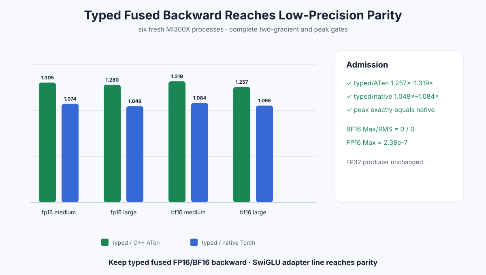

# Experiment 337 — 低精度backward也合成一个Kernel

Status: `keep typed fused FP16/BF16 backward; SwiGLU adapter line reaches scoped parity`

## 合同

gate、up、output gradient和两份输出必须连续、同shape/device/dtype，dtype只允许FP16或BF16。
Kernel加载低精度，FP32计算sigmoid与两条导数，最终每个输出只舍入一次。CPU reference使用相同
“输入先低精度、计算FP32、输出再舍入”语义。FP32 general/scalar-seed producer完全不改。

## 结果

相对上一节点的C++ ATen多算子公式：

| dtype/shape | typed/ATen | typed/native | peak | Max/RMS |
|---|---:|---:|---:|---:|
| FP16 64K | 1.305× | 1.074× | = native | 2.38e-7 / 2.08e-9 |
| FP16 1M | 1.280× | 1.048× | = native | 2.38e-7 / 1.89e-9 |
| BF16 64K | 1.319× | 1.084× | = native | 0 / 0 |
| BF16 1M | 1.257× | 1.055× | = native | 0 / 0 |

六进程15格矩阵的所有forward/loss/gradient门继续通过。低精度F+B第一次在两个shape、两种dtype
同时达到native parity，且没有用额外临时Tensor。

## 决定

保留typed fused backward并作为C++ Autograd低精度路径。到此SwiGLU adapter scoped line关闭：
FP32、FP16、BF16在声明shape均达到native，peak不回退。下一工作必须来自新的模型/图级profile，
不能继续调整这个Kernel的block或packet。

证据：[`benchmarks/results/2026-08-26-pytorch-rocm-custom-op-swiglu-typed-backward`](../../../benchmarks/results/2026-08-26-pytorch-rocm-custom-op-swiglu-typed-backward/)

