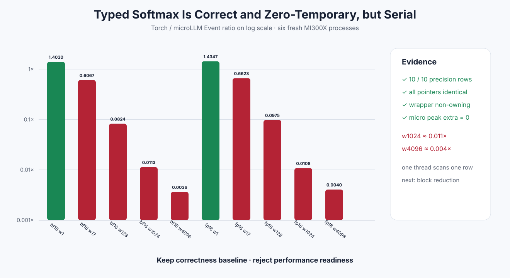

# Experiment 338 — 低精度Softmax不再转FP32，但为什么慢两百倍

Status: `correctness baseline keep; performance readiness rejected`

## 能力

`softmax`现在可直接接受HIP FP16/BF16；`softmax_typed_out_`写caller-owned同dtype输出。每行maximum、
exp和denominator用FP32，最后每个概率舍入一次。没有FP32 Tensor-shaped中间量，C ABI/Python外部
Tensor也复用同一接口。

CPU/HIP测试覆盖稳定大数、非法dim/dtype/alias、零payload transfer和out路径allocation 0。

## 六进程矩阵

FP16/BF16 × width 1/17/128/1024/4096，共10格：全部在PyTorch tolerance内，pointer identity与
non-owning合同全部通过，microLLM peak extra为0。

性能却不能使用：

- width1约1.40×Torch；
- width17约0.61×–0.66×；
- width128约0.08×–0.10×；
- width1024约0.011×；
- width4096约0.0036×–0.0040×。

## 原因和决定

当前readable Kernel是一线程处理一整行，三次串行扫描width。它证明dtype/所有权/舍入，不是生产
reduction。能力baseline保留，但任何模型/性能route拒绝。下一节点必须一block一row并行求max/sum，
同一10格复测；不能靠FP32临时量或库fallback掩盖问题。

证据：[`benchmarks/results/2026-08-26-pytorch-rocm-typed-softmax`](../../../benchmarks/results/2026-08-26-pytorch-rocm-typed-softmax/)
