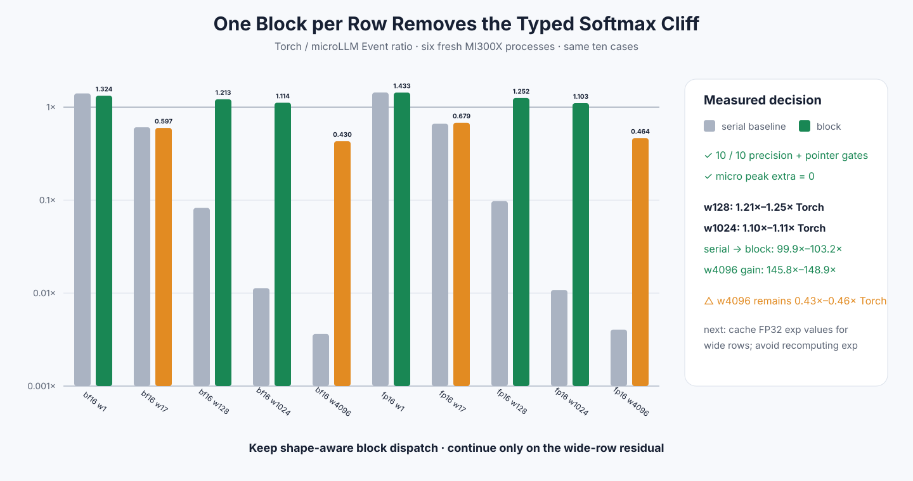

# Experiment 339 — 一行从一个线程变成一个block

Status: `shape-aware keep; wide-row residual remains`

## 假设

Experiment 338的低精度路径慢，不是因为Python、外部Tensor或低精度转换，而是一条线程连续扫描
整行三次。让一个block共同求maximum和denominator，应当消除width增大时的串行悬崖，同时保留
FP32 reduction、caller-owned输出和零Tensor临时量。

## 最小改动

- width≤32保留一线程一行，避免很短行承担block barrier；
- width33–64/65–128/>128分别使用64/128/256线程；
- 每个block只负责一行，线程跨列步进；
- maximum与sum使用已有FP32 shared-memory归约；
- 不改变C++、C ABI或Python接口，不分配中间Tensor。

HIP边界测试覆盖1/17/32/33/64/65/128/129/1024/4096，两种dtype都与CPU reference对齐，
operator期间H2D/D2H与allocation增量均为0。

## 六进程结果

同一10格PyTorch矩阵全部通过。相对serial baseline：width128提升13.297×–15.680×，width1024
提升99.945×–103.214×，width4096提升145.826×–148.896×。相对PyTorch，width128达到
1.213×–1.252×，width1024达到1.103×–1.114×。

width4096仍只有0.430×–0.464×PyTorch。这里每个元素在denominator和写回阶段各计算一次`expf`；
超宽行已不再串行，但重复超越函数成为新解释。当前dispatch保留，下一节点只测试“用block内FP32
shared缓存exp”这一项；若显存合同或宽行性能不过门就拒绝。

证据：[`benchmarks/results/2026-08-26-pytorch-rocm-block-softmax`](../../../benchmarks/results/2026-08-26-pytorch-rocm-block-softmax/)
