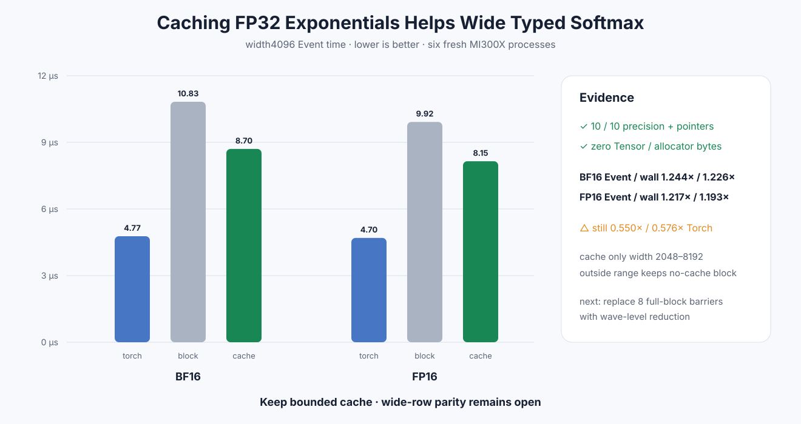

# Experiment 340 — 少算一次exp，为什么还是没追平

Status: `bounded cache keep; parity open`

## 假设

block归约消除了串行悬崖后，width4096仍只有0.430×–0.464×PyTorch。当前Kernel在求denominator时
计算一次`expf`，写output时又计算一次。若把第一次FP32结果放在block-local shared memory，宽行应
明显变快，同时不产生全局Tensor临时量。

## 边界

cache只允许width 2048–8192；最大动态LDS为32KiB，另有固定1KiB reduction scratch。width≤32仍
走serial，其他width仍走普通block。HIP测试覆盖2047/2048和8192/8193两端，以及此前全部线程数
边界；两种dtype都检查CPU reference、零H2D/D2H和零engine allocation增量。

## 六进程结果

10格精度、pointer、non-owning与peak extra 0全部通过。width4096 BF16 Event/wall提升
1.244×/1.226×，FP16提升1.217×/1.193×。相对PyTorch改善到0.550×/0.576×，仍未达到parity。

候选保留，因为受影响的两格都越过1.20× Event门且资源合同不变；结论不扩大到整个范围的性能，
2048/8192当前只有正确性边界证据。剩余Kernel仍使用shared array做两次256线程归约，每次有八轮
全block barrier。下一可反驳假设是wave-level归约，不再继续调exp。

证据：[`benchmarks/results/2026-08-26-pytorch-rocm-cached-softmax`](../../../benchmarks/results/2026-08-26-pytorch-rocm-cached-softmax/)
