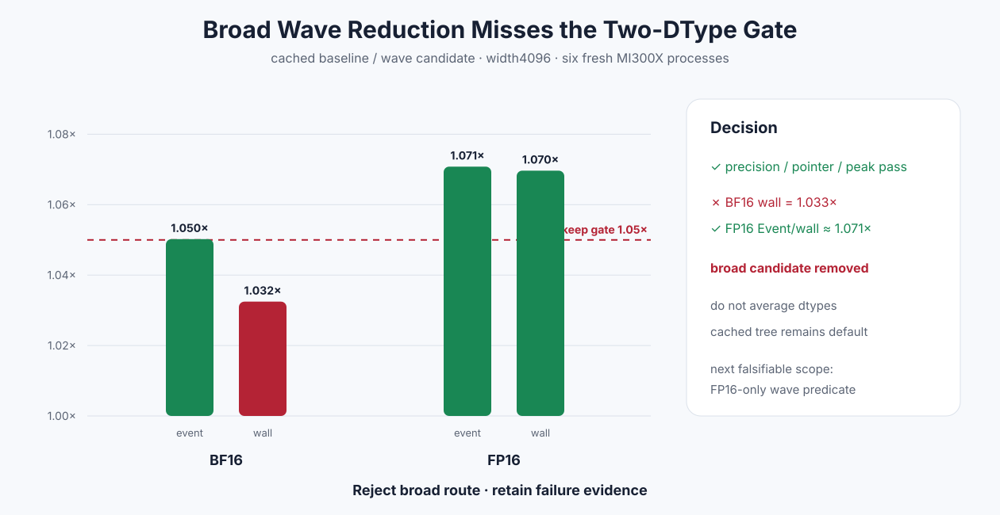

# Experiment 341 — wave归约只赢了一种dtype

Status: `broad candidate rejected and removed`

## 假设

cached width4096仍有两次256线程shared-tree reduction。每次需要多轮全block barrier。候选用wave
shuffle先做局部归约，再只让一个wave合并四个partial，预期两种dtype的Event与wall都至少提高1.05×。

## 结果

六进程10格正确性、pointer、non-owning和peak extra 0全部通过。相对cached baseline：

- BF16 Event 1.050×，wall只有1.033×，失败；
- FP16 Event/wall 1.071×/1.070×，通过。

不能把两种dtype平均，也不能因为PyTorch比值提高就更改预先声明的候选门。广义wave helper和调用点
全部删除，默认仍是shared-tree cached Kernel。失败raw保留。

下一步如果继续，只能把问题重新定义为“FP16 width2048–8192是否应有独立wave谓词”，并重新测量
完整矩阵。它不能借用本实验把BF16一起合入。

证据：[`benchmarks/results/2026-08-26-pytorch-rocm-wave-softmax-reject`](../../../benchmarks/results/2026-08-26-pytorch-rocm-wave-softmax-reject/)
