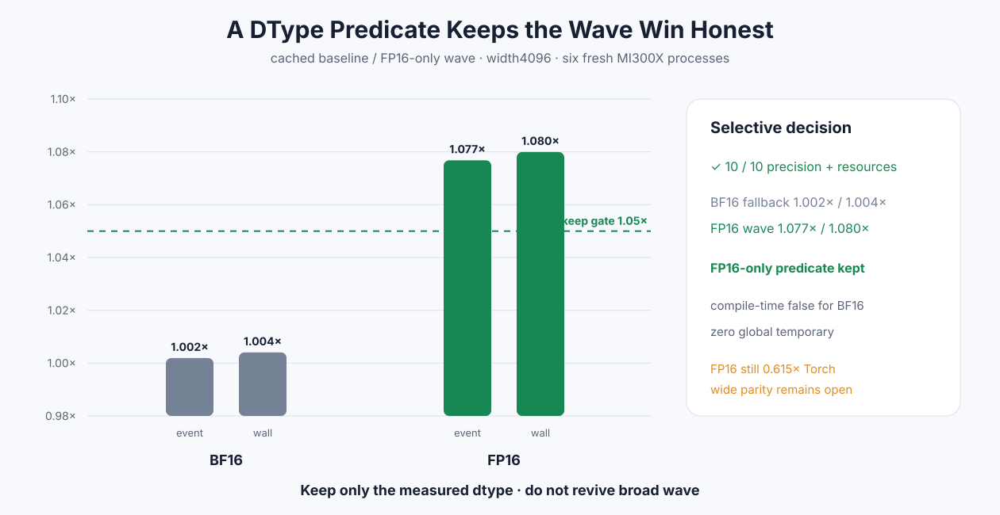

# Experiment 342 — 失败的广义方案可以成为诚实的窄策略吗

Status: `FP16-only predicate kept`

## 新问题

Experiment 341不能广义合入，因为BF16 wall只有1.033×；但FP16 Event/wall稳定超过1.07×。本实验不
修改旧结论，而是新建显式策略：只有FP16 cached width2048–8192编译wave reduction，BF16在编译期
选择shared tree。

## 结果

六进程10格精度、pointer、non-owning和peak extra 0全部通过。width4096相对retained cached：

- BF16 fallback Event/wall 1.002×/1.004×，属于不变路径噪声；
- FP16 wave Event/wall 1.077×/1.080×，同时越过1.05；
- 当前FP16/PyTorch Event为0.615×，所以parity仍未完成。

源码用`UseWaveReduction`编译期参数，并分别实例化`<__half,true>`与
`<hip_bfloat16,false>`。这不是运行时猜测，也不会让BF16承担未通过的归约顺序。

FP16-only谓词保留。下一优化不能再次推广到BF16；必须从剩余0.615×的profile/指令成本提出新假设。

证据：[`benchmarks/results/2026-08-26-pytorch-rocm-fp16-wave-softmax`](../../../benchmarks/results/2026-08-26-pytorch-rocm-fp16-wave-softmax/)
