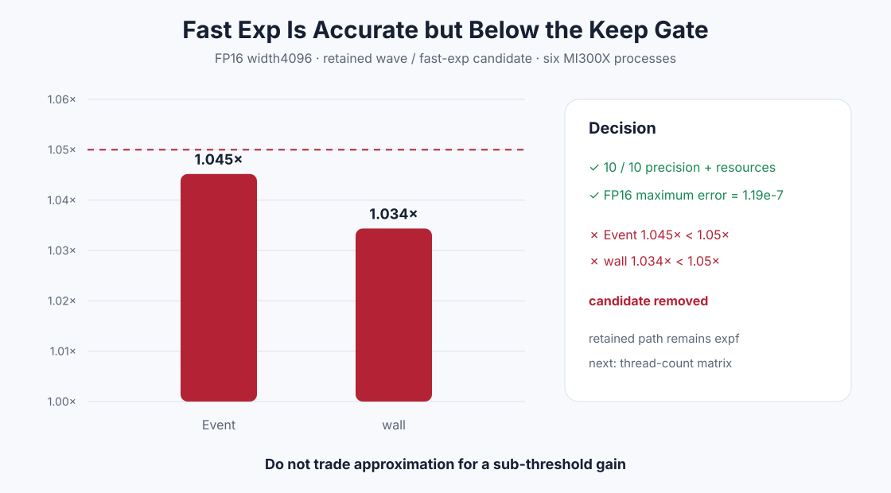

# Experiment 343 — 近似exp正确，也不代表值得保留

Status: `candidate rejected and removed`

## 假设与门

FP16 width4096仍只有0.615×PyTorch，指数可能占主要成本。候选只在已经selective的FP16 cached/wave
实例中把`expf`替换成HIP fast intrinsic。先要求FP16 Max≤5e-4，再要求Event与wall都至少1.05×。

## 结果

六进程10格正确性、pointer、non-owning和peak extra 0全部通过，FP16 Max仍为1.19e-7。但相对当前
retained FP16 wave，width4096 Event只有1.045×、wall只有1.034×，两项都失败。

不能因为相对PyTorch比值从0.615×提高到0.659×就绕过候选前后的门。近似intrinsic删除，默认继续
精确`expf`。下一实验转向线程数/occupancy，而不是继续花数值预算。

证据：[`benchmarks/results/2026-08-26-pytorch-rocm-fast-exp-softmax-reject`](../../../benchmarks/results/2026-08-26-pytorch-rocm-fast-exp-softmax-reject/)
