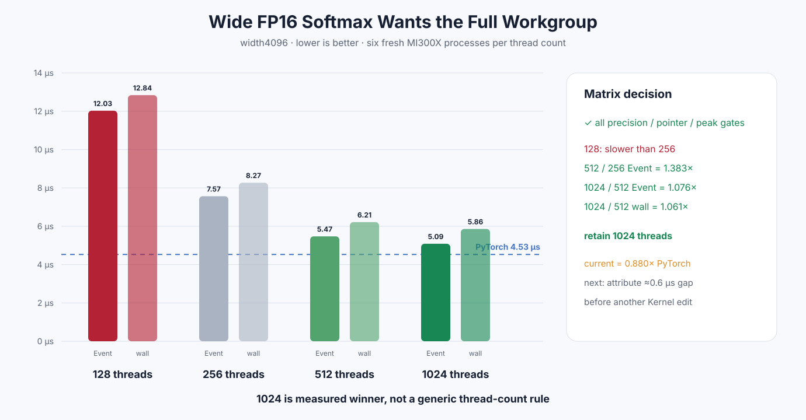

# Experiment 344 — 128、256、512还是1024线程

Status: `1024-thread FP16 cached/wave path kept`

## 问题

fast-exp失败后，剩余0.615×PyTorch可能来自调度而非数学。MI300X允许1024-thread workgroup，因此对
FP16 cached/wave width4096固定测试128/256/512/1024；BF16和其他路径不改。

## 六进程矩阵

四档都通过10格精度、pointer、non-owning和peak extra 0。FP16 width4096：

| threads | Event μs | wall μs | PyTorch比值 |
|---:|---:|---:|---:|
| 128 | 12.027 | 12.839 | 0.424× |
| 256 | 7.567 | 8.271 | 0.615× |
| 512 | 5.472 | 6.215 | 0.856× |
| 1024 | 5.086 | 5.859 | 0.880× |

512相对256为1.383×/1.331×；1024继续相对512提高1.076×/1.061×，两项都越过1.05。因此1024
保留，128拒绝，512保留为次优证据。

这不是“所有Kernel都应该1024线程”。它只适用于FP16、cached width2048–8192、wave reduction
实例。当前与PyTorch约差0.6μs；下一步应做提交/Kernel归因，而不是继续枚举非法更大block。

证据目录：

- [`threads128`](../../../benchmarks/results/2026-08-26-pytorch-rocm-softmax-threads128/)
- [`threads512`](../../../benchmarks/results/2026-08-26-pytorch-rocm-softmax-threads512/)
- [`threads1024`](../../../benchmarks/results/2026-08-26-pytorch-rocm-softmax-threads1024/)
- 256基线见[FP16 wave](../../../benchmarks/results/2026-08-26-pytorch-rocm-fp16-wave-softmax/)
