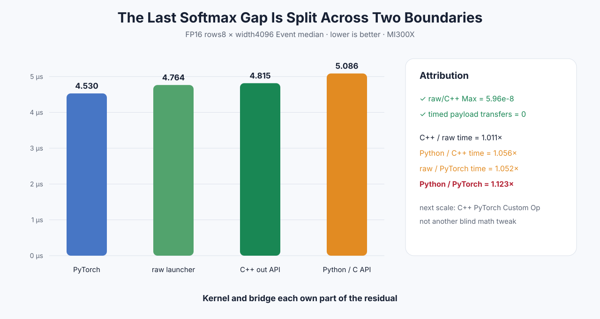

# Experiment 345 — 剩下0.6微秒到底属于谁

Status: `attribution complete; change optimization scale`

## 方法

增加benchmark-only C++程序，对同一个FP16 `[8,4096]`、同一Stream、同一1024-thread Kernel测：

1. 直接调用内部raw launcher；
2. 调公开C++ `softmax_typed_out_`；
3. 复用已提交的Python ctypes/C API六进程结果；
4. 复用同矩阵PyTorch结果。

raw/C++各六个新进程，顺序交叉，每个进程7组、每组25次。所有输出Max 5.96e-8，timed payload
transfer为0。

## 结果

| 层 | Event中位数 | 分界比值 |
|---|---:|---:|
| PyTorch | 4.530μs | reference |
| raw launcher | 4.764μs | 1.052×PyTorch time |
| C++ out API | 4.815μs | 1.011×raw |
| Python/C API | 5.086μs | 1.056×C++ |

总Python/PyTorch时间比是1.123×。因此C++参数检查不是主要问题；约0.23μs在raw Kernel以下，约
0.27μs出现在Python/C API重复提交相对C++的位置。不同进程族的差值不能当作完美可加的逐指令
账本，但足以否决“继续只调Kernel就能关闭全部12.3%”的解释。

下一尺度应把typed Softmax接进现有C++ PyTorch Custom Op adapter，直接比较dispatcher路径；core
Kernel只剩约5.2%差距，除非新profile给出更具体热点，不再盲改数学。

证据：[`benchmarks/results/2026-08-26-pytorch-rocm-softmax-attribution`](../../../benchmarks/results/2026-08-26-pytorch-rocm-softmax-attribution/)
