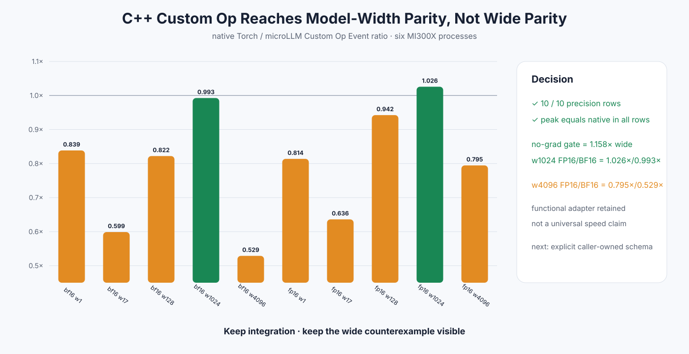

# Experiment 346 — 直接注册Softmax，为什么wide还是没过线

Status: `functional adapter kept; wide performance partial`

## 能力

新增`torch.ops.microllm.softmax`，合同固定最后一维，支持FP32/FP16/BF16、CPU、ROCm当前Stream、
Meta/fullgraph与C++ Autograd。外部Tensor不复制；functional op按PyTorch惯例分配一个output。

单测覆盖空/标量/非连续错误、五组shape、三dtype、当前Stream、梯度与compile。ROCm与CPU都通过。

## 第一次失败与修复

初版Autograd kernel即使input不需要梯度也进入`Function::apply`。FP16 width4096只有0.700×native。
C++增加`GradMode && requires_grad`门：推理直接调用forward，需要梯度才保存output。

六进程复测中FP16 wide从6.640降到5.732μs，提升1.158×；10格精度和输出所有权通过，所有peak
与native完全相同。

## 当前边界

- width1024 FP16/BF16达到1.026×/0.993×native；
- width4096 FP16/BF16只有0.795×/0.529×native；
- functional adapter保留，用于生态与模型宽度，不宣称wide全面加速。

ctypes路径是caller-owned，functional Custom Op需要output allocation和dispatcher，二者不能直接拿一个
总时间互换解释。下一步若追wide，应定义显式mutable/out schema并先守住alias、Meta和Autograd边界。

证据：

- [初版无条件Autograd](../../../benchmarks/results/2026-08-26-pytorch-rocm-custom-op-softmax/)
- [当前inference gate](../../../benchmarks/results/2026-08-26-pytorch-rocm-custom-op-softmax-inference-gate/)
