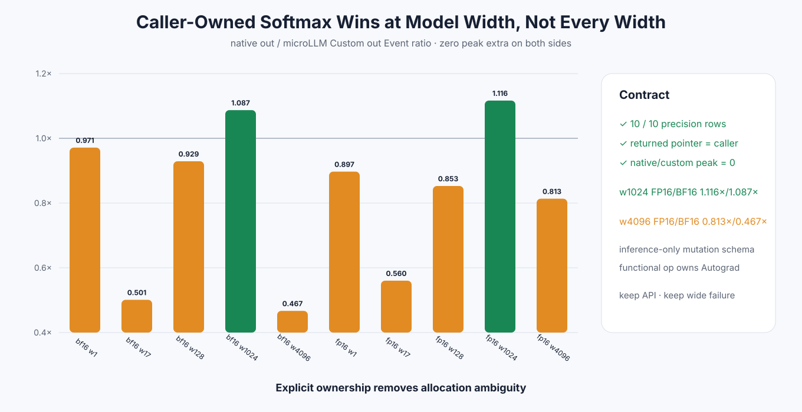

# Experiment 347 — 把output交给调用者后，口径终于一致

Status: `caller-owned integration keep; wide partial`

## 合同

新增`torch.ops.microllm.softmax_out(input, output)`。schema明确`Tensor(a!)` mutation/alias，返回值必须
与output同pointer；shape/dtype/device/contiguous不符或与input alias就拒绝。它是inference-only，
GradMode下任何requires-grad Tensor明确报错；可微调用继续使用functional `softmax`。

性能对照使用`torch.softmax(..., out=...)`，两边output都在计时前分配。

## 六进程结果

10格精度与pointer门通过，native/custom peak extra全为0：

- width1024 FP16/BF16为1.116×/1.087×native out；
- width4096 FP16/BF16为0.813×/0.467×；
- 所有returned pointer都等于caller output。

out API作为零分配互操作面保留。模型宽度有明确收益，wide仍是失败；不再用functional allocation
解释它，也不把FP16结果推广到BF16。

证据：[`benchmarks/results/2026-08-26-pytorch-rocm-custom-op-softmax-out`](../../../benchmarks/results/2026-08-26-pytorch-rocm-custom-op-softmax-out/)
