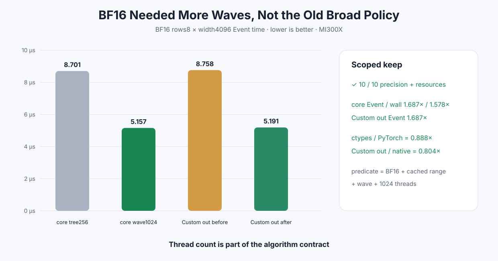

# Experiment 348 — BF16失败的是wave，还是256线程

Status: `BF16 cached wave1024 kept`

## 反驳旧解释

Experiment 341的BF16 256-thread wave wall只有1.033×，所以广义路由删除。但FP16线程矩阵证明
width4096需要更多waves。本实验新合同固定BF16、cached width2048–8192、wave、1024 threads；不改
短行和普通block。

## 结果

六进程10格精度、pointer与零peak通过。BF16 width4096 core Event/wall从8.701/9.404μs降到
5.157/5.960μs，提升1.687×/1.578×，达到0.888×PyTorch。

caller-owned Custom out中，BF16 wide从8.758降到5.191μs，约1.687×，native-out比值从0.467×提高到
0.804×。FP16保持约0.821×。

因此旧失败解释被细化：BF16不是不能wave，而是256 threads没有足够并行度。1024是算法合同的一部分。

证据：

- [core matrix](../../../benchmarks/results/2026-08-26-pytorch-rocm-bf16-wave1024-softmax/)
- [Custom out matrix](../../../benchmarks/results/2026-08-26-pytorch-rocm-custom-op-softmax-out-wave1024/)
