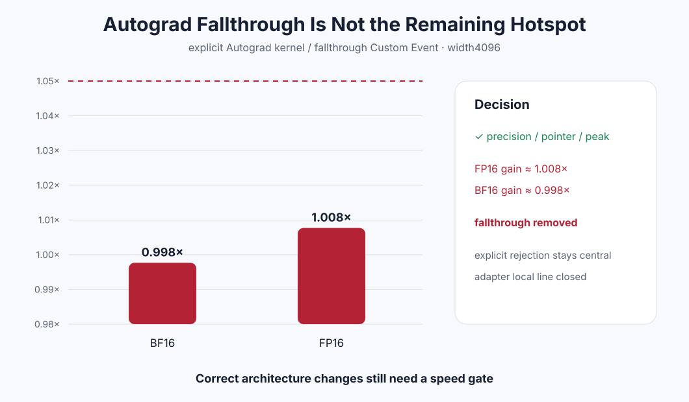

# Experiment 349 — 少一层dispatch，为什么几乎没变化

Status: `candidate rejected and removed; adapter local line closed`

## 假设

`softmax_out`是inference-only，却仍先进入Autograd kernel做requires-grad检查。候选把检查移入backend，
并为Autograd key注册fallthrough，预期两种wide dtype的Event/wall至少提高1.05×。

## 结果

CPU/ROCm alias、requires-grad、current Stream全部通过；六进程10格精度、pointer、零peak也通过。但
width4096相对当前显式Autograd kernel：FP16约1.008×，BF16约0.998×。没有一项接近1.05。

fallthrough删除，集中式`softmax_out_autograd`恢复。这个实验说明剩余wide差距不在这一层dispatch；
adapter局部提交线关闭，下一目标必须来自新的模型/图profile。

证据：[`benchmarks/results/2026-08-26-pytorch-rocm-custom-op-softmax-out-fallthrough`](../../../benchmarks/results/2026-08-26-pytorch-rocm-custom-op-softmax-out-fallthrough/)
