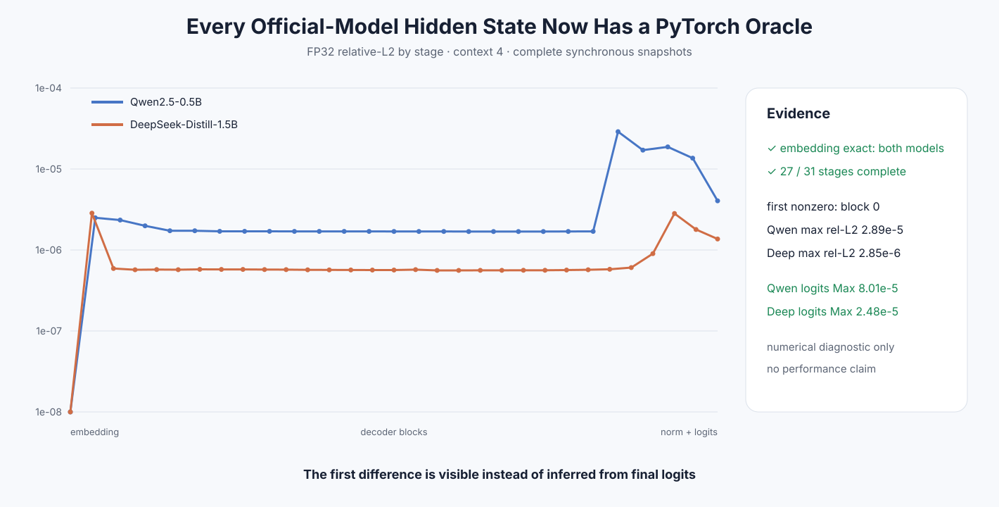

# Experiment 350 — 不只看logits：每一层到底从哪里开始不同

Status: `official Qwen/DeepSeek full-layer alignment complete`

## 合同

同一真实safetensors、同一四个token、FP32、PyTorch eager Attention。C++复用正式trace导出embedding、
每个decoder block、final norm和last-token logits；PyTorch用forward hook导出相同边界。大trace比较后
删除，仓库只保存每层完整Max/mean/RMS/relative-L2指标。

## 结果

| 模型 | 阶段数 | 首个非零 | 最大relative-L2 | logits Max/RMS |
|---|---:|---|---:|---:|
| Qwen2.5-0.5B | 27 | block 0 | 2.89e-5（block 21） | 8.01e-5 / 1.01e-5 |
| DeepSeek-Distill-Qwen-1.5B | 31 | block 0 | 2.85e-6（block 0） | 2.48e-5 / 4.19e-6 |

两模型embedding位级相同；每个期望层都存在且shape一致。差异从block 0出现，而不是权重加载或token
embedding。最终logits仍在明确小误差内。

这关闭P1“逐层hidden state与PyTorch比较”的空白，并给后续图级优化一个可定位的数值门。它是同步
诊断，不用于性能结论。

证据：[`benchmarks/results/2026-08-26-official-pytorch-hidden-alignment`](../../../benchmarks/results/2026-08-26-official-pytorch-hidden-alignment/)
