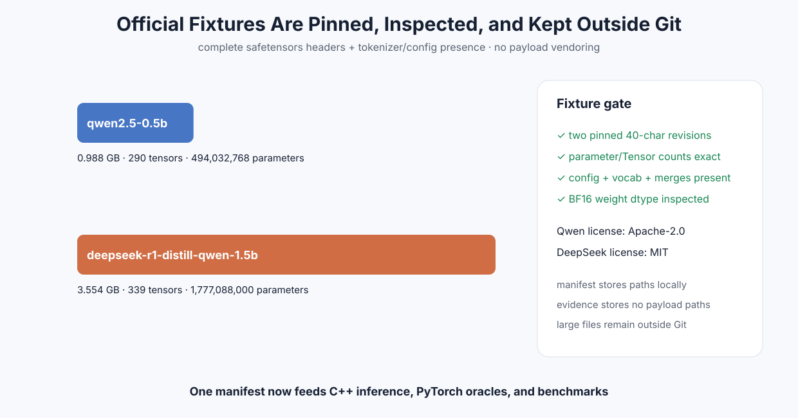

# Experiment 351 — 官方权重不进Git，fixture怎样仍然可复现

Status: `pinned Qwen/DeepSeek fixture path complete`

## 问题

过去的benchmark manifest依赖手工准备`/tmp`路径。revision虽然固定，但没有一个命令同时验证权重
header、分片membership、参数量、Tensor数、tokenizer文件和许可记录。数GB权重也不能提交Git。

## 新合同

`data/model_fixtures.toml`固定两个官方repo/revision/license与预期结构。
`tools/prepare_hf_fixture.py`支持：

- 从pinned revision下载允许文件，或验证已有本地model/tokenizer目录；
- 解析完整safetensors header或安全分片index；
- 验证参数量、Tensor数、config、vocab、merges；
- 生成供C++/PyTorch/benchmark共用的本地manifest；
- 单独生成不含本机payload路径的可提交evidence。

没有把大权重或tokenizer复制进仓库，也没有引入禁用的哈希字段。

## 真实结果

Qwen BF16权重988,097,824字节、290 Tensor、494,032,768参数；DeepSeek BF16权重
3,554,214,621字节、339 Tensor、1,777,088,000参数。两者config/vocab/merges完整，状态
`fixture-ready`。许可记录分别为Apache-2.0与MIT。

证据：[`benchmarks/results/2026-08-26-official-hf-fixtures`](../../../benchmarks/results/2026-08-26-official-hf-fixtures/)
