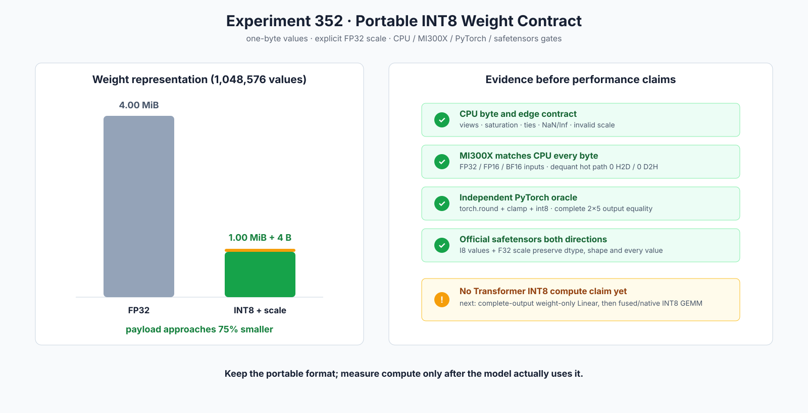

# Experiment 352 — 一字节INT8权重怎样成为可验证的框架合同

Status: `portable format kept; model compute route not yet admitted`



## 问题

Experiment 121已经在MI300X执行过原始INT8矩阵吞吐，但当时框架没有`DType::Int8`、scale
Tensor、公共量化API或文件格式。硬件probe不能让用户保存和加载一份量化权重，也不能证明
CPU、HIP与PyTorch在同一舍入规则上。

## 单变量改动

本节点只建立weight-only格式，不接Transformer：

```text
连续FP32/FP16/BF16
→ 对称最近偶数舍入与[-127,127]饱和
→ 一字节Int8 Tensor + 同设备FP32标量scale
→ CPU/HIP反量化
→ safetensors I8 + F32混合保真读写
```

## 正确性证据

- CPU边界、tie-to-even、NaN/Inf、shape、view和错误scale用例通过；
- 独立PyTorch oracle的2×5完整量化与还原值逐项相等；
- MI300X上FP32/FP16/BF16输入的量化字节全部等于CPU；
- HIP反量化测量窗为0 H2D、0 D2H；
- C++与官方Python safetensors包双向保持I8权重、F32 scale、shape和值；
- 从文件直接加载到HIP只传6字节权重和4字节scale，随后反量化无payload回传。

## 内存结论与边界

大Tensor的权重payload从每元素4字节变为1字节，理论接近减少75%；一份Tensor再增加4字节
scale。它不是端到端显存或速度结果，因为当前模型还会先还原为浮点，且没有INT8 GEMM路由。

保留理由是格式、API和跨框架证据完整；下一实验必须比较反量化+浮点GEMM与真正的INT8
Linear，完整输出正确后才能讨论tokens/s。
