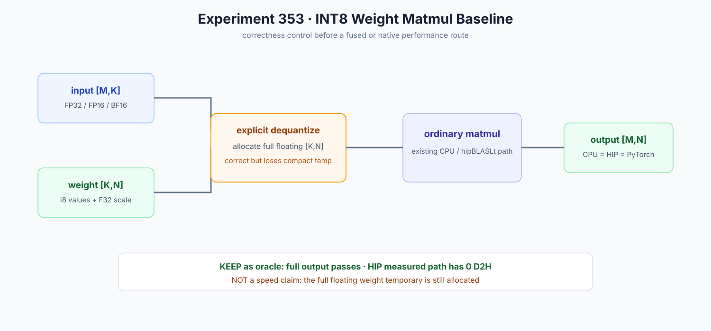

# Experiment 353 — INT8 Linear先要有一个不能偷换口径的基线

Status: `complete-output baseline kept; performance candidate not admitted`

## 问题

一字节权重可以保存和还原，但还没有一个公共`[M,K]×[K,N]`入口。若直接写融合Kernel，错误可能
来自shape、scale、舍入、累加顺序或Kernel本身，难以定位。

## 实现

`int8_weight_matmul`固定第一条可读路径：验证rank/dtype/shape/device，按input dtype还原完整
`[K,N]`权重，再调用现有matmul。CPU、HIP和PyTorch使用同一个量化权重比较完整`[M,N]`输出。

## 证据

- CPU FP32/FP16/BF16三种input都逐项等于显式dequantize+matmul；
- HIP完整输出等于CPU，执行窗0 D2H；
- 独立PyTorch oracle新增完整`3×5`输出，逐项相等；
- 错rank、K不匹配、device/scale错误继续由合同拒绝。

## 为什么没有速度数字

这条路径会分配完整浮点`[K,N]`临时Tensor。它证明答案，不保留INT8常驻和带宽优势。下一实验
才比较这个control与M=1融合读取INT8的候选，并同时报告Event、wall、临时峰值和完整输出。
