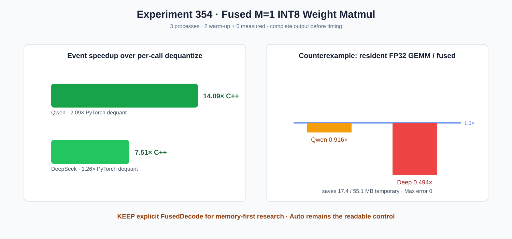

# Experiment 354 — M=1直接读INT8权重，什么时候真的更快

Status: `explicit fused route kept; Auto unchanged`

一个block负责一个输出列，256线程分摊K并归约，直接读取FP32 activation、I8 weight和设备scale，
不生成浮点weight。尾部、Qwen K896/N4864、DeepSeek K1536/N8960完整输出通过；三进程各2 warm-up
+5 measured。

相对本项目显式反量化，Event为14.09×/7.51×，wall为10.48×/6.74×；相对PyTorch每次反量化
为2.09×/1.26×。但相对PyTorch常驻FP32 GEMM，Event只有0.916×/0.494×。候选节省17.4/55.1MB
浮点临时weight且本次数据Max误差为0，因此保留显式`FusedDecode`；`Auto`不切换，也不声称普遍
超过成熟GEMM。原始口径见结果目录。
