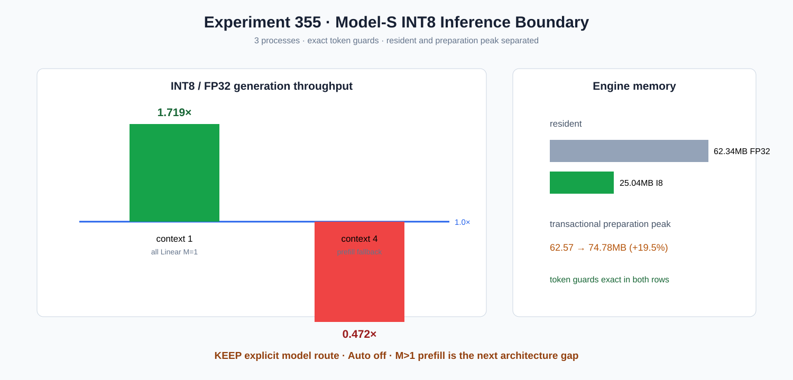

# Experiment 355 — INT8接进整模后，prefill为什么推翻单算子结论

Status: `explicit model route kept; Auto off; official-model gate next`

事务式`prepare_int8_inference_weights()`先为全部43个Linear生成I8+scale，全部成功后一次提交；
Autograd/load/state导出在单向准备后拒绝。graph-free FP32 M=1自动使用显式FusedDecode，其他M走
完整反量化control。

三进程Model-S中位数：context1为2437.23 vs 1417.74 tok/s=`1.719×`；context4为635.06 vs
1344.68=`0.472×`。两行token guard相同。常驻engine bytes 62.34MB→25.04MB（-59.8%），但事务
准备峰值62.57MB→74.78MB（+19.5%）。因此整模API保留为显式研究路线，不能默认启用；下一步
必须做官方权重与长prefill，或实现M>1融合消费者。
