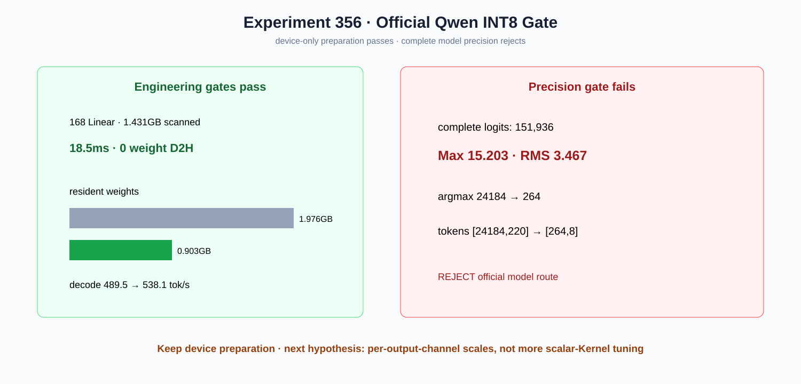

# Experiment 356 — 准备变快且省显存，为什么官方INT8仍然不能合入

Status: `device preparation kept; official model route rejected`

`quantize_int8_dynamic`复用device amax两级归约，在GPU上生成scale与I8 payload。Qwen 168个
Linear扫描1.431GB仅18.5ms，权重payload无D2H；常驻1.976GB→0.903GB，最短decode 489.5→538.1
tok/s。

但完整151,936 logits Max/RMS为15.203/3.467，argmax 24184→264，两个生成token从
`[24184,220]`变为`[264,8]`。因此官方整模路线明确reject，`--int8-linear`保持显式研究开关，
Auto/default不变。下一精度实验必须改变scale粒度（优先逐输出通道），不能继续调当前Kernel速度。
