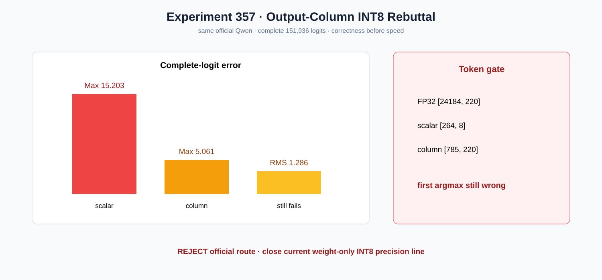

# Experiment 357 — 逐输出通道scale改善很多，为什么仍然必须拒绝

Status: `column primitive kept; official route rejected; precision line closed`

逐列device amax为每个Linear输出列保存scale，融合M=1按列读取。Qwen scale元数据1.22MB，准备
16.9ms，常驻0.904GB。相对scalar，完整logits Max/RMS从15.203/3.467改善到5.061/1.286，第二个
token恢复；但argmax仍24184→785，第一个token错误，速度532.1 tok/s也不是精度证据。

因此保留通用column算子与显式CLI，官方route再次reject。scalar和column两个合理粒度连续失败，
当前weight-only INT8官方精度线关闭；后续若重启必须引入校准/混合精度或量化感知训练，而不是
继续在同一舍入模型上调Kernel。
