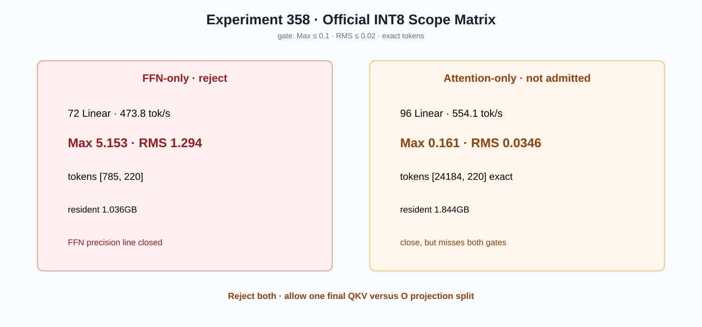

# Experiment 358 — 混合精度先分FFN和Attention，哪个岛接近可用

Status: `FFN rejected; Attention not admitted; one final QKV/O split allowed`

固定门为完整logits Max≤0.1、RMS≤0.02且token一致。FFN-only 72个Linear为Max/RMS
5.153/1.294、token `[785,220]`、473.8 tok/s，直接关闭。Attention-only 96个Linear恢复
`[24184,220]`，554.1 tok/s、常驻1.844GB，但Max/RMS 0.161/0.0346仍分别超门61%/73%。

因此两者都不合入默认；Attention接近门，允许最后一次QKV/O拆分。该拆分若仍无通过项，当前
PTQ INT8混合精度路线关闭。
