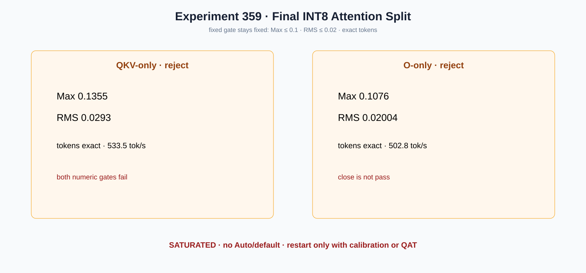

# Experiment 359 — O-only只差一点，要不要放宽门槛

Status: `both rejected; official PTQ weight-only INT8 line saturated`

固定门Max≤0.1、RMS≤0.02、token exact。QKV-only为0.1355/0.0293、533.5 tok/s；O-only为
0.1076/0.02004、502.8 tok/s。两者token均为`[24184,220]`，但都越过预先写下的完整logits门。
O-only很接近也不能事后改阈值。

因此两项都reject，当前官方PTQ weight-only INT8路线饱和关闭。保留primitive、device preparation、
scoped CLI和全部失败图；重新开启必须引入校准集、混合bit-width搜索或QAT，并建立新的独立门。
