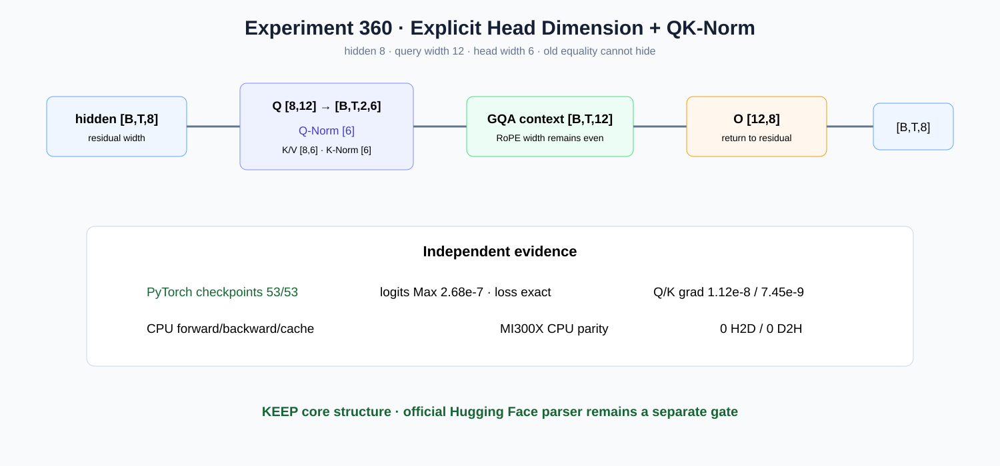

# Experiment 360 — 让Attention宽度故意不等于hidden，旧假设还能藏住吗

Status: `core structure kept; official parser pending`

合成配置hidden8、heads2、head_dim6使Q/context宽12，无法退化成旧的8。Q/K-Norm各6参数，
总参数964。CPU forward/backward/cache通过；MI300X与CPU对齐且执行窗0 H2D/D2H。

独立PyTorch全图53/53通过：logits Max2.68e-7、loss精确、Q/K-Norm梯度Max
1.12e-8/7.45e-9，任意梯度最差4.29e-6。保留核心结构与mapping；官方Qwen3 parser/checkpoint
是下一独立节点，不在这里提前声称。
