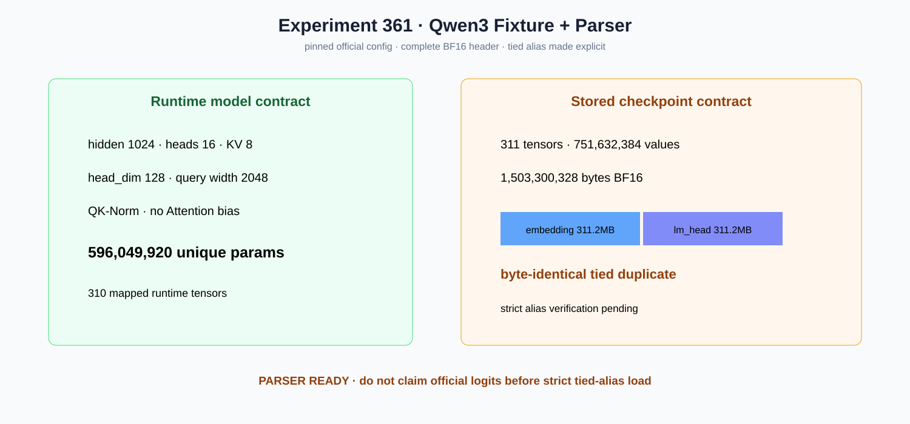

# Experiment 361 — config说tied，文件为什么多出1.55亿参数

Status: `fixture/parser ready; strict tied alias pending`

固定官方Qwen3-0.6B revision。parser得到hidden1024、head16、KV8、head_dim128、QK-Norm、无bias，
运行时唯一参数596,049,920，mapping 310项。完整BF16文件却有311 Tensor、751,632,384个存储值、
1,503,300,328字节。

原因不是公式错：`embed_tokens`和`lm_head`各311,164,928字节且逐字节相同。fixture与parser保留；
strict streaming必须验证这个tied alias后再忽略重复payload。当前状态不是official-logit-ready。
