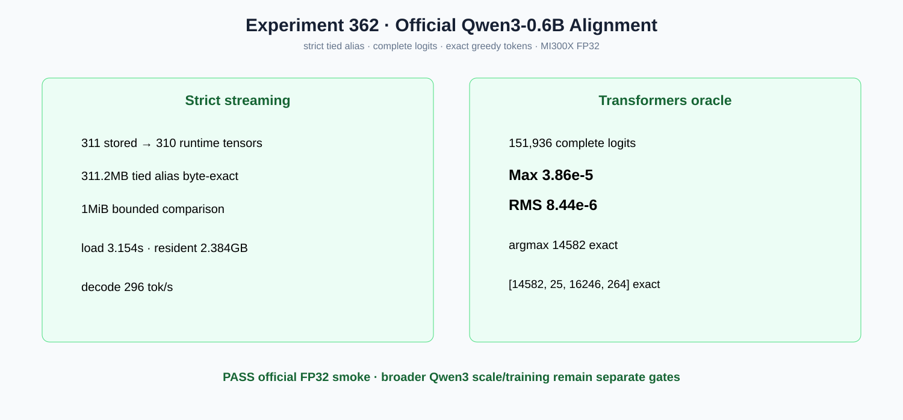

# Experiment 362 — tied重复验证以后，Qwen3真实logits是否一致

Status: `official Qwen3-0.6B FP32 smoke aligned`

strict streaming先用1MiB有界buffer比较311.2MB embedding/lm_head，完全相同才加载310个运行时
参数；损坏alias在零H2D前失败。MI300X常驻2.384GB，load 3.154s，短decode 296 tok/s。

同一官方权重、token1、FP32计算与Transformers比较151,936 logits：Max3.86e-5、RMS8.44e-6、
argmax14582一致；四个greedy token均为`[14582,25,16246,264]`。Qwen3-0.6B状态提升为官方
FP32 smoke aligned，不推广到更大Qwen3、长上下文、BF16策略或训练。
