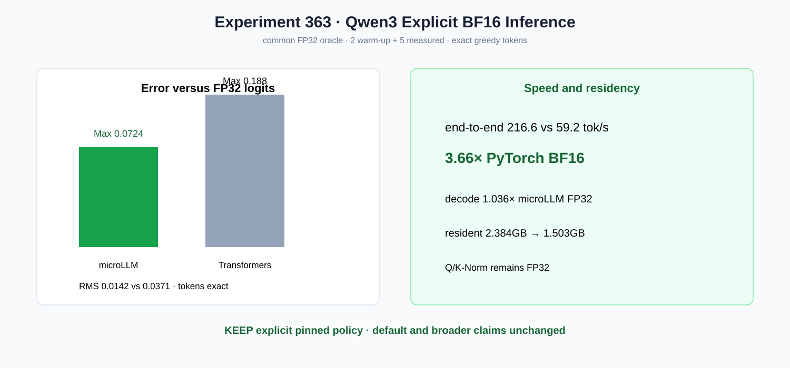

# Experiment 363 — 两个BF16实现不bit-exact，怎样判断谁更准

Status: `explicit Qwen3 BF16 policy kept`

196个FFN/Attention Linear变成单份BF16，Q/K-Norm保持FP32。microLLM与Transformers四token均为
`[14582,25,16246,264]`。两种BF16归约树不同，因此共同使用FP32 logits做oracle：microLLM
Max/RMS 0.0724/0.0142，Transformers 0.188/0.0371，前者两项更接近FP32。

同为2 warm-up+5 measured的短端到端生成：216.6 vs 59.2 tok/s=`3.66×`；microLLM decode相对
自身FP32为1.036×，常驻2.384→1.503GB。策略在固定Qwen3-0.6B上显式保留，不改全局默认，
不推广到长上下文或训练。
