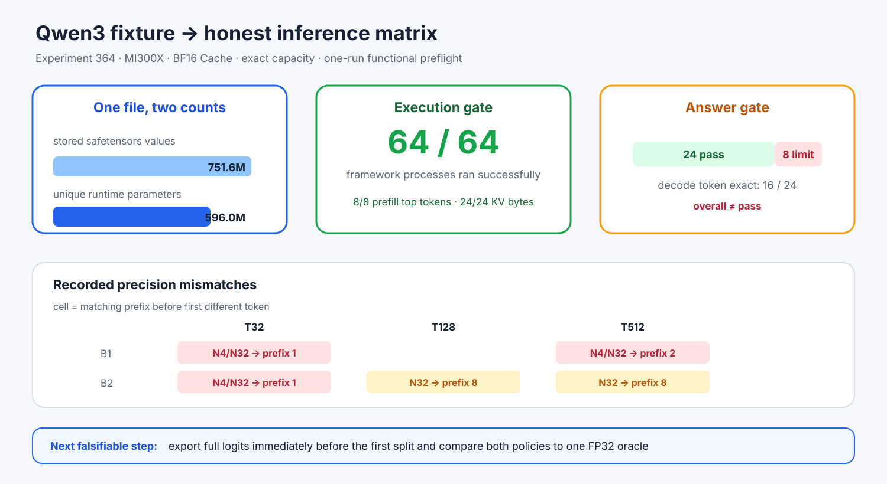

# Experiment 364 — 64个进程都成功，为什么矩阵仍不能写pass

Status: `runner fixed; 24 pass + 8 precision limits recorded`

Qwen3双计数manifest第一次进入通用runner：4个context×2个batch，prefill加N1/N4/N32 cached
decode，共32个shape pair。microLLM/PyTorch各32个进程全部执行成功；8个prefill top token相同，
24/24 active KV bytes一致且exact capacity利用率为1。

旧summary只看两边worker是否`pass`，因此把32行全标绿。重新审查token发现只有16/24 decode行
完整一致；T32 B1/B2 N4/N32、T128 B2 N32、T512 B1 N4/N32与T512 B2 N32共8行分叉，
共同前缀分别为1、2或8 token。汇总器现在把它们标为`precision_mismatch`，整体状态改为
`complete_with_recorded_limits`。

两边精度政策不同：microLLM是BF16 Linear+FP32 activation/QK-Norm+BF16 Cache，Transformers是
整网BF16。本节点不判断谁错；下一实验必须在第一处分叉前导出共同FP32 oracle和完整logits。
1 warm-up+1 measured的吞吐范围只证明测量路径有效，不写成稳定速度结论。

首次运行还暴露visible-device双重过滤：两边都看不到GPU却继续生成64条失败。runner现在识别双方
`environment_unavailable`并提前停止；真实反例只执行2个worker、summary为`invalid_environment`、
退出码2。该轮是环境invalid，不计入模型矩阵。
