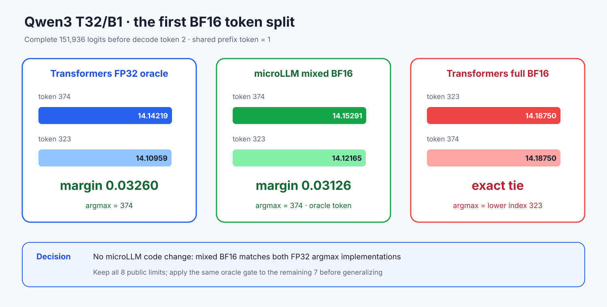

# Experiment 365 — 分叉时谁更接近FP32，不能看名字决定

Status: `first mismatch attributed; no microLLM fix admitted`

固定Experiment 364最短失败T32/B1/N4，在第二个steady decode选择前导出六份完整151,936 logits：
两种FP32、microLLM权重/Cache四格、Transformers整网BF16。所有policy进入capture前共享token1，
所以比较的是同一输入，不是分叉后的不同序列。

Transformers FP32中token374=14.14219、323=14.10959，margin仅0.03260；microLLM FP32对它
Max/RMS 5.78e-5/1.20e-5且同样选374。Transformers BF16把两个logit都舍入成14.1875，exact
tie后argmax选较小索引323。microLLM BF16+BF16 Cache仍为14.15291/14.12165，保留0.03126
margin并选择FP32 token374；其oracle Max/RMS 0.1564/0.0365也小于Transformers BF16的
0.3052/0.0659。

因此这一个公开mismatch不是microLLM答案错误，而是两种BF16 policy在低margin处产生不同离散
决策。框架代码不因本实验改变，8个shape limit也不删除。下一节点必须让其余7个分叉接受同样的
FP32 oracle门，不能用一个有利例子概括全部长轨迹。
